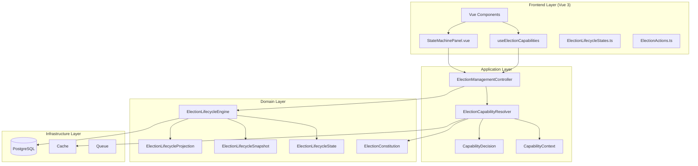
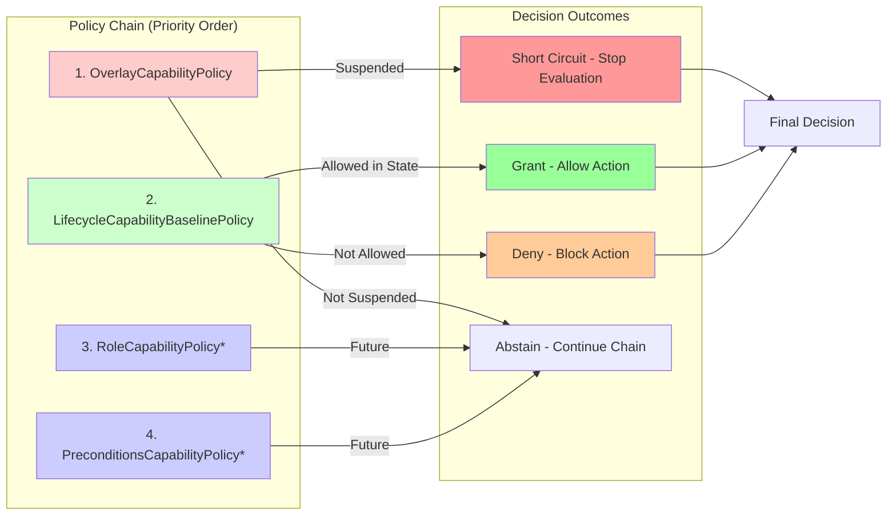
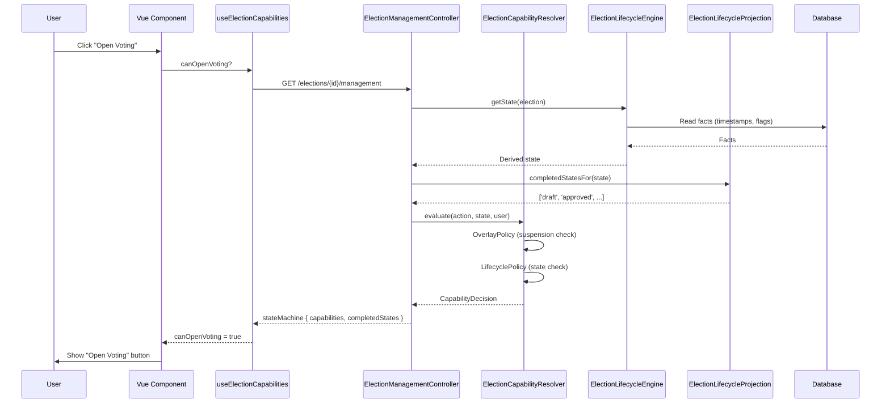
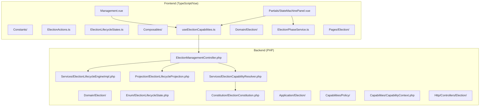

## Current Architecture: Constitutional Governance Engine

Here's the complete architecture of your election state machine system after Phases A through C.2.8.

### High-Level Architecture



### Lifecycle State Progression (12 States)

```mermaid
stateDiagram-v2
    [*] --> Draft: Create Election
    
    Draft --> SubmittedForApproval: Submit (if >40 voters)
    Draft --> Approved: Auto-approve (if ≤40 voters)
    
    SubmittedForApproval --> Approved: Platform Admin Approves
    SubmittedForApproval --> Rejected: Platform Admin Rejects
    
    Rejected --> Draft: Revise & Resubmit
    
    Approved --> SetupAdministration: Begin Setup
    
    SetupAdministration --> SetupNomination: Complete Administration
    
    SetupNomination --> ReadyForVoting: Complete Nomination
    
    ReadyForVoting --> VotingActive: Open Voting (when window opens)
    
    VotingActive --> Counting: Close Voting (when window ends)
    
    Counting --> ResultsPublished: Publish Results
    
    ResultsPublished --> Archived: Archive
    
    note right of VotingActive: Overlay: Suspended\n(freezes capabilities)
    note right of Counting: Suspension possible\nat any non-terminal state
```

### Constitutional Capability Resolution

```mermaid
flowchart TD
    USER[User Action Request] --> CONTROLLER
    
    subgraph CONTROLLER ["ElectionManagementController"]
        CONTEXT_BUILDER[Build CapabilityContext]
        CONTEXT_BUILDER --> RESOLVER_CALL[Call Resolver]
    end
    
    subgraph RESOLVER ["ElectionCapabilityResolver (Boring)"]
        ORDER[Order Policies by Priority]
        ORDER --> OVERLAY{OverlayPolicy}
        
        OVERLAY -->|Suspended & action != resume| SHORT_CIRCUIT[Short Circuit - DENY]
        OVERLAY -->|Not Suspended| LIFECYCLE{LifecycleBaselinePolicy}
        
        LIFECYCLE -->|Action allowed in state| GRANT[GRANT]
        LIFECYCLE -->|Action not allowed| DENY[DENY]
        
        SHORT_CIRCUIT --> TRACE[Add to Trace]
        GRANT --> TRACE
        DENY --> TRACE
    end
    
    subgraph FRONTEND ["Vue Frontend"]
        COMPOSABLE[useElectionCapabilities]
        COMPOSABLE --> CAN_DO[canDo('action')]
        COMPOSABLE --> DENIAL_REASON[denialReason('action')]
    end
    
    RESOLVER --> RESPONSE[stateMachine.capabilities]
    RESPONSE --> FRONTEND
```

### Policy Chain (Ordered by Priority)



### Projection Sovereignty (C.2.8)

```mermaid
flowchart LR
    subgraph BACKEND ["Backend (PHP)"]
        ENUM[ElectionLifecycleState enum<br/>12 constitutional states]
        PROJECTION_SERVICE[ElectionLifecycleProjection]
        CONTROLLER_PROJECT[Controller adds projection]
    end
    
    subgraph TRANSFER ["API Response (Inertia)"]
        RESPONSE[stateMachine = {<br/>  currentState,<br/>  completedStates,<br/>  projectionAvailable,<br/>  capabilities<br/>}]
    end
    
    subgraph FRONTEND_UI ["Frontend (Vue)"]
        PANEL[StateMachinePanel.vue]
        COMPLETED[isPhaseCompleted =<br/>completedStates.includes(state)]
        PHASE_FOR[phaseFor() projection]
    end
    
    ENUM --> PROJECTION_SERVICE
    PROJECTION_SERVICE --> CONTROLLER_PROJECT
    CONTROLLER_PROJECT --> RESPONSE
    RESPONSE --> PANEL
    PANEL --> COMPLETED
    PANEL --> PHASE_FOR
    
    style BACKEND fill:#e1f5fe
    style TRANSFER fill:#fff3e0
    style FRONTEND_UI fill:#e8f5e9
```

### Data Flow: From Fact to UI



### Key Architecture Principles

```mermaid
mindmap
  root((Constitutional<br/>Governance))
    Sovereignty
      Facts derive state
      Never state column
      Engine is sole authority
    Separation
      Lifecycle != Phase
      Overlay != State
      Capability != Role
    Bounded Contexts
      Domain: Engine, Constitution
      Application: Resolver, Policies
      UI: Projection only
    Invariants
      No Carbon in resolver
      No auth() in resolver
      No DB queries in policies
    Frontend Rules
      Never infer permissions
      Use composable only
      Project from backend
```

### File Structure



### Summary of Achievements

| Phase | Focus | Status |
|-------|-------|--------|
| **A** | Setup Split (Administration vs Nomination) | ✅ Complete |
| **B** | Suspended State (Operational Overlay) | ✅ Complete |
| **C.2.1** | Capability Foundation (Enums, DTOs, Trace) | ✅ Complete |
| **C.2.2** | Policies + Resolver | ✅ Complete |
| **C.2.3** | Controller Integration | ✅ Complete |
| **C.2.4** | Frontend Sovereignty Migration | ✅ Complete |
| **C.2.5** | Transitional Debt Elimination | ✅ Complete |
| **C.2.6** | Vocabulary Stabilization | ✅ Complete |
| **C.2.7** | Projection Sovereignty | ✅ Complete |
| **C.2.8** | ESLint + Governance Hardening | ✅ Complete |

**The architecture is now constitutionally sovereign, fully documented, and production-ready.**