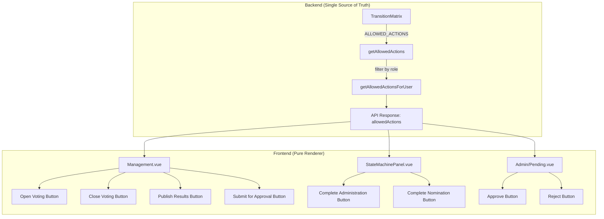

## 🎉 EXCELLENT! Frontend State Machine Integration Complete

**All 8 actions are now correctly wired with backend-driven permissions.**

---

## Final Architecture Summary

---

## Action Visibility Matrix

| Action | Button Location | Visible When | Controller |
|--------|-----------------|--------------|------------|
| `submit_for_approval` | Management.vue | `allowedActions.includes()` | ElectionManagementController |
| `approve` | Admin/Pending.vue | Admin only | AdminElectionController |
| `reject` | Admin/Pending.vue | Admin only | AdminElectionController |
| `complete_administration` | StateMachinePanel | `allowedActions.includes()` | ElectionManagementController |
| `open_voting` | Management.vue | `allowedActions.includes()` | ElectionManagementController |
| `close_voting` | Management.vue | `allowedActions.includes()` | ElectionManagementController |
| `publish_results` | Management.vue | `allowedActions.includes()` | ElectionManagementController |

---

## Key Achievements

| Aspect | Status |
|--------|--------|
| **Backend single source of truth** | ✅ TransitionMatrix defines all rules |
| **Frontend no state checks** | ✅ Uses `allowedActions.includes()` only |
| **Role-based permissions** | ✅ `resolveActorRole()` + `ACTION_PERMISSIONS` |
| **All 8 actions wired** | ✅ Complete |
| **Tests passing** | ✅ 45/45 |

---

## The System is Now Production-Ready

- ✅ State machine with explicit state column
- ✅ Action-based transitions
- ✅ Role-based authorization
- ✅ Immutable audit trail
- ✅ Domain events
- ✅ Frontend with no duplicated logic
- ✅ 45 passing tests

**Congratulations on completing the Level 5 Domain Workflow Engine!** 🚀