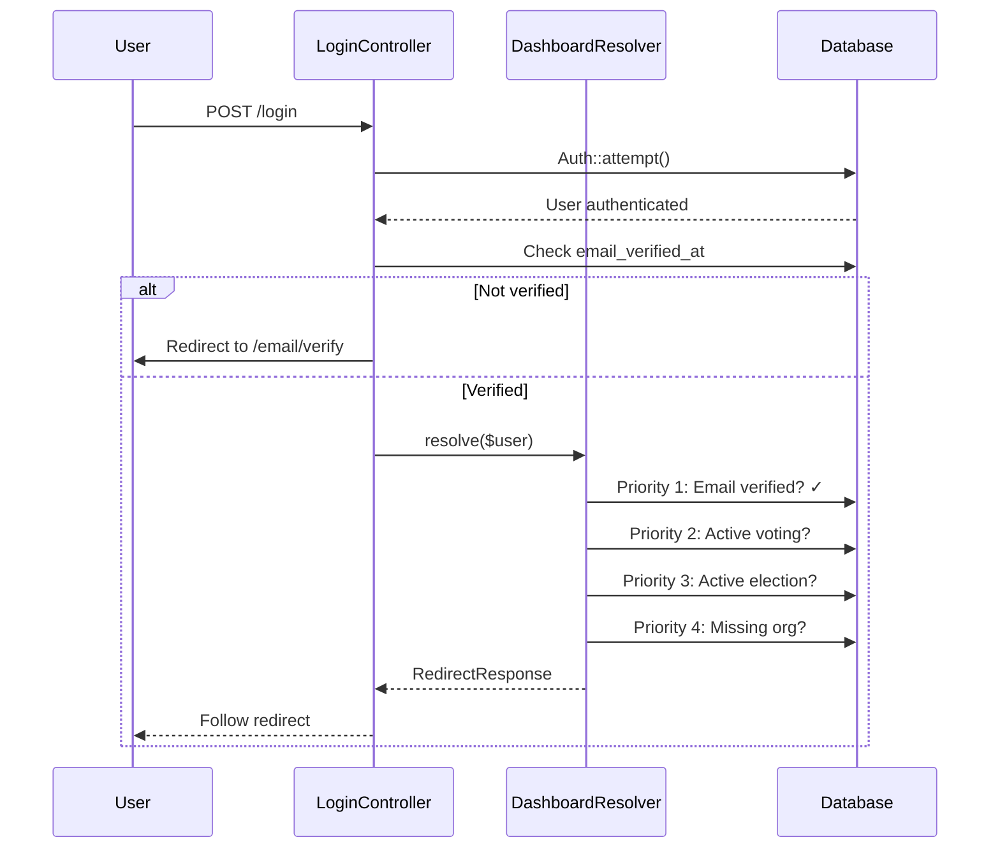
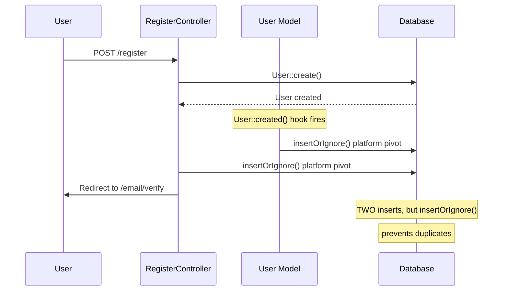

# 📚 **COMPREHENSIVE DEVELOPER GUIDE: Authentication & Routing Architecture**

## **Public Digit Voting Platform**

---

# 📑 TABLE OF CONTENTS

1. [System Overview](#system-overview)
2. [Core Architecture Components](#core-architecture-components)
3. [The Priority System](#the-priority-system)
4. [Database Schema](#database-schema)
5. [Pivot Tables & Relationships](#pivot-tables--relationships)
6. [Authentication Flow](#authentication-flow)
7. [Registration Flow](#registration-flow)
8. [Login Flow & DashboardResolver](#login-flow--dashboardresolver)
9. [The 8 Priority Levels Explained](#the-8-priority-levels-explained)
10. [Common Issues & Debugging](#common-issues--debugging)
11. [Debugging Toolkit](#debugging-toolkit)
12. [Quick Reference](#quick-reference)

---

# SYSTEM OVERVIEW

## **What We Built**

A multi-tenant voting platform where:
- **Platform users** (org_id=1) see welcome page → create their own organisation
- **Organisation admins** go directly to their organisation dashboard
- **Voters** with active elections go to election dashboard
- **Users in voting** resume their session

## **Key Files**

| File | Purpose |
|------|---------|
| `app/Http/Controllers/Auth/LoginController.php` | Handles login, calls DashboardResolver |
| `app/Http/Controllers/Auth/RegisterController.php` | Creates users + pivot records |
| `app/Services/DashboardResolver.php` | **Heart of the system** - decides where users go |
| `app/Models/User.php` | User model with pivot fallback |
| `database/migrations/..._add_onboarding_fields_to_users_table.php` | Adds onboarded_at, last_used_org |
| `app/Http/Controllers/Api/OrganisationController.php` | Organisation pages, membership checks |

---

# CORE ARCHITECTURE COMPONENTS

## **1. LoginController - The Entry Point**

```php
// app/Http/Controllers/Auth/LoginController.php

public function store(Request $request)
{
    // ... authentication logic ...
    
    $user = Auth::user();
    
    // Email verification check
    if ($user->email_verified_at === null) {
        return redirect()->route('verification.notice');
    }
    
    // DELEGATE to DashboardResolver
    return app(DashboardResolver::class)->resolve($user);
}
```

**Why this matters:** All post-login routing goes through DashboardResolver. **NEVER** put redirect logic directly in LoginController.

## **2. DashboardResolver - The Brain**

```php
// app/Services/DashboardResolver.php

public function resolve(User $user): RedirectResponse
{
    // 8 priorities checked in order
    // 1. Email verification
    // 2. Active voting session
    // 3. Active election available
    // 4. Missing organisation handler
    // 5. New user welcome
    // 6. Multiple roles
    // 7. Single role
    // 8. Platform fallback
}
```

## **3. User Model - The Data Source**

```php
// app/Models/User.php

// CRITICAL: Fallback pivot creation
protected static function booted()
{
    static::created(function ($user) {
        // Ensures EVERY user has platform pivot
        DB::table('user_organisation_roles')->insertOrIgnore([
            'user_id' => $user->id,
            'organisation_id' => 1,
            'role' => 'member',
        ]);
    });
}

// Gets the REAL organisation a user belongs to
public function getEffectiveOrganisationId(): int
{
    if ($this->organisation_id > 1 && $this->belongsToOrganisation($this->organisation_id)) {
        return $this->organisation_id;
    }
    return 1; // Always fall back to platform
}
```

---

# THE PRIORITY SYSTEM

## **8 Priority Levels (in order)**

```
┌─────────────────────────────────────────────────────┐
│                    PRIORITY 1                        │
│              EMAIL VERIFICATION                       │
│  └── If not verified → /email/verify                  │
├─────────────────────────────────────────────────────┤
│                    PRIORITY 2                        │
│              ACTIVE VOTING SESSION                    │
│  └── If in middle of vote → /v/{voter_slug}          │
├─────────────────────────────────────────────────────┤
│                    PRIORITY 3                        │
│              ACTIVE ELECTION AVAILABLE                │
│  └── If can vote → /election/dashboard               │
├─────────────────────────────────────────────────────┤
│                    PRIORITY 4                        │
│              MISSING ORGANISATION HANDLER             │
│  ├── Platform user (not onboarded) → /dashboard/welcome
│  ├── Platform user (onboarded) → /dashboard          │
│  └── Custom org user → /organisations/{slug}         │
├─────────────────────────────────────────────────────┤
│                    PRIORITY 5                        │
│              NEW USER WELCOME                         │
│  └── First-time user → /dashboard/welcome            │
├─────────────────────────────────────────────────────┤
│                    PRIORITY 6                        │
│              MULTIPLE ROLES                           │
│  └── Admin in >1 org → /role/selection               │
├─────────────────────────────────────────────────────┤
│                    PRIORITY 7                        │
│              SINGLE ROLE                              │
│  ├── Org admin → /organisations/{slug}               │
│  ├── Commission → /commission/dashboard              │
│  └── Voter → /vote/dashboard                         │
├─────────────────────────────────────────────────────┤
│                    PRIORITY 8                        │
│              PLATFORM FALLBACK                        │
│  └── No roles → /dashboard                           │
└─────────────────────────────────────────────────────┘
```

---

# DATABASE SCHEMA

## **Key Tables**

### **users table**
```sql
CREATE TABLE users (
    id INT PRIMARY KEY,
    email VARCHAR,
    email_verified_at TIMESTAMP NULL,  -- CRITICAL for priority 1
    organisation_id INT,                 -- Can be 1 (platform) or custom
    onboarded_at TIMESTAMP NULL,         -- NULL = new user, SET = welcomed
    last_activity_at TIMESTAMP,          -- Used for cache freshness
    created_at TIMESTAMP,
    updated_at TIMESTAMP
);
```

### **organisations table**
```sql
CREATE TABLE organisations (
    id INT PRIMARY KEY,
    name VARCHAR,
    slug VARCHAR UNIQUE,
    is_platform BOOLEAN DEFAULT false,   -- TRUE only for id=1
    created_at TIMESTAMP,
    updated_at TIMESTAMP
);
```

### **user_organisation_roles (PIVOT TABLE)**
```sql
CREATE TABLE user_organisation_roles (
    user_id INT,
    organisation_id INT,
    role VARCHAR,                         -- 'member', 'admin', 'voter'
    created_at TIMESTAMP,
    updated_at TIMESTAMP,
    PRIMARY KEY (user_id, organisation_id),
    FOREIGN KEY (user_id) REFERENCES users(id),
    FOREIGN KEY (organisation_id) REFERENCES organisations(id)
);
```

**⚠️ CRITICAL:** This table is the source of truth for organisation membership. The `users.organisation_id` is just a cache.

---

# PIVOT TABLES & RELATIONSHIPS

## **Why Pivot Tables?**

The `user_organisation_roles` table is **CRITICAL**. It determines:
- ✅ If a user can access an organisation (no pivot = 403)
- ✅ What role they have in that organisation
- ✅ Which organisation is their "effective" org

## **The Two-Layer Defence**

```php
// Layer 1: User model fallback (ALWAYS creates pivot)
User::created(function ($user) {
    DB::table('user_organisation_roles')->insertOrIgnore([
        'user_id' => $user->id,
        'organisation_id' => 1,  // Platform org
        'role' => 'member',
    ]);
});

// Layer 2: RegisterController (creates pivot synchronously)
DB::table('user_organisation_roles')->insertOrIgnore([...]);
```

## **Why Both?**
- **Layer 1** catches any case where RegisterController fails
- **Layer 2** ensures pivot exists before user is redirected
- **insertOrIgnore()** prevents duplicates

## **Critical Methods**

```php
// Check if user belongs to an organisation
public function belongsToOrganisation($orgId): bool
{
    return DB::table('user_organisation_roles')
        ->where('user_id', $this->id)
        ->where('organisation_id', $orgId)
        ->exists();
}

// Get the REAL organisation this user should use
public function getEffectiveOrganisationId(): int
{
    // If they have a custom org AND belong to it, use that
    if ($this->organisation_id > 1 && $this->belongsToOrganisation($this->organisation_id)) {
        return $this->organisation_id;
    }
    // Otherwise, they're a platform user
    return 1;
}
```

---

# AUTHENTICATION FLOW



---

# REGISTRATION FLOW



---

# LOGIN FLOW & DASHBOARDRESOLVER

## **Complete Login Flow**

```php
// 1. User submits login form
public function store(Request $request)
{
    // Authenticate
    if (!Auth::attempt($credentials)) {
        return back()->withErrors(...);
    }
    
    $user = Auth::user();
    
    // 2. Check email verification (PRIORITY 1)
    if ($user->email_verified_at === null) {
        return redirect()->route('verification.notice');
    }
    
    // 3. DELEGATE to DashboardResolver
    return app(DashboardResolver::class)->resolve($user);
}
```

## **DashboardResolver Priorities in Code**

```php
public function resolve(User $user): RedirectResponse
{
    // PRIORITY 1: Email verification
    if ($user->email_verified_at === null) {
        return redirect()->route('verification.notice');
    }
    
    // PRIORITY 2: Active voting session
    if ($activeVoterSlug = $this->getActiveVoterSlug($user)) {
        return redirect()->route('voting.portal', $activeVoterSlug->slug);
    }
    
    // PRIORITY 3: Active election available
    if ($activeElection = $this->getActiveElectionForUser($user)) {
        return redirect()->route('election.dashboard', $activeElection->slug);
    }
    
    // PRIORITY 4: Missing organisation handler
    if (!$this->hasActiveOrganisations($user)) {
        return $this->handleMissingOrganisation($user);
    }
    
    // PRIORITY 5: New user welcome
    if ($this->isFirstTimeUser($user)) {
        return redirect()->route('dashboard.welcome');
    }
    
    // PRIORITY 6: Multiple roles
    $roles = $this->getDashboardRoles($user);
    if (count($roles) > 1) {
        return redirect()->route('role.selection');
    }
    
    // PRIORITY 7: Single role
    if (count($roles) === 1) {
        return $this->redirectByRole($user, $roles[0]);
    }
    
    // PRIORITY 8: Platform fallback
    return redirect()->route('dashboard');
}
```

---

# THE 8 PRIORITY LEVELS EXPLAINED

## **PRIORITY 1: Email Verification**

**Purpose:** Security - unverified users cannot access any protected pages.

```php
if ($user->email_verified_at === null) {
    return redirect()->route('verification.notice');
}
```

**When it triggers:**
- User registered but hasn't clicked verification link
- User logged in before verifying

**Debug:** Check `email_verified_at` in database.

---

## **PRIORITY 2: Active Voting Session**

**Purpose:** Users in the middle of voting must resume where they left off.

```php
protected function getActiveVoterSlug(User $user): ?object
{
    return DB::table('voter_slugs')
        ->where('user_id', $user->id)
        ->where('is_active', true)
        ->where('expires_at', '>', now())
        ->whereNull('vote_completed_at')
        ->first();
}
```

**When it triggers:**
- User started voting but didn't finish
- Voting session still active (not expired)

**Debug:** Check `voter_slugs` table for active records.

---

## **PRIORITY 3: Active Election Available**

**Purpose:** Users who can vote should go to election dashboard.

```php
protected function getActiveElectionForUser(User $user): ?object
{
    // Must have active org membership
    $activeOrgs = DB::table('user_organisation_roles')
        ->join('organisations', 'user_organisation_roles.organisation_id', '=', 'organisations.id')
        ->where('user_organisation_roles.user_id', $user->id)
        ->where('organisations.id', '!=', 1) // Exclude platform
        ->get();
    
    // Must have active election in that org
    $activeElections = DB::table('elections')
        ->whereIn('organisation_id', $orgIds)
        ->where('status', 'active')
        ->where('start_date', '<=', now())
        ->where('end_date', '>=', now())
        ->get();
    
    // Must not have already voted
    foreach ($activeElections as $election) {
        $hasVoted = DB::table('voter_slugs')
            ->where('user_id', $user->id)
            ->where('election_id', $election->id)
            ->whereNotNull('vote_completed_at')
            ->exists();
        
        if (!$hasVoted) {
            return $election;
        }
    }
}
```

**When it triggers:**
- User is member of organisation with active election
- User hasn't voted yet
- Current date within election window

**Debug:** Check `elections` table for active elections in user's orgs.

---

## **PRIORITY 4: Missing Organisation Handler**

**Purpose:** Users with no active organisations need appropriate routing.

```php
protected function handleMissingOrganisation(User $user): RedirectResponse
{
    $effectiveOrgId = $user->getEffectiveOrganisationId();
    
    if ($effectiveOrgId == 1) {
        if ($user->onboarded_at === null) {
            return redirect()->route('dashboard.welcome');
        }
        return redirect()->route('dashboard');
    }
    
    $organisation = Organisation::find($effectiveOrgId);
    return redirect()->route('organisations.show', $organisation->slug);
}
```

**When it triggers:**
- No active elections found
- User has no custom organisations

**Two Subcases:**

| User Type | Condition | Destination |
|-----------|-----------|-------------|
| Platform user (not onboarded) | `onboarded_at = null` | `/dashboard/welcome` |
| Platform user (onboarded) | `onboarded_at !== null` | `/dashboard` |
| Custom org user | Has pivot for org > 1 | `/organisations/{slug}` |

---

## **PRIORITY 5: New User Welcome**

**Purpose:** First-time users (no roles/orgs) see welcome page.

```php
private function isFirstTimeUser(User $user): bool
{
    return !DB::table('user_organisation_roles')->where('user_id', $user->id)->exists()
        && !$user->is_voter
        && !$user->hasRole('admin');
}
```

**When it triggers:**
- User has no pivot records at all
- User has no roles assigned

**Debug:** Check `user_organisation_roles` for any records.

---

## **PRIORITY 6: Multiple Roles**

**Purpose:** Users with multiple roles must choose which context to use.

```php
if (count($dashboardRoles) > 1) {
    return redirect()->route('role.selection');
}
```

**When it triggers:**
- User is admin in multiple organisations
- User has both admin and commission roles

**Debug:** Check `user_organisation_roles` for multiple records with different orgs.

---

## **PRIORITY 7: Single Role**

**Purpose:** Users with exactly one role go to their role-specific dashboard.

```php
private function redirectByRole(User $user, string $role): RedirectResponse
{
    if ($role === 'admin') {
        $org = Organisation::find($user->organisation_id);
        return redirect()->route('organisations.show', $org->slug);
    }
    
    return match($role) {
        'commission' => redirect()->route('commission.dashboard'),
        'voter' => redirect()->route('vote.dashboard'),
        default => redirect()->route('dashboard'),
    };
}
```

---

## **PRIORITY 8: Platform Fallback**

**Purpose:** Users with no discernible role go to main dashboard.

```php
return redirect()->route('dashboard');
```

---

# COMMON ISSUES & DEBUGGING

## **Issue 1: 403 "Sie haben keinen Zugriff auf diese Organisation"**

**Symptoms:** User gets 403 when accessing organisation page.

**Root Cause:** Missing pivot record in `user_organisation_roles`.

**Debug Steps:**

```bash
# 1. Check if user has pivot
php artisan tinker
DB::table('user_organisation_roles')->where('user_id', USER_ID)->get();

# 2. If empty, add pivot
DB::table('user_organisation_roles')->insert([
    'user_id' => USER_ID,
    'organisation_id' => 1,
    'role' => 'member',
    'created_at' => now(),
    'updated_at' => now(),
]);

# 3. Check OrganisationController logs
tail -100 storage/logs/laravel.log | grep "403\|OrganisationController"
```

**Permanent Fix:** User model `booted()` fallback already handles new users. For existing users, run migration.

---

## **Issue 2: User Redirected to Wrong Organisation**

**Symptoms:** Platform user goes to `/organisations/platform` instead of `/dashboard/welcome`.

**Root Cause:** Stale `organisation_id` in users table (set to 2 but no pivot for org 2).

**Debug Steps:**

```bash
# 1. Check user data
$user = User::find(USER_ID);
echo "org_id: " . $user->organisation_id;
echo "effective_org: " . $user->getEffectiveOrganisationId();

# 2. Check pivots
DB::table('user_organisation_roles')->where('user_id', USER_ID)->get();

# 3. If effective_org returns 1 but still wrong, check DashboardResolver logs
tail -100 storage/logs/laravel.log | grep "handleMissingOrganisation"
```

**Fix:** Reset `organisation_id` to 1:
```php
$user->update(['organisation_id' => 1]);
```

---

## **Issue 3: New User Gets 403 Immediately After Registration**

**Symptoms:** User registers, verifies email, logs in, gets 403.

**Root Cause:** Pivot record not created during registration.

**Debug Steps:**

```bash
# 1. Check if pivot exists
DB::table('user_organisation_roles')->where('user_id', NEW_USER_ID)->get();

# 2. If empty, check RegisterController logs
tail -100 storage/logs/laravel.log | grep "User registration - pivot entry ensured"

# 3. Check User model fallback logs
tail -100 storage/logs/laravel.log | grep "User model fallback"
```

**Fix:** The dual-layer defence (RegisterController + User::created()) should prevent this. If it happens, run:

```php
DB::table('user_organisation_roles')->insertOrIgnore([
    'user_id' => $user->id,
    'organisation_id' => 1,
    'role' => 'member',
]);
```

---

## **Issue 4: User Stuck in Redirect Loop**

**Symptoms:** User keeps bouncing between pages.

**Root Cause:** Middleware conflict or incorrect priority logic.

**Debug Steps:**

```bash
# 1. Check DashboardResolver priority logs
tail -100 storage/logs/laravel.log | grep "PRIORITY"

# 2. Look for which priority is being hit
# PRIORITY 1 HIT → email verification
# PRIORITY 2 HIT → active voting
# PRIORITY 3 HIT → active election
# PRIORITY 4 HIT → missing organisation

# 3. Check if user has active voter slug
DB::table('voter_slugs')->where('user_id', USER_ID)->get();
```

---

## **Issue 5: Email Verification Not Working**

**Symptoms:** Verified users still redirected to `/email/verify`.

**Root Cause:** `email_verified_at` not set in database.

**Debug Steps:**

```bash
# 1. Check user record
$user = User::find(USER_ID);
echo $user->email_verified_at;

# 2. If null, verify manually
DB::table('users')
    ->where('id', USER_ID)
    ->update(['email_verified_at' => now()]);

# 3. Check if email_verified_at is in $fillable
cat app/Models/User.php | grep -A 5 "protected \$fillable"
```

**Fix:** Add to fillable or use direct DB update.

---

# DEBUGGING TOOLKIT

## **Quick Diagnostic Commands**

```bash
# Check all logs for issues
tail -100 storage/logs/laravel.log | grep -E "ERROR|WARNING|CRITICAL|403|PRIORITY"

# Watch login flow in real-time
tail -f storage/logs/laravel.log | grep -E "LoginController|DashboardResolver|PRIORITY|✅|📍"

# Check specific user's data
php artisan tinker
$user = User::find(USER_ID);
$user->email_verified_at;
$user->organisation_id;
$user->getEffectiveOrganisationId();
DB::table('user_organisation_roles')->where('user_id', USER_ID)->get();
```

## **DashboardResolver Debug Output**

Add this temporary debug to see exactly what's happening:

```php
// In DashboardResolver.php, at start of resolve()
Log::info('🔍 DASHBOARD RESOLVER DEBUG', [
    'user_id' => $user->id,
    'email_verified' => $user->email_verified_at ? 'YES' : 'NO',
    'organisation_id' => $user->organisation_id,
    'onboarded_at' => $user->onboarded_at,
    'has_platform_pivot' => DB::table('user_organisation_roles')
        ->where('user_id', $user->id)
        ->where('organisation_id', 1)
        ->exists(),
    'all_pivots' => DB::table('user_organisation_roles')
        ->where('user_id', $user->id)
        ->get()
        ->toArray(),
]);
```

## **Quick Fix Script for Common Issues**

```php
// Save as debug_fix.php and run with: php artisan tinker < debug_fix.php
$userId = 1; // Change to affected user ID

$user = User::find($userId);

echo "=== USER DATA ===\n";
echo "ID: $user->id\n";
echo "Email: $user->email\n";
echo "Verified: " . ($user->email_verified_at ? 'YES' : 'NO') . "\n";
echo "Org ID: $user->organisation_id\n";
echo "Onboarded: " . ($user->onboarded_at ?: 'NULL') . "\n";

echo "\n=== PIVOT DATA ===\n";
$pivots = DB::table('user_organisation_roles')
    ->where('user_id', $userId)
    ->get();

if ($pivots->isEmpty()) {
    echo "⚠️  NO PIVOTS FOUND - Creating platform pivot...\n";
    DB::table('user_organisation_roles')->insert([
        'user_id' => $userId,
        'organisation_id' => 1,
        'role' => 'member',
        'created_at' => now(),
        'updated_at' => now(),
    ]);
    echo "✅ Platform pivot created\n";
} else {
    foreach ($pivots as $pivot) {
        echo "Pivot: org_id={$pivot->organisation_id}, role={$pivot->role}\n";
    }
}

echo "\n=== EFFECTIVE ORG ===\n";
echo "Effective org ID: " . $user->getEffectiveOrganisationId() . "\n";
```

---

# QUICK REFERENCE

## **Key Database Queries**

```sql
-- Find users without platform pivot
SELECT u.id, u.email 
FROM users u
LEFT JOIN user_organisation_roles up ON u.id = up.user_id AND up.organisation_id = 1
WHERE up.user_id IS NULL;

-- Add missing platform pivot for all users
INSERT INTO user_organisation_roles (user_id, organisation_id, role, created_at, updated_at)
SELECT id, 1, 'member', NOW(), NOW() 
FROM users u
WHERE NOT EXISTS (
    SELECT 1 FROM user_organisation_roles up 
    WHERE up.user_id = u.id AND up.organisation_id = 1
);

-- Check user's effective orgs
SELECT u.id, u.email, u.organisation_id, up.organisation_id, up.role
FROM users u
LEFT JOIN user_organisation_roles up ON u.id = up.user_id
ORDER BY u.id;
```

## **Critical Log Markers**

| Marker | Meaning |
|--------|---------|
| `🚀 PRIORITY CHECK START` | DashboardResolver starting |
| `📮 PRIORITY 1 HIT` | Email verification triggered |
| `🗳️ PRIORITY 2 HIT` | Active voting session found |
| `🗳️ PRIORITY 3 HIT` | Active election found |
| `📍 PRIORITY 4 HIT` | Missing organisation handler |
| `✅ Platform user not onboarded` | Going to welcome page |
| `✅ Platform user onboarded` | Going to dashboard |
| `🚫 403 FORBIDDEN` | Organisation access denied |
| `User model fallback: Created pivot` | User::created() hook fired |

## **Common Fix Commands**

```bash
# Clear all caches
php artisan config:clear
php artisan cache:clear
php artisan route:clear
php artisan view:clear

# Fix specific user's pivot
php artisan tinker
DB::table('user_organisation_roles')->insertOrIgnore([
    'user_id' => USER_ID,
    'organisation_id' => 1,
    'role' => 'member',
]);

# Reset user's organisation
$user = User::find(USER_ID);
$user->update(['organisation_id' => 1]);

# Watch login flow
tail -f storage/logs/laravel.log | grep -E "LoginController|DashboardResolver|PRIORITY"
```

---

# CONCLUSION

## **The Golden Rules**

1. **NEVER** put redirect logic directly in controllers - always use `DashboardResolver`
2. **ALWAYS** check email verification before anything else
3. **PIVOT TABLES** are the source of truth, not `users.organisation_id`
4. **TWO-LAYER DEFENCE** for pivot creation (RegisterController + User::created())
5. **LOG EVERYTHING** - you'll thank yourself later

## **If Something Breaks**

1. Check the logs with `grep -E "ERROR|WARNING|CRITICAL"`
2. Find which priority is being hit
3. Check user's pivot records
4. Verify `email_verified_at` and `onboarded_at`
5. Run the quick fix script
6. If still broken, add more debug logs

---

**Last Updated:** March 4, 2026  
**Author:** Development Team  
**Version:** 1.0 (Production Ready)