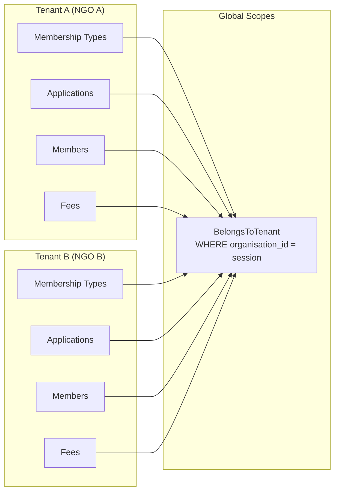
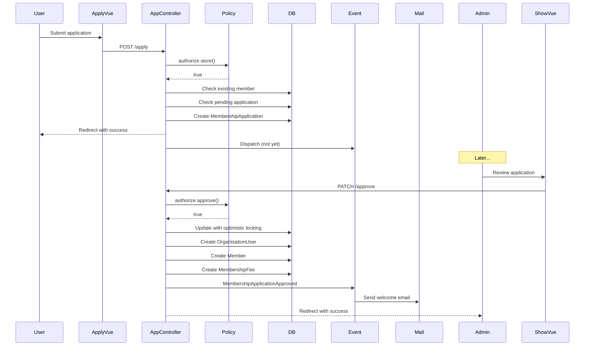
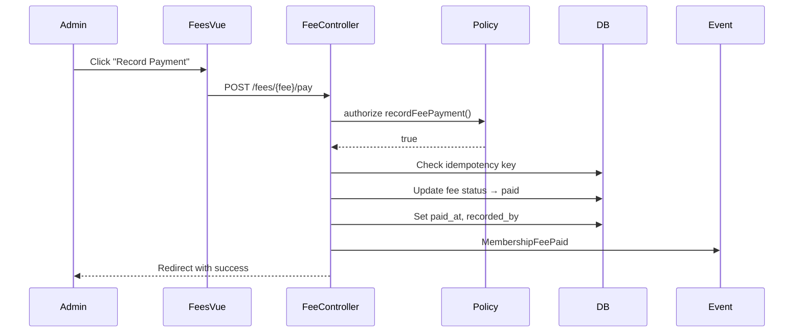
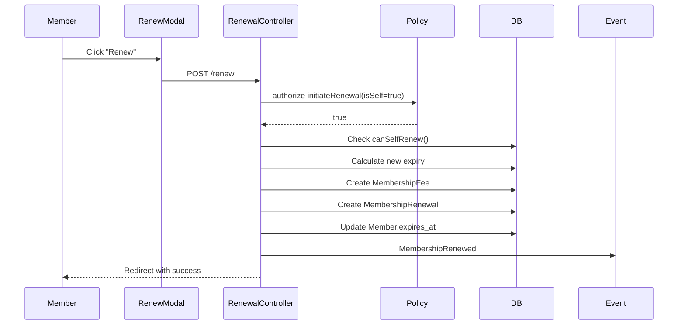
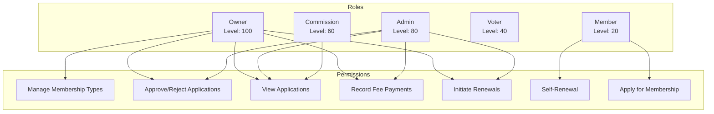
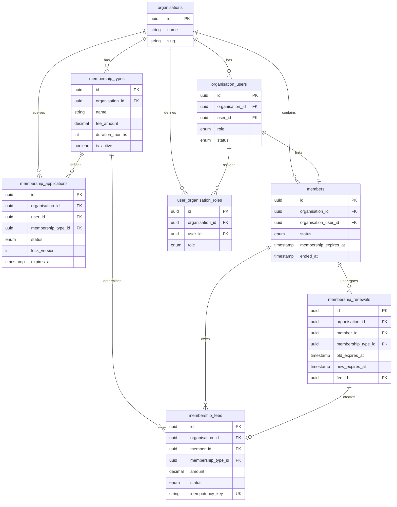
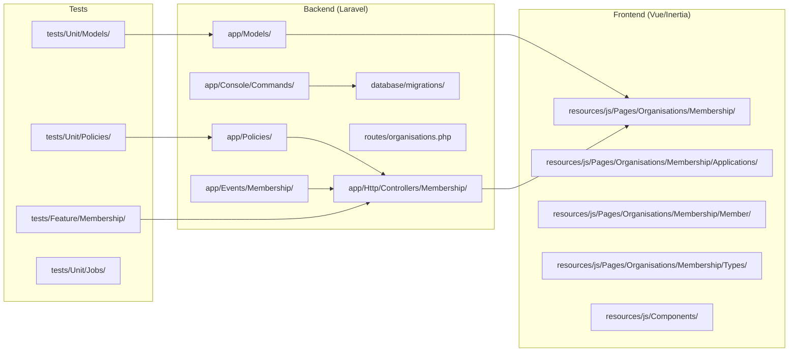
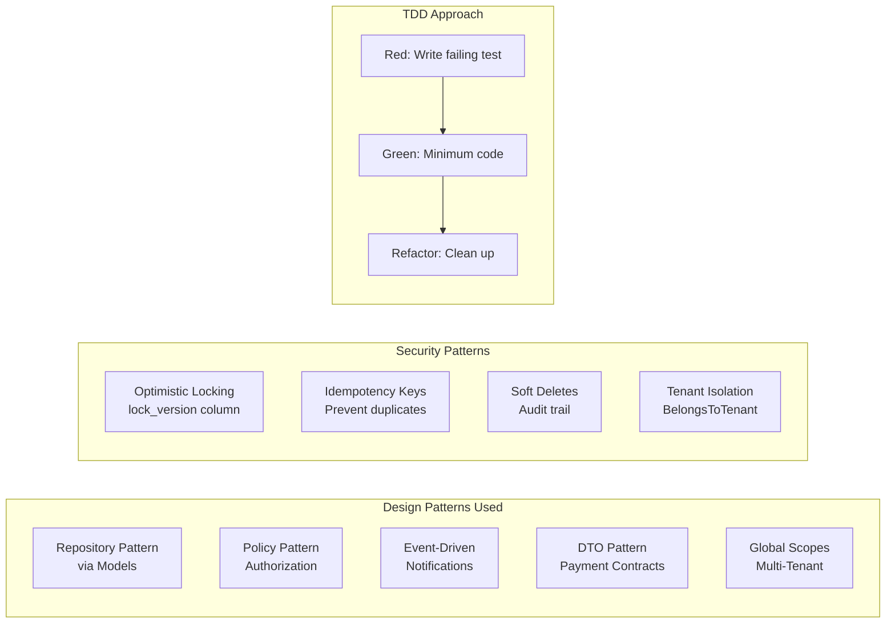
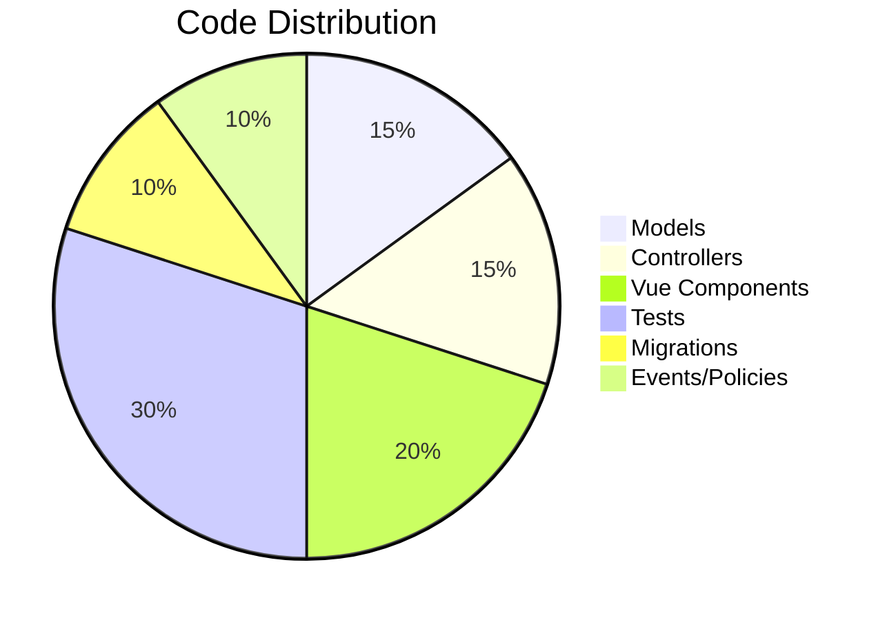

# 🏗️ **Membership Management System - Architecture Diagram**

## **Complete System Architecture (Mermaid)**

```mermaid
graph TB
    subgraph "Frontend Layer"
        UI1[Apply.vue<br/>Public Application Form]
        UI2[Applications/Index.vue<br/>Admin Application List]
        UI3[Applications/Show.vue<br/>Application Review]
        UI4[Types/Index.vue<br/>Membership Type CRUD]
        UI5[Member/Fees.vue<br/>Fee Management]
        UI6[Member/RenewModal.vue<br/>Self-Renewal]
    end

    subgraph "Controller Layer"
        C1[MembershipApplicationController<br/>- create()<br/>- store()<br/>- index()<br/>- show()<br/>- approve()<br/>- reject()]
        C2[MembershipFeeController<br/>- index()<br/>- pay()<br/>- waive()]
        C3[MembershipRenewalController<br/>- store()]
        C4[MembershipTypeController<br/>- index()<br/>- store()<br/>- update()<br/>- destroy()]
    end

    subgraph "Policy Layer"
        P1[MembershipPolicy<br/>- viewApplications()<br/>- approveApplication()<br/>- rejectApplication()<br/>- manageMembershipTypes()<br/>- recordFeePayment()<br/>- initiateRenewal()]
    end

    subgraph "Service Layer"
        S1[ManualPaymentGateway<br/>- createPayment()<br/>- confirmPayment()<br/>- refundPayment()]
        S2[ProcessMembershipExpiryCommand<br/>- auto-reject expired apps<br/>- mark overdue fees]
    end

    subgraph "Event Layer"
        E1[MembershipApplicationApproved]
        E2[MembershipApplicationRejected]
        E3[MembershipFeePaid]
        E4[MembershipRenewed]
    end

    subgraph "Model Layer"
        M1[MembershipType<br/>- organisation_id<br/>- fee_amount<br/>- duration_months<br/>- is_active]
        M2[MembershipApplication<br/>- status<br/>- lock_version<br/>- expires_at]
        M3[MembershipFee<br/>- amount snapshot<br/>- status<br/>- idempotency_key]
        M4[MembershipRenewal<br/>- old_expires_at<br/>- new_expires_at]
        M5[Member<br/>- status<br/>- membership_expires_at<br/>- canSelfRenew()<br/>- endMembership()]
        M6[OrganisationUser<br/>- user_id<br/>- role<br/>- status]
        M7[UserOrganisationRole<br/>- role]
    end

    subgraph "Database Layer"
        DB1[(membership_types)]
        DB2[(membership_applications)]
        DB3[(membership_fees)]
        DB4[(membership_renewals)]
        DB5[(members)]
        DB6[(organisation_users)]
        DB7[(user_organisation_roles)]
    end

    %% Frontend to Controller connections
    UI1 --> C1
    UI2 --> C1
    UI3 --> C1
    UI4 --> C4
    UI5 --> C2
    UI6 --> C3

    %% Controller to Policy
    C1 --> P1
    C2 --> P1
    C3 --> P1
    C4 --> P1

    %% Controller to Service
    C2 --> S1
    S2 --> M2
    S2 --> M3

    %% Controller to Events
    C1 --> E1
    C1 --> E2
    C2 --> E3
    C3 --> E4

    %% Controller to Models
    C1 --> M1
    C1 --> M2
    C1 --> M5
    C1 --> M6
    C1 --> M7
    C2 --> M3
    C2 --> M5
    C3 --> M3
    C3 --> M4
    C3 --> M5
    C4 --> M1

    %% Model Relationships
    M1 --> M2
    M1 --> M3
    M2 --> M5
    M3 --> M5
    M4 --> M5
    M5 --> M6
    M6 --> M7

    %% Models to Database
    M1 --> DB1
    M2 --> DB2
    M3 --> DB3
    M4 --> DB4
    M5 --> DB5
    M6 --> DB6
    M7 --> DB7
```

---

## **Multi-Tenant Architecture**



---

## **Application Workflow Sequence**



---

## **Fee Payment Sequence**



---

## **Self-Renewal Sequence**



---

## **Role-Based Access Control (RBAC)**



---

## **Database Schema Relationships**



---

## **File Structure**



---

## **Technology Stack**

```mermaid
graph TD
    subgraph "Frontend"
        VUE[Vue 3 + Composition API]
        INERTIA[Inertia.js]
        TAILWIND[Tailwind CSS]
        I18N[vue-i18n]
    end
    
    subgraph "Backend"
        LARAVEL[Laravel 10/11]
        PHP[PHP 8.2+]
        MYSQL[MySQL 8.0+]
        REDIS[Redis (Queue/Cache)]
    end
    
    subgraph "Testing"
        PHPUNIT[PHPUnit]
        PEST[Pest (optional)]
        TDD[TDD - Red/Green/Refactor]
    end
    
    subgraph "Infrastructure"
        QUEUE[Queue Workers]
        SCHEDULE[Scheduled Jobs]
        MAIL[Mail Service]
    end
    
    VUE --> INERTIA
    INERTIA --> LARAVEL
    LARAVEL --> MYSQL
    LARAVEL --> REDIS
    LARAVEL --> QUEUE
    LARAVEL --> SCHEDULE
    LARAVEL --> MAIL
    PHPUNIT --> LARAVEL
```

---

## **Key Architectural Decisions**



---

## **Summary Statistics**



| Component | Count | Lines of Code |
|-----------|-------|---------------|
| Models | 4 new + 2 modified | ~600 |
| Controllers | 4 | ~800 |
| Vue Components | 6 | ~1,500 |
| Tests | 11 files | ~2,000 |
| Migrations | 5 new + 1 alter | ~300 |
| Events | 4 | ~80 |
| Policies | 1 | ~100 |
| **Total** | **~30 files** | **~5,380 lines** |

---

This architecture provides a **scalable, secure, and maintainable** membership management system with full multi-tenant support! 🚀