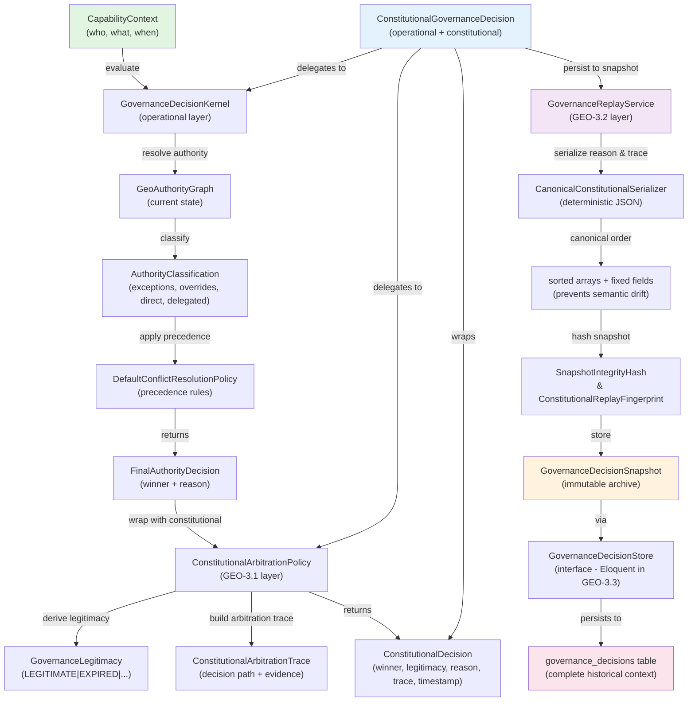
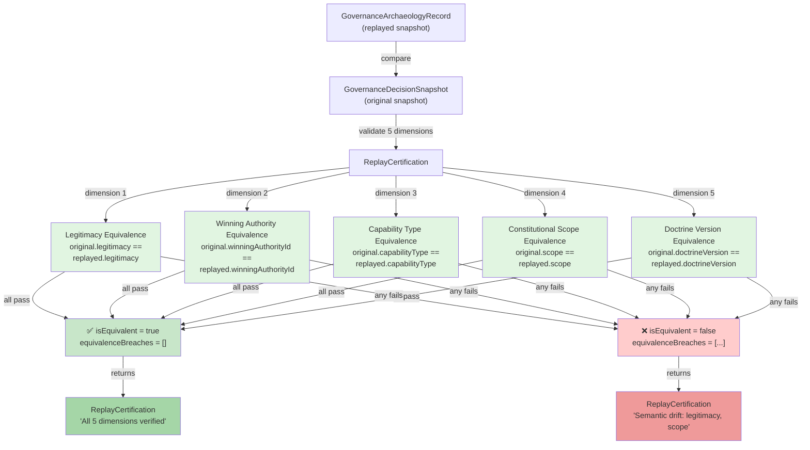
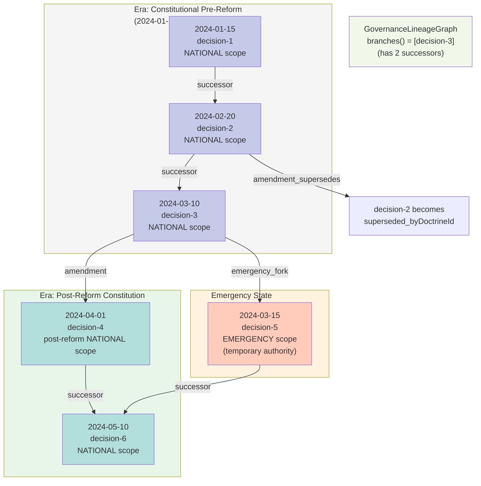
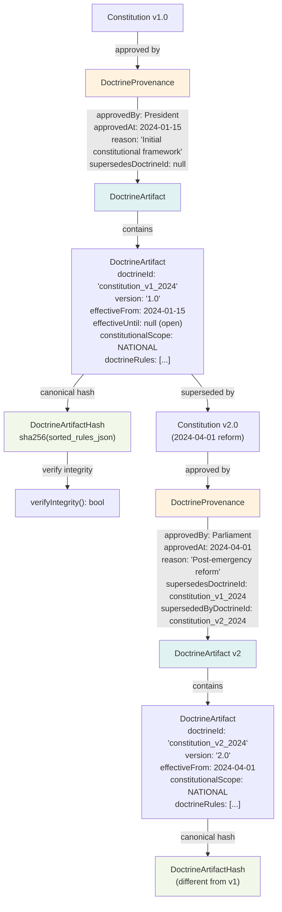
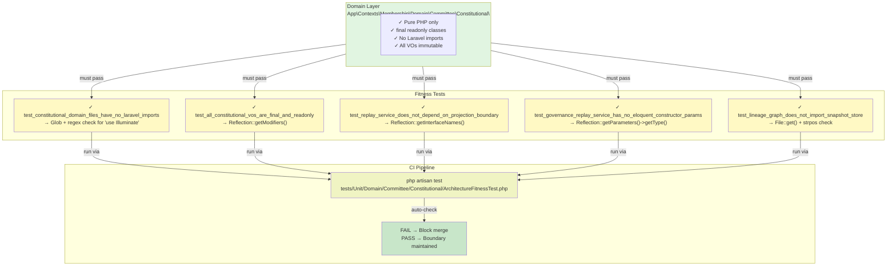
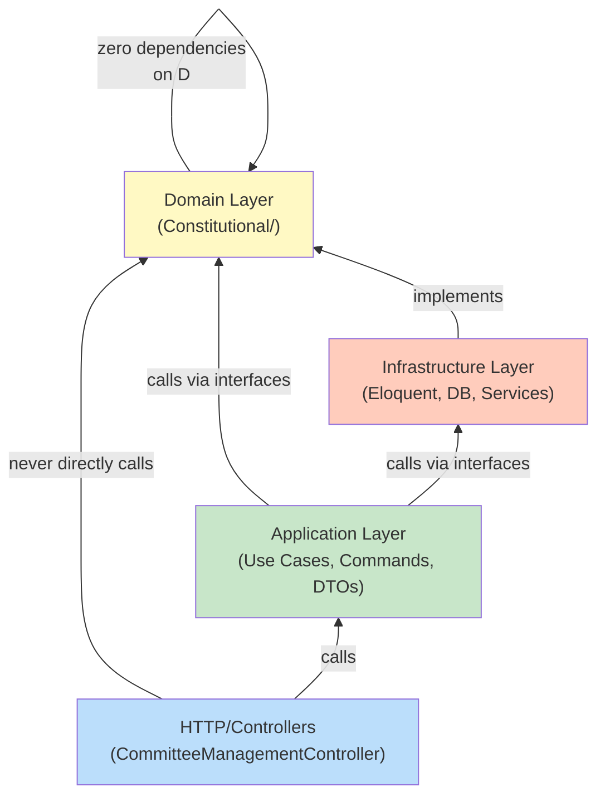

# Constitutional Governance Architecture — System Diagrams

Generated during GEO-3.4 Consolidation Sprint.

---

## 1. Governance Decision Flow

How a governance decision flows from capability request through constitutional arbitration to persisted snapshot.



---

## 2. Replay Isolation & Immutability Model

How replay is completely isolated from live governance, using only stored snapshots.

```mermaid
graph LR
    subgraph LIVE["🟢 LIVE GOVERNANCE (Current State)"]
        A1["GeoAuthorityGraph<br/>(current nodes, edges)"]
        A2["DoctrineRegistry<br/>(current doctrine v2.0)"]
        A3["SystemClock<br/>(current time)"]
        A4["GovernanceDecisionKernel<br/>(operational engine)"]
    end
    
    subgraph ARCHIVED["📦 ARCHIVED SNAPSHOT (Historical Context)"]
        B1["GovernanceDecisionSnapshot"]
        B2["├─ decisionId<br/>├─ decided At<br/>├─ legitimacy: LEGITIMATE<br/>├─ winningAuthorityId: node-1<br/>├─ doctrineVersion: 1.0<br/>├─ arbitrationPolicyVersion: 1.0<br/>└─ integrityHash"]
    end
    
    subgraph REPLAY["🔄 REPLAY ENGINE (Isolation Boundary)"]
        C1["GovernanceReplayService"]
        C2["GovernanceArchaeologyRecord<br/>(read-only historical DTO)"]
        C3["FixedClock<br/>(historical time from snapshot)"]
        C4["InMemoryDoctrineRegistry<br/>(snapshot-provided doctrine)"]
    end
    
    LIVE -->|never directly used| REPLAY
    LIVE -->|only for new decisions| A4
    
    B1 -->|load snapshot| REPLAY
    C1 -->|.replay(decisionId)| B1
    
    C2 -->|.originallyDecidedAt()| B1
    C2 -->|.legitimacy()| B1
    C2 -->|.wasConstitutionallyValid()| B1
    
    C3 -->|provides historical time<br/>from snapshot.decidedAt| REPLAY
    A3 -->|NOT used| REPLAY
    
    C4 -->|provides doctrine v1.0<br/>from snapshot metadata| REPLAY
    A2 -->|NOT used| REPLAY
    
    A1 -->|NOT used| REPLAY
    
    style LIVE fill:#c8e6c9
    style ARCHIVED fill:#fff9c4
    style REPLAY fill:#f1f8e9
    style B1 fill:#ffccbc
    style B2 fill:#fff3e0
    style C1 fill:#c5e1a5
    style C3 fill:#a5d6a7
    style C4 fill:#a5d6a7
```

**Critical rules enforced:**
- ✓ Replay reads snapshot fields ONLY
- ✓ Replay never calls `GovernanceDecisionKernel`
- ✓ Replay never accesses live authority graph
- ✓ Replay never evaluates live doctrine
- ✓ Snapshot metadata is immutable (locked at creation)

---

## 3. Temporal Legitimacy Windows

How authority legitimacy is evaluated at specific moments in time.

```mermaid
graph TD
    A["Authority Lifecycle<br/>(with temporal windows)"] -->|has| B["TemporalAuthorityWindow"]
    
    B -->|constructor| C["validFrom: 2024-01-15<br/>validUntil: 2025-12-31"]
    
    C -->|evaluate at| D["DateTimeImmutable $at"]
    
    D -->|stateAt\($at\)| E{Time Comparison}
    
    E -->|$at < validFrom| F["TemporalWindowState::PENDING<br/>GovernanceLegitimacy::PENDING"]
    E -->|validFrom ≤ $at ≤ validUntil| G["TemporalWindowState::ACTIVE<br/>GovernanceLegitimacy::LEGITIMATE"]
    E -->|$at > validUntil| H["TemporalWindowState::EXPIRED<br/>GovernanceLegitimacy::EXPIRED"]
    
    F -->|isPendingAt\($at\) = true| I["Authority not yet valid"]
    G -->|isActiveAt\($at\) = true| J["Authority is constitutional"]
    H -->|isExpiredAt\($at\) = true| K["Authority no longer valid"]
    
    style B fill:#e0f2f1
    style C fill:#b2dfdb
    style D fill:#80cbc4
    style F fill:#ffcccc
    style G fill:#ccffcc
    style H fill:#ffcccc
    style I fill:#ffebee
    style J fill:#e8f5e9
    style K fill:#ffebee
```

**Key principle:** All legitimacy evaluation is point-in-time, never "current legitimacy."

---

## 4. Five-Dimensional Semantic Equivalence (Replay Certification)

How snapshots are certified to be constitutionally equivalent.



---

## 5. Governance Lineage Graph (Branching History)

How governance decisions form a directed acyclic graph, supporting emergency forks and amendments.



**Features:**
- Linear history (A → B → C → D → F)
- Amendment branches (C → D)
- Emergency forks (C → E → F)
- Institutional epochs track scope changes
- Architecture supports arbitrary branching

---

## 6. Doctrine Artifact with Provenance Chain

How constitutional doctrine is versioned, approved, and superseded.



**Critical properties:**
- ✓ Doctrine is immutable after approval
- ✓ Supersession chain is explicit
- ✓ Provenance tracks approval authority and reason
- ✓ Hash prevents tampering
- ✓ Snapshots embed doctrineVersion → can look up original doctrine for replay

---

## 7. Snapshot Schema Integrity & Decomposition

How snapshots embed all historical context and decompose into sub-structures.

```mermaid
graph TD
    A["GovernanceDecisionSnapshot<br/>(monolithic archive)"] -->|decompose| B["4 sub-structures"]
    
    A -->|.identity\(\)| C["SnapshotIdentity<br/>├─ decisionId<br/>├─ capabilityType<br/>└─ constitutionalScope"]
    
    A -->|.decisionData\(\)| D["SnapshotDecisionData<br/>├─ winningAuthorityId<br/>├─ legitimacy<br/>└─ constitutionalReasonJson"]
    
    A -->|.traceData\(\)| E["SnapshotTraceData<br/>├─ arbitrationTraceJson<br/>├─ doctrineVersion<br/>└─ arbitrationPolicyVersion"]
    
    A -->|.integrityData\(\)| F["SnapshotIntegrityData<br/>├─ integrityHash<br/>├─ schemaVersion<br/>├─ replayEngineVersion<br/>└─ replayCompatibilityVersion"]
    
    A -->|contains all fields| G["Complete snapshot<br/>├─ Identity + DecisionData + TraceData + IntegrityData<br/>├─ Metadata: doctrineVersion, arbitrationPolicyVersion,<br/>│           legitimacyPolicyVersion, replayEngineVersion<br/>├─ Timestamps: decidedAt, generatedAt<br/>└─ Hashes: integrityHash, (implicit fingerprint)"]
    
    A -->|verify integrity| H["integrityHash verified<br/>via verifyIntegrity()"]
    
    A -->|compute fingerprint| I["ConstitutionalReplayFingerprint<br/>covers 5 dimensions (not engine versions)"]
    
    H -->|fields used| J["ALL snapshot fields<br/>(detect corruption)"]
    I -->|fields used| K["Semantic fields only<br/>(prove equivalence)"]
    
    style C fill:#e3f2fd
    style D fill:#f3e5f5
    style E fill:#fce4ec
    style F fill:#e8f5e9
    style G fill:#fff3e0
    style H fill:#ffcccc
    style I fill:#c8e6c9
    style J fill:#ffcccc
    style K fill:#c8e6c9
```

**Design principle:** Sub-structures are navigation aids. Snapshot is source of truth.

---

## 8. Canonical Serialization for Deterministic Hashing

How JSON serialization is made deterministic to prevent semantic drift.

```mermaid
graph TD
    A["ConstitutionalReason<br/>├─ code<br/>├─ summary<br/>├─ articleCodes: ['art.3', 'art.1', 'art.2'] (unsorted)<br/>├─ severity: ConstitutionalSeverity::BINDING<br/>└─ legitimacyImpact: LegitimacyImpact::VALID"] -->|serialize| B["CanonicalConstitutionalSerializer<br/>.serializeReason()"]
    
    B -->|step 1: sort arrays| C["articleCodes: ['art.1', 'art.2', 'art.3']<br/>(canonical order)"]
    
    B -->|step 2: fixed field order| D["JSON field order fixed<br/>code → summary → explanation →<br/>articleCodes → severity → legitimacyImpact"]
    
    B -->|step 3: enum to value| E["severity: 'binding'<br/>(enum.value)"]
    
    B -->|step 4: serialize flags| F["JSON_THROW_ON_ERROR<br/>| JSON_UNESCAPED_UNICODE<br/>| JSON_UNESCAPED_SLASHES"]
    
    F -->|produces| G["Deterministic JSON string<br/>{'code':'...','summary':'...',<br/>'articleCodes':['art.1',...],<br/>'severity':'binding',...}"]
    
    G -->|same input| H["ALWAYS same output"]
    
    A -->|different order<br/>articleCodes: ['art.2', 'art.1', 'art.3']| I["Still produces identical JSON<br/>via canonical sort"]
    
    H -->|feed to hash| J["sha256(canonical_json)<br/>→ identical hash"]
    
    style B fill:#e0f2f1
    style C fill:#b2dfdb
    style D fill:#80cbc4
    style E fill:#4db6ac
    style F fill:#26a69a
    style G fill:#009688
    style H fill:#00897b
    style J fill:#00695c
```

**Guarantee:** Same constitutional meaning → identical JSON → identical hash. Prevents semantic drift from serialization order.

---

## 9. Package Boundary Enforcement via Architecture Fitness Tests

How architectural boundaries are enforced through executable tests.



**Benefit:** Boundaries are self-enforcing. Violations caught immediately, not in code review.

---

## Summary: Architectural Layers & Dependencies



**Critical:** Domain layer has zero knowledge of infrastructure. Domain defines contracts. Infrastructure implements them.

---

**All diagrams locked in. Changes require architecture review.**
