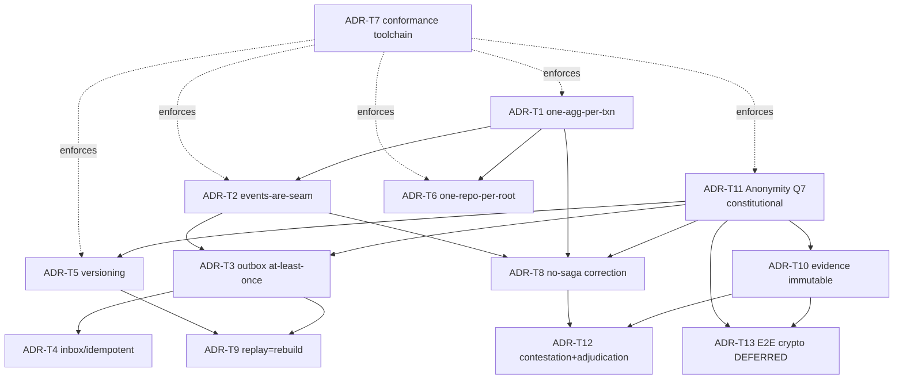

# ADR-T Log — Tactical Implementation Decisions

**Scope:** tactical/implementation ADRs for the greenfield Core (distinct from domain ADR-001…008). Each promotes a decision validated in **LIT-A** (Decision Traceability Matrix D1–D12) and recorded in Round 50-xx. **Status:** Accepted unless noted. Implementation slices reference these by ID.
**Date:** 2026-06-26 · Conformance enforced by ADR-T7 toolchain.

| ADR | Decision | Context / why | Consequence | Source |
|-----|----------|---------------|-------------|--------|
| **ADR-T1** | **One aggregate per transaction** (consistency boundary) | true invariants must be transactional; cross-aggregate consistency is eventual | no txn writes two roots; fitness-tested | D1 · 50-08 · Vernon |
| **ADR-T2** | **Cross-aggregate collaboration via domain events only** (TP-1) | aggregates must not reach across boundaries | event is the seam; no foreign repo calls | D2 · 50-04 |
| **ADR-T3** | **Reliable publishing via transactional outbox; at-least-once** | event + state in one txn; no 2PC | existing `ProcessOutboxEvents`; consumers must dedupe | D3 · 50-04/05 · Richardson |
| **ADR-T4** | **Idempotent consumers via Inbox/dedupe table (key=`EventId`)** | at-least-once ⇒ duplicates possible | inbox table; no ad-hoc dedupe | D4 · R-1 · Richardson |
| **ADR-T5** | **Events version, never mutate; new version convertible-from-old else NEW event; never rename/repurpose a property** (TP-3) | downstream consumers read old + new | vN+1 for breaking; old retained until migrated | D5 · R-2 · Young |
| **ADR-T6** | **One repository per aggregate root; non-root reads via read models** | repo = aggregate roots only (DDD), persistence ignorance | no repo-per-table; no generic repo | D6 · 50-08 · Evans/Fowler |
| **ADR-T7** | **Executable architecture conformance**: Deptrac (boundaries/layers) + PHPStan + Pest/PHPUnit + `tests/Architecture` (constitutional rules) | manual review insufficient | drift fails CI | D7 · R-3 · Ford/Parsons/Kua |
| **ADR-T8** | **Correction loop without saga**: thin `AdjudicationService` coordinator; forward-only `ContainedOnly` correction | compensation assumes reversibility; anonymity forbids un-casting | no compensating txns; eventual consistency via events | D8 · 50-03/04 |
| **ADR-T9** | **Replay = projection-rebuild, not re-execution**; Replay as Application capability | Decision/side-effecting events are one-time acts | replay rebuilds read models only | D9 · 50-05 · BDR-06 |
| **ADR-T10** | **EvidenceEnvelope immutable + content hash** | tamper-evident audit trail | freeze-then-immutable; idempotent on `envelopeHash` | D10 · 50-01/06 |
| **ADR-T11** | **Anonymity invariant (Q7)** — no voter↔vote linkage in any aggregate, event payload, or projection; hashes only | constitutional, build-breaking | fitness test asserts no linkage/`user_id` reconstruction | D11 · 50-04/05 |
| **ADR-T12** | **Contestation + Adjudication = binding finality** (greenfield Core) | dispute resolution is an open problem in the voting literature | the trustworthiness differentiator; candidate contribution | D12 · 50-03 |
| **ADR-T13** | **Cryptographic E2E verifiability — DEFERRED (Proposed)** | current integrity = hash + audit-trail, weaker than voter-verifiable crypto proof | recorded **known limitation**; revisit in Part B | R-4 · S17–S20 |
| **ADR-T15** | **`EventOutbox` is an Application Port** (not an infra service) | the app service enqueues events; dispatch/publication is hidden behind the port | service never publishes directly; aggregate→pullEvents()→enqueue()→commit | R1.1 review · hexagonal/TP-1 |
| **ADR-T16** | **Cross-context references are local opaque VOs** (`ChallengeRef`, `EvidenceEnvelopeRef`) — never import another context's aggregate types | bounded-context isolation; the id string crosses the boundary, not the type | fitness test asserts no cross-context Domain import; canonical pattern for all contexts | R1.1 review · TP-1 |
| **ADR-T17** | **LegitimacyDecision placement — POSTPONED (not avoided)** — intentionally sequenced because the current implementation does not require it (legitimacy is a clean input today) | options: (1) aggregate runs it; (2) **Adjudication domain service [preferred — legitimacy depends on evidence beyond one entity]**; (3) application service **REJECTED** (no constitutional reasoning in orchestration) | first agenda item of Push B | R1.1 review Q3 · 50-06 |
| **ADR-T14** | **Adjudication interaction = Option A: Challenge READ-ONLY** during `IssueDetermination`; **Determination is the sole aggregate written** in the transaction | one-aggregate-per-transaction (ADR-T1) must not be violated; Challenge is resolved **asynchronously later** by reacting to `DeterminationIssued` + `ElectionCorrectionApplied` (50-07 Routed→Resolved) | `AdjudicationService` loads Challenge (read), verifies `canProceedToAdjudication()` (state=Routed), creates+saves Determination, enqueues `DeterminationIssued` to outbox in the same txn; never writes Challenge | 50-03 · 50-07 · 50-08 |

## ADR dependency graph (prevents conflicting future ADRs)

**Rule:** a new ADR that contradicts an upstream node (esp. **T11 anonymity** or **T1 one-txn**) is rejected; superseding requires an explicit ADR + Architecture Review Gate.

## ADR template (for any new tactical ADR)
`Title · Status (Proposed/Accepted/Superseded) · Context · Decision · Consequences · Quality attribute · Source (Dxx/Round 50-xx/literature) · Conformance test`

---
*ADR-T Log — Tactical Implementation — ADR-T1..T12 Accepted; ADR-T13 Deferred. Every greenfield-Core slice references these IDs; ADR-T7 toolchain enforces ADR-T1/T2/T5/T6/T11 mechanically.*
