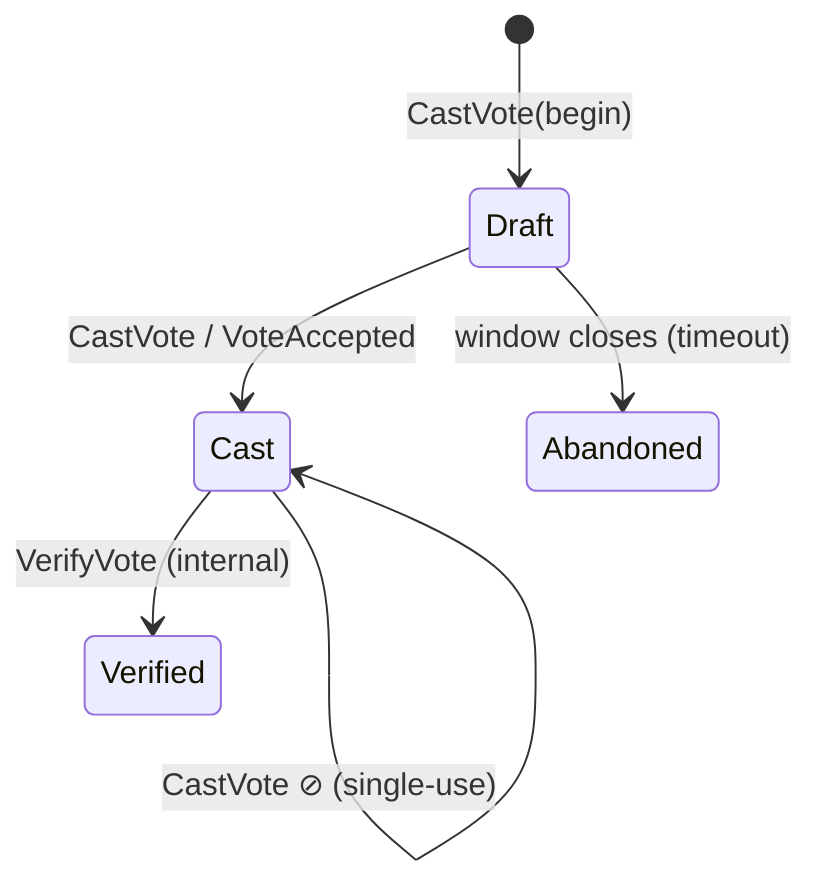
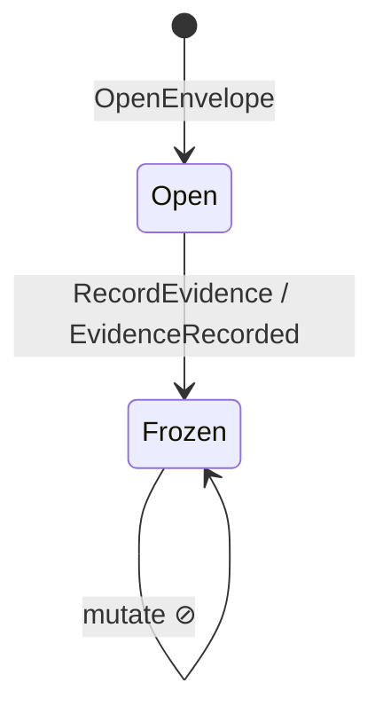
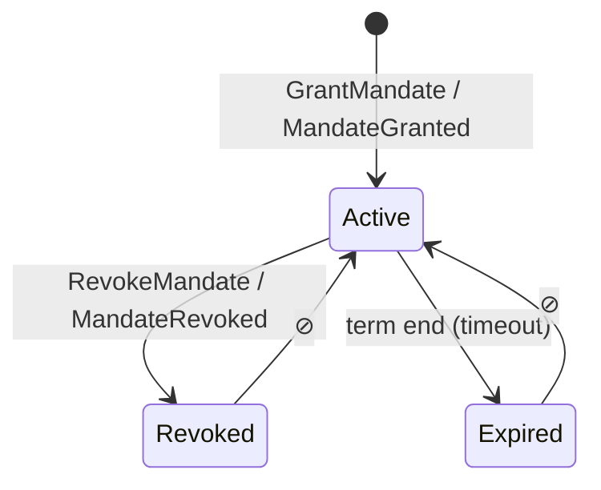
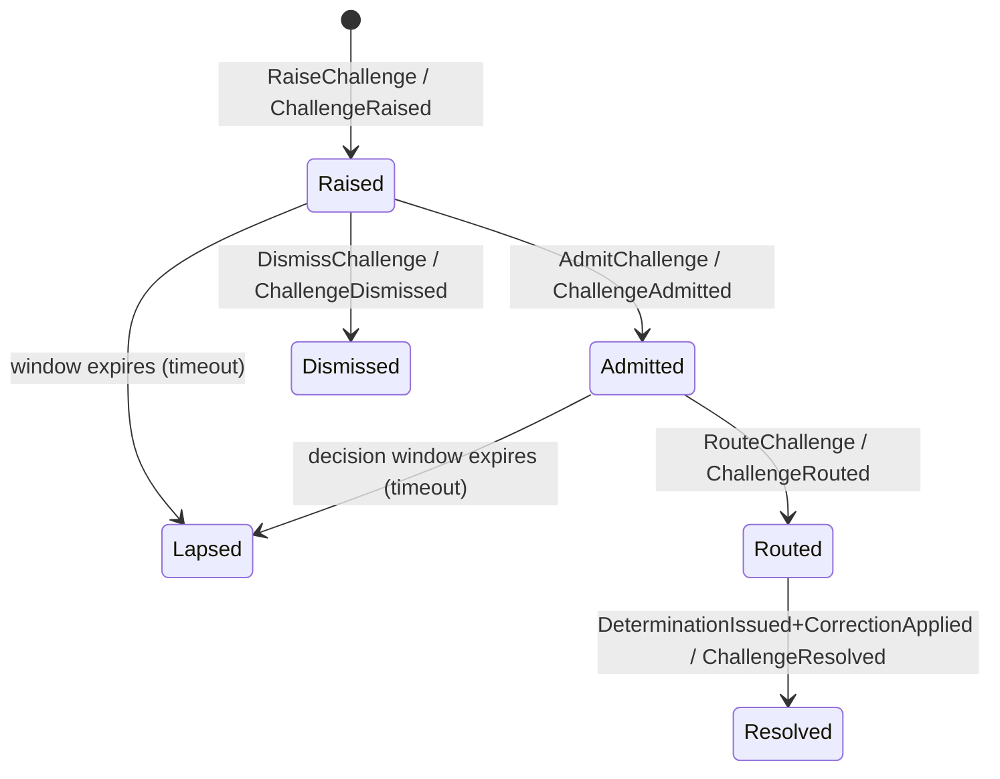
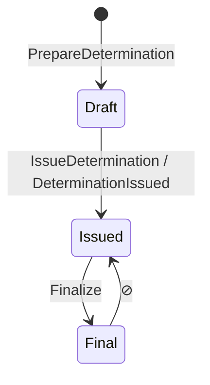
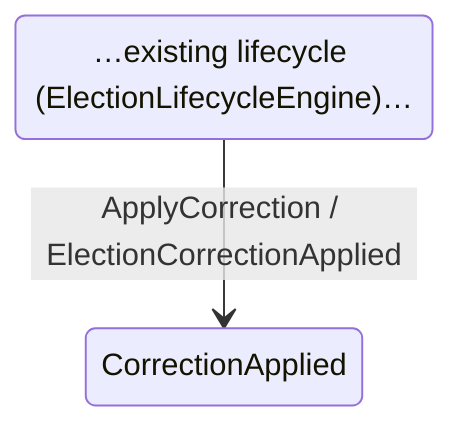
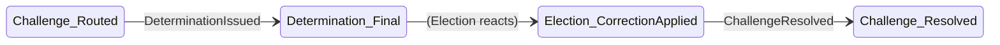

# Round 50-07 — Aggregate Lifecycle and State Machine Specification

**Phase III (Tactical Realization) · Built against Release 1.0 · Design only · v1.1 · 2026-06-26**
**Status:** 🔁 CANDIDATE v1.1 (supersedes v1.0 "Aggregate State Machines") — normative lifecycle spec per aggregate: states · **invariants** · **ownership** · **Command→Policy→Transition→Event tables** · **guards** · **concurrency** · **failure/rejection** · **temporal/clock** · UML. Not yet frozen.

## Modeling discipline (tactical EBSD analogue)
Every transition is specified as the same chain the strategic work used:
```
Decision → Command → Policy(guard) → Transition → State → Domain Event
```
Conventions: **▣ terminal · ↦ allowed · ⊘ forbidden** (fitness-tested). Events come from the **Canonical Event Catalog v1.0**; no event is invented here. Each transition emits its event **after** state commit, via the outbox (same txn, ADR-T3).

## State ownership (no aggregate mutates another's state — SD-5 #4 / TP-1)
| State family | Owned by |
|--------------|----------|
| Draft/Cast/Verified/Abandoned | **Vote** aggregate |
| Open/Frozen (evidence) | **EvidenceEnvelope** (Evidence) |
| Active/Revoked/Expired (mandate) | **Mandate** (Appointment) |
| Raised/Admitted/Routed/Resolved/Dismissed/Lapsed | **Challenge** (Contestation) |
| Draft/Issued/Final (determination) | **Determination** (Adjudication) |
| …lifecycle… / CorrectionApplied | **Election** (Lifecycle) |

## Cross-cutting rules
- **Concurrency (optimistic):** every aggregate carries `AggregateVersion`; writes assert `WHERE version=:expected` (ADR-T1, 50-08). Conflicting commands → `ConcurrencyConflict` → reject + retry on fresh state. *No pessimistic locks on the voting path.* Vote double-cast is additionally blocked by single-use code semantics.
- **State-machine versioning:** state machines are **versioned**; existing instances continue under their **originating version**; a version change never silently re-interprets live instances — migration is an **explicit transition**. (Critical for in-flight elections.)
- **Temporal constraints & clock authority:** all windows (voting, challenge-raise, challenge-decision, mandate-term) are **governance-configured**, expressed in **UTC**, and resolved against the **single Temporal trust-root clock** (38C model) — never local server time. Timeouts are system-driven transitions to terminal states.
- **Recovery:** crash between commit and publish → outbox redelivers; consumers idempotent on `EventId` (inbox, ADR-T4); causal waits **park, not fail** (50-05 §3).

## Review questions (answered per aggregate below)
*skip? · repeat? · split? · merge? · rollback? · timeout? · who owns the transition? · what evidence proves it?*

---

## Vote — owned by Vote aggregate

**State invariants**
| State | Invariant |
|-------|-----------|
| Draft | mutable selection; **no receipt**; no event emitted |
| Cast | receipt+vote hash exist; selection immutable; **no voter↔vote link (Q7, ADR-T11)**; `VoteAccepted` emitted |
| Verified | `EvidenceRecorded` exists for this vote; replay possible |
| Abandoned ▣ | not counted; no downstream event |
**Transitions (normative)**
| From | Command | Policy / Guard | To | Event | Allowed |
|------|---------|----------------|----|-------|---------|
| Draft | CastVote | VotingEligibilityPolicy + BallotAdmissibilityPolicy + VotingWindowOpen + ElectionActive | Cast | VoteAccepted | ✅ |
| Draft | (timeout) | window closed | Abandoned ▣ | — | ✅ (system) |
| Cast | VerifyVote | EvidenceRecorded present | Verified | — (internal) | ✅ |
| Cast | CastVote | — | Cast | — | ⊘ single-use code |
| Verified/Abandoned | any | — | — | — | ⊘ terminal |
**Review:** skip ✘ · repeat ✘ (single-use) · split ✘ · merge ✘ · rollback ✘ (immutable once Cast) · timeout ✔ (→Abandoned) · owner=Vote · evidence=`voteHash`+`VoteAccepted`.

## EvidenceEnvelope — owned by Evidence aggregate

**Invariants:** Open = mutable, hash not final · Frozen ▣ = immutable, `envelopeHash` final, `EvidenceRecorded` emitted.
**Transitions**
| From | Command | Policy / Guard | To | Event | Allowed |
|------|---------|----------------|----|-------|---------|
| Open | RecordEvidence | EvidenceRecordingPolicy + EnvelopeHashCalculation | Frozen ▣ | EvidenceRecorded | ✅ |
| Frozen | mutate | — | — | — | ⊘ immutability |
**Review:** repeat ✘ · rollback ✘ · timeout ✘ (explicit freeze) · owner=Evidence · evidence=`envelopeHash`. Freeze idempotent on `envelopeHash`.

## Mandate — owned by Appointment aggregate

**Invariants:** Active = within term, holder set · Revoked ▣ = reason recorded · Expired ▣ = term ended.
**Transitions**
| From | Command | Policy / Guard | To | Event | Allowed |
|------|---------|----------------|----|-------|---------|
| ∅ | GrantMandate | MandateAuthorityPolicy + MandateScopeValidation | Active | MandateGranted | ✅ |
| Active | RevokeMandate | MandateAuthorityPolicy + DelegationLifecyclePolicy(ACTIVE→REVOKED) | Revoked ▣ | MandateRevoked | ✅ |
| Active | (timeout) | term end (UTC, clock authority) | Expired ▣ | — | ✅ (system) |
| Revoked/Expired | GrantMandate | — | — | — | ⊘ no resurrection |
**Review:** rollback ✘ · timeout ✔ (→Expired, distinct from Revoked) · owner=Mandate · evidence=`MandateGranted/Revoked`.

## Challenge — owned by Contestation aggregate *(greenfield Core)*

**Invariants**
| State | Invariant |
|-------|-----------|
| Raised | standing verified; within raise window; submitted content attached |
| Admitted | admissibility = admit |
| Routed | jurisdiction assigned; **parked** awaiting Determination |
| Resolved ▣ | linked `determinationId`; correction acknowledged |
| Dismissed ▣ | dismissed-on-merits; reason recorded |
| Lapsed ▣ | window expired without decision (≠ Dismissed) |
**Transitions**
| From | Command | Policy / Guard | To | Event | Allowed |
|------|---------|----------------|----|-------|---------|
| ∅ | RaiseChallenge | ChallengeStandingPolicy + ChallengeContentValidation + RaiseWindowOpen | Raised | ChallengeRaised | ✅ |
| Raised | AdmitChallenge | ChallengeAdmissibilityDecision=admit | Admitted | ChallengeAdmitted | ✅ |
| Raised | DismissChallenge | ChallengeAdmissibilityDecision=dismiss | Dismissed ▣ | ChallengeDismissed | ✅ |
| Raised/Admitted | (timeout) | decision window expired | Lapsed ▣ | — | ✅ (system) |
| Admitted | RouteChallenge | ChallengeRoutingDecision | Routed | ChallengeRouted | ✅ |
| Routed | ResolveChallenge | `DeterminationIssued` received **and** `ElectionCorrectionApplied` | Resolved ▣ | ChallengeResolved | ✅ |
| Raised | AdmitChallenge | raise window closed | — | — | ⊘ |
| Resolved/Dismissed/Lapsed | any | — | — | — | ⊘ terminal |
**Review:** skip ✘ (must route before resolve) · repeat ✘ · rollback ✘ · timeout ✔ (→Lapsed) · owner=Contestation · evidence=`determinationId` on Resolved.

## Determination — owned by Adjudication aggregate *(greenfield Core)*

**Invariants:** Draft = authority verified, evidence referenced · Issued = outcome+legitimacy set, `DeterminationIssued` emitted · Final ▣ = immutable; override only via amendment (S-1/S-5).
**Transitions**
| From | Command | Policy / Guard | To | Event | Allowed |
|------|---------|----------------|----|-------|---------|
| ∅ | PrepareDetermination | DeterminationAuthorityPolicy (jurisdiction) | Draft | — | ✅ |
| Draft | IssueDetermination | LegitimacyDecision + evidenceEnvelopeRef present | Issued | DeterminationIssued | ✅ |
| Issued | Finalize | DeterminationFinalityInvariant | Final ▣ | — | ✅ |
| Final/Issued | IssueDetermination (same `challengeId`) | — | — | — | ⊘ issued once |
**Concurrency:** one Determination per `challengeId` (uniqueness guard). **Review:** repeat ✘ · rollback ✘ · timeout ✘ (authority act, not time-driven) · owner=Adjudication · evidence=`issuedByAuthority`+`DeterminationIssued`. *Requested by `AdjudicationService` (request-not-create, TP-2).*

## Election / Lifecycle — owned by Election aggregate

**Invariants:** CorrectionApplied = `correctionType` set; **`ContainedOnly`** when votes cannot be un-cast (Q7); `ChallengeResolved` follows.
**Transitions**
| From | Command | Policy / Guard | To | Event | Allowed |
|------|---------|----------------|----|-------|---------|
| (existing state) | ApplyCorrection *(reacts to `DeterminationIssued`)* | CorrectionTypeDecision + ContainedCorrectionInvariant | CorrectionApplied | ElectionCorrectionApplied | ✅ |
| any | Adjudication mutates Election directly | — | — | — | ⊘ SD-5 #4 |
**Review:** rollback ✘ (forward-only; cannot un-cast) · timeout ✘ · owner=Election · evidence=`determinationId`+`ElectionCorrectionApplied`. **Existing lifecycle state names are authoritative — confirm against `ElectionLifecycleEngine` at implementation; only the correction transition is new here.**

---

## Cross-aggregate flow (correction loop)

Each hop atomic; linked by causal events; **no cross-aggregate transaction** (ADR-T1/Q10).

## Fitness tests (from this spec)
- Every aggregate exposes its allowed transition set; forbidden transitions **throw**, never silently no-op.
- Terminal states reject all transitions; every timeout has an explicit terminal target.
- Each transition's guard policy exists (50-06) and is exercised.
- Concurrency: conflicting commands raise `ConcurrencyConflict` (version check), never lost-update.
- Parked (awaiting-causal-event) states are recoverable, never dead-locked.

## Open
- Exact Election/Lifecycle state names ← existing engine (confirm at implementation).
- Challenge raise/decision window durations = governance config (not hardcoded).

## Next
```
50-07 v1.1 (this) → freeze on review → 50-08 Repository & Transaction → 50-09 Verification → Implementation
```

---
*Round 50-07 — Aggregate Lifecycle and State Machine Specification — CANDIDATE v1.1.*
*Adds: state invariants, state ownership, Command→Policy→Transition→Event tables, explicit guards, optimistic-concurrency rule, failure/rejection + timeout transitions (Abandoned/Expired/Lapsed/Dismissed), temporal/clock-authority (UTC + Temporal trust-root), state-machine versioning, UML (mermaid) diagrams, per-aggregate review questions. Modeling discipline = Decision→Command→Policy→Transition→State→Event. Events constrained to Canonical Event Catalog v1.0. Not frozen — awaiting review.*
