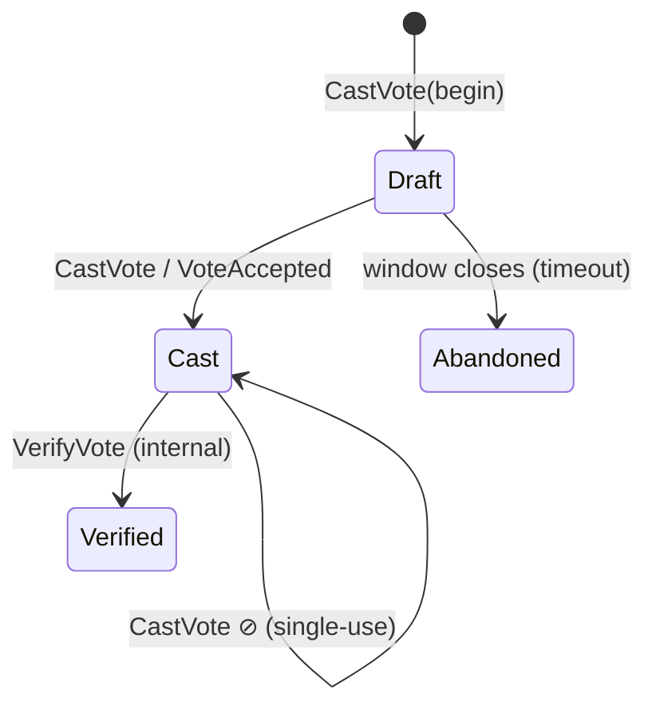
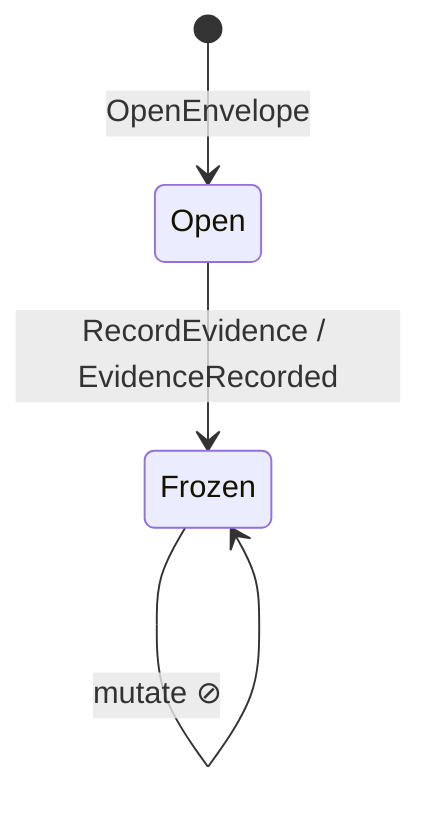
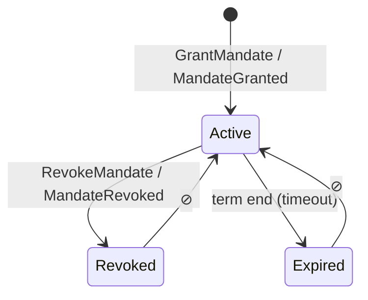
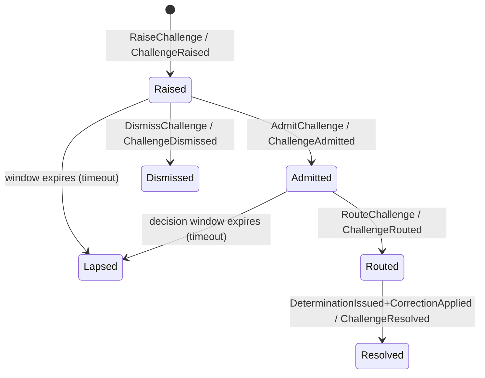
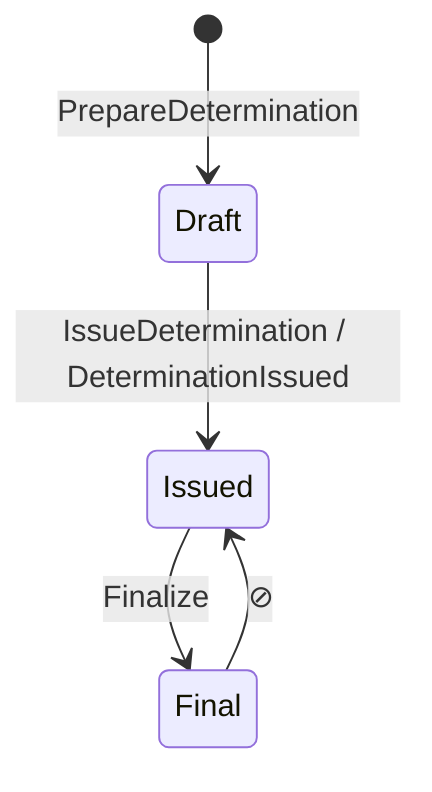
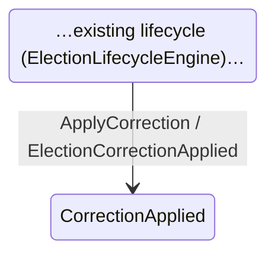

# Round 50-07 — Aggregate Lifecycle and State Machine Specification

**Phase III (Tactical Realization) · Built against Release 1.0 · Design only · v1.2 FINAL · 2026-06-26**
**Status:** 🧊 FROZEN v1.2 (RC1=v1.1 → Final; supersedes v1.0 "Aggregate State Machines") — **normative implementation specification**: principles · identity · states · **invariants** · **ownership** · **Command→Policy→Transition→Event tables** · **guards** · **concurrency** · **failure/rejection** · **temporal/clock** · atomicity · retry · event-guarantees · transition classes · fitness-test linkage · UML. **Last tactical design doc — implementation proceeds from here.**

## Aggregate State Machine Principles (read first)
1. Every aggregate has **exactly one authoritative state machine**.
2. Every transition is **initiated by a command**.
3. Every transition is **validated by policies (guards) before execution**.
4. Every successful transition **changes state exactly once**.
5. Every successful transition **emits canonical domain events** (Catalog v1.0) — or none (internal).
6. **No aggregate directly changes another aggregate's state** (SD-5 #4 / TP-1).
7. **Recovery must never violate invariants.**
8. **Terminal states reject all transitions.**
9. **Time-driven transitions use the authoritative governance clock** (Temporal trust-root, UTC).
10. **State machines are versioned**; running instances continue under the version with which they were created.

## Modeling discipline (tactical EBSD analogue)
Every transition is specified as the same chain the strategic work used:
```
Decision → Command → Policy(guard) → Transition → State → Domain Event
```
Conventions: **`[*]` = INITIAL/FINAL (UML) · ▣ terminal · ↦ allowed · ⊘ forbidden** (fitness-tested). Events come from the **Canonical Event Catalog v1.0**; no event is invented here.

## State machine identity (each aggregate's SM)
| Field | Meaning |
|-------|---------|
| `StateMachineId` | stable id (e.g. `vote-sm`, `challenge-sm`) |
| `Version` | SM version (e.g. v1); multiple may run simultaneously |
| `OwnerAggregate` | the sole aggregate that executes it |
| `EffectiveFrom` / `EffectiveUntil` | validity window; **an instance binds to the version effective at its creation** (Principle 10) |

## Transition atomicity (ordering is FIXED — never reordered)
```
guard (policies) ─► [pass?] ─► state mutation (×1) ─► event creation ─► outbox append (same txn) ─► COMMIT ─► async dispatch
```
Guard failure **aborts before** any mutation. Event + state commit in **one transaction** (ADR-T1/T3).

## Illegal (forbidden) transition policy — deterministic
A `⊘` attempt → **throw `DomainException`** → **no state mutation** → recorded to **Audit as a security event** → **no domain event emitted**. Same behavior everywhere (no per-developer variance).

## Retry & idempotency (per action)
| Action | Retryable? | Idempotent? |
|--------|-----------|-------------|
| Command on stale version | No (retry on fresh state after `ConcurrencyConflict`) | — |
| `CastVote` | **No** (single-use code) | n/a |
| Event delivery (all) | **Yes** (at-least-once) | **Yes** (consumer dedupes on `EventId`, ADR-T4) |
| Timeout transition | system-driven, once | yes |

## Event ownership & emission guarantees (single producer; effectively-once)
| Event | Sole producer | Emitted at | Guarantee |
|-------|---------------|-----------|-----------|
| `VoteAccepted` | Vote | Draft→Cast | exactly-once per vote (effectively-once delivery) |
| `EvidenceRecorded` | EvidenceEnvelope | Open→Frozen | exactly-once per envelope |
| `MandateGranted`/`Revoked` | Mandate | grant / revoke | exactly-once each |
| `ChallengeRaised…Resolved` | Challenge | each transition | exactly-once per transition |
| `DeterminationIssued` | Determination | Draft→Issued | **exactly-once per `challengeId`** |
| `ElectionCorrectionApplied` | Election | ApplyCorrection | exactly-once per `determinationId` |
*No other aggregate may emit these (fitness-tested, AT-EVT-001).*

## Transition classification (drives authorization)
| Class | Examples |
|-------|----------|
| **User-initiated** | `CastVote`, `RaiseChallenge` |
| **System-initiated** | timeouts → `Abandoned`/`Expired`/`Lapsed` |
| **Governance-initiated** | `GrantMandate`/`RevokeMandate`, `AdmitChallenge`/`RouteChallenge`, `IssueDetermination`, `ApplyCorrection` |
| **Recovery-initiated** | outbox redelivery, projection replay-rebuild |
| **Administrative** | (e.g. `CancelElection` — if/when defined; governance-authorized) |

## State ownership (no aggregate mutates another's state — SD-5 #4 / TP-1)
| State family | Owned by |
|--------------|----------|
| Draft/Cast/Verified/Abandoned | **Vote** aggregate |
| Open/Frozen (evidence) | **EvidenceEnvelope** (Evidence) |
| Active/Revoked/Expired (mandate) | **Mandate** (Appointment) |
| Raised/Admitted/Routed/Resolved/Dismissed/Lapsed | **Challenge** (Contestation) |
| Draft/Issued/Final (determination) | **Determination** (Adjudication) |
| …lifecycle… / CorrectionApplied | **Election** (Lifecycle) |

## Cross-cutting rules
- **Concurrency (optimistic):** every aggregate carries `AggregateVersion`; writes assert `WHERE version=:expected` (ADR-T1, 50-08). Conflicting commands → `ConcurrencyConflict` → reject + retry on fresh state. *No pessimistic locks on the voting path.* Vote double-cast is additionally blocked by single-use code semantics.
- **State-machine versioning:** state machines are **versioned**; existing instances continue under their **originating version**; a version change never silently re-interprets live instances — migration is an **explicit transition**. (Critical for in-flight elections.)
- **Temporal constraints & clock authority:** all windows (voting, challenge-raise, challenge-decision, mandate-term) are **governance-configured**, expressed in **UTC**, and resolved against the **single Temporal trust-root clock** (38C model) — never local server time. Timeouts are system-driven transitions to terminal states.
- **Recovery:** crash between commit and publish → outbox redelivers; consumers idempotent on `EventId` (inbox, ADR-T4); causal waits **park, not fail** (50-05 §3).

## Review questions (answered per aggregate below)
*skip? · repeat? · split? · merge? · rollback? · timeout? · who owns the transition? · what evidence proves it?*

---

## Vote — owned by Vote aggregate

**State invariants**
| State | Invariant |
|-------|-----------|
| Draft | mutable selection; **no receipt**; no event emitted |
| Cast | receipt+vote hash exist; selection immutable; **no voter↔vote link (Q7, ADR-T11)**; `VoteAccepted` emitted |
| Verified | `EvidenceRecorded` exists for this vote; replay possible |
| Abandoned ▣ | not counted; no downstream event |
**Transitions (normative)**
| From | Command | Policy / Guard | To | Event | Allowed |
|------|---------|----------------|----|-------|---------|
| Draft | CastVote | VotingEligibilityPolicy + BallotAdmissibilityPolicy + VotingWindowOpen + ElectionActive | Cast | VoteAccepted | ✅ |
| Draft | (timeout) | window closed | Abandoned ▣ | — | ✅ (system) |
| Cast | VerifyVote | EvidenceRecorded present | Verified | — (internal) | ✅ |
| Cast | CastVote | — | Cast | — | ⊘ single-use code |
| Verified/Abandoned | any | — | — | — | ⊘ terminal |
**Review:** skip ✘ · repeat ✘ (single-use) · split ✘ · merge ✘ · rollback ✘ (immutable once Cast) · timeout ✔ (→Abandoned) · owner=Vote · evidence=`voteHash`+`VoteAccepted`.

## EvidenceEnvelope — owned by Evidence aggregate

**Invariants:** Open = mutable, hash not final · Frozen ▣ = immutable, `envelopeHash` final, `EvidenceRecorded` emitted.
**Transitions**
| From | Command | Policy / Guard | To | Event | Allowed |
|------|---------|----------------|----|-------|---------|
| Open | RecordEvidence | EvidenceRecordingPolicy + EnvelopeHashCalculation | Frozen ▣ | EvidenceRecorded | ✅ |
| Frozen | mutate | — | — | — | ⊘ immutability |
**Review:** repeat ✘ · rollback ✘ · timeout ✘ (explicit freeze) · owner=Evidence · evidence=`envelopeHash`. Freeze idempotent on `envelopeHash`.

## Mandate — owned by Appointment aggregate

**Invariants:** Active = within term, holder set · Revoked ▣ = reason recorded · Expired ▣ = term ended.
**Transitions**
| From | Command | Policy / Guard | To | Event | Allowed |
|------|---------|----------------|----|-------|---------|
| ∅ | GrantMandate | MandateAuthorityPolicy + MandateScopeValidation | Active | MandateGranted | ✅ |
| Active | RevokeMandate | MandateAuthorityPolicy + DelegationLifecyclePolicy(ACTIVE→REVOKED) | Revoked ▣ | MandateRevoked | ✅ |
| Active | (timeout) | term end (UTC, clock authority) | Expired ▣ | — | ✅ (system) |
| Revoked/Expired | GrantMandate | — | — | — | ⊘ no resurrection |
**Review:** rollback ✘ · timeout ✔ (→Expired, distinct from Revoked) · owner=Mandate · evidence=`MandateGranted/Revoked`.

## Challenge — owned by Contestation aggregate *(greenfield Core)*

**Invariants**
| State | Invariant |
|-------|-----------|
| Raised | standing verified; within raise window; submitted content attached |
| Admitted | admissibility = admit |
| Routed | jurisdiction assigned; **parked** awaiting Determination |
| Resolved ▣ | linked `determinationId`; correction acknowledged |
| Dismissed ▣ | dismissed-on-merits; reason recorded |
| Lapsed ▣ | window expired without decision (≠ Dismissed) |
**Transitions**
| From | Command | Policy / Guard | To | Event | Allowed |
|------|---------|----------------|----|-------|---------|
| ∅ | RaiseChallenge | ChallengeStandingPolicy + ChallengeContentValidation + RaiseWindowOpen | Raised | ChallengeRaised | ✅ |
| Raised | AdmitChallenge | ChallengeAdmissibilityDecision=admit | Admitted | ChallengeAdmitted | ✅ |
| Raised | DismissChallenge | ChallengeAdmissibilityDecision=dismiss | Dismissed ▣ | ChallengeDismissed | ✅ |
| Raised/Admitted | (timeout) | decision window expired | Lapsed ▣ | — | ✅ (system) |
| Admitted | RouteChallenge | ChallengeRoutingDecision | Routed | ChallengeRouted | ✅ |
| Routed | ResolveChallenge | `DeterminationIssued` received **and** `ElectionCorrectionApplied` | Resolved ▣ | ChallengeResolved | ✅ |
| Raised | AdmitChallenge | raise window closed | — | — | ⊘ |
| Resolved/Dismissed/Lapsed | any | — | — | — | ⊘ terminal |
**Review:** skip ✘ (must route before resolve) · repeat ✘ · rollback ✘ · timeout ✔ (→Lapsed) · owner=Contestation · evidence=`determinationId` on Resolved.

## Determination — owned by Adjudication aggregate *(greenfield Core)*

**Invariants:** Draft = authority verified, evidence referenced · Issued = outcome+legitimacy set, `DeterminationIssued` emitted · Final ▣ = immutable; override only via amendment (S-1/S-5).
**Transitions**
| From | Command | Policy / Guard | To | Event | Allowed |
|------|---------|----------------|----|-------|---------|
| ∅ | PrepareDetermination | DeterminationAuthorityPolicy (jurisdiction) | Draft | — | ✅ |
| Draft | IssueDetermination | LegitimacyDecision + evidenceEnvelopeRef present | Issued | DeterminationIssued | ✅ |
| Issued | Finalize | DeterminationFinalityInvariant | Final ▣ | — | ✅ |
| Final/Issued | IssueDetermination (same `challengeId`) | — | — | — | ⊘ issued once |
**Concurrency:** one Determination per `challengeId` (uniqueness guard). **Review:** repeat ✘ · rollback ✘ · timeout ✘ (authority act, not time-driven) · owner=Adjudication · evidence=`issuedByAuthority`+`DeterminationIssued`. *Requested by `AdjudicationService` (request-not-create, TP-2).*

## Election / Lifecycle — owned by Election aggregate

**Invariants:** CorrectionApplied = `correctionType` set; **`ContainedOnly`** when votes cannot be un-cast (Q7); `ChallengeResolved` follows.
**Transitions**
| From | Command | Policy / Guard | To | Event | Allowed |
|------|---------|----------------|----|-------|---------|
| (existing state) | ApplyCorrection *(reacts to `DeterminationIssued`)* | CorrectionTypeDecision + ContainedCorrectionInvariant | CorrectionApplied | ElectionCorrectionApplied | ✅ |
| any | Adjudication mutates Election directly | — | — | — | ⊘ SD-5 #4 |
**Review:** rollback ✘ (forward-only; cannot un-cast) · timeout ✘ · owner=Election · evidence=`determinationId`+`ElectionCorrectionApplied`. **Existing lifecycle state names are authoritative — confirm against `ElectionLifecycleEngine` at implementation; only the correction transition is new here.**

---

## Cross-aggregate flow (correction loop)

Each hop atomic; linked by causal events; **no cross-aggregate transaction** (ADR-T1/Q10).

## Fitness tests (from this spec — IDs are executable references)
| ID | Asserts |
|----|---------|
| **AT-Q7-001** | no state/event/projection carries voter↔vote linkage or `user_id` reconstruction (ties to every "no voter link" invariant) |
| **AT-SM-001** | forbidden transition throws `DomainException`, no mutation, audited (illegal-transition policy) |
| **AT-SM-002** | terminal states reject all transitions |
| **AT-SM-003** | every timeout has an explicit terminal target (no stuck instance) |
| **AT-SM-004** | each transition's guard policy exists (50-06) and is exercised |
| **AT-EVT-001** | each event has exactly one producer (event ownership) |
| **AT-EVT-002** | no consumer subscribes outside its allowed set (Voting consumes nothing foreign) |
| **AT-TXN-001** | one aggregate root per transaction; event in same txn/outbox |
| **AT-CON-001** | conflicting commands raise `ConcurrencyConflict` (version check), never lost-update |
| **AT-REC-001** | parked (awaiting-causal-event) states recover, never dead-lock; recovery preserves invariants |

*Invariant → test linkage: each per-aggregate invariant references its AT-ID (e.g. Cast "no voter↔vote link" → **AT-Q7-001**; "issued once" → **AT-SM-002**; single-producer → **AT-EVT-001**). The spec is thereby **executable architecture**.*

## Open
- Exact Election/Lifecycle state names ← existing engine (confirm at implementation).
- Challenge raise/decision window durations = governance config (not hardcoded).

## Next
```
50-07 v1.2 FINAL (this) → Implementation (greenfield Core). No further tactical design docs.
```

---
*Round 50-07 — Aggregate Lifecycle and State Machine Specification — FROZEN v1.2 (Final).*
*v1.1→v1.2 adds: 10 State Machine Principles; state-machine identity (Id/Version/Owner/Effective window); fixed transition atomicity (guard→mutate→event→outbox→commit); deterministic illegal-transition policy (DomainException + audit, no mutation); retry & idempotency table; event ownership + emission guarantees (single producer, effectively-once); transition classification (User/System/Governance/Recovery/Administrative); INITIAL/FINAL UML notation; fitness-test IDs (AT-Q7-001…AT-REC-001) linked to invariants → executable architecture. v1.1 base: invariants, ownership, transition tables, guards, optimistic concurrency, failure/timeout transitions, temporal/clock authority, versioning, mermaid UML. Events constrained to Canonical Event Catalog v1.0. FROZEN — last tactical design doc.*
