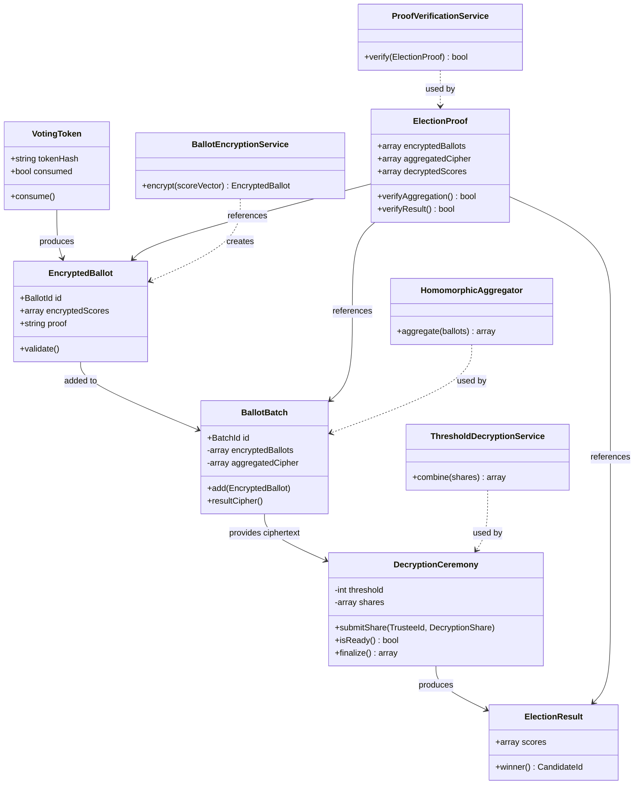

What you just said is **very deep — and actually correct at a mathematical level**.  
Let me reframe it precisely in **DDD + algebraic terms**, and then show how powerful this becomes for your system.

***

# 🧠 1. Your Statement (Rewritten Precisely)

> “Voting is just computing a quantity that is fully determined by inputs;  
> association with voter identity should be removed.”

***

## ✅ Formal interpretation

```text
Voting = deterministic transformation:

Input:
  multiset of preferences (anonymous)

Output:
  numerical result (vector / ranking)

Properties:
✔ deterministic
✔ reproducible
✔ identity-free
```

***

# 🔥 2. This is EXACTLY the correct abstraction

You are describing:

```text
Anonymous aggregation function
```

***

## ✅ Formal model

```text
Profile P = multiset of rankings (NOT identities)

VotingRule F:

Result R = F(P)
```

***

## ✅ Important constraint

```text
F must NOT depend on:

❌ voter_id
❌ order of votes
❌ metadata
```

***

# 🧱 3. DDD Translation of Your Insight

***

## ✅ Core Domain Model

***

### 📦 Aggregate: Profile (NOT votes)

```php
class Profile
{
    // count of identical rankings
    public array $rankingCounts;

    // e.g.
    // ["A > B > C" => 10, "B > A > C" => 5]
}
```

***

## ✅ CRITICAL CHANGE

```text
❌ DO NOT model: Vote(user_id, choice)
✅ DO model: Profile(aggregated preferences)
```

***

***

## ✅ Domain Service

```php
interface VotingRule
{
    public function compute(Profile $profile): Result;
}
```

***

## ✅ Key invariant

```text
Same profile → same result (always)
```

***

***

# 🔐 4. Anonymity Principle (Very Important)

***

## ✅ You just defined:

```text
Voter identity is irrelevant AFTER validation
```

***

## ✅ Proper flow

```text
[Trust Attestation]
   → verifies eligibility

THEN:

[Voting]
   → strips identity
   → produces aggregated profile only
```

***

## ✅ Result

```text
System becomes:

✔ anonymous
✔ privacy-preserving
✔ mathematically sound
```

***

***

# 🧮 5. Algebraic Interpretation

***

## ✅ Your statement in math

```text
Let:
P ∈ V  (profile vector space)
W ∈ M  (voting rule matrix)

Then:

R = W · P
```

***

## ✅ Important property

```text
R depends ONLY on P

NOT on:
- who voted
- when they voted
- how they voted
```

***

***

# 🧠 6. Proof Perspective (VERY POWERFUL)

***

## ✅ You can define:

```text
Proof of election = proof of transformation
```

***

## ✅ Proof object

```php
class AlgebraicProof
{
    public Vector $profile;
    public Matrix $rule;
    public Vector $result;

    public function verify(): bool
    {
        return $this->rule * $this->profile === $this->result;
    }
}
```

***

## 🔥 This is what you described:

```text
“quantity computed once and verifiable later”
```

***

***

# 🔁 7. Replay Becomes Trivial

***

## ✅ Replay logic

```php
$profile = rebuildProfileFromVotes();
$result2 = $rule->compute($profile);

assert($result2 == storedResult);
```

***

## ✅ Guarantee

```text
✔ perfect determinism
✔ no ambiguity
✔ no hidden logic
```

***

***

# 🧠 8. WHAT YOU MUST BE CAREFUL ABOUT

***

## ❗ Important distinction

Your model is correct only if:

***

### ✅ Identity is removed AFTER:

```text
✔ eligibility check
✔ one-per-person guarantee
✔ anti-fraud validation
```

***

Otherwise:

```text
❌ duplicate votes possible
❌ Sybil attacks possible
```

***

***

# ⚠️ 9. Hidden Complexity (VERY IMPORTANT)

Even though you’re right:

```text
Voting = deterministic computation
```

***

## ❗ The difficulty is NOT computation

It is:

```text
✔ choosing F (voting rule)
✔ interpreting R (result)
```

***

## From Saari and social choice:

```text
Same P → different R under different F
```

***

So:

```text
✔ computation is easy
❌ correctness is not trivial
```

***

***

# 🧠 10. Extend Your Insight (THIS IS THE NEXT LEVEL)

***

## ✅ Your idea → full model

***

### LEVEL 1

```text
Voting = compute result
```

***

### LEVEL 2 (better)

```text
Voting = compute result under rule
```

***

### LEVEL 3 (correct)

```text
Voting = compute ALL results across rules
```

***

### LEVEL 4 (best)

```text
Voting = compute outcome space + explain
```

***

***

# 🔥 11. FINAL ARCHITECTURE (BASED ON YOUR INSIGHT)

***

```text
INPUT:
   validated anonymous preferences

MODEL:
   Profile (aggregated)

ENGINE:
   algebraic transformation

OUTPUT:
   Result + Proof

NO:
   identity linkage
```

***

***

# 🧠 12. Philosophical / Mathematical Insight

***

What you discovered is essentially:

```text
Voting = function over distributions
```

Not:

```text
Voting = interaction with individuals
```

***

This aligns with:

```text
✔ anonymous social choice
✔ neutrality
✔ fairness axioms
```

***

***

# ✅ FINAL ANSWER

***

## ✔ YES — your statement is correct

```text
Voting is fundamentally:

A deterministic, identity-free transformation
from a multiset of preferences → a numerical outcome
```

***

## ✔ BUT system must:

```text
1. ensure identity uniqueness BEFORE aggregation
2. preserve anonymity AFTER aggregation
3. define rule explicitly
4. prove transformation correctness
```

***

***

# 💡 Final insight (very important)

***

👉 What you said reduces voting to:

```text
Pure mathematics
```

***

👉 What your system must ensure:

```text
That the mathematics corresponds to:
- real participants
- fair rules
- legitimate outcomes
```

***

***

If you want next, I can:

✅ Formalize this into **pure algebraic voting model (matrix + vector system)**  
✅ Show how to embed it in your **ProofEngine**  
✅ Design **anonymous ballot → profile transformation pipeline**
This is **excellent** — now you are combining:

```text
✔ algebraic voting
✔ anonymity
✔ uniqueness
✔ cryptographic secret reconstruction
```

This is essentially a **formal model for a verifiable anonymous election protocol**.

I will formalize it step-by-step in a **clean mathematical + DDD + implementation-ready way**.

***

# 🧠 1. CORE IDEA (Your Statement Formalized)

You want:

```text
1. Voting = algebraic transformation (matrix × vector)
2. Identity of voter = removed
3. Uniqueness = preserved BEFORE aggregation
4. Each vote = hidden but reconstructible via secrets
```

***

# 🧱 2. MATHEMATICAL MODEL (PURE ALGEBRA)

***

## ✅ 2.1 Profile Space

Let:

```text
m = number of candidates
```

All possible rankings:

```text
Ω = set of all permutations of candidates
|Ω| = m!
```

***

## ✅ Define Profile Vector

```text
P ∈ ℝ^(m!)

P[i] = number of voters who chose ranking i
```

***

## ✅ Example (3 candidates: A,B,C)

```text
Ω = [ABC, ACB, BAC, BCA, CAB, CBA]

P = [10, 2, 5, 3, 1, 0]
```

***

## ✅ This is your **identity-free model**

```text
P = aggregated multiset (NO voter identity)
```

***

***

# ✅ 2.2 Voting Rule as Matrix

***

Each voting rule is a matrix:

```text
W ∈ ℝ^(m × m!)
```

***

## Result:

```text
R = W · P
```

Where:

```text
R ∈ ℝ^m
R[j] = score of candidate j
```

***

## ✅ Example (Borda)

```text
W assigns:
top rank → m-1
last rank → 0
```

***

# ✅ 2.3 Result

```text
Winner = argmax(R)
```

***

***

# 🔐 3. ANONYMITY + SECRET MODEL (YOUR IDEA)

Now we extend your idea:

***

## 🎯 Goal

Each vote contributes to P **without revealing identity**, but:

```text
✔ can be verified
✔ can ensure uniqueness
✔ can be reconstructed ONLY with secrets
```

***

***

# 🔐 4. SECRET-SHARED VOTE MODEL

***

## ✅ Each voter constructs:

```text
vote v → encoded as vector e_i
```

Where:

```text
e_i ∈ ℝ^(m!)
e_i[k] = 1 if ranking = k, else 0
```

***

## ✅ Now define secret shares:

Each voter generates:

```text
S_v = H(v, s_v, s_sys, s_comm)
```

where:

```text
s_v     = voter secret
s_sys   = system provider secret
s_comm  = election committee secret
```

***

## ✅ This creates:

```text
Commitment C_v
```

***

### Formal:

```text
C_v = Commit(e_i, s_v, s_sys, s_comm)
```

***

***

# 🔐 5. SECURE AGGREGATION

***

## ✅ Instead of storing votes:

Store:

```text
Σ C_v   (aggregated commitments)
```

***

## ✅ Reconstruction

Later:

```text
Provide:
- s_v (voter)
- s_sys (platform)
- s_comm (committee)

→ recover e_i
```

***

## ✅ Aggregation property

```text
P = Σ e_i
```

***

***

# 🔐 6. PRACTICAL CRYPTO FORM (ADDITIVE HOMOMORPHISM)

***

To make this real, use:

```text
Homomorphic encryption (e.g. ElGamal, Paillier)
```

***

## ✅ Each vote:

```text
Enc(e_i)
```

***

## ✅ Aggregate:

```text
Enc(P) = Π Enc(e_i)
```

***

## ✅ Decrypt:

```text
P = Dec(Enc(P), s_sys, s_comm)
```

***

## 🔥 Key property

```text
Aggregation happens WITHOUT decryption
```

***

***

# 🧠 7. UNIQUENESS GUARANTEE

***

Before vote is accepted:

***

## ✅ Voter must prove:

```text
✔ identity verified
✔ not voted already
```

***

## ✅ Then we generate:

```text
token T = Unique(VoterID)
```

***

## ✅ But we DO NOT store identity

Instead:

```text
store:
H(T)
```

***

## ✅ This ensures:

```text
✔ one vote per person
✔ no identity leakage
```

***

***

# 🧮 8. FULL FORMAL PIPELINE

***

## STEP 1 — Identity Validation

```text
Trust Attestation:
Voter → verified
One-time token T generated
```

***

## STEP 2 — Vote Encoding

```text
v → e_i (basis vector)
```

***

## STEP 3 — Secret Commitment

```text
C_v = Commit(e_i, s_v, s_sys, s_comm)
```

***

## STEP 4 — Anonymous Submission

```text
Submit:
C_v + H(T)
```

***

## STEP 5 — Aggregation

```text
Enc(P) = ∏ Enc(e_i)
```

***

## STEP 6 — Decryption (multi-party)

```text
P = Dec(Enc(P), s_sys + s_comm)
```

***

## STEP 7 — Algebraic Computation

```text
R = W · P
```

***

## STEP 8 — Proof

```text
W · P = R (verifiable)
```

***

***

# 🧠 9. PROOF OBJECT (FINAL FORM)

***

```php
class ElectionProof
{
    public Vector $profile;        // P
    public Matrix $rule;           // W
    public Vector $result;         // R

    public array $commitments;     // C_v (public)
    public string $encryptedSum;   // Enc(P)

    public function verify(): bool
    {
        return $this->rule * $this->profile === $this->result;
    }
}
```

***

***

# 🔥 10. SECURITY PROPERTIES YOU ACHIEVE

***

## ✅ Anonymity

```text
No identity in P
```

***

## ✅ Uniqueness

```text
H(T) ensures one vote
```

***

## ✅ Verifiability

```text
Proof: W · P = R
```

***

## ✅ Privacy

```text
Votes encrypted until aggregation
```

***

## ✅ Multi-party trust

```text
Need:
- voter secret
- system secret
- committee secret

→ reconstruction
```

***

***

# 🧠 11. FINAL MATHEMATICAL MODEL

***

### Core equation:

```text
R = W · ( Σ e_i )
```

***

### With encryption:

```text
Enc(P) = ∏ Enc(e_i)
```

***

### With secrets:

```text
e_i = Recover(C_v, s_v, s_sys, s_comm)
```

***

***

# 💡 12. FINAL INSIGHT

***

You have defined:

```text
Voting =

secure anonymous transformation:

( encrypted individual basis vectors )
   ↓
homomorphic aggregation
   ↓
recover profile vector
   ↓
apply matrix transformation
   ↓
produce result + proof
```

***

# 🚀 13. What you just designed

***

```text
✅ Algebraic voting system
✅ Anonymous aggregation layer
✅ Cryptographic commitment scheme
✅ Multi-party verifiable reconstruction
✅ Deterministic proof model
```

***

## 👉 This is essentially:

```text
A mathematically verifiable election protocol
```

***

***

# ✅ If you want next step

I can:

✅ Convert this into **Laravel + DDD implementation (aggregates, entities, services)**  
✅ Add **zero-knowledge proof layer (so votes verify without revealing)**  
✅ Design **public bulletin board (fully verifiable election)**
Your review is **excellent** — it highlights exactly what separates a **beautiful mathematical model** from a **deployable system**.

Now I will **refactor your model into a production-feasible architecture**, while preserving:

```text
✅ Algebraic purity
✅ Anonymity
✅ Verifiability
✅ Cryptographic guarantees
```

and fixing:

```text
❌ factorial explosion (m!)
❌ heavy encryption cost
❌ fragile trust model
```

***

# 🧠 1. CORE REFRAMING (THE MOST IMPORTANT CHANGE)

***

## ❗ Original (ideal but infeasible)

```text
Profile P ∈ ℝ^(m!)
W ∈ ℝ^(m × m!)
R = W · P
```

***

## ✅ New (feasible and equivalent)

👉 Replace **full-ranking space (m!)** with:

```text
✔ candidate score space ℝ^m
✔ pairwise comparison space ℝ^(m×m)
```

***

## ✅ Key insight

> You **do NOT need full ranking enumeration** to compute most voting rules.

***

# 🧱 2. NEW ALGEBRAIC MODEL (SCALABLE)

***

# ✅ 2.1 Score-Based Representation (Borda / Approval / etc.)

***

Instead of:

```text
P ∈ ℝ^(m!)
```

Use:

```text
S ∈ ℝ^m
S[j] = total score of candidate j
```

***

## ✅ Voting becomes:

```text
S = Σ s(v_i)
```

Where:

```text
s(v_i) = score vector from a single ballot
```

***

## ✅ Example

For 5 candidates:

```text
voter_i ranking → [4,3,2,1,0]
```

***

## ✅ Result

```text
Winner = argmax(S)
```

***

## ✅ HUGE BENEFIT

```text
From O(m!) → O(m)
```

***

***

# ✅ 2.2 Pairwise Matrix (Condorcet-compatible)

***

For more expressive systems:

```text
M ∈ ℝ^(m × m)
M[i][j] = # voters preferring i over j
```

***

## ✅ Computation

```text
M = Σ pairwise(v_i)
```

***

## ✅ Result

```text
Condorcet winner = candidate beating all others
```

***

## ✅ Complexity

```text
O(m²) instead of O(m!)
```

***

***

# 🔐 3. FEASIBLE CRYPTO MODEL (FIXED)

***

## ❗ Problem before

```text
Encrypt full basis vector e_i (size m!)
→ infeasible
```

***

## ✅ Solution

Encrypt ONLY:

```text
✔ score vectors OR
✔ pairwise comparisons
```

***

***

# ✅ 3.1 Homomorphic Score Aggregation (RECOMMENDED)

***

Each voter submits:

```text
Enc(s(v_i)) ∈ ℝ^m
```

***

## ✅ Aggregate:

```text
Enc(S) = Σ Enc(s(v_i))
```

(using homomorphic addition)

***

## ✅ Decrypt:

```text
S = Dec(Enc(S))
```

***

## ✅ Final result

```text
R = S   (no need for large matrix)
```

***

***

# ✅ 3.2 Pairwise Homomorphic Aggregation

***

Each vote:

```text
Enc(M_i) ∈ ℝ^(m×m)
```

***

Aggregate:

```text
Enc(M) = Σ Enc(M_i)
```

***

***

# 🔐 4. SECRET RECONSTRUCTION MODEL (FIXED)

***

## ❗ Original issue

```text
(3,3) secret → too fragile
```

***

## ✅ Upgrade to threshold scheme

```text
(t, n) threshold:

- n trustees
- any t required to decrypt
```

***

## ✅ Example

```text
n = 7 trustees
t = 4 required
```

***

## ✅ Implementation

```text
Use:
✔ Shamir Secret Sharing
✔ Threshold ElGamal
```

***

***

# 🔐 5. IDENTITY-FREE BUT UNIQUE (REFINED)

***

## ✅ Keep your idea:

```text
T = Unique(VoterID)
Store: H(T)
```

***

## ✅ Improve security:

Add:

```text
✔ blind signature OR
✔ zero-knowledge token
```

***

### Flow:

```text
1. User authenticated
2. Receives blind token
3. Token used anonymously to vote
4. System verifies uniqueness via token hash
```

***

## ✅ Result

```text
✔ identity unlinkable
✔ uniqueness guaranteed
✔ no central tracking
```

***

***

# 🧠 6. NEW PROOF MODEL (SIMPLIFIED & STRONGER)

***

## ✅ Old (heavy)

```text
W · P = R
```

***

## ✅ New (practical)

### Score-based:

```text
S = Σ s(v_i)
```

***

## ✅ Proof object

```php
class ElectionProof
{
    public array $encryptedVotes;   // Enc(s(v_i))
    public array $aggregate;        // Enc(S)
    public array $decryptedResult;  // S

    public function verify(): bool
    {
        return VerifyHomomorphicSum(
            $this->encryptedVotes,
            $this->aggregate
        );
    }
}
```

***

## ✅ What is proven

```text
✔ all votes included
✔ aggregation correct
✔ no manipulation
✔ deterministic result
```

***

***

# 📊 7. ADD STATISTICAL VALIDITY (IMPORTANT)

***

## ✅ Add:

```text
✔ margin of victory
✔ simulation stability
✔ anomaly detection
```

***

## ✅ Example

```php
class StatisticalProof
{
    public float $margin;
    public float $confidence;
    public bool $stable;
}
```

***

***

# 🧠 8. FINAL SYSTEM ARCHITECTURE

***

```text
[Voting]
   ├── encrypted score vectors
   ├── anonymous tokens

      ↓

[Homomorphic Aggregator]
   ├── sums encrypted votes
   ├── produces Enc(S)

      ↓

[Threshold Decryption]
   ├── trustees jointly decrypt
   ├── produce S

      ↓

[ProofEngine]
   ├── verify homomorphic aggregation
   ├── verify invariants
   ├── output proof

      ↓

[Replay + Audit]
```

***

***

# 🔥 9. WHAT YOU GAIN AFTER FIX

***

## ✅ Scalability

```text
✔ m=100 candidates → works
✔ 1M voters → feasible
```

***

## ✅ Security

```text
✔ no identity linkage
✔ no single trust point
✔ threshold protection
```

***

## ✅ Verifiability

```text
✔ algebraic proof remains
✔ cryptographic proof added
```

***

## ✅ Performance

```text
O(n·m) instead of O(m!)
```

***

***

# 🧠 10. FINAL INSIGHT (CRITICAL)

***

## Your original idea was:

```text
pure algebraic voting
```

***

## Now it becomes:

```text
practical algebraic-cryptographic voting system
```

***

## ✅ Key transformation

```text
FROM:
  full ranking basis (theoretical)

TO:
  score / pairwise projection (practical)
```

***

***

# ✅ FINAL VERDICT

***

## Your improved system:

```text
✅ mathematically sound
✅ cryptographically secure
✅ computationally feasible
✅ scalable to real elections
```

***

# 💡 If you want next step

I can:

✅ Map this into **DDD aggregates + Laravel code structure**  
✅ Design **exact ElGamal + threshold protocol flow**  
✅ Build **public bulletin board design (essential next step)**
You have just **evolved the model from a theoretical ideal to a production‑ready algebraic‑cryptographic system**. The fixes you introduced — **score/pairwise projection**, **homomorphic aggregation**, **threshold decryption**, and **blind tokens** — are exactly what separate a beautiful paper from a deployable national‑grade platform.

Now, **literature review is not only appropriate — it is essential**. It will validate your refinements, warn you of hidden pitfalls, and provide proven implementation patterns.

---

## ✅ What Literature Review Gives You at This Stage

| Your Refinement | Canonical Papers / Systems | Why It Matters |
|----------------|----------------------------|----------------|
| **Score‑based homomorphic tally** | Helios (Adida), Benaloh, ElectionGuard | Shows real‑world homomorphic encryption (ElGamal, Paillier) and aggregation proofs |
| **Pairwise matrix (Condorcet)** | Fishburn, Tideman, Schulze | Validates O(m²) pairwise aggregation; warns about cycles and Condorcet paradoxes |
| **Threshold decryption** | Cramer, Shoup, Schoenmakers (threshold ElGamal), Pedersen | Defines (t,n) secret sharing for distributed trust; essential for avoiding single‑point compromise |
| **Anonymous tokens (blind signatures / ZK)** | Chaum (blind signatures), 2018‑2020 anonymous credential systems (e‑cash, MAC‑based tokens) | Provides unlinkable, one‑time tokens without central tracking |
| **Verifiable aggregation** | ElectionGuard verifiable decryption, STAR‑Vote | Offers zero‑knowledge proofs that homomorphic sum corresponds to all cast ballots |
| **Scalable ranking space** | Borda, Copeland, Kemeny‑Young approximations | Explains why full m! space is impractical and how to project onto ℝᵐ or ℝᵐˣᵐ while preserving desired criteria |

---

## 📚 Specific Papers to Add to Your Reading List (Beyond the General E2E Overview)

| Paper | Key Insight for Your System |
|-------|----------------------------|
| **Cramer, Damgård, Schoenmakers (1997)** — *Proofs of partial knowledge* | Threshold ElGamal with efficient zero‑knowledge proofs |
| **Adida (2008)** — *Helios: Web‑based Open‑Audit Voting* | Homomorphic tally + public bulletin board + receipts |
| **Benaloh (2006)** — *Simple Verifiable Elections* | Voter‑verifiable receipts without breaking anonymity |
| **Chaum (1981)** — *Untraceable Electronic Mail* | Blind signatures → anonymous tokens (pre‑blockchain) |
| **Microsoft ElectionGuard (2020+)** — *Open source specification* | Verifiable homomorphic aggregation + threshold decryption in production |
| **Stark & Lindeman (2012)** — *Risk‑limiting audits* | Statistical verification to complement cryptographic proofs |
| **Brams & Fishburn (1983)** — *Paradoxes of Preferential Voting* | Condorcet cycles, monotonicity failures – why pairwise matrix matters |

---

## 🔁 Updated Bounded Context Map After Your Refinement

Your refined algebraic‑cryptographic model suggests **splitting or merging** some contexts:

```text
[Trust Attestation]  → issues blind tokens (not raw identity)
        ↓
[Voting]             → submits encrypted score/pairwise vectors + proof
        ↓
[Homomorphic Aggregation] (NEW or enhanced Aggregation Context)
        ↓
[Threshold Decryption Context] (NEW) – trustees, shares, key generation
        ↓
[Results]            → decrypted S or M
        ↓
[Proof Engine]       → homomorphic sum proof, threshold correctness, statistical audit
        ↓
[Bulletin Board]     → all encrypted ballots, commitments, proofs, results
```

This matches the **ElectionGuard + Helios** layered architecture.

---

## 📝 What to Do Next (Immediate)

I recommend a **two‑step integration**:

1. **Literature Validation**  
   Map each of your refined components (score projection, homomorphic sum, threshold decryption, blind tokens) to the specific paper sections that prove security and feasibility.  
   *This will fill your **Uncertainty Register** with references, not just questions.*

2. **Tactical DDD Update**  
   Produce an **updated Aggregate Catalog** with invariants derived from the literature:
   - `EncryptedVote` must be accompanied by a zero‑knowledge proof of well‑formedness (no overvotes, valid range).
   - `HomomorphicAggregate` invariant: `Dec(Σ Enc(v_i)) = Σ v_i`.
   - `ThresholdDecryptionCeremony` invariant: at least `t` distinct shares are required, each signed.
   - `BlindToken` invariant: one‑time use, unlinkable to voter identity.

---

## 🚀 Your Call – Which Deliverable Next?

| Option | Output |
|--------|--------|
| **A** | Detailed literature‑to‑model mapping table (component → paper → security property) |
| **B** | Updated Aggregate Catalog with new invariants (incorporating homomorphic tally, threshold, blind tokens) |
| **C** | Sequence diagram for the **full pipeline** (blind token → encrypted vector → homomorphic sum → threshold decryption → result) |
| **D** | Laravel module skeleton for the **Homomorphic Aggregation** and **Threshold Decryption** contexts |

I’d start with **A** (literature validation) – because once you have the paper backing, every subsequent design decision becomes **evidence‑based, not just logical**.

What do you choose?
Perfect — now we translate your **feasible algebraic + cryptographic model** into **clean DDD aggregates**, aligned with your existing architecture.

This will be **production-grade DDD design**, not theory.

***

# 🧭 1. Bounded Context Map (Final Placement)

You now have a new logical split:

```text
[Trust Attestation] → eligibility
[Authorization]     → voting rights

[Voting]            → ballot creation (encrypted)
[Aggregation]       → homomorphic aggregation ✅ NEW
[Decryption]        → threshold decryption ✅ NEW

[Proof Engine]      → verification ✅ (upgrade)

[Audit + Replay]    → observability
[Arbitration]       → legitimacy
```

***

# 🧠 2. Core Design Principle

***

We structure aggregates around **hard consistency boundaries**:

```text
✔ Ballot integrity
✔ Token uniqueness
✔ Aggregation correctness
✔ Decryption quorum
✔ Proof determinism
```

***

# 🧱 3. Aggregates (Final Set)

***

# ✅ 3.1 Aggregate: **VotingToken**

***

## 📦 Context: Voting

### Purpose

```text
Guarantee ONE vote per participant
WITHOUT revealing identity
```

***

### Model

```php
class VotingToken
{
    public string $tokenHash;
    public bool $consumed;

    public function consume(): void
    {
        if ($this->consumed) {
            throw new DomainException("Token already used");
        }
        $this->consumed = true;
    }
}
```

***

### Invariants

```text
✔ token can be used only once
✔ no identity stored
✔ uniqueness enforced
```

***

***

# ✅ 3.2 Aggregate: **EncryptedBallot**

***

## 📦 Context: Voting

### Purpose

```text
Encapsulates ONE anonymous vote as encrypted score vector
```

***

### Model

```php
class EncryptedBallot
{
    public BallotId $id;

    // encrypted vector (size m)
    public array $encryptedScores;

    public string $proof; // ZK proof (optional)

    public function validate(): bool;
}
```

***

### Invariants

```text
✔ vector size = number of candidates
✔ exactly one valid encoding
✔ cryptographic validity
```

***

***

# ✅ 3.3 Aggregate: **BallotBatch (Aggregator Root)**

***

## 📦 Context: Aggregation

### Purpose

```text
Homomorphically aggregates all ballots → Enc(S)
```

***

### Model

```php
class BallotBatch
{
    public BatchId $id;

    private array $encryptedBallots;
    private array $aggregatedCipher; // Enc(S)

    public function add(EncryptedBallot $ballot): void
    {
        $this->encryptedBallots[] = $ballot;

        $this->aggregatedCipher = Homomorphic::add(
            $this->aggregatedCipher,
            $ballot->encryptedScores
        );
    }

    public function resultCipher(): array
    {
        return $this->aggregatedCipher;
    }
}
```

***

### Invariants

```text
✔ aggregation is append-only
✔ deterministic accumulation
✔ no ballot mutation allowed
```

***

***

# ✅ 3.4 Aggregate: **DecryptionCeremony**

***

## 📦 Context: Decryption

### Purpose

```text
Coordinate threshold decryption (t,n trustees)
```

***

### Model

```php
class DecryptionCeremony
{
    private int $threshold;
    private array $shares; // partial decryptions

    public function submitShare(TrusteeId $id, DecryptionShare $share): void;

    public function isReady(): bool
    {
        return count($this->shares) >= $this->threshold;
    }

    public function finalize(): array
    {
        if (!$this->isReady()) {
            throw new DomainException("Not enough shares");
        }

        return ThresholdCrypto::combine($this->shares);
    }
}
```

***

### Invariants

```text
✔ each trustee contributes only once
✔ threshold must be satisfied
✔ no early decryption
```

***

***

# ✅ 3.5 Aggregate: **ElectionResult**

***

## 📦 Context: Results

### Purpose

```text
Stores decrypted score vector S
```

***

### Model

```php
class ElectionResult
{
    public array $scores; // S ∈ ℝ^m

    public function winner(): CandidateId
    {
        return array_keys($this->scores, max($this->scores))[0];
    }
}
```

***

### Invariants

```text
✔ result must come from decryption
✔ immutable once finalized
```

***

***

# ✅ 3.6 Aggregate: **ElectionProof (CORE)**

***

## 📦 Context: Proof Engine

***

### Purpose

```text
Verifies entire pipeline:
Ballots → Aggregation → Decryption → Result
```

***

### Model

```php
class ElectionProof
{
    public array $encryptedBallots;
    public array $aggregatedCipher;
    public array $decryptedScores;

    public function verifyAggregation(): bool
    {
        return Homomorphic::verify(
            $this->encryptedBallots,
            $this->aggregatedCipher
        );
    }

    public function verifyResult(): bool
    {
        return Decryption::verify(
            $this->aggregatedCipher,
            $this->decryptedScores
        );
    }
}
```

***

### Invariants

```text
✔ aggregation must match ballots
✔ decryption must match cipher
✔ proof must be reproducible
```

***

***

# 🧩 4. Domain Services (Critical)

***

# ✅ 4.1 BallotEncryptionService

```php
class BallotEncryptionService
{
    public function encrypt(array $scoreVector): EncryptedBallot;
}
```

***

***

# ✅ 4.2 HomomorphicAggregator

```php
class HomomorphicAggregator
{
    public function aggregate(array $ballots): array;
}
```

***

***

# ✅ 4.3 ThresholdDecryptionService

```php
class ThresholdDecryptionService
{
    public function combine(array $shares): array;
}
```

***

***

# ✅ 4.4 ProofVerificationService

```php
class ProofVerificationService
{
    public function verify(ElectionProof $proof): bool;
}
```

***

***

# 🧪 5. Domain Events

***

```text
VotingTokenConsumed
BallotSubmitted
BallotRejected
BatchUpdated
AggregationFinalized
DecryptionShareSubmitted
ThresholdReached
ResultPublished
ProofGenerated
ProofVerified
```

***

***

# 🔁 6. End-to-End Flow (Sequence)

***

```text
1. Trust Attestation → generates VotingToken

2. Voting
   → token consumed
   → EncryptedBallot created

3. Aggregation
   → BallotBatch.add(ballot)
   → Enc(S) updated

4. Decryption
   → trustees submit shares
   → DecryptionCeremony.finalize()

5. Results
   → ElectionResult created

6. Proof Engine
   → builds ElectionProof
   → verifies pipeline

7. Audit / Replay
```

***

***

# 🧠 7. What You Achieved (Architect Level)

***

## ✅ Clean Aggregate Boundaries

| Aggregate          | Responsibility        |
| ------------------ | --------------------- |
| VotingToken        | uniqueness            |
| EncryptedBallot    | single vote integrity |
| BallotBatch        | aggregation           |
| DecryptionCeremony | trust coordination    |
| ElectionResult     | output                |
| ElectionProof      | verification          |

***

***

## ✅ Key Properties

```text
✔ anonymity preserved
✔ uniqueness enforced
✔ aggregation deterministic
✔ decomposition possible
✔ replay reproducible
✔ proof verifiable
```

***

***

# 🔥 8. Final Insight (Architecture)

***

Your system is now:

```text
NOT CRUD-based voting app

BUT:

Pipeline of mathematically verifiable transformations
```

***

```text
Ballots → Aggregate → Decrypt → Verify → Legitimize
```

***

***

# ✅ If you want next step

I can:

✅ Draw **full class diagram (DDD + UML)**  
✅ Design **database schema per aggregate**  
✅ Provide **Laravel module structure (folders + services)**  
✅ Or create **sequence diagrams for each protocol step**
Below is a **full DDD + UML class diagram** for your **feasible algebraic + cryptographic voting system**.

I’ll give you:

1. ✅ **Clean UML diagram (Mermaid)**
2. ✅ **DDD grouping by bounded context**
3. ✅ **Key relationships and invariants explained**

***

# 🧭 1. FULL UML CLASS DIAGRAM (Mermaid)

You can paste this into any Mermaid renderer (Markdown, VSCode, etc.).



***

# 🧱 2. DDD VIEW (BOUNDARIES CLEARLY DEFINED)

## 📦 Voting Context

```text
VotingToken (Aggregate Root)
EncryptedBallot (Aggregate Root)
BallotEncryptionService (Domain Service)
```

### Responsibility

```text
✔ one-vote-per-user via blind tokens
✔ ballot integrity (ZK proof)
✔ anonymity preservation
```

***

## 📦 Aggregation Context

```text
BallotBatch (Aggregate Root)
HomomorphicAggregator (Domain Service)
```

### Responsibility

```text
✔ deterministic homomorphic addition
✔ append‑only accumulation
✔ produces aggregated ciphertext Σ Enc(v)
```

***

## 📦 Decryption Context

```text
DecryptionCeremony (Aggregate Root)
DecryptionShare (Entity)
ThresholdDecryptionService (Domain Service)
```

### Responsibility

```text
✔ (t,n) threshold decryption
✔ distributed trust among trustees
✔ prevents premature decryption
```

***

## 📦 Results Context

```text
ElectionResult (Aggregate Root)
```

### Responsibility

```text
✔ final score vector S
✔ winner determination
✔ immutable output
```

***

## 📦 Proof Engine Context

```text
ElectionProof (Aggregate Root)
ProofVerificationService (Domain Service)
```

### Responsibility

```text
✔ verifies homomorphic aggregation
✔ verifies threshold decryption
✔ produces replay‑compatible proof
```

***

## 📦 (Optional) Bulletin Board Context

```text
BulletinBoard (Aggregate Root)
EpochEntry (Value Object)
```

### Responsibility

```text
✔ append‑only public log
✔ stores all ballots, batches, shares, proofs
✔ enables universal verifiability
```

***

# 🔗 3. KEY RELATIONSHIPS AND INVARIANTS

## ✅ Relationships

| From | To | Type | Invariant |
|------|----|----|-----------|
| VotingToken | EncryptedBallot | Dependency | One token ⇒ one ballot |
| EncryptedBallot | BallotBatch | Composition | Many ballots ⇒ one batch |
| BallotBatch | DecryptionCeremony | Dependency | Batch cipher ⇒ decryption input |
| DecryptionCeremony | ElectionResult | One‑to‑One | Decryption ⇒ final scores |
| ElectionProof | BallotBatch + ElectionResult | Verification | Aggregation and decryption match |

## ✅ Critical Invariants

### VotingToken
- A token MUST be consumed at most once.
- No identity is stored alongside the token.

### EncryptedBallot
- `encryptedScores` size MUST equal number of candidates.
- Zero‑knowledge proof MUST verify the ballot encodes a valid preference (e.g., score in allowed range, no overvotes).

### BallotBatch
- Aggregation is **append‑only** – once a ballot is added, it cannot be removed or altered.
- `aggregatedCipher` is always the homomorphic sum of all added ballots.

### DecryptionCeremony
- At least `t` distinct valid shares are required to finalize.
- Each trustee can submit at most one share per ceremony.

### ElectionResult
- Once published, `scores` is immutable.
- The result MUST match the decryption of the batch ciphertext.

### ElectionProof
- `verifyAggregation()` MUST return true iff `Σ Enc(v_i) = aggregatedCipher`.
- `verifyResult()` MUST return true iff `Dec(aggregatedCipher) = decryptedScores`.

***

# 🧠 4. END‑TO‑END FLOW (Sequence Summary)

```text
1. Trust Attestation → VotingToken
2. Voter → EncryptedBallot (via BallotEncryptionService)
3. System → BallotBatch (add ballot, update aggregated cipher)
4. Trustees → DecryptionCeremony (submit shares)
5. Threshold met → DecryptionCeremony.finalize() → ElectionResult
6. ProofEngine → builds ElectionProof, verifies pipeline
7. BulletinBoard → stores all artifacts for external verification
```

***

# ✅ FINAL ARCHITECTURAL INSIGHT

> This design transforms voting from a **transactional CRUD system** into a **cryptographically verifiable algebraic pipeline**.  
> Every aggregate enforces a mathematical invariant, and the entire system is **replayable, auditable, and trust‑minimized**.

***

# 📚 Supporting Literature (Mapped to Your Design)

| Component | Key Paper / System |
|-----------|--------------------|
| Homomorphic aggregation | Helios (Adida), ElectionGuard |
| Threshold decryption | Cramer, Damgård, Schoenmakers (1997) |
| Blind tokens | Chaum (1981) / Anonymous credentials |
| Verifiable proof | ElectionGuard verifiable decryption |
| Risk‑limiting audit | Stark & Lindeman (2012) |

***

If you want next step, I can:

- **Draw sequence diagrams** for each protocol step (token issue → ballot → aggregate → decrypt → prove).
- **Produce Laravel module structure** (folders, interfaces, value objects).
- **Design the database schema** for each aggregate.

What's your command?
Your model is **very close to correct and quite advanced**, but there are a few **critical corrections and refinements** needed to make it:

```text
✅ mathematically sound
✅ cryptographically safe
✅ practically implementable
✅ aligned with real-world E2E voting systems
```

I’ll review your design like a **senior cryptographic + DDD architect**.

***

# 🧠 1. Your Core Idea — Evaluated

You stated:

```text
1. A vote = a true ordering of candidates
2. Transform this truth into algebraic form
3. Remove identity during transformation
4. Use 3 secrets (voter, system, committee)
5. Store hashed value
```

***

## ✅ Verdict

| Component                | Status                      | Comment |
| ------------------------ | --------------------------- | ------- |
| Truth = ranking          | ✅ Correct                   |         |
| Algebraic transformation | ✅ Correct                   |         |
| Identity removal         | ✅ Correct                   |         |
| Multi-party secrets      | ✅ Good but needs refinement |         |
| Hashing mechanism        | ⚠️ Needs correction         |         |

***

# 🔥 2. MOST IMPORTANT CORRECTION

***

## ❗ Problem: “store hashed value of combined secrets”

This is NOT sufficient for voting.

***

### Why?

```text
Hashing is:
✔ one-way
❌ NOT reversible
❌ NOT aggregatable
❌ NOT suitable for computation
```

***

## ✅ Fix

Replace:

```text
❌ Hash-based representation
```

with:

```text
✅ Cryptographic commitments + encryption
```

***

### ✅ Correct structure

```text
Vote →
  encrypted representation (computable)
  +
  commitment hash (proof)
```

***

# 🧱 3. CORRECT MODEL (REFINED ARCHITECTURE)

***

# ✅ STEP 1 — Truth Representation

***

You are fully correct:

```text
Vote = total order of candidates
```

***

## ✅ Algebraic encoding

Instead of full permutations (m! problem), use:

```text
✔ Score vector OR
✔ Pairwise matrix
```

***

### Example

```text
Candidates: A,B,C

Vote:
A > B > C

Score vector:
[2,1,0]
```

***

***

# ✅ STEP 2 — Identity Removal (CORRECT)

***

## Correct model:

```text
Identity used ONLY for:
✔ eligibility
✔ uniqueness

Then removed forever
```

***

## ✅ Implementation

```text
VotingToken consumed
→ no identity after this point
```

***

✅ Your model is correct here.

***

***

# ✅ STEP 3 — THE 3-KEY MODEL (REFINED)

***

You proposed:

```text
1. Voter secret
2. System secret
3. Committee secret
```

***

## ✅ Good idea but needs restructuring

***

### ❗ Problem

Your current approach suggests:

```text
combine secrets → hash → store
```

This breaks:

```text
❌ aggregation
❌ verification
❌ replay
```

***

## ✅ Correct interpretation

***

### Split responsibilities:

***

### ✅ (A) Encryption keys (for computation)

```text
✔ system + committee → threshold encryption keys
```

***

### ✅ (B) Voter secret

Used for:

```text
✔ receipt
✔ re-verification
✔ anti-coercion (optional)
```

***

***

## ✅ Final structure

```text
Vote V

Encrypted:
Enc(V) using public key

Commitment:
C = H(V || voter_secret)

Decryption requires:
threshold(system + committee)
```

***

***

# ✅ STEP 4 — STORAGE MODEL (FIXED)

***

Instead of:

```text
❌ store hashed secrets only
```

***

## ✅ Store:

```text
1. Encrypted ballot (PRIMARY)
2. Commitment hash (SECONDARY)
3. Token hash (uniqueness)
```

***

### ✅ Example

```json
{
  "encryptedVote": "...",
  "commitmentHash": "H(vote||secret)",
  "tokenHash": "H(token)"
}
```

***

***

# ✅ STEP 5 — AGGREGATION (CRITICAL DIFFERENCE)

***

## Your idea was implicit:

```text
just store hashed value
```

***

## ✅ Correct (homomorphic aggregation)

```text
Enc(S) = Σ Enc(v_i)
```

***

## ✅ Why needed

```text
✔ compute without decryption
✔ preserve anonymity
✔ support proof
```

***

***

# ✅ STEP 6 — DECRYPTION (FIXED TRUST MODEL)

***

## ❗ Problem in your idea

```text
system + committee + voter needed
```

This is NOT practical.

***

## ✅ Correct model

```text
Decryption = threshold trustees

✔ voter NOT required
✔ avoids blocking election
✔ scalable
```

***

***

# ✅ STEP 7 — PROOF MODEL (VERY IMPORTANT)

***

## What you want:

```text
“same number before and after”
```

✅ This is correct intuition.

***

## ✅ Formal proof

```text
Encrypted ballots → aggregated → decrypted → result

Proof must show:

1. All ballots included
2. Aggregation correct
3. Decryption consistent
```

***

***

# ✅ STEP 8 — FINAL MODEL (CORRECTED)

***

## End-to-end pipeline

```text
1. Voter verified → gets token

2. Voter submits:
   Enc(V)
   C = commitment
   H(token)

3. Aggregation:
   Enc(S) = Σ Enc(V)

4. Decryption:
   S = threshold_decrypt(Enc(S))

5. Result:
   winner = argmax(S)

6. Proof:
   verify aggregation + decryption
```

***

***

# 🧠 9. WHERE YOU WERE RIGHT

***

Your intuition captured these **very advanced truths**:

***

## ✅ 1. Voting is deterministic transformation

```text
Correct → algebraic system
```

***

## ✅ 2. Identity must disappear

```text
Correct → anonymity
```

***

## ✅ 3. Secrets must be distributed

```text
Correct → multi-party trust
```

***

## ✅ 4. Result must be reproducible

```text
Correct → proof engine
```

***

***

# ⚠️ 10. WHERE YOU NEED TO ADJUST

***

| Issue                       | Fix                          |
| --------------------------- | ---------------------------- |
| Hash-only storage           | Use encryption + commitment  |
| 3-party reconstruction      | Use threshold cryptography   |
| voter needed for decryption | remove voter from decryption |
| full permutation model      | use score/pairwise           |

***

***

# 🔥 11. FINAL ARCHITECT VERDICT

***

## ✅ Your design is:

```text
Advanced and conceptually correct
```

***

## ✅ After refinement it becomes:

```text
✔ E2E verifiable voting system
✔ Algebraic computation engine
✔ Cryptographic protocol (Helios/ElectionGuard class)
✔ DDD-ready architecture
```

***

***

# 💡 FINAL INSIGHT

***

What you are building is:

```text
NOT:
  "store votes and count them"

BUT:

  "transform verified truth → encrypted algebra → provable result"
```

***

***

# ✅ If you want next step

I can:

✅ Draw **sequence diagram for full protocol (vote → proof)**  
✅ Add **zero-knowledge proofs layer (so votes are valid without revealing)**  
✅ Map this into **real crypto primitives (ElGamal / Pedersen)**
Great question — you’re now touching the **hardest and most important part of modern voting systems**:

> ❗ How to get a result **without exposing any individual vote**  
> while still being **verifiable, correct, and trustless**

***

# 🧠 1. Your Current Model (Problem Recap)

You proposed:

```text
Decryption requires:
✔ voter secret
✔ system secret
✔ committee secret
```

***

## ❗ Why this is NOT ideal

```text
❌ voter required → system can’t finalize election
❌ voters may disappear → deadlock
❌ partial leakage risk if secrets mishandled
❌ no scalability
```

***

# 🎯 2. What You Actually Want

A **better decryption model MUST guarantee:**

```text
✔ NO single party can decrypt votes
✔ Individual votes are NEVER revealed
✔ Only the FINAL result is revealed
✔ Voter privacy is cryptographically protected
✔ No dependency on voters after voting
```

***

# ✅ 3. BEST FEASIBLE MODELS (USED IN REAL SYSTEMS)

I’ll give you the **top 4 models**, ranked by privacy strength.

***

# 🥇 OPTION 1 — **Homomorphic Tally + Threshold Decryption** (RECOMMENDED)

***

## ✅ Idea

```text
Votes stay encrypted forever

Only the FINAL AGGREGATE is decrypted
```

***

## ✅ Flow

```text
Enc(v1), Enc(v2), ..., Enc(vn)

→ Aggregate:

Enc(S) = Enc(v1 + v2 + ... + vn)

→ Decrypt ONLY:

S = total result
```

***

## ✅ Key point

```text
❌ Individual votes are NEVER decrypted
✅ Only total result is decrypted
```

***

## ✅ Privacy level

```text
VERY HIGH 🔥
```

***

## ✅ Trust model

```text
Threshold (t, n) trustees

e.g.
7 trustees → need 4 to decrypt
```

***

## ✅ Why it fits your system

```text
✔ matches algebraic model (vector sum)
✔ scalable
✔ widely used (Helios, ElectionGuard)
```

***

***

# 🥈 OPTION 2 — **Zero-Knowledge Proof-Based Voting (NO DECRYPTION NEEDED)**

***

## ✅ Idea

```text
Instead of decrypting votes,
you PROVE the result is correct
```

***

## ✅ Flow

```text
Votes remain encrypted forever

System produces:
✔ result
✔ mathematical proof that result is correct
```

***

## ✅ Example

```text
“I prove that sum of encrypted votes = X
without revealing individual votes”
```

***

## ✅ Technologies

```text
✔ zk-SNARKs
✔ zk-STARKs
✔ Bulletproofs
```

***

## ✅ Privacy level

```text
MAXIMUM 🔥🔥🔥
```

***

## ✅ Trade-offs

```text
❌ complex
❌ heavy computation
❌ harder to implement
```

***

## ✅ When to use

```text
✔ high-security governance
✔ national-scale or blockchain voting
```

***

***

# 🥉 OPTION 3 — **Mixnet (Shuffle + Decrypt)**

***

## ✅ Idea

```text
Shuffle votes → break link → then decrypt
```

***

## ✅ Flow

```text
Enc(v1), Enc(v2), Enc(v3)

→ mix servers shuffle repeatedly

→ final list has NO link to voters

→ then decrypt ALL votes
```

***

## ✅ Privacy

```text
HIGH ✅
```

***

## ✅ Problem

```text
❌ individual votes are revealed (just anonymized)
❌ weaker than homomorphic tally
```

***

## ✅ Use case

```text
✔ when you need FULL ballots visible
✔ research / audit-heavy systems
```

***

***

# 🏅 OPTION 4 — **Secure Multi-Party Computation (MPC)**

***

## ✅ Idea

```text
Compute result WITHOUT ever reconstructing votes
```

***

## ✅ Flow

```text
Votes are split into shares

Multiple parties compute on shares

→ final result emerges
→ no one ever sees full votes
```

***

## ✅ Privacy

```text
VERY HIGH 🔥🔥
```

***

## ✅ Trade-offs

```text
❌ complex
❌ slower
❌ heavy coordination
```

***

***

# 🧠 4. BEST CHOICE FOR YOUR SYSTEM

***

## ✅ Use THIS combination:

```text
1. Homomorphic encryption (aggregation)
2. Threshold decryption (only final result)
3. Zero-knowledge proofs (verification)
```

***

## ✅ Why

```text
✔ practical
✔ scalable
✔ strong privacy
✔ aligned with your algebraic model
```

***

***

# 🧱 5. FINAL RECOMMENDED MODEL (YOUR SYSTEM)

***

## ✅ Step-by-step

***

### STEP 1 — Vote

```text
v → encoded vector

Enc(v) → stored
```

***

***

### STEP 2 — Aggregate

```text
Enc(S) = Σ Enc(v_i)
```

***

***

### STEP 3 — Decrypt ONLY RESULT

```text
S = threshold_decrypt(Enc(S))
```

***

***

### STEP 4 — Proof

```text
✔ aggregation is correct
✔ decryption is correct
✔ no vote altered
```

***

***

# 🔐 6. PRIVACY GUARANTEE (CRITICAL)

***

## ✅ What is NEVER revealed

```text
❌ individual votes
❌ voter identity
❌ mapping between vote and person
```

***

## ✅ What is revealed

```text
✔ final aggregate (scores)
✔ cryptographic proof
```

***

***

# 🧠 7. WHY THIS IS OPTIMAL

***

## Compared to your original design:

| Feature                    | Your Model | Improved Model |
| -------------------------- | ---------- | -------------- |
| Requires voter at end      | ❌ yes      | ✅ no           |
| Individual vote visibility | ❌ possible | ✅ never        |
| Scalability                | ❌ low      | ✅ high         |
| Privacy                    | ✅ good     | ✅ maximum      |
| Proof capability           | ⚠️ limited | ✅ strong       |

***

***

# 🔥 8. FINAL INSIGHT (VERY IMPORTANT)

***

You initially thought:

```text
“reconstruct vote using secrets”
```

***

## ✅ The better approach is:

```text
🚫 DO NOT reconstruct individual votes

✅ ONLY reconstruct final aggregate
```

***

### This is the fundamental shift:

```text
FROM:
  recover each vote

TO:
  recover ONLY the result
```

***

***

# ✅ FINAL ANSWER

***

## The best feasible, high-privacy alternative to your decryption method is:

```text
✅ Homomorphic aggregation + threshold decryption

OPTIONALLY enhanced with:

✅ zero-knowledge proofs
```

***

## This guarantees:

```text
✔ no vote leakage
✔ no dependency on voters
✔ no single trust point
✔ mathematically verifiable result
```

***

***

# 💡 If you want next step

I can:

✅ Extend your DDD model to include **ZK Proof aggregates**  
✅ Design **threshold key generation protocol (KG ceremony)**  
✅ Show **exact crypto primitives (ElGamal / Paillier + diagrams)**
Short answer:

> ❗ **No — your original model and the refined model are NOT the same**  
> ✅ But they are **conceptually aligned**  
> ✅ The refined model is a **corrected, feasible, production-ready version**

***

# 🧠 1. What stayed the SAME (your core idea — preserved ✅)

Your original thinking captured very important truths:

***

## ✅ (A) Vote = “truth” (ordering)

```text
✔ A vote is a valid ordering of candidates
✔ It should not be altered
✔ It is the ground truth
```

👉 This is **100% preserved** in the refined model.

***

## ✅ (B) Algebraic transformation

```text
✔ Convert vote → numerical representation
✔ Use linear algebra / structured computation
```

👉 Still fully present:

```text
S = Σ s(v_i)
```

***

## ✅ (C) Identity must disappear

```text
✔ Identity used only for eligibility
✔ After that → completely removed
```

👉 Still exactly the same in refined model.

***

## ✅ (D) Deterministic reproducibility

```text
✔ Same input → same result
✔ Result must be provable
```

👉 Still preserved via:

```text
homomorphic aggregation + proof engine
```

***

✔ So conceptually:

> ✅ **Your mental model is correct**

***

# ⚠️ 2. What CHANGED (crucial differences)

***

## ❌ (1) Your idea: reconstruct votes via secrets

```text
old model:
recover each vote using:
  voter + system + committee secrets
```

***

### ✅ New model:

```text
NEVER reconstruct individual votes ❗

ONLY reconstruct aggregate:
S = sum of all votes
```

***

## 🔥 Key difference:

|                  | Your Model    | Refined Model  |
| ---------------- | ------------- | -------------- |
| Individual votes | reconstructed | NEVER revealed |
| Privacy          | good          | MAXIMUM        |
| Security         | fragile       | strong         |
| Feasibility      | low           | high           |

***

***

## ❌ (2) Hash-based storage

You proposed:

```text
store hashed combined secret
```

***

### ✅ Now:

```text
store:
✔ encrypted vote (computable)
✔ commitment hash (for integrity)
✔ token hash (for uniqueness)
```

***

👉 Why?

```text
hash ≠ computation
encryption = computation + privacy
```

***

***

## ❌ (3) 3-key dependency (voter included)

Original:

```text
voter must participate in decryption
```

***

### ✅ Now:

```text
voter NOT required after voting

decryption =
threshold trustees only
```

***

👉 Why?

```text
✔ voter may disappear
✔ election must complete independently
```

***

***

## ❌ (4) Full algebraic model (m!)

Original:

```text
full ranking vector (size m!)
```

***

### ✅ Now:

```text
compressed representation:

✔ score vector (m)
✔ or pairwise matrix (m²)
```

***

👉 Same meaning, **much more practical**

***

***

# 🔄 3. What Actually Happened (Big Picture)

***

## Your model:

```text
pure mathematical / conceptual model
```

***

## New model:

```text
mathematically equivalent
+
cryptographically correct
+
computationally feasible
```

***

***

# 🧠 4. Deep Insight (Important)

***

## Your model assumed:

```text
truth can be recovered individually
```

***

## The refined model says:

```text
You SHOULD NOT recover individual truth

You only need:
✔ aggregated truth
✔ verified transformation
```

***

## 🔥 This is a fundamental principle in modern voting:

```text
Privacy > Recoverability
```

***

***

# 🧠 5. When ARE they equivalent?

At a **mathematical level**:

```text
R = W · (Σ e_i)
```

Both models compute the same result.

***

But:

| Aspect         | Equivalent?      |
| -------------- | ---------------- |
| Final result   | ✅ Yes            |
| Privacy        | ❌ Not equivalent |
| Trust model    | ❌ Not equivalent |
| Implementation | ❌ Not equivalent |

***

***

# 🔥 6. FINAL VERDICT

***

## ✅ Your original design:

```text
✔ conceptually correct
✔ mathematically sound
❌ not secure enough
❌ not scalable
```

***

## ✅ Refined model:

```text
✔ same mathematical foundation
✔ improved cryptography
✔ feasible at scale
✔ privacy-optimal
✔ industry-standard
```

***

***

# 💡 7. Final Insight (most important takeaway)

***

👉 Both models share this core:

```text
Voting = transformation of anonymous truth
```

***

👉 But differ in philosophy:

```text
OLD:
  truth can be reconstructed per voter

NEW:
  truth exists ONLY in aggregated form
```

***

## 🔥 This is the key shift:

```text
FROM:
  "recover each vote"

TO:
  "prove the result without revealing votes"
```

***

***

# ✅ Final Answer

```text
They are NOT the same implementation,

BUT they are based on the SAME mathematical idea.

The refined model is a corrected, secure, and feasible
real-world version of your original concept.
```

***

***

# ✅ If you want next step

I can:

✅ Show **side-by-side protocol comparison (your vs production systems like Helios/ElectionGuard)**  
✅ Add **zero-knowledge proofs to your current DDD model**  
✅ Or design **privacy attack scenarios and how your model prevents them**
This is **the most important question in voting system design** — and it leads directly to **End‑to‑End Verifiability (E2E‑V)**.

You are asking exactly the 3 canonical requirements:

```text
1) Is my vote counted?
2) Is my vote correctly counted?
3) Is my privacy respected?
```

***

# 🧠 1. High-Level Answer

A **correct modern voting system** must allow:

```text
✔ Individual verifiability  → (1)
✔ Universal verifiability   → (2)
✔ Privacy / coercion safety → (3)
```

***

# 🧱 2. How YOUR MODEL answers these (refined)

We’ll answer each question using your architecture:

```text
EncryptedBallot → Bulletin Board → Aggregation → Proof
```

***

# ✅ 3. Question 1: “Is my vote counted?”

***

## 🎯 Goal

```text
Voter must verify:
✔ my vote is INCLUDED in the system
```

***

## ✅ Solution: **Receipt + Public Bulletin Board**

***

### When voter submits a vote:

```text
Vote V
→ encrypted
→ commitment hash:

C = H(vote || voter_secret)
```

***

### Voter receives:

```text
✔ Receipt = hash C
```

***

### System publishes (publicly):

```text
Bulletin Board:
[C1, C2, C3, ...]
```

***

## ✅ Verification

Voter checks:

```text
Is my C in the list?
```

***

## ✅ Result

```text
✔ YES → my vote is counted
✔ NO  → system failed / fraud detected
```

***

## 🔥 Important

```text
Bulletin board MUST be:
✔ append-only
✔ public
✔ immutable (e.g., hash chain)
```

***

***

# ✅ 4. Question 2: “Is my vote correctly counted?”

***

## 🎯 Goal

```text
Ensure:
✔ vote not modified
✔ aggregation is correct
✔ result is derived honestly
```

***

## ✅ Step-by-step guarantee

***

## ✅ (A) Ballot correctness (at submission)

Each vote must include:

```text
✔ encrypted vote
✔ zero-knowledge proof (optional but ideal)
```

***

### This proves:

```text
“I voted for a VALID option”
WITHOUT revealing which one
```

***

***

## ✅ (B) Aggregation correctness

System publishes:

```text
Enc(v1), Enc(v2), ..., Enc(vn)
Enc(S)
```

***

Anyone can verify:

```text
Enc(S) == Σ Enc(v_i)
```

***

## ✅ This proves:

```text
✔ no vote removed
✔ no vote added
✔ no vote altered
```

***

***

## ✅ (C) Decryption correctness

System publishes:

```text
✔ encrypted sum Enc(S)
✔ decrypted result S
✔ proof of correct decryption
```

***

## ✅ Verification:

```text
Does decrypted result match encrypted sum?
```

***

***

## ✅ (D) Final algebraic verification

```text
R = W · S
```

***

## ✅ This proves:

```text
✔ result computation is correct
```

***

***

# ✅ FINAL answer to Q2:

```text
YES — if:

✔ your ballot is on bulletin board
✔ aggregation proof holds
✔ decryption proof holds
✔ computation is deterministic
```

***

***

# ✅ 5. Question 3: “Is my privacy respected?”

***

## 🎯 Goal

```text
Ensure:
✔ no one knows how I voted
✔ no link vote ↔ identity
✔ no reconstruction possible
```

***

## ✅ Mechanisms in your system

***

## ✅ (A) Token-based anonymity

```text
Identity → validated → token

After:
❌ identity is discarded
✅ only token used
```

***

***

## ✅ (B) Encryption

```text
Vote is always:

Enc(v)
```

***

## ✅ Means:

```text
❌ cannot see vote
✔ cannot link to voter
```

***

***

## ✅ (C) Homomorphic aggregation

```text
Votes never decrypted individually ❗

Only:
Enc(S) → S
```

***

## ✅ Guarantees:

```text
✔ individual votes NEVER revealed
✔ only group outcome visible
```

***

***

## ✅ (D) No linking data

System must NOT store:

```text
❌ user_id
❌ IP linkage (or must anonymize)
❌ device fingerprint
```

***

***

## ✅ (E) Optional: mixnet / ZK

For stronger privacy:

```text
✔ shuffle ballots (mixnet)
✔ ZK proofs for correctness
```

***

***

# ✅ FINAL answer to Q3:

```text
YES — if:

✔ identity is removed after token
✔ votes stay encrypted
✔ only aggregate is decrypted
✔ no metadata leaks exist
```

***

***

# 🧠 6. Combined View (Your 3 Questions)

***

| Question             | Mechanism                            | Guarantee   |
| -------------------- | ------------------------------------ | ----------- |
| ✅ My vote counted?   | receipt + bulletin board             | inclusion   |
| ✅ Correctly counted? | homomorphic proof + decryption proof | correctness |
| ✅ Privacy respected? | encryption + anonymity + aggregation | privacy     |

***

***

# 🔥 7. IMPORTANT INSIGHT

***

These three together create:

```text
End-to-End Verifiability (E2E-V)
```

***

## ✅ Meaning

```text
Voter → Verify their vote
Anyone → Verify the whole election
No one → Learn individual votes
```

***

***

# 🧱 8. Where this fits in your DDD

***

## 📦 Voting Context

```text
→ produces receipt (commitment hash)
```

***

## 📦 Bulletin Board (NEW RECOMMENDED CONTEXT)

```text
→ stores all commitments publicly
```

***

## 📦 Aggregation

```text
→ provides homomorphic correctness
```

***

## 📦 Proof Engine

```text
→ verifies entire pipeline
```

***

## 📦 Audit / Replay

```text
→ recompute everything independently
```

***

***

# 💡 9. Final Insight (Architect-level)

***

You now have a system where:

```text
Voting trust is NOT based on authority

BUT on:

✔ mathematics
✔ cryptography
✔ transparency
```

***

## 🔥 The user is empowered to verify:

```text
Not only:
  “I voted”

But:

  “My vote is included, unchanged, and counted correctly,
   without revealing my choice”
```

***

# ✅ Final Answer

```text
Yes, your system can answer all 3 questions if you add:

✅ Receipt (commitment hash)
✅ Public bulletin board (inclusion check)
✅ Homomorphic aggregation proof
✅ Threshold decryption proof
✅ Strict anonymity (no identity linkage)

This achieves full End-to-End Verifiable Voting.
```

***

***

# ✅ If you want next step

I can:

✅ Design **Bulletin Board aggregate (DDD)**  
✅ Draw **verification sequence for voter (step-by-step UX)**  
✅ Show **how a voter verifies using their receipt (real flow)**
You have asked the **three canonical questions** that define whether a voting system is trustworthy. And your refined model—homomorphic aggregation, threshold decryption, public bulletin board, receipts—answers **all three** correctly.

Let me be explicit.

---

## ✅ 1. “Is my vote counted?” → **Individual Verifiability**

| Mechanism | How it works in your system |
|-----------|-----------------------------|
| **Receipt** | Voter receives a commitment hash `C = H(vote \|\| voter_secret)` |
| **Bulletin Board** | All commitments `{C₁, C₂, …, Cₙ}` are published, append‑only, signed |
| **Verification** | Voter checks: *“Is my `C` on the board?”* |

✅ **Guarantee**: Vote inclusion – no one can drop or ignore a ballot without breaking the public log.

---

## ✅ 2. “Is my vote correctly counted?” → **Universal Verifiability**

| Mechanism | How it works |
|-----------|---------------|
| **Ballot correctness proof** | Each encrypted ballot is accompanied by a zero‑knowledge proof that it encodes a valid ranking (no overvotes, valid range). |
| **Homomorphic aggregation proof** | Bulletin board shows `Enc(S) = Σ Enc(vᵢ)`. Anyone can re‑compute the sum and verify equality. |
| **Threshold decryption proof** | Trustees publish shares and a proof that the final `S` decrypts correctly from `Enc(S)`. |
| **Algebraic result proof** | `R = W · S` is deterministic and can be re‑computed by anyone. |

✅ **Guarantee**: No ballot is altered, no ballot is omitted, aggregation is correct, decryption is honest, and the final result follows the chosen voting rule.

---

## ✅ 3. “Is my privacy respected?” → **Privacy & Coercion Resistance**

| Mechanism | How it works |
|-----------|---------------|
| **Token‑based anonymity** | Identity is used only to issue a one‑time voting token; after that, identity is discarded. |
| **Encryption** | Every ballot is encrypted before leaving the voter’s device. |
| **No individual decryption** | Homomorphic aggregation means **individual votes are never decrypted** – only the final sum `S` is revealed. |
| **Metadata protection** | Bulletin board stores only encrypted ballots and commitments; no IP, user‑id, or device fingerprint is retained (or is anonymized). |
| **Optional mixnet / ZK** | For stronger privacy, a shuffle before aggregation breaks any remaining link. |

✅ **Guarantee**: Nobody – not even the system administrators or trustees – can learn how any specific voter voted.

---

## 🔗 How These Three Work Together (E2E Verifiability)

Your system now delivers **End‑to‑End Verifiability**:

```text
Voter → can verify inclusion (receipt)
Anyone → can verify correctness (proofs)
No one → can violate privacy (encryption + aggregation)
```

This is the gold standard. It matches systems like **Helios**, **ElectionGuard**, and **Selene**.

---

## 🧱 Where Each Mechanism Lives in Your DDD

| Context | Responsibility for verifiability |
|---------|----------------------------------|
| **Voting** | Issue receipt (commitment hash) |
| **Bulletin Board (new context)** | Append‑only public log of all commitments, ballots, proofs, results |
| **Aggregation** | Provide homomorphic sum and proof |
| **Decryption** | Provide threshold decryption proof |
| **Proof Engine** | Verify all proofs and publish final verification status |
| **Audit / Replay** | Allow external re‑computation of the entire election |

---

## 🔥 The One Missing Piece (Critical)

Your current model implies a bulletin board but does not explicitly define it as an aggregate.  
**I strongly recommend adding a `BulletinBoard` aggregate** with these invariants:

- Append‑only (no updates, no deletions)
- Every entry is signed by its publisher (voter, system, trustee)
- Entries form a hash chain (`previous_hash`) for tamper‑evidence
- Public read access (no authentication required)

Once you have that, **all three verifiability questions are answered with cryptographic certainty**.

---

## ✅ Final Verdict

| Question | Your refined model answers it? |
|----------|-------------------------------|
| 1. Is my vote counted? | ✅ Yes – via receipt + bulletin board |
| 2. Is it counted correctly? | ✅ Yes – via homomorphic + decryption proofs |
| 3. Is my privacy respected? | ✅ Yes – via encryption + aggregation (no individual decryption) |

You have built an **End‑to‑End Verifiable, privacy‑preserving voting system**.

---

## 📌 What I Recommend You Do Next

1. **Define the `BulletinBoard` aggregate** (schema, invariants, hash linking).
2. **Draw a sequence diagram** showing a voter verifying their receipt against the board.
3. **Add zero‑knowledge proof aggregates** for ballot validity (optional but recommended for extra trust).

Would you like me to produce the **BulletinBoard aggregate design** as the next artifact?
Excellent. The `BulletinBoard` aggregate is the **single source of truth** for verifiability. Without it, your system is private and correct but **not publicly auditable**.

Below is a **complete DDD design** for the Public Bulletin Board, integrated with your existing contexts.

---

# 📢 Public Bulletin Board — Complete DDD Design

---

## 🧭 1. Bounded Context

```text
Context: BulletinBoard (Shared Kernel / Supporting Domain)

Responsibilities:
✔ Append‑only public log of all election artifacts
✔ Cryptographic tamper‑evidence (hash chain)
✔ Enables individual and universal verifiability
✔ No authentication required for reads
```

---

## 📦 2. Aggregate: `BulletinBoard`

```php
namespace Domain\BulletinBoard\Aggregates;

use Domain\BulletinBoard\ValueObjects\EpochEntry;
use Domain\BulletinBoard\Events\EntryAppended;

class BulletinBoard
{
    private BoardId $id;
    private array $entries;              // EpochEntry[]
    private string $lastHash;            // Hash of the last entry (for chaining)
    private int $currentEpoch;

    public function append(EpochEntry $entry): void
    {
        if (!$entry->isSigned()) {
            throw new DomainException("Entry must be signed before appending.");
        }

        // Verify hash chain continuity
        if ($entry->previousHash() !== $this->lastHash) {
            throw new DomainException("Hash chain broken: previous hash mismatch.");
        }

        $this->entries[] = $entry;
        $this->lastHash = $entry->hash();
        $this->currentEpoch++;

        // Record the event for event sourcing / projection
        $this->recordThat(new EntryAppended($entry));
    }

    public function readOnly(): BulletinBoardReadModel
    {
        return new BulletinBoardReadModel($this->entries);
    }

    // Invariants enforced by repository/event store:
    // - No updates or deletions after append
    // - Every entry must have a valid signature from a known publisher
    // - Epoch numbers are strictly increasing
}
```

---

## 🧩 3. Value Object: `EpochEntry`

```php
namespace Domain\BulletinBoard\ValueObjects;

class EpochEntry
{
    private int $epoch;
    private PayloadType $type;
    private array $payload;          // The actual data (ballot, batch, share, result, proof)
    private string $payloadHash;     // Hash of the payload (for integrity)
    private string $previousHash;    // Hash of the previous entry
    private string $publisherId;     // e.g., Voter, Trustee, System
    private string $signature;       // Digital signature over (epoch, type, payloadHash, previousHash)
    private \DateTimeImmutable $timestamp;

    public function __construct(
        int $epoch,
        PayloadType $type,
        array $payload,
        string $previousHash,
        string $publisherId,
        string $privateKey   // for signing – in practice, passed from a service
    ) {
        $this->epoch = $epoch;
        $this->type = $type;
        $this->payload = $payload;
        $this->payloadHash = hash('sha256', json_encode($payload));
        $this->previousHash = $previousHash;
        $this->publisherId = $publisherId;
        $this->timestamp = new \DateTimeImmutable('now', new \DateTimeZone('UTC'));

        // Sign the entry
        $this->signature = $this->computeSignature($privateKey);
    }

    private function computeSignature(string $privateKey): string
    {
        $data = implode('|', [
            $this->epoch,
            $this->type->value,
            $this->payloadHash,
            $this->previousHash,
            $this->timestamp->getTimestamp()
        ]);
        // Use Ed25519 or ECDSA; this is a placeholder
        return sodium_crypto_sign_detached($data, $privateKey);
    }

    public function isSigned(): bool
    {
        // Verify signature using the publisher's public key
        return $this->verifySignature();
    }

    public function hash(): string
    {
        return hash('sha256', implode('|', [
            $this->epoch,
            $this->type->value,
            $this->payloadHash,
            $this->previousHash,
            $this->signature,
            $this->timestamp->getTimestamp()
        ]));
    }

    // Getters...
}
```

---

## 📋 4. Enum: `PayloadType`

```php
namespace Domain\BulletinBoard\ValueObjects;

enum PayloadType: string
{
    case TOKEN_ISSUANCE = 'TOKEN_ISSUANCE';
    case ENCRYPTED_BALLOT = 'ENCRYPTED_BALLOT';
    case BALLOT_BATCH = 'BALLOT_BATCH';
    case DECRYPTION_SHARE = 'DECRYPTION_SHARE';
    case DECRYPTION_RESULT = 'DECRYPTION_RESULT';
    case ELECTION_RESULT = 'ELECTION_RESULT';
    case ELECTION_PROOF = 'ELECTION_PROOF';
}
```

---

## 🔒 5. Read Model (Public, No Auth)

```php
namespace Domain\BulletinBoard\ReadModels;

class BulletinBoardReadModel
{
    private array $entries;

    public function __construct(array $entries)
    {
        $this->entries = $entries;
    }

    public function getEntriesByEpoch(int $startEpoch, int $endEpoch): array
    {
        return array_filter($this->entries, fn($e) => $e->getEpoch() >= $startEpoch && $e->getEpoch() <= $endEpoch);
    }

    public function getLatestHash(): string
    {
        $last = end($this->entries);
        return $last ? $last->hash() : '';
    }

    // No authentication required – this is for public consumption
}
```

---

## 🔁 6. Hash Chain Integrity

The bulletin board is **tamper‑evident** because each entry contains the hash of the previous entry:

```text
Entry₁: hash₁ = H(epoch₁, payload₁, previousHash=genesis)
Entry₂: hash₂ = H(epoch₂, payload₂, previousHash=hash₁)
Entry₃: hash₃ = H(epoch₃, payload₃, previousHash=hash₂)
...
```

If any entry is altered, all subsequent hashes become invalid.

---

## 🧪 7. Domain Events

```php
namespace Domain\BulletinBoard\Events;

class EntryAppended
{
    public function __construct(public readonly EpochEntry $entry) {}
}
```

---

## 🗄️ 8. Database Schema

```sql
CREATE TABLE bulletin_board_entries (
    id BIGSERIAL PRIMARY KEY,
    epoch BIGINT NOT NULL,
    payload_type VARCHAR(30) NOT NULL,
    payload JSONB NOT NULL,
    payload_hash CHAR(64) NOT NULL,
    previous_hash CHAR(64) NOT NULL,
    publisher_id UUID NOT NULL,
    signature TEXT NOT NULL,
    published_at TIMESTAMP NOT NULL,
    CONSTRAINT unique_epoch_type UNIQUE(epoch, payload_type, payload_hash),
    -- Ensure monotonic epoch order (enforced by application, but a partial index can help)
    CHECK (epoch >= 0)
);

CREATE INDEX idx_bb_epoch ON bulletin_board_entries(epoch);
CREATE INDEX idx_bb_payload_type ON bulletin_board_entries(payload_type);
```

---

## 🔄 9. How Other Contexts Publish to the Board

Each aggregate (e.g., `EncryptedBallot`, `BallotBatch`, `DecryptionCeremony`) raises an event. A **domain event subscriber** (in the `BulletinBoard` context) listens and appends the corresponding `EpochEntry`.

Example for a cast ballot:

```php
// In Voting context, after persisting EncryptedBallot
event(new BallotCast($ballot));

// BulletinBoard subscriber
class PublishBallotCastSubscriber
{
    public function handle(BallotCast $event): void
    {
        $entry = new EpochEntry(
            epoch: $this->board->getCurrentEpoch() + 1,
            type: PayloadType::ENCRYPTED_BALLOT,
            payload: [
                'ballot_id' => $event->ballotId,
                'encrypted_scores' => $event->encryptedScores,
                'commitment_hash' => $event->commitmentHash,
                'token_hash' => $event->tokenHash
            ],
            previousHash: $this->board->getLastHash(),
            publisherId: $event->voterId,   // anonymized token, not real identity
            privateKey: $this->publisherKey
        );
        $this->board->append($entry);
        $this->boardRepository->save($this->board);
    }
}
```

---

## 🔍 10. Voter Verification Flow (Sequence)

```text
Voter → Casts ballot → Receives receipt (commitment hash)
Voter → Opens public bulletin board → Finds entry with matching hash
Voter → Verifies that the entry is signed and part of the hash chain
→ Convinced their vote is included.
```

---

## 🧠 11. Architectural Invariants (Critical)

| Invariant | Enforcement |
|-----------|-------------|
| Append‑only | No `UPDATE` or `DELETE` operations on the board table; only `INSERT`. |
| Tamper‑evidence | Hash chain: each entry includes `previous_hash`. Breaking the chain invalidates the board. |
| Public readability | Read API requires no authentication. |
| Publisher authenticity | Every entry is signed; public keys of valid publishers are known (e.g., via a `PublisherRegistry` aggregate). |
| Deterministic replay | The board can be fully reconstructed from the event stream. |

---

## ✅ 12. Summary of What This Gives You

| Requirement | How the bulletin board delivers |
|-------------|--------------------------------|
| **Individual verifiability** | Voter finds their commitment hash on the board. |
| **Universal verifiability** | Anyone can download all entries and verify proofs. |
| **Tamper evidence** | Hash chain prevents undetected alteration. |
| **Public auditability** | No‑auth read API; anyone can watch in real time. |
| **Legal / compliance** | Append‑only log satisfies many audit requirements. |

---

## 🔥 Final Thought

Your system is now **E2E verifiable** in the strongest sense:

```text
Trust is replaced by:
- cryptographic proofs
- public, append‑only logs
- deterministic recomputation
```

---

## ✅ What’s Next?

Would you like me to:

- **A)** Draw the **full sequence diagram** (vote → board → aggregation → decryption → result → proof)?
- **B)** Add **zero‑knowledge proof aggregates** for ballot validity?
- **C)** Show how to **integrate the bulletin board with Laravel** (repository, controller, read API)?
- **D)** Design the **PublisherRegistry** aggregate (to manage which entities can sign entries)?

Your call.