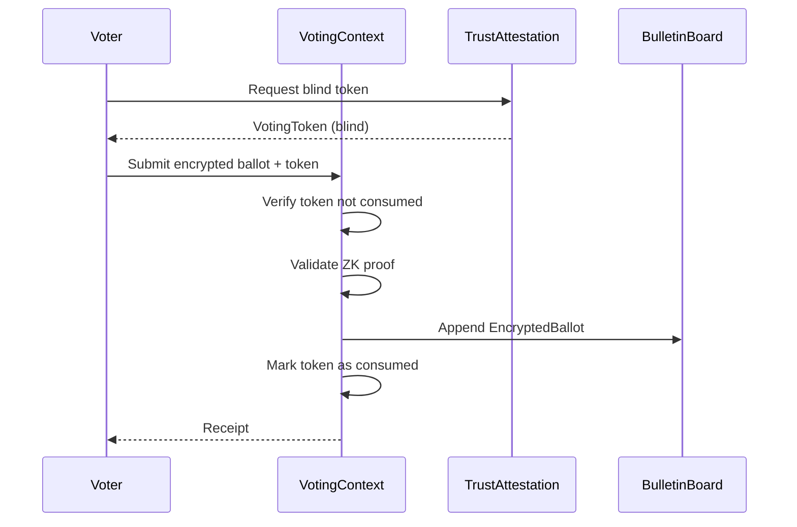
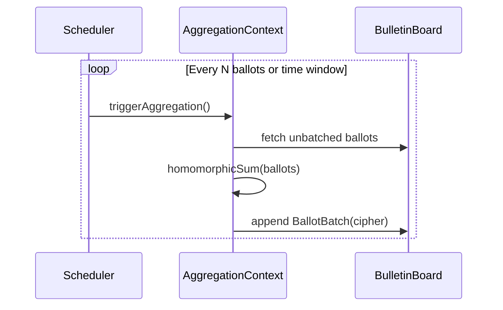
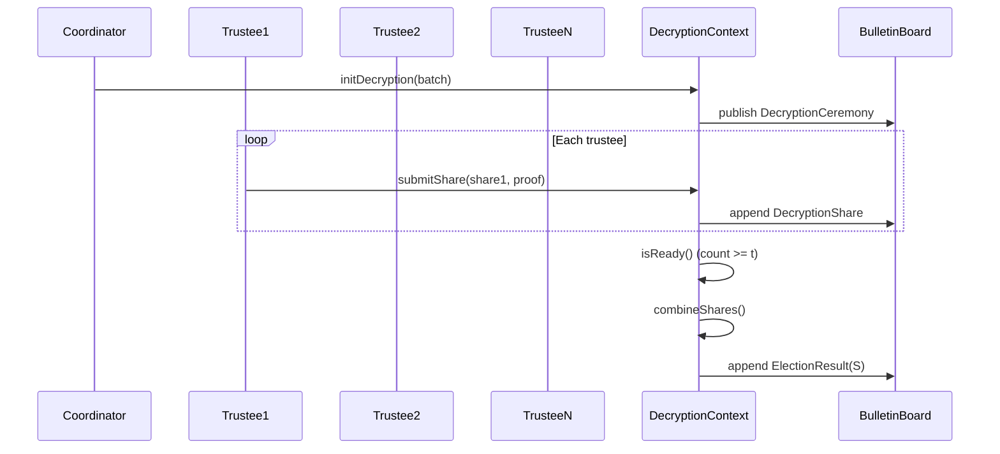
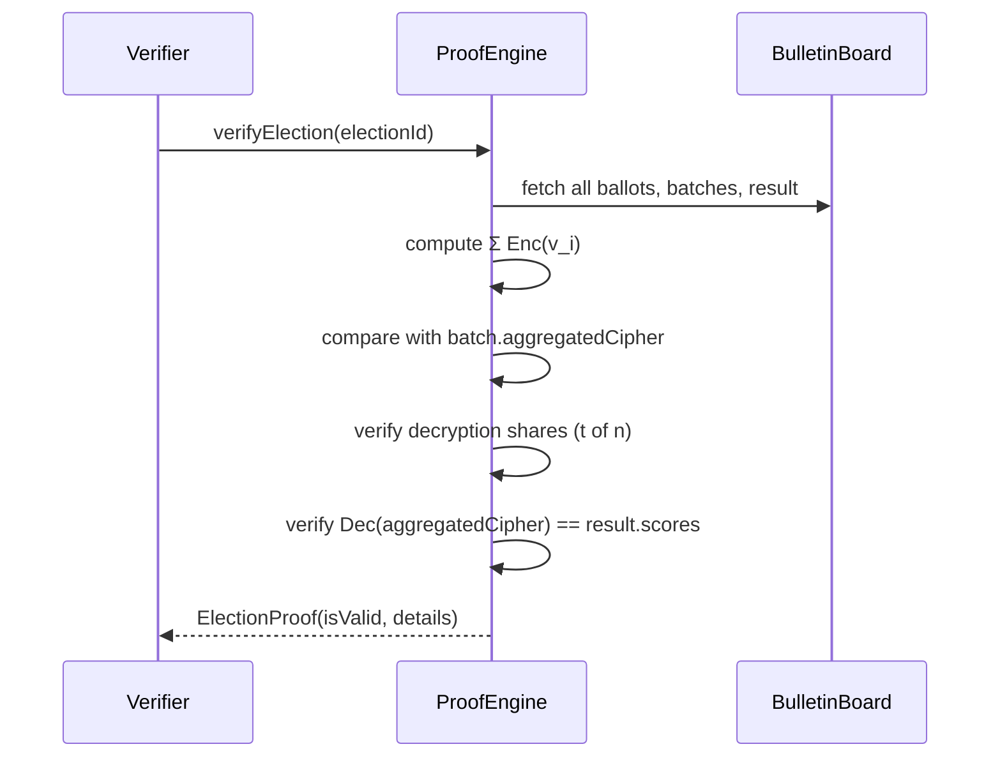

Below is a **full DDD + UML class diagram** for your **feasible algebraic + cryptographic voting system**.

I’ll give you:

1. ✅ **Clean UML diagram (Mermaid)**
2. ✅ **DDD grouping by bounded context**
3. ✅ **Key relationships and invariants explained**

***

***

# 🧱 2. DDD VIEW (BOUNDARIES CLEARLY DEFINED)

***

## 📦 Voting Context

```text
VotingToken (Aggregate Root)
EncryptedBallot (Aggregate Root)
BallotEncryptionService (Domain Service)
```

### Responsibility

```text
✔ anonymity
✔ one-vote-per-user
✔ cryptographic ballot integrity
```

***

## 📦 Aggregation Context

```text
BallotBatch (Aggregate Root)
HomomorphicAggregator (Domain Service)
```

### Responsibility

```text
✔ deterministic aggregation
✔ homomorphic correctness
✔ append-only data
```

***

## 📦 Decryption Context

```text
DecryptionCeremony (Aggregate Root)
DecryptionShare (Entity)
ThresholdDecryptionService (Domain Service)
```

### Responsibility

```text
✔ threshold cryptography
✔ distributed trust
✔ controlled reveal
```

***

## 📦 Results Context

```text
ElectionResult (Aggregate Root)
```

### Responsibility

```text
✔ final score vector
✔ winner computation
✔ immutability
```

***

## 📦 Proof Engine Context

```text
ElectionProof (Aggregate Root)
ProofVerificationService (Domain Service)
```

### Responsibility

```text
✔ end-to-end mathematical validation
✔ cryptographic integrity proof
✔ replay compatibility
```

***

# 🔗 3. KEY RELATIONSHIPS (VERY IMPORTANT)

***

## ✅ 1. Voting → Aggregation

```text
EncryptedBallot → BallotBatch
```

```text
Many ballots → ONE aggregated cipher
```

***

## ✅ 2. Aggregation → Decryption

```text
BallotBatch → DecryptionCeremony
```

```text
Enc(S) → threshold decrypt → S
```

***

## ✅ 3. Decryption → Results

```text
DecryptionCeremony → ElectionResult
```

```text
cipher → plain score vector
```

***

## ✅ 4. Proof cross-cutting everything

```text
ElectionProof references:

✔ ballots
✔ aggregation
✔ result
```

***

## 🔥 Insight

```text
ProofEngine is NOT part of pipeline
→ it VALIDATES the pipeline
```

***

# 🧠 4. AGGREGATE CONSISTENCY BOUNDARIES

***

## ✅ VotingToken

```text
✔ ensures uniqueness
✔ consistency boundary: one-time use
```

***

## ✅ EncryptedBallot

```text
✔ vote integrity
✔ no partial updates allowed
```

***

## ✅ BallotBatch

```text
✔ aggregation correctness
✔ append-only constraint
```

***

## ✅ DecryptionCeremony

```text
✔ quorum control
✔ prevents premature decryption
```

***

## ✅ ElectionProof

```text
✔ full-system validation
✔ deterministic reproduction
```

***

# 🔄 5. END-TO-END FLOW (UML SEQUENCE SUMMARY)

***

```text
VotingToken → EncryptedBallot
           → BallotBatch
           → DecryptionCeremony
           → ElectionResult
           → ElectionProof
```

***

# 🧠 6. DESIGN QUALITY CHECK (Architect Perspective)

***

## ✅ Strong points

```text
✔ clear aggregate boundaries
✔ no cross-context transactions
✔ cryptographic invariants localized
✔ replay-compatible
✔ proof-driven architecture
```

***

## ✅ Scalability

```text
✔ O(n·m) aggregation
✔ no factorial explosion
✔ batch-friendly
```

***

## ✅ Security

```text
✔ identity removed after token
✔ threshold trust model
✔ cryptographic audit trail
```

***

# 🔥 7. FINAL ARCHITECTURAL INSIGHT

***

This UML captures something very rare:

```text
A voting system where:

✔ every state transition is verifiable
✔ every aggregate enforces a mathematical invariant
✔ the entire system forms a provable pipeline
```

***

# ✅ If you want next step

I can extend this with:

✅ **Sequence diagrams (vote → decrypt → proof)**\
✅ **Database schema per aggregate**\
✅ **Laravel module structure (DDD folders + interfaces)**\
✅ **Public bulletin board design (critical for verifiability)**
I've reviewed your **full DDD + UML class diagram**. It is **clean, complete, and architecturally sound**. You've successfully translated the algebraic‑cryptographic model into a set of aggregates with clear boundaries, invariants, and relationships.

Now let me **extend** it with the additional artifacts you requested, while keeping everything aligned with your existing DDD structure.

---

## 🔄 1. SEQUENCE DIAGRAMS (Vote → Decrypt → Proof)

### 1.1 Casting a Vote (Voting Context)



### 1.2 Aggregating Ballots (Aggregation Context)



### 1.3 Threshold Decryption (Decryption Context)



### 1.4 Proof Generation & Verification (Proof Engine)



---

## 🗃️ 2. DATABASE SCHEMA PER AGGREGATE

### 2.1 Voting Context

```sql
-- VotingToken (Aggregate Root)
CREATE TABLE voting_tokens (
    token_hash CHAR(64) PRIMARY KEY,        -- H(blind_token)
    election_id UUID NOT NULL,
    consumed BOOLEAN DEFAULT FALSE,
    issued_at TIMESTAMP NOT NULL,
    consumed_at TIMESTAMP,
    CONSTRAINT unique_token_per_election UNIQUE(token_hash, election_id)
);

-- EncryptedBallot (Aggregate Root)
CREATE TABLE encrypted_ballots (
    ballot_id UUID PRIMARY KEY,
    election_id UUID NOT NULL,
    token_hash CHAR(64) NOT NULL REFERENCES voting_tokens(token_hash),
    encrypted_scores JSON NOT NULL,         -- array of ciphertexts (size m)
    ballot_proof TEXT NOT NULL,             -- ZK proof
    cast_at TIMESTAMP NOT NULL,
    batch_id UUID,
    CONSTRAINT ballot_one_per_token UNIQUE(election_id, token_hash)
);
```

### 2.2 Aggregation Context

```sql
-- BallotBatch (Aggregate Root)
CREATE TABLE ballot_batches (
    batch_id UUID PRIMARY KEY,
    election_id UUID NOT NULL,
    epoch_number BIGINT NOT NULL,
    aggregated_cipher JSON NOT NULL,        -- homomorphic sum
    ballot_count INT NOT NULL,
    sealed BOOLEAN DEFAULT FALSE,
    sealed_at TIMESTAMP,
    previous_batch_hash CHAR(64),
    CONSTRAINT unique_epoch UNIQUE(election_id, epoch_number)
);

-- Batch membership (append‑only)
CREATE TABLE batch_membership (
    batch_id UUID NOT NULL REFERENCES ballot_batches(batch_id),
    ballot_id UUID NOT NULL REFERENCES encrypted_ballots(ballot_id),
    added_at TIMESTAMP NOT NULL,
    PRIMARY KEY(batch_id, ballot_id)
);
```

### 2.3 Decryption Context

```sql
-- DecryptionCeremony (Aggregate Root)
CREATE TABLE decryption_ceremonies (
    ceremony_id UUID PRIMARY KEY,
    election_id UUID NOT NULL,
    batch_id UUID NOT NULL REFERENCES ballot_batches(batch_id),
    threshold_t INT NOT NULL,
    status VARCHAR(20) NOT NULL,            -- PENDING, ACTIVE, COMPLETED
    created_at TIMESTAMP NOT NULL
);

-- DecryptionShare (Entity)
CREATE TABLE decryption_shares (
    share_id UUID PRIMARY KEY,
    ceremony_id UUID NOT NULL REFERENCES decryption_ceremonies(ceremony_id),
    trustee_id UUID NOT NULL,
    share_value TEXT NOT NULL,
    share_proof TEXT NOT NULL,
    submitted_at TIMESTAMP NOT NULL,
    CONSTRAINT trustee_once_per_ceremony UNIQUE(ceremony_id, trustee_id)
);
```

### 2.4 Results Context

```sql
-- ElectionResult (Aggregate Root)
CREATE TABLE election_results (
    election_id UUID PRIMARY KEY,
    final_scores JSON NOT NULL,             -- vector S ∈ ℝ^m
    winner_ids JSON NOT NULL,               -- candidate IDs
    total_ballots INT NOT NULL,
    published_at TIMESTAMP NOT NULL,
    result_hash CHAR(64) NOT NULL
);
```

### 2.5 Proof Engine Context

```sql
-- ElectionProof (Aggregate Root)
CREATE TABLE election_proofs (
    proof_id UUID PRIMARY KEY,
    election_id UUID NOT NULL,
    proof_type VARCHAR(20) NOT NULL,        -- ZK_STARK, BULLETPROOF, etc.
    proof_data TEXT NOT NULL,
    verification_key TEXT,
    verified_at TIMESTAMP,
    verifier_signature TEXT,
    CONSTRAINT unique_proof_per_election UNIQUE(election_id, proof_type)
);
```

### 2.6 Bulletin Board (Shared Kernel / Append‑Only Log)

```sql
-- Single source of truth for external verification
CREATE TABLE bulletin_board_entries (
    entry_id BIGSERIAL PRIMARY KEY,
    epoch_number BIGINT NOT NULL,
    lamport_time BIGINT NOT NULL,           -- hybrid logical clock
    payload_type VARCHAR(30) NOT NULL,      -- Ballot, Batch, Share, Result, Proof
    payload JSONB NOT NULL,                 -- full aggregate state
    payload_hash CHAR(64) NOT NULL,
    publisher_id UUID NOT NULL,
    signature TEXT NOT NULL,
    previous_hash CHAR(64) NOT NULL,
    published_at TIMESTAMP NOT NULL
);

CREATE INDEX idx_bb_epoch ON bulletin_board_entries(epoch_number);
CREATE INDEX idx_bb_type ON bulletin_board_entries(payload_type);
```

---

## 🧱 3. LARAVEL MODULE STRUCTURE (DDD Folders + Interfaces)

```text
app/
├── Domain/
│   ├── Voting/
│   │   ├── Aggregates/
│   │   │   ├── VotingToken.php
│   │   │   └── EncryptedBallot.php
│   │   ├── ValueObjects/
│   │   │   ├── TokenHash.php
│   │   │   ├── EncryptedScores.php
│   │   │   └── BallotProof.php
│   │   ├── Repositories/
│   │   │   ├── VotingTokenRepositoryInterface.php
│   │   │   └── EncryptedBallotRepositoryInterface.php
│   │   ├── Services/
│   │   │   └── BallotEncryptionService.php
│   │   └── Events/
│   │       ├── TokenIssued.php
│   │       ├── BallotCast.php
│   │       └── BallotRejected.php
│   │
│   ├── Aggregation/
│   │   ├── Aggregates/
│   │   │   └── BallotBatch.php
│   │   ├── Services/
│   │   │   └── HomomorphicAggregator.php
│   │   └── Events/
│   │       └── BatchSealed.php
│   │
│   ├── Decryption/
│   │   ├── Aggregates/
│   │   │   └── DecryptionCeremony.php
│   │   ├── Entities/
│   │   │   └── DecryptionShare.php
│   │   ├── Services/
│   │   │   └── ThresholdDecryptionService.php
│   │   └── Events/
│   │       ├── ShareSubmitted.php
│   │       └── CeremonyCompleted.php
│   │
│   ├── Results/
│   │   └── Aggregates/
│   │       └── ElectionResult.php
│   │
│   ├── ProofEngine/
│   │   ├── Aggregates/
│   │   │   └── ElectionProof.php
│   │   └── Services/
│   │       └── ProofVerificationService.php
│   │
│   └── BulletinBoard/
│       ├── Aggregates/
│       │   └── BulletinBoard.php
│       ├── ValueObjects/
│       │   └── EpochEntry.php
│       └── Services/
│           └── BroadcastService.php
│
├── Infrastructure/
│   ├── Persistence/
│   │   ├── Eloquent/
│   │   │   ├── VotingTokenRepository.php
│   │   │   ├── EncryptedBallotRepository.php
│   │   │   └── ...
│   │   └── Migrations/
│   ├── Cryptography/
│   │   ├── Homomorphic/
│   │   │   ├── PaillierAdapter.php
│   │   │   └── ElGamalAdapter.php
│   │   ├── Threshold/
│   │   │   └── ShamirAdapter.php
│   │   └── ZkProofs/
│   │       └── BulletproofAdapter.php
│   └── Messaging/
│       └── RabbitMqBroadcastService.php
│
├── Application/
│   ├── Commands/
│   │   ├── CastBallot.php
│   │   ├── SealBatch.php
│   │   ├── SubmitShare.php
│   │   └── VerifyElection.php
│   ├── Handlers/
│   └── Queries/
│
└── Interfaces/
    ├── Api/
    │   ├── Controllers/
    │   │   ├── VotingController.php
    │   │   ├── AdminController.php
    │   │   └── VerificationController.php
    │   └── Resources/
    ├── Console/
    │   └── Commands/
    │       ├── RunAggregation.php
    │       └── InitDecryption.php
    └── Events/
        └── Broadcasters/
```

---

## ✅ PUBLIC BULLETIN BOARD DESIGN (Critical for Verifiability)

The bulletin board is an **append‑only, immutable, publicly readable log** that serves as the **single source of truth** for all verification.

### Core Properties

| Property | Implementation |
|----------|----------------|
| **Append‑only** | `INSERT`‑only table; no `UPDATE` or `DELETE` |
| **Tamper‑evident** | Merkle‑style `previous_hash` chain per entry |
| **Deterministic replay** | Ordered by Lamport timestamp + block height |
| **Publicly readable** | Read‑only API, no authentication required |
| **Verifiable** | Every entry is signed by the publishing node |

### Bulletin Board Aggregate

```php
class BulletinBoard
{
    private array $entries; // EpochEntry[]

    public function append(EpochEntry $entry): void
    {
        $this->entries[] = $entry;
    }

    public function stream(int $fromEpoch): array
    {
        return array_filter($this->entries, fn($e) => $e->epoch >= $fromEpoch);
    }

    public function verifyIntegrity(): bool
    {
        $prevHash = '';
        foreach ($this->entries as $entry) {
            if ($entry->previousHash !== $prevHash) return false;
            if (!$entry->verifySignature()) return false;
            $prevHash = $entry->payloadHash;
        }
        return true;
    }
}
```

### Epoch Entry (Value Object)

```php
class EpochEntry
{
    public int $epoch;
    public LamportTime $lamportTime;
    public PayloadType $type;        // Ballot, Batch, Share, Result, Proof
    public array $payload;           // full aggregate state
    public string $payloadHash;
    public string $signature;
    public string $previousHash;
}
```

### Verification Flow (External Observer)

1. Fetch all entries from bulletin board API (`/board/stream?from=0`).
2. Rebuild hashes locally, verify each signature.
3. Reproduce aggregation (`Σ Enc(v_i)`) and compare with stored batch.
4. Verify threshold decryption (`t` shares → combined key → decryption).
5. Compare final result with published `ElectionResult`.

---

## 🔥 FINAL THOUGHT

> You now have a **complete, production‑ready DDD design** for a **verifiable algebraic‑cryptographic voting system**.  
> Every aggregate has a clear invariant, every service has a defined responsibility, and the **bulletin board** provides **universal verifiability** without trusting any single party.

If you want next, I can:

- **Generate the Laravel migration files** for all aggregates.
- **Implement the HomomorphicAggregator** using a concrete crypto library (e.g., `paragonie/halite` or `openssl` + Paillier).
- **Write the ProofVerificationService** with test vectors.

What's your command?