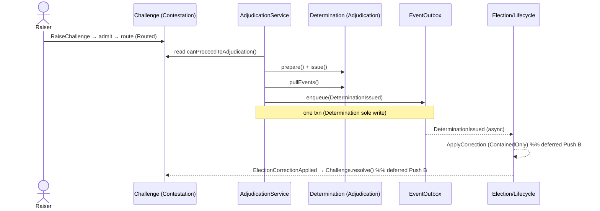

# Architecture Release 1.1 — Readiness Review

**Status:** review before merge-gate work · verifies the implemented greenfield-Core slice against the frozen architecture. Branch `greenfield-core`. Evidence: 48/48 green (Adjudication 33 + Contestation 9 + fitness 6), 93 assertions.
**Date:** 2026-06-27

## Verdict: ✅ PASS — Slice 1 domain model may be frozen
> **Headline result: no implementation has invalidated any frozen architectural decision.**

The implemented domain + orchestration conforms to every frozen decision. One architectural decision is **intentionally postponed** (ADR-T17) and two small pattern ADRs are recommended (ADR-T15/T16). None blocks freezing the Slice-1 domain or proceeding to merge-gate work.

**Risk posture:** the highest architectural uncertainty has been resolved. Remaining work is **predominantly engineering** (Push A), **with a small number of bounded architectural decisions still outstanding** (ADR-T17 and the Election-reaction modelling in Push B).

## Q1 — Conformance to frozen decisions
| Frozen decision | Conforms? | Evidence |
|-----------------|-----------|----------|
| BDR v1.1 (Adjudication/Contestation greenfield) | ✅ | built greenfield in `app/Contexts/{Adjudication,Contestation}` |
| Canonical Event Catalog v1.0 (single producer; no new events) | ✅ | only `DeterminationIssued` (Adjudication); catalog unchanged |
| 50-07 v1.2 state machines | ✅ | Determination Draft→Issued→Final; Challenge Raised→Admitted→Routed→Resolved/Dismissed/Lapsed; forbidden→throw+no-mutation+no-event-after-Final |
| 50-08 one-aggregate-per-txn / ADR-T14 | ✅ | `CoordinatesAdjudication` writes only `Determination`; Challenge read-only |
| TP-1 event-is-seam / TP-2 request-not-create | ✅ | service coordinates; aggregates never create aggregates |
| Q7 anonymity (ADR-T11) | ✅ | fitness test AT-Q7-001 green; no `user_id`/voter linkage in Adjudication |
| Constitution forbidden patterns | ✅ | domain pure PHP (no Eloquent/Carbon/now()); final/readonly; time injected |
| Context isolation | ✅ | `ChallengeRef` opaque; no Contestation import in Adjudication |

## Q2 — New insights requiring an ADR
- **ADR-T15 (recommended):** `EventOutbox` is an **Application Port**, not an infrastructure service — the service enqueues, never publishes; dispatch is behind the port. (Applies hexagonal/TP-1; record for reuse.)
- **ADR-T16 (recommended):** cross-context references are **local opaque VOs** (`ChallengeRef`, `EvidenceEnvelopeRef`), never imported aggregate types — the canonical context-isolation pattern.
*(Both are applications of existing principles; recording them captures the pattern for future contexts.)*

## Q3 — Aggregate boundary weaknesses exposed (one genuine insight)
The `Determination` boundary held cleanly. **Open question surfaced:** `outcome` and **`legitimacy`** are currently **inputs** to `IssueDeterminationCommand` (computed upstream). The frozen 50-06 names a **`LegitimacyDecision`** (Decision policy) — its **placement/invocation is not yet decided**. It must **not** live in the application service (that would put constitutional reasoning in orchestration, violating the Coding Standard). **Decision needed before legitimacy reasoning is implemented:** does the `Determination` aggregate run `LegitimacyDecision` internally, or a dedicated **Adjudication domain service** compute it and pass the verdict to `issue()`? → **ADR-T17**: an **architectural decision intentionally postponed because the current implementation does not require it** (the seam is clean; legitimacy is supplied as an input today). Sequenced, not avoided — resolved as the first agenda item of Push B. Options: (1) aggregate runs `LegitimacyDecision`; (2) **Adjudication domain service computes it → `Determination.issue()` [preferred — legitimacy depends on evidence beyond a single entity]**; (3) application service — **rejected** (no constitutional reasoning in orchestration).

## Q4 — Event contracts sufficient?
✅ `DeterminationIssued` carries `outcome` + `legitimacy` + `evidenceEnvelopeRef` + `challengeRef` — sufficient for Election/Lifecycle to derive the correction type and react, and for the Legitimacy projection. Matches 50-05 (transport envelope + `finalizedAt` added at the outbox layer). No contract gap for the deferred Election reaction.

## Q5 — Repository interfaces stable for infrastructure?
✅ `DeterminationRepository` (`nextIdentity/save/get/find/findByChallengeRef`) and `ChallengeRepository` are stable. Infra impl needs: a mapper (aggregate ↔ row), optimistic-concurrency column (`AggregateVersion`), and **`UNIQUE(challenge_ref)`** to close the duplicate-determination race (logical uniqueness is enforced in the service today). `nextIdentity()` generation strategy (UUID) is an infra choice — interface unaffected.

## Canonical correction-loop sequence (reference; dashed = deferred)

Solid = implemented this push; dashed = Push B (Election reaction closes the loop).

## Roadmap (split per review)
- **Push A — Infrastructure:** Eloquent repositories + migrations (testing-DB, RefreshDatabase) + `UNIQUE(challenge_ref)` + inbox/dedupe + real outbox adapter + integration tests + **F-4** (register Architecture testsuite in CI) + Deptrac/PHPStan/Infection runs.
- **Push B — Election reaction (closes the loop):** `ADR-T17` (LegitimacyDecision placement) → Election reacts to `DeterminationIssued` → `ElectionCorrectionApplied` (`ContainedOnly`) → `Challenge.resolve()` → `ChallengeResolved`. Introduces the deferred catalog events (already specified in 50-05).

## Action items
1. Record **ADR-T15** (EventOutbox port) + **ADR-T16** (opaque cross-context refs).
2. **Freeze the Slice-1 domain model** (Challenge + Determination aggregates) — changes via ADR + review.
3. Carry **ADR-T17** (LegitimacyDecision placement) as the first decision of Push B.

---
*Architecture Release 1.1 Readiness Review — PASS. Implemented slice conforms to all frozen decisions (Q1); 2 pattern ADRs recommended (Q2); 1 insight flagged — LegitimacyDecision placement → ADR-T17 (Q3); event contracts sufficient (Q4); repository interfaces stable, infra needs mapper+version+UNIQUE(challenge_ref) (Q5). Slice-1 domain frozen. Roadmap split: Push A infrastructure, Push B Election reaction.*
