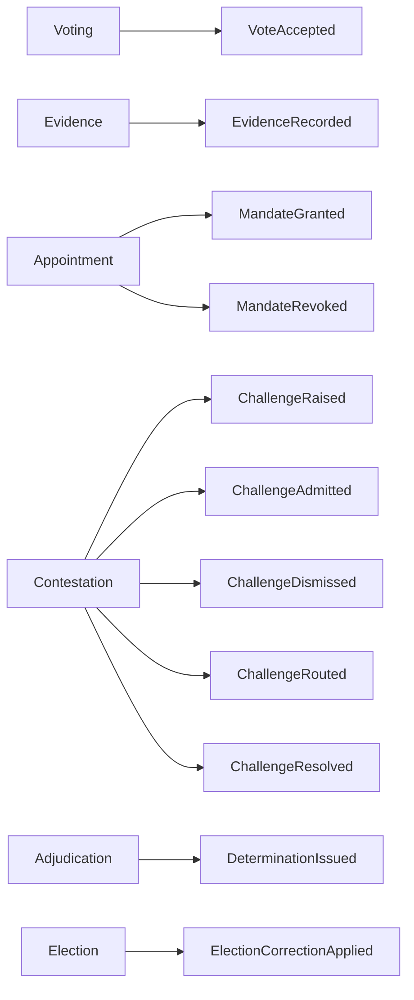

# Canonical Event Catalog v1.0 (FROZEN)

**Status:** 🧊 FROZEN registry — the single authoritative list of domain events. **Every context uses these names; no synonyms.** Full payload/delivery/security contracts live in **Round 50-05** (authoritative); this is the one-page registry. Changes follow ADR-T5 (version, never mutate).
**Date:** 2026-06-26 · Envelope: `EventId · EventType · AggregateId · AggregateVersion · OccurredAt · CorrelationId · CausationId · SchemaVersion` (50-04 §1).

| Event | Producer (only) | Classification | Stability | Security | SchemaVer |
|-------|-----------------|----------------|-----------|----------|-----------|
| `VoteAccepted` | Voting | Decision | **Core** | restricted | 1 |
| `EvidenceRecorded` | Evidence | Evidence | **Core** | restricted | 1 |
| `MandateGranted` | Appointment | Lifecycle | Supporting | internal | 1 |
| `MandateRevoked` | Appointment | Lifecycle | Supporting | internal | 1 |
| `ChallengeRaised` | Contestation | Process | Supporting | internal | 1 |
| `ChallengeAdmitted` | Contestation | Process | Supporting | internal | 1 |
| `ChallengeDismissed` | Contestation | Process | Supporting | internal | 1 |
| `ChallengeRouted` | Contestation | Process | Supporting | internal | 1 |
| `ChallengeResolved` | Contestation | Process | Supporting | internal | 1 |
| `DeterminationIssued` | Adjudication | Decision | **Core** | restricted | 1 |
| `ElectionCorrectionApplied` | Election/Lifecycle | **Integration** | **Core** | internal | 1 |

**Classification:** *Decision* (records an authoritative outcome) · *Evidence* (immutable fact) · *Process* (workflow step) · *Integration* (cross-context reaction). **Stability:** *Core* = highest-stability, evolve only by additive vN+1 with strongest review; *Supporting* = may evolve more readily under ADR-T5.

## Event ownership map (canonical)

**Rules:** single producer each (50-04 §2); **Audit consumes all**; no payload carries voter↔vote linkage (ADR-T11); refs-not-entities (TP-1/T2). New event or version → add a row + bump `SchemaVersion`; **never edit a frozen row's meaning** (ADR-T5). **Core events** require Architecture + Security review-gate sign-off to evolve.

---
*Canonical Event Catalog v1.0 — FROZEN. 11 canonical events; authoritative contracts in 50-05; evolution governed by ADR-T5.*
