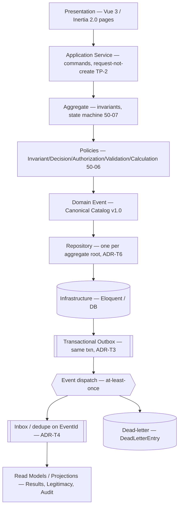
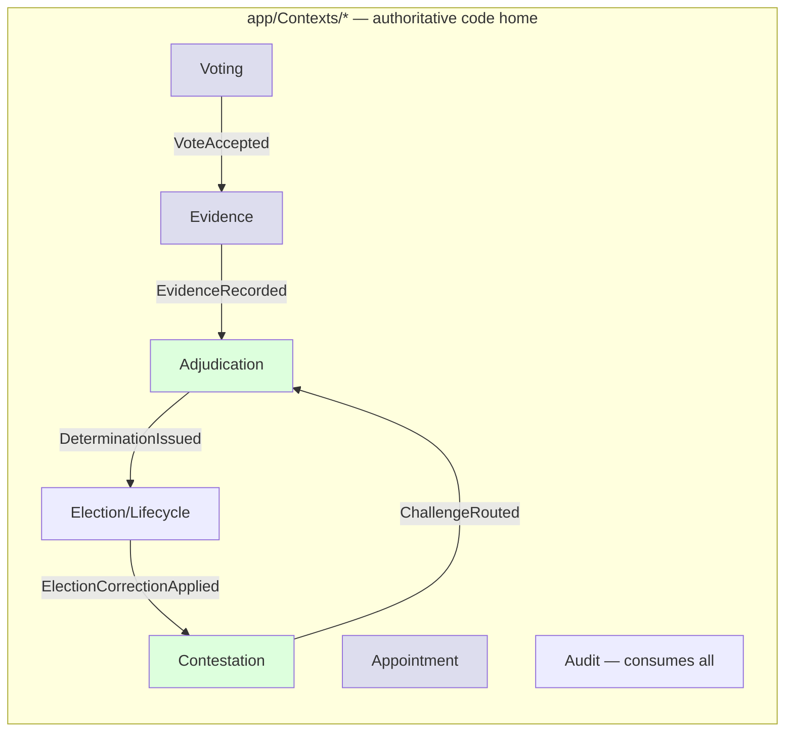

# Implementation Architecture Overview (one page)

**Status:** implementation-facing · the first page every new developer reads. How the certified architecture maps to running code. References: ADR-T log · Canonical Event Catalog v1.0 · BDR 1.1 · 50-06/07/08.
**Date:** 2026-06-26 · Stack: Laravel 11 · Inertia 2.0 · Vue 3 · PHP 8.

## Layered flow (request → decision → event → read model)

## Boundaries (one transaction = one aggregate + its outbox row — ADR-T1)

Green = greenfield Core (build first). Edges = domain events only (event is the seam, TP-1); never direct cross-aggregate calls.

## Layer rules (CLAUDE.md discipline, enforced by Deptrac — ADR-T7)
| Layer | Laravel allowed? | Rule |
|-------|------------------|------|
| Domain (aggregates/VOs/policies) | ❌ none | pure PHP; final classes |
| Application (commands/services) | limited | constructor injection; no facades/Eloquent |
| Infrastructure (repos/outbox/inbox) | ✅ freely | Eloquent, facades |
| Presentation (Inertia/Vue) | ✅ | `router.post()` not raw fetch |

## Invariants that cross every layer
**Q7 anonymity** (no voter↔vote linkage anywhere) · **one-aggregate-per-txn** · **events version-never-mutate** · **single producer per event**. All fitness-tested.

---
*Implementation Architecture Overview — layered flow + context boundaries + layer rules on one page; greenfield Core highlighted; event-is-the-seam; Q7 anonymity crosses all layers.*
