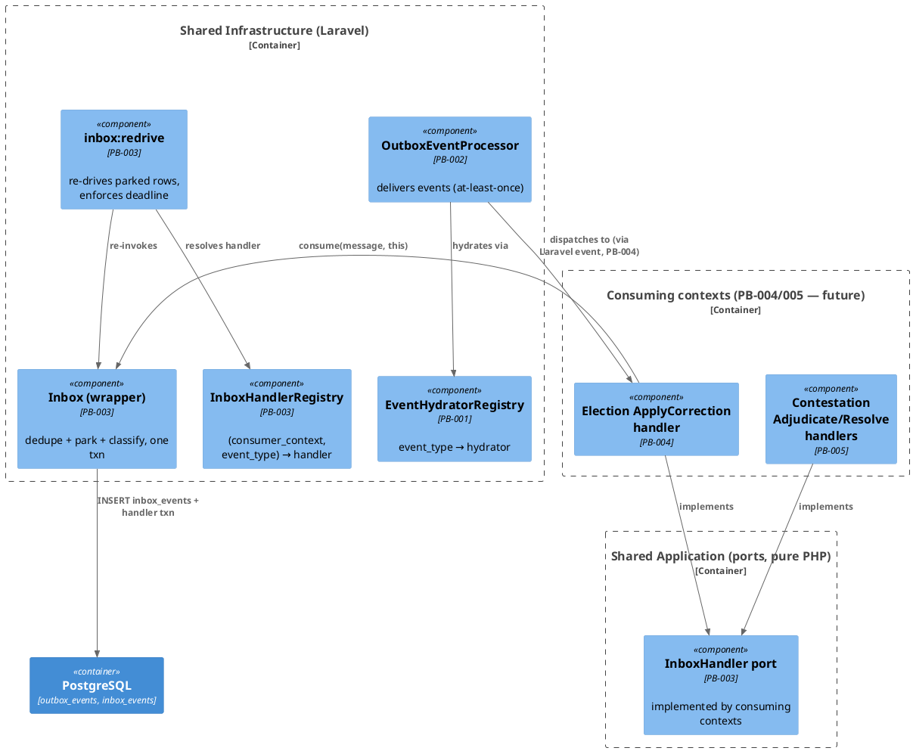

# PB-003 — Inbox / Deduplication — Implementation Design Document

**Ticket:** PB-003 (EPIC-001 Greenfield Core) · **Status:** ⚠️ AWAITING ARCHITECTURE REVIEW — no code until approved
**Template:** IDD_Prompt_Template_Push_Implementation_Design.md · **Author role:** Chief Software Architect / DDD / Laravel / Online Voting Systems
**Frozen inputs (not re-decided):** Push B Blueprint v1.0 §6/§7/§8/§14/§16-6 · ADR-T4 · Decision Log D-03/D-05/D-06 · Event Catalog v1.0 · Coding Standard · Package Structure v1.0

---

## 1. Objective

Deliver the consumer-side half of reliable messaging: **at-least-once delivery + idempotent consumption = effectively-once**. The outbox/relay (PB-001/PB-002, Verified) guarantees events leave the producer; nothing yet guarantees a consumer processes each event exactly once, tolerates duplicates, or survives out-of-order arrival.

- **Blueprint sections implemented:** §6 (Inbox), §7 F3/F4/F5 (duplicate / out-of-order / crash), §8 (idempotency layer 2 + exception classification), §16 step 6.
- **ADR justification:** ADR-T4 — "consumers idempotent via Inbox/dedupe table keyed on EventId — no ad-hoc dedupe"; ADR-T1 — inbox row commits inside the consumer's transaction.
- **Why now:** PB-004 (Election Reaction) and PB-005 (Contestation Reaction) are consumers; per the frozen implementation order (infrastructure before business), they cannot start until the inbox exists.

## 2. Scope

**Included:** `inbox_events` table + migration · idempotent consumer wrapper (check-insert-handle in one transaction) · park/re-drive mechanism incl. `inbox:redrive` command + scheduling · `InboxHandler` port + handler registry · exception-classification contract · configuration keys (numbers operational, policy frozen — D-05 pattern) · tests for all of the above using fake handlers.

**Explicitly excluded (scope-creep guards):** any Election or Contestation handler (PB-004/PB-005) · any change to `OutboxEventProcessor`, hydrators, or outbox tables (PB-002 is frozen) · any Laravel listener wiring from relay to handlers (lands with the first real handler in PB-004) · read models/projections · broker/queue introduction (Blueprint §19: v1.1 decision).

## 3. Business Motivation

- **Business capability:** the organisation can trust that a legal consequence (an election correction, a challenge resolution) happens **exactly once** — a re-delivered ruling must never apply a correction twice, and a lost delivery must never silently drop a member's challenge.
- **Business workflow:** a ruling is issued → the election reacts → the challenge completes. Members see one certified outcome per challenge.
- **Business invariant protected:** every challenge reaches exactly one terminal legal outcome (CI-1); duplicated processing would fabricate legal history, violating the audit trail's credibility.
- **Business consequence of absence:** duplicate corrections (constitutional incident), stuck challenges (member-visible injustice), or silent loss of rulings (undetectable until dispute).

## 4. DDD Analysis

| Element | Determination |
|---------|---------------|
| Bounded Context | **Shared Infrastructure** (messaging capability). Deliberately NOT a business context: the inbox stores no business state, decides nothing (Responsibility Matrix §15: "Inbox = idempotency + ordering; NOT handling logic"). |
| Aggregate | none — `inbox_events` rows are infrastructure records, not domain state; no invariants beyond uniqueness |
| Entities / VOs | `InboxMessage` (immutable message DTO crossing the port); `InboxOutcome` (enum: Processed, Duplicate, Parked, DeadLettered) |
| Domain Events | none produced. Consumed: any (generic) — first real consumers arrive in PB-004/005 |
| Policies | park policy (retry-until-deadline) and classification policy — infrastructure policies, config-parameterized |
| Repositories | none (Eloquent model used directly — infrastructure layer, Rule: repositories are for aggregates only) |
| Domain Services | none |
| Application Services | none — the wrapper is an infrastructure service invoked BY future application handlers |
| Ports | `InboxHandler` (implemented by consuming contexts), classification marker interfaces, `CausalPreconditionMissing` |
| State ownership | `inbox_events` rows owned by Shared Infrastructure; each row scoped to `(event_id, consumer_context)` per D-03 — the same event legitimately consumed by both Election and Contestation |

**Context-boundary rule:** the wrapper never inspects payload semantics; handlers never touch `inbox_events`. Contexts implement the port; infrastructure implements the mechanism.

## 5. Architecture

**Layers (Clean Architecture, dependencies point inward):**

- `App\Contexts\Shared\Application\Inbox\` — the PORT surface visible to consuming contexts: `InboxHandler`, `InboxMessage`, `InboxOutcome`, `CausalPreconditionMissing`, marker interfaces `IdempotentReplay`, `PermanentInboxFailure`. Pure PHP, zero Illuminate imports.
- `App\Contexts\Shared\Infrastructure\Inbox\` — the ADAPTER/mechanism: `Inbox` (wrapper), `InboxEvent` (Eloquent), `InboxHandlerRegistry`, `RedriveParkedInboxEvents` support. Laravel allowed freely here.
- Consuming contexts (PB-004/005) depend only on the Application port package — never on the Eloquent model or wrapper internals.

**Dependency graph:** `Context handler → Shared\Application\Inbox (port)` ← implemented/driven by `Shared\Infrastructure\Inbox` → Laravel/PostgreSQL. Domain layers of all contexts remain untouched by this ticket.

## 6. C4 Component View (PlantUML)



(Vue3/Inertia intentionally absent — no presentation surface in this ticket.)

## 7. Class Inventory

| # | Class | Layer / Package | Responsibility (single) | Public API | Depends on | Blueprint / ADR |
|---|-------|-----------------|--------------------------|------------|------------|------------------|
| 1 | `InboxMessage` | Shared **Application**\Inbox | immutable carrier of one delivered event | `eventId() eventType() payload() organisationId() correlationId() causationId()` (readonly ctor) | pure PHP | §14, D-06 |
| 2 | `InboxHandler` (interface) | Shared **Application**\Inbox | contract a consuming context implements | `consumerContext(): string · eventTypes(): string[] · handle(InboxMessage): void` | InboxMessage | §6, ADR-T4 |
| 3 | `InboxOutcome` (enum) | Shared **Application**\Inbox | result vocabulary | `Processed · Duplicate · Parked · DeadLettered` | — | §7 |
| 4 | `CausalPreconditionMissing` (exception) | Shared **Application**\Inbox | handler signals "cause not yet processed → park me" | ctor(reason) | pure PHP | §7 F4 |
| 5 | `IdempotentReplay` (marker interface) | Shared **Application**\Inbox | context exceptions marking "already done → ack" | — | — | §8 |
| 6 | `PermanentInboxFailure` (marker interface) | Shared **Application**\Inbox | context exceptions marking "never retry → dead-letter" | — | — | §7 F9, §8 |
| 7 | `InboxEvent` (Eloquent) | Shared **Infrastructure**\Inbox | row gateway for `inbox_events` | scopes `parkedDue()`, transitions `markProcessed/markParked/markDead` | Eloquent | §6, D-03 |
| 8 | `Inbox` (wrapper) | Shared **Infrastructure**\Inbox | the ONE idempotent-consumption implementation: txn{dedupe-insert → handler → mark} + classification | `consume(InboxMessage, InboxHandler): InboxOutcome` | DB, InboxEvent | §6, §8, ADR-T1/T4 |
| 9 | `InboxHandlerRegistry` | Shared **Infrastructure**\Inbox | `(consumer_context, event_type) → handler`; duplicate registration rejected | `register(InboxHandler) · handlerFor(ctx,type) · has()` | InboxHandler | §6 (mirror of PB-001 registry) |
| 10 | `RedriveParkedInboxEvents` (artisan `inbox:redrive`) | Console command | re-drive parked rows due; enforce park deadline → dead | `handle()` | Inbox, InboxHandlerRegistry, InboxEvent | §7 F4, §7.1 Recovery |
| 11 | migration `create_inbox_events_table` | database/migrations | schema (below) | — | — | §6, D-03, D-06 |

**Schema:** `id uuid PK · event_id uuid · consumer_context string · event_type string · payload json · organisation_id uuid NOT NULL FK · correlation_id uuid nullable · causation_id uuid nullable · status enum{processed,parked,dead} · park_attempts int · parked_until ts nullable · park_deadline ts nullable · processed_at ts nullable · created_at` — **UNIQUE (event_id, consumer_context)** (D-03). Config: `inbox.park_retry_minutes` (default 5) · `inbox.park_deadline_minutes` (default 60) — numbers operational, policy frozen (D-05 pattern).

## 8. Interaction Sequence

```text
Relay (PB-002)                    Inbox wrapper                       Handler (PB-004/5)
  │ dispatch(domainEvent)              │                                   │
  │────────────────────► listener builds InboxMessage                      │
  │                        │ consume(msg, handler)                         │
  │                        │ BEGIN TXN                                     │
  │                        │ SELECT row (event_id, ctx)                    │
  │                        │  ├─ status=processed → COMMIT → Duplicate ✔   │
  │                        │  ├─ status=dead      → COMMIT → DeadLettered ✔│
  │                        │  ├─ status=parked    → (re-drive path only)   │
  │                        │  └─ absent → INSERT row                       │
  │                        │       (unique-violation race → Duplicate)     │
  │                        │ handler.handle(msg) ──────────────────────►   │ aggregate txn work + outbox
  │                        │ ◄─ ok / exception                             │
  │                        │ ok → mark processed → COMMIT → Processed      │
  │                        │ CausalPreconditionMissing → mark parked       │
  │                        │     (parked_until=now+retry, deadline set)    │
  │                        │     → COMMIT → Parked                         │
  │                        │ IdempotentReplay → mark processed → COMMIT    │
  │                        │ PermanentInboxFailure → mark dead → COMMIT    │
  │                        │     + alert log (dead_letter_reason)          │
  │                        │ other Throwable → ROLLBACK + rethrow          │
  │                        │     (transient → relay retry redelivers)      │

inbox:redrive (every minute):  parked rows due → resolve handler via registry → consume()
                               past park_deadline & still failing → mark dead + alert
```

Terminal states per message-consumer pair: `processed` or `dead`. `parked` is always transient (bounded by deadline).

## 9. State Changes

| From | To | Trigger | Notes |
|------|----|---------|-------|
| (absent) | processed | successful handle / IdempotentReplay | happy path |
| (absent) | parked | CausalPreconditionMissing | F4 out-of-order |
| (absent) | dead | PermanentInboxFailure | F9-class; alert |
| (absent) | (absent) | transient Throwable | ROLLBACK — no trace; relay redelivers (F5) |
| parked | processed | re-drive success | cause has arrived |
| parked | parked | re-drive, cause still missing, deadline not reached | park_attempts++ |
| parked | dead | park_deadline exceeded | F4→F6 escalation; alert |
| processed | — | any redelivery | **invalid**: wrapper returns Duplicate, handler NEVER re-invoked |
| dead | — | automatic transition | **invalid**: only operator re-drive after fix (§7.1 Recovery — re-drive preserves event_id, never re-emits) |

## 10. Failure Model (per failure: cause → detection → recovery → owners → consequences)

| Failure | Cause | Detection | Recovery | Retry owner | Dead-letter owner | Business consequence | Operational consequence |
|---------|-------|-----------|----------|-------------|-------------------|----------------------|--------------------------|
| Duplicate delivery (F3) | relay at-least-once | unique key / status=processed | none needed — ack | n/a | n/a | none (exactly-once preserved) | none |
| Out-of-order (F4) | correction arrives before adjudication processed | handler throws CausalPreconditionMissing | park + re-drive | inbox re-drive (config cadence) | Operations after deadline | delayed completion, never wrong order | parked-rows metric |
| Crash mid-handle (F5) | process death / deadlock | txn ROLLBACK | relay redelivery; row absent → clean retry | Relay (PB-002 policy) | Operations | none | retry noise in logs |
| Insert race (two workers) | concurrent delivery | unique-violation on INSERT | loser returns Duplicate | n/a | n/a | none | none |
| Business-permanent (F9) | constitutional guard rejection, unknown refs after deadline | PermanentInboxFailure marker | operator + governance review; re-drive only after fix | **never auto** | Operations + Governance | potential constitutional incident — escalation mandatory | alert |
| Handler unregistered at re-drive | registry gap after deploy | registry lookup miss | mark dead `UNREGISTERED_INBOX_HANDLER`; register + re-drive | none | Operations | delayed consequence | alert (mirrors PB-002 F2) |

## 11. TDD Plan (RED first — every class test-driven)

Ordered; each block written failing before its implementation exists:

1. **Unit — `InboxHandlerRegistryTest`** (pure): register/lookup by (ctx,type); multi-type handler; unknown → dedicated exception; duplicate (ctx,type) rejected. *(mirror of PB-001 registry tests)*
2. **Unit — `InboxMessageTest`** (pure): immutability, identifier accessors incl. correlation/causation (D-06).
3. **Feature — `InboxConsumeTest`** (RefreshDatabase, fake handlers): processed happy path (row + handler called once) · duplicate → handler NOT re-invoked, outcome Duplicate · concurrent-insert race → Duplicate (unique-violation branch) · CausalPreconditionMissing → Parked with parked_until/deadline set · IdempotentReplay marker → Processed · PermanentInboxFailure → Dead + alert log · transient Throwable → row absent after rollback (redelivery-clean) + exception rethrown.
4. **Feature — `InboxRedriveTest`**: parked row due → handler re-invoked via registry → processed · not due → untouched · past deadline → dead · handler missing from registry → dead with reason.
5. **Architecture — extend `EventRegistryCompletenessTest` sibling: `InboxArchitectureTest`**: `Shared\Application\Inbox\*` contains no Illuminate imports (port purity) · wrapper is the only writer of `inbox_events` outside the re-drive command (source scan) · every registered InboxHandler's `consumerContext()` matches its owning context name (enforced when PB-004/005 register — assertion tolerant of empty registry now).
6. **Regression:** full Architecture suite (currently 133) · Adjudication 44 · outbox tests 14 — must stay green (nothing in their paths is touched; run as gate).
7. **Mutation tests:** Infection still lacks a coverage driver (F-2, merge-gate item PB-007) — listed, not run; no false claim of mutation coverage.

## 12. Implementation Order (each step ends green)

1. Port package (classes 1–6) + unit tests 1–2 → green (pure PHP, no DB).
2. Migration + `InboxEvent` model → migration runs in RefreshDatabase.
3. `Inbox` wrapper + `InboxConsumeTest` (RED written first) → green.
4. `InboxHandlerRegistry` + singleton binding (AppServiceProvider, next to EventHydratorRegistry) → green.
5. `inbox:redrive` command + scheduling (`routes/console.php`, every minute, alongside `outbox:process`) + `InboxRedriveTest` → green.
6. `InboxArchitectureTest` + full gate run + Traceability/Backlog/Decision-Log updates.

## 13. Traceability (every class)

All classes carry the standard docblock block. Summary: classes 1–6 → Blueprint §6/§8, ADR-T4, Matrix "Inbox", Context = Shared Application (port) · classes 7–10 → Blueprint §6/§7/§7.1, ADR-T1/T4, Matrix "Inbox", Context = Shared Infrastructure · migration → D-03/D-06. Event Catalog: unchanged (no new events). State machines: unchanged (no aggregate touched). BDR: no boundary change — Shared Infrastructure capability, consumed via port.

## 14. Acceptance Criteria (measurable)

☐ All PB-003 tests green (units, consume, re-drive, architecture) ☐ Architecture suite ≥133 green, zero regressions ☐ greenfield PHPStan (`phpstan-greenfield.neon`) clean; new Shared classes ad-hoc `--level=max` clean ☐ port package has zero Illuminate imports (test-enforced) ☐ handler never invoked twice for same (event_id, consumer_context) (test-enforced) ☐ transient failure leaves NO inbox row (test-enforced) ☐ no outbox/relay/hydrator file modified ☐ Traceability Matrix "Inbox" row → Verified; BACKLOG PB-003 → Verified ☐ Decision Log updated (or explicit "no new decisions") ☐ Architecture Review Checklist answered on the PR.

## 15. Risks

- **Architectural:** classification via marker interfaces requires PB-004/005 discipline (wrong marker = wrong terminal state). Mitigated: markers documented in port docblocks + §8 classification test examples; checklist item.
- **Business:** park deadline too short could dead-letter legitimate slow chains → member-visible delay. Mitigated: deadline config-tunable without ADR (D-05 pattern); Operations owns.
- **Migration:** none (new table only).
- **Operational:** parked-row buildup if a handler is chronically broken → re-drive noise. Mitigated: dead-letter deadline bounds it; parked/dead counts are §14 dashboard metrics.
- **Performance:** negligible at Blueprint §19 volumes (tens of rows per election); UNIQUE index is the only hot path.
- **Security:** payloads pass through unchanged — CI-5 obligations rest on producers (already enforced); inbox rows tenant-scoped `organisation_id NOT NULL` (D-06); no new endpoints (command + internal service only).

## 16. Deliverables

**Create (11):** the 10 classes in §7 + migration; tests: `InboxHandlerRegistryTest`, `InboxMessageTest`, `InboxConsumeTest`, `InboxRedriveTest`, `InboxArchitectureTest`.
**Modify (3):** `AppServiceProvider` (registry singleton) · `routes/console.php` (schedule `inbox:redrive`) · `config/` (inbox keys; new `config/inbox.php`).
**Delete:** none — nothing exists to supersede (grep `Inbox` in app/ = 0 files, verified 2026-07-06).

## 17. Commit Strategy

1. `PB-003: inbox port package (InboxHandler, InboxMessage, outcomes, classification markers) + unit tests`
2. `PB-003: inbox_events migration + InboxEvent model`
3. `PB-003: idempotent Inbox wrapper (dedupe/park/classify in one txn) + consume tests`
4. `PB-003: InboxHandlerRegistry + container wiring`
5. `PB-003: inbox:redrive command + scheduling + re-drive tests`
6. `PB-003: inbox architecture tests + traceability/backlog/decision-log updates`

Each commit compiles and passes its tests; each maps to one §12 step.

---

*PB-003 IDD — complete implementation design, no code written. Encodes Blueprint §6/§7/§8/§14 + ADR-T1/T4 + D-03/D-05/D-06. AWAITING ARCHITECTURE REVIEW — implementation begins only on approval.*
