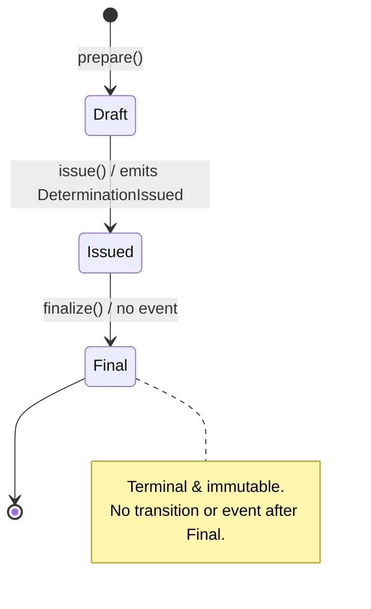

# Determination State Machine

> Lifecycle: `Draft → Issued → Final`. `Final` is terminal and immutable (override only via constitutional amendment). Source: [`DeterminationState.php`](../../../../../app/Contexts/Adjudication/Domain/Determination/DeterminationState.php).

## Transition table

| State | Legal command | Next | Event | Illegal commands |
|---|---|---|---|---|
| `Draft` | `issue()` | `Issued` | `DeterminationIssued` | `finalize()` |
| `Issued` | `finalize()` | `Final` | _(none)_ | `issue()` (already issued) |
| `Final` | _(none)_ | — | — | `issue()`, `finalize()` |

## Discipline

Any illegal command throws [`IllegalDeterminationTransition`](../../../../../app/Contexts/Adjudication/Domain/Determination/Exception/IllegalDeterminationTransition.php) via the aggregate's `guard()` — **with no mutation and no event**. `DeterminationState::isTerminal()` returns true only for `Final`.
