# Knowledge Graph

> **Generated** by `npm run knowledge-graph` on 2026-06-27. Do not hand-edit.
> Nodes = governed documents (grouped by bounded context); edges = typed relationships.

```mermaid
graph LR
  subgraph adjudication["adjudication"]
    ADJ_DISC_BOUNDARY["ADJ-DISC-BOUNDARY<br/><small>ddd-discovery</small>"]
    ADJ_IMPL_WIRING["ADJ-IMPL-WIRING<br/><small>implementation</small>"]
    ADJ_MODEL_DETERMINATION["ADJ-MODEL-DETERMINATION<br/><small>aggregate</small>"]
    ADJ_README["ADJ-README<br/><small>domain-model</small>"]
    ADJ_ROADMAP["ADJ-ROADMAP<br/><small>status</small>"]
    ADJ_SM_DETERMINATION["ADJ-SM-DETERMINATION<br/><small>state-machine</small>"]
    ADJ_TESTS["ADJ-TESTS<br/><small>test</small>"]
    HUB_ADJUDICATION["HUB-ADJUDICATION<br/><small>portal</small>"]
  end
  subgraph committee["committee"]
    COM_README["COM-README<br/><small>domain-model</small>"]
  end
  subgraph contestation["contestation"]
    CON_README["CON-README<br/><small>domain-model</small>"]
  end
  subgraph election["election"]
    ELE_README["ELE-README<br/><small>domain-model</small>"]
    HUB_ELECTION["HUB-ELECTION<br/><small>portal</small>"]
  end
  subgraph elections["elections"]
    ELC_README["ELC-README<br/><small>domain-model</small>"]
  end
  subgraph finance["finance"]
    FIN_README["FIN-README<br/><small>domain-model</small>"]
  end
  subgraph geography["geography"]
    GEO_README["GEO-README<br/><small>domain-model</small>"]
  end
  subgraph global["global"]
    AI_README["AI-README<br/><small>reference</small>"]
    GLOBAL_README["GLOBAL-README<br/><small>reference</small>"]
    GRAPH_FULL["GRAPH-FULL<br/><small>portal</small>"]
    GRAPH_README["GRAPH-README<br/><small>portal</small>"]
    GUIDE_EKP["GUIDE-EKP<br/><small>guide</small>"]
    KNOWLEDGE_CONSTITUTION["KNOWLEDGE-CONSTITUTION<br/><small>constitution</small>"]
    META_LIFECYCLE["META-LIFECYCLE<br/><small>reference</small>"]
    META_NAMING["META-NAMING<br/><small>reference</small>"]
    PKG_ARCHITECTURE_REVIEW["PKG-ARCHITECTURE-REVIEW<br/><small>package</small>"]
    PKG_IMPLEMENT_AGGREGATE["PKG-IMPLEMENT-AGGREGATE<br/><small>package</small>"]
    PKG_README["PKG-README<br/><small>reference</small>"]
    PORTAL_ADR_INDEX["PORTAL-ADR-INDEX<br/><small>portal</small>"]
    PORTAL_BY_ROLE["PORTAL-BY-ROLE<br/><small>portal</small>"]
    PORTAL_BY_TYPE["PORTAL-BY-TYPE<br/><small>portal</small>"]
    PORTAL_INDEX["PORTAL-INDEX<br/><small>portal</small>"]
    RCP_CREATE_ADR["RCP-CREATE-ADR<br/><small>recipe</small>"]
    RCP_IMPLEMENT_AGGREGATE["RCP-IMPLEMENT-AGGREGATE<br/><small>recipe</small>"]
    RESEARCH_README["RESEARCH-README<br/><small>reference</small>"]
    WORKING_README["WORKING-README<br/><small>reference</small>"]
  end
  subgraph governance["governance"]
    GOV_README["GOV-README<br/><small>domain-model</small>"]
  end
  subgraph membership["membership"]
    MEM_README["MEM-README<br/><small>domain-model</small>"]
  end
  subgraph shared["shared"]
    SHR_README["SHR-README<br/><small>domain-model</small>"]
  end
  subgraph trust["trust"]
    TRU_README["TRU-README<br/><small>domain-model</small>"]
  end
  AI_README -->|related_to| PORTAL_INDEX
  AI_README -->|related_to| KNOWLEDGE_CONSTITUTION
  ADJ_DISC_BOUNDARY -->|related_to| ADJ_README
  ADJ_DISC_BOUNDARY -->|documents| ADJ_MODEL_DETERMINATION
  ADJ_IMPL_WIRING -->|related_to| ADJ_README
  ADJ_MODEL_DETERMINATION -->|derived_from| ADJ_DISC_BOUNDARY
  ADJ_MODEL_DETERMINATION -->|related_to| ADJ_README
  ADJ_MODEL_DETERMINATION -->|tested_by| ADJ_TESTS
  ADJ_MODEL_DETERMINATION -->|state_machine| ADJ_SM_DETERMINATION
  ADJ_README -->|related_to| HUB_ADJUDICATION
  ADJ_README -->|documents| ADJ_DISC_BOUNDARY
  ADJ_README -->|documents| ADJ_MODEL_DETERMINATION
  ADJ_README -->|documents| ADJ_SM_DETERMINATION
  ADJ_ROADMAP -->|related_to| ADJ_README
  ADJ_SM_DETERMINATION -->|related_to| ADJ_MODEL_DETERMINATION
  ADJ_TESTS -->|related_to| ADJ_MODEL_DETERMINATION
  COM_README -->|related_to| PORTAL_INDEX
  CON_README -->|related_to| PORTAL_INDEX
  ELE_README -->|related_to| PORTAL_INDEX
  ELC_README -->|related_to| PORTAL_INDEX
  FIN_README -->|related_to| PORTAL_INDEX
  GEO_README -->|related_to| PORTAL_INDEX
  GOV_README -->|related_to| PORTAL_INDEX
  MEM_README -->|related_to| PORTAL_INDEX
  SHR_README -->|related_to| PORTAL_INDEX
  TRU_README -->|related_to| PORTAL_INDEX
  GUIDE_EKP -->|requires| META_NAMING
  GUIDE_EKP -->|related_to| PORTAL_INDEX
  GUIDE_EKP -->|related_to| KNOWLEDGE_CONSTITUTION
  GUIDE_EKP -->|related_to| META_LIFECYCLE
  GUIDE_EKP -->|related_to| META_NAMING
  GLOBAL_README -->|related_to| PORTAL_INDEX
  KNOWLEDGE_CONSTITUTION -->|related_to| META_LIFECYCLE
  PORTAL_ADR_INDEX -->|related_to| PORTAL_INDEX
  PORTAL_BY_ROLE -->|related_to| PORTAL_INDEX
  PORTAL_BY_TYPE -->|related_to| PORTAL_INDEX
  GRAPH_FULL -->|related_to| PORTAL_INDEX
  GRAPH_README -->|related_to| PORTAL_INDEX
  HUB_ADJUDICATION -->|related_to| PORTAL_INDEX
  HUB_ADJUDICATION -->|related_to| HUB_ELECTION
  HUB_ADJUDICATION -->|documents| ADJ_README
  HUB_ELECTION -->|related_to| PORTAL_INDEX
  HUB_ELECTION -->|related_to| HUB_ADJUDICATION
  PORTAL_INDEX -->|related_to| KNOWLEDGE_CONSTITUTION
  PORTAL_INDEX -->|related_to| META_LIFECYCLE
  PKG_README -->|related_to| PORTAL_INDEX
  RCP_CREATE_ADR -->|requires| META_NAMING
  RCP_CREATE_ADR -->|related_to| PORTAL_ADR_INDEX
  RCP_CREATE_ADR -->|related_to| RCP_IMPLEMENT_AGGREGATE
  RCP_IMPLEMENT_AGGREGATE -->|requires| META_NAMING
  RCP_IMPLEMENT_AGGREGATE -->|related_to| PKG_IMPLEMENT_AGGREGATE
  RCP_IMPLEMENT_AGGREGATE -->|related_to| RCP_CREATE_ADR
  RESEARCH_README -->|related_to| PORTAL_INDEX
  WORKING_README -->|related_to| PORTAL_INDEX
  META_LIFECYCLE -->|derived_from| KNOWLEDGE_CONSTITUTION
  META_LIFECYCLE -->|related_to| KNOWLEDGE_CONSTITUTION
  META_NAMING -->|related_to| KNOWLEDGE_CONSTITUTION
  PKG_ARCHITECTURE_REVIEW -->|includes| KNOWLEDGE_CONSTITUTION
  PKG_ARCHITECTURE_REVIEW -->|includes| META_LIFECYCLE
  PKG_ARCHITECTURE_REVIEW -->|includes| PORTAL_ADR_INDEX
  PKG_ARCHITECTURE_REVIEW -->|includes| HUB_ELECTION
  PKG_ARCHITECTURE_REVIEW -->|includes| HUB_ADJUDICATION
  PKG_IMPLEMENT_AGGREGATE -->|includes| KNOWLEDGE_CONSTITUTION
  PKG_IMPLEMENT_AGGREGATE -->|includes| META_NAMING
  PKG_IMPLEMENT_AGGREGATE -->|includes| RCP_IMPLEMENT_AGGREGATE
  PKG_IMPLEMENT_AGGREGATE -->|includes| RCP_CREATE_ADR
  PKG_IMPLEMENT_AGGREGATE -->|includes| ADJ_README
  PKG_IMPLEMENT_AGGREGATE -->|includes| ADJ_MODEL_DETERMINATION
  PKG_IMPLEMENT_AGGREGATE -->|includes| ADJ_SM_DETERMINATION
```

*Nodes:* 38 · *edges:* 69.