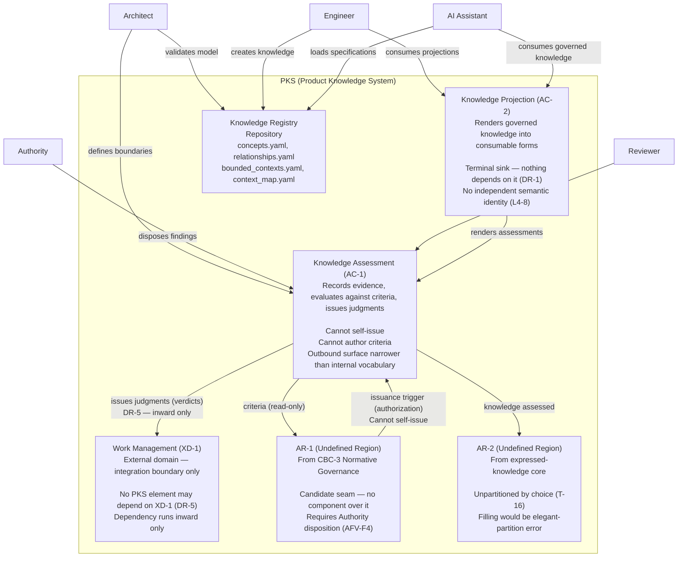

# C4 Level 2 — Container Diagram (PlantUML)

## The Short Answer

**Yes — here is the C4 Level 2 Container Diagram in PlantUML.**

This shows the **containers** (applications, databases, services) inside the PKS system boundary, based on AD-1's logical components.

---

## PlantUML Code

```plantuml
@startuml PKS_Container_Diagram
!include https://raw.githubusercontent.com/plantuml-stdlib/C4-PlantUML/master/C4_Container.puml

LAYOUT_WITH_LEGEND()

title PKS — Container Diagram (C4 Level 2)

' ============================================
' Actors (Human Users)
' ============================================
Person(architect, "Architect", "Defines strategic boundaries and validates architectural decisions")
Person(engineer, "Engineer", "Creates and consumes engineering knowledge")
Person(authority, "Program Authority", "Makes governance decisions and disposes recommendations")
Person(reviewer, "Reviewer", "Independently verifies knowledge and execution")
Person(ai_assistant, "AI Assistant", "Consumes governed knowledge to guide development")

' ============================================
' System Boundary — PKS
' ============================================
System_Boundary(pks, "Product Knowledge System") {
    
    ' Container 1: Knowledge Assessment (AC-1)
    Container(ac1, "Knowledge Assessment", "AC-1", 
        "Records evidence, evaluates against criteria, issues judgments\n(verdicts)\n\nBoundary constraints:\n- Cannot self-issue (issuance trigger is outside)\n- Cannot author its own criteria\n- Outbound surface narrower than internal vocabulary",
        tags="component")
    
    ' Container 2: Knowledge Projection (AC-2)
    Container(ac2, "Knowledge Projection", "AC-2", 
        "Renders governed knowledge into consumable forms\n(ADR, Guide, Session Log, Verification Report, YAML)\n\nBoundary constraints:\n- Nothing may depend on AC-2 (DR-1)\n- No independent semantic identity (L4-8)\n- Terminal sink — no arrow leaves it",
        tags="component")
    
    ' Container 3: Work Management Integration (XD-1 — External)
    Container(xd1, "Work Management", "XD-1 (External)", 
        "External domain — integration boundary only\nManages work items (PB/EPIC/ENG/AD, WBS rows, boards)\n\nBoundary constraints:\n- No PKS element may depend on XD-1 (DR-5)\n- Cross-edge dependency runs inward only",
        tags="external")
    
    ' Container 4: Undefined Region 1 — AR-1 (Normative region)
    Container_Ext(ar1, "AR-1", "Undefined Architectural Region", 
        "From CBC-3 Normative Governance (candidate seam)\n\nStatus:\n- Candidate seam — formal state distinct from BC (MCR-2)\n- Architectural undefined — no component may be defined over it\n- Requires Authority disposition (AFV-F4)",
        tags="candidate")
    
    ' Container 5: Undefined Region 2 — AR-2 (Expressed-knowledge region)
    Container_Ext(ar2, "AR-2", "Undefined Architectural Region", 
        "From the unpartitioned expressed-knowledge core\n(Decision, Term, Model element, Contract)\n\nStatus:\n- Unpartitioned by choice (T-16)\n- Architectural undefined — no component may be defined over it\n- Filling would be elegant-partition error",
        tags="candidate")
    
    ' Container 6: Knowledge Registry (Implicit — the governed model)
    Container(registry, "Knowledge Registry", "Repository", 
        "The governed knowledge base\n- concepts.yaml\n- relationships.yaml\n- lifecycles.yaml\n- bounded_contexts.yaml\n- context_map.yaml\n\nContains all governed knowledge that AI consumes")
}

' ============================================
' Relationships (Post-DAR-1, with constraints)
' ============================================

' Actors → Containers
Rel(architect, ac1, "defines boundaries", "Strategic DDD")
Rel(architect, registry, "validates model", "Review")
Rel(engineer, registry, "creates knowledge", "CRUD")
Rel(engineer, ac2, "consumes projections", "Read")
Rel(authority, ac1, "disposes findings", "Authority act")
Rel(reviewer, ac1, "verifies execution", "Critical Review")
Rel(ai_assistant, ac2, "consumes governed knowledge", "YAML/Markdown")
Rel(ai_assistant, registry, "loads specifications", "YAML")

' Container Dependencies (AD-1 DR-1..DR-8)
Rel(ac1, ar1, "criteria (read-only)", "Dependency — not component dependency (DR-6)")
Rel(ac1, ar2, "knowledge assessed", "Dependency — not component dependency (DR-6)")
Rel(ac1, xd1, "issues judgments (verdicts) to Work Management", "DR-5 — no PKS element may depend on XD-1; dependency runs INWARD only")
Rel(ac2, ac1, "renders assessments", "Derived from AC-1")

' DR-1: Nothing may depend on AC-2
' No arrow leaves AC-2 (enforced by omission)

' DR-3: AC-1 may depend on AR-1, AR-2, and external issuance trigger
' The issuance trigger arrow originates in AR-1 (cannot self-issue)
Rel(ar1, ac1, "issuance trigger (authorization)", "AC-1 cannot self-issue — trigger originates outside SB-1")

' DR-7: No cycles — the dependency graph is acyclic
' All arrows point away from AR-1 and AC-1, toward AC-2 and XD-1

' ============================================
' Legend
' ============================================
LEGEND()
== Containers ==
Container(c, "Container", "A deployable/executable unit")
Container_Ext(c, "Container", "External or undefined")
== Relationships ==
Rel_Arrow(a, b, "Direction", "Dependency direction")
Rel_Plain(a, b, "Relationship", "No arrow indicates interaction")
== Tags ==
' Component tags for visual distinction
' (Handled by C4 PlantUML via stereotypes)
END_LEGEND()

@enduml
```

---

## Visual Output (Mermaid Equivalent)



---

## Key Design Decisions (From AD-1 & C4-1)

| Element | Decision | Source |
|---------|----------|--------|
| **AC-1** | Can issue judgments but cannot self-issue (trigger originates in AR-1) | AD-1 §7 |
| **AC-2** | Terminal sink — no arrow leaves it (DR-1) | AD-1 DR-1 |
| **XD-1** | External domain — no PKS element may depend on it (DR-5); dependency runs **inward only** | AD-1 DR-5 |
| **AR-1** | Undefined architectural region — candidate seam | AD-1 §6.2; MCR-2 |
| **AR-2** | Undefined architectural region — unpartitioned core | AD-1 §6.2; T-16 |
| **Dependencies** | AD-1 before C4-1 — representation follows source | AD-1 → C4-1 |
| **No Mechanism** | Arrows carry direction and content — no synchronicity, messaging, or events | AD-1 DP-2 |

---

## Container Details (From AD-1)

### AC-1 — Knowledge Assessment

| Aspect | Detail |
|--------|--------|
| **Purpose** | Records evidence, evaluates against criteria, issues judgments (verdicts) |
| **Responsibilities** | Observation collection, Criterion evaluation, Verdict issuance, Judgment recording |
| **Constraints** | Cannot self-issue (issuance trigger is outside SB-1); Cannot author its own criteria; Outbound surface is narrower than internal vocabulary |
| **Dependencies** | AR-1 (criteria, read-only), AR-2 (knowledge assessed), XD-1 (issues judgments to Work Management — DR-5) |

### AC-2 — Knowledge Projection

| Aspect | Detail |
|--------|--------|
| **Purpose** | Renders governed knowledge into consumable forms |
| **Responsibilities** | ADR generation, Guide generation, Session Log generation, Verification Report generation, YAML/Markdown exports |
| **Constraints** | Nothing may depend on AC-2 (DR-1); No independent semantic identity (L4-8); Terminal sink |
| **Dependencies** | AC-1 (renders assessments from AC-1) |

### AR-1 — Normative Region (Undefined)

| Aspect | Detail |
|--------|--------|
| **Status** | Candidate seam — formal state distinct from BC (MCR-2) |
| **Role** | Provides criteria for AC-1 (read-only) |
| **Constraint** | No component may be defined over it |
| **Pending** | Authority disposition required (AFV-F4) |

### AR-2 — Expressed-Knowledge Region (Undefined)

| Aspect | Detail |
|--------|--------|
| **Status** | Unpartitioned by choice (T-16) |
| **Role** | Provides knowledge for AC-1 to assess |
| **Constraint** | No component may be defined over it |
| **Risk** | Filling would be the elegant-partition error at one remove |

---

## What This Diagram Shows

| Element | Description |
|---------|-------------|
| **AC-1** | The Knowledge Assessment container — evaluates evidence and issues judgments |
| **AC-2** | The Knowledge Projection container — renders governed knowledge (terminal sink) |
| **XD-1** | Work Management (external) — integration boundary only |
| **AR-1** | Undefined architectural region — candidate seam (requires Authority disposition) |
| **AR-2** | Undefined architectural region — unpartitioned core |
| **Registry** | The governed knowledge repository (concepts.yaml, relationships.yaml, etc.) |

---

## What This Diagram Does NOT Show

| Element | Reason |
|---------|--------|
| **Internal components of AC-1/AC-2** | Not derivable from AD-1 (C4-1 L3 substitute is Knowledge Structure View) |
| **Synchronization** | No timing, coupling, delivery, or ordering evidence exists |
| **Deployment** | Deployment-neutral by construction |
| **Technology** | Technology-neutral by construction |
| **Runtime semantics** | Containers carry no runtime semantics (DP-6) |

---

## Where to Save

```
docs/architecture/c4/c4_level2_container_diagram.puml
```

---

## Next Steps

| Step | Description |
|------|-------------|
| **C4 Level 3 — Components** | Show components inside AC-1 and AC-2 (if derivable) |
| **C4 Level 4 — Code** | Optional — only if explicitly derivable |

---

**The Container Diagram is ready. It shows AC-1, AC-2, XD-1, AR-1, AR-2, and the Knowledge Registry — with all constraints from AD-1 and C4-1 respected.**