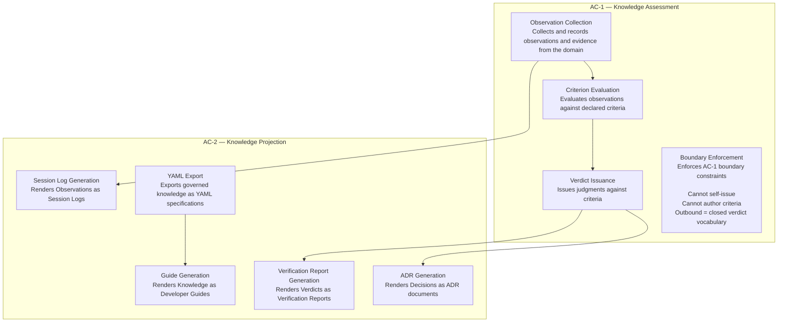

# C4 Level 3 — Component View (Knowledge Structure View)

## The Short Answer

**Yes — but not as a conventional C4 Level 3.**

C4 Level 3 (Component View) conventionally shows the **internal structure** of individual containers — their components, responsibilities, and interactions.

**However, as established in C4-1, a conventional Level 3 is NOT derivable from AD-1.** The architecture allocates responsibilities but does **not** define internal components. Therefore, we provide a **Knowledge Structure View** — a governed architectural projection that shows responsibility allocation, not component decomposition.

---

## What We Have (From C4-1)

### The Knowledge Structure View (Responsibility Allocation)

This view shows **responsibilities** allocated to AC-1 and AC-2 — not internal components. Every box in this view is a **responsibility**, not a component.

```
 AC-1 — KNOWLEDGE ASSESSMENT — Responsibilities Allocated by AD-1 §7
 ┌─────────────────────────────────────────────────────────────────┐
 │  Responsibilities:                                              │
 │  ┌─────────────────────────────────────────────────────────┐    │
 │  │ 1. Record observations and evidence                     │    │
 │  │ 2. Evaluate observations against criteria               │    │
 │  │ 3. Issue verdicts (judgments against criteria)          │    │
 │  │ 4. Enforce boundary constraints:                        │    │
 │  │    - Cannot self-issue (issuance trigger is outside)    │    │
 │  │    - Cannot author its own criteria                      │    │
 │  │    - Outbound surface = closed verdict vocabulary        │    │
 │  └─────────────────────────────────────────────────────────┘    │
 └─────────────────────────────────────────────────────────────────┘

 AC-2 — KNOWLEDGE PROJECTION — Responsibilities Allocated by AD-1 §7
 ┌─────────────────────────────────────────────────────────────────┐
 │  Responsibilities:                                              │
 │  ┌─────────────────────────────────────────────────────────┐    │
 │  │ 1. Render governed knowledge into consumable forms:     │    │
 │  │    - ADR (Decision → Markdown)                          │    │
 │  │    - Guide (Knowledge → Markdown)                       │    │
 │  │    - Session Log (Observations → Markdown)              │    │
 │  │    - Verification Report (Verdicts → Markdown)          │    │
 │  │    - YAML specifications (for AI tools)                 │    │
 │  │ 2. Enforce boundary constraints:                        │    │
 │  │    - Nothing may depend on AC-2 (DR-1)                  │    │
 │  │    - No independent semantic identity (L4-8)            │    │
 │  │    - Terminal sink — no outgoing dependencies           │    │
 │  └─────────────────────────────────────────────────────────┘    │
 └─────────────────────────────────────────────────────────────────┘
```

---

## Why L3 (Conventional) Is Not Supplied

| Reason | Explanation |
|--------|-------------|
| **No internal components derived** | AD-1 allocates responsibilities to containers but does **not** define internal structure |
| **No decomposition evidence** | The strategic model contains no evidence of internal component decomposition |
| **AD-1 forbids tactical decomposition** | AD-1's boundary explicitly forbids tactical decomposition |
| **Nested boxes would invent structure** | Adding nested boxes would assert internal components that do not exist |

**Conventional L3 is NOT supplied because it would invent architecture.**

---

## PlantUML — Knowledge Structure View (Responsibility Allocation)

```plantuml
@startuml PKS_Knowledge_Structure_View
!include https://raw.githubusercontent.com/plantuml-stdlib/C4-PlantUML/master/C4_Component.puml

LAYOUT_WITH_LEGEND()

title PKS — Knowledge Structure View (Responsibility Allocation)
subtitle NOT a conventional C4 Level 3 — a governed architectural projection

' ============================================
' AC-1 — Knowledge Assessment
' ============================================
Package(ac1, "AC-1 — Knowledge Assessment", "Records evidence, evaluates against criteria, issues judgments") {
    Component(ac1_1, "Observation Collection", "Responsibility", "Collects and records observations and evidence from the domain")
    Component(ac1_2, "Criterion Evaluation", "Responsibility", "Evaluates observations against declared criteria")
    Component(ac1_3, "Verdict Issuance", "Responsibility", "Issues judgments against criteria")
    Component(ac1_4, "Boundary Enforcement", "Responsibility", "Enforces AC-1 boundary constraints")
}

' ============================================
' AC-2 — Knowledge Projection
' ============================================
Package(ac2, "AC-2 — Knowledge Projection", "Renders governed knowledge into consumable forms") {
    Component(ac2_1, "ADR Generation", "Responsibility", "Renders Decisions as ADR documents")
    Component(ac2_2, "Guide Generation", "Responsibility", "Renders Knowledge as Developer Guides")
    Component(ac2_3, "Session Log Generation", "Responsibility", "Renders Observations as Session Logs")
    Component(ac2_4, "Verification Report Generation", "Responsibility", "Renders Verdicts as Verification Reports")
    Component(ac2_5, "YAML Export", "Responsibility", "Exports governed knowledge as YAML specifications")
}

' ============================================
' Relationships (Responsibility flow, not components)
' ============================================
Rel(ac1_1, ac1_2, "Observations feed evaluation", "Evidence flow")
Rel(ac1_2, ac1_3, "Evaluation results feed judgments", "Criteria application")
Rel(ac1_3, ac2_1, "Decisions rendered as ADRs", "Projection")
Rel(ac1_3, ac2_4, "Verdicts rendered as reports", "Projection")
Rel(ac1_1, ac2_3, "Observations rendered as logs", "Projection")
Rel(ac2_5, ac2_2, "YAML used to generate guides", "Derived")

' ============================================
' Notes (Constraints from AD-1)
' ============================================
NOTE_LEFT(ac1_4, "Boundary constraints:\n- Cannot self-issue\n- Cannot author criteria\n- Outbound surface = closed verdict vocabulary\n- Issuance trigger originates outside SB-1")
NOTE_RIGHT(ac2_5, "Boundary constraints:\n- Nothing may depend on AC-2 (DR-1)\n- No independent semantic identity (L4-8)\n- Terminal sink")

' ============================================
' Legend
' ============================================
LEGEND()
== Responsibilities ==
Component(comp, "Responsibility", "A responsibility allocated by AD-1 — NOT a component")
== Relationships ==
Rel_Arrow(a, b, "Flow", "Responsibility flow direction")
END_LEGEND()

@enduml
```

---

## Visual Output (Mermaid Equivalent)



---

## Key Constraints (From AD-1)

| Constraint | Source | Enforcement |
|------------|--------|-------------|
| **Nothing may depend on AC-2** | AD-1 DR-1 | No arrow leaves AC-2 |
| **AC-1 cannot self-issue** | AD-1 AP-5 | Issuance trigger originates in AR-1 |
| **AC-1 cannot author criteria** | AD-1 AP-7 | Criteria are used here, owned elsewhere |
| **Outbound surface = closed verdict vocabulary** | AD-1 AP-8 | Only Verdict tokens cross SB-1 |
| **No independent semantic identity** | AD-1 L4-8 | Projections are regenerable; nothing builds on them |
| **Terminal sink** | AD-1 DR-1 | AC-2 is the end of the dependency chain |

---

## What This View Shows

| Element | Description |
|---------|-------------|
| **AC-1 Responsibilities** | Observation Collection, Criterion Evaluation, Verdict Issuance, Boundary Enforcement |
| **AC-2 Responsibilities** | ADR Generation, Guide Generation, Session Log Generation, Verification Report Generation, YAML Export |
| **Responsibility Flow** | Observations → Evaluation → Verdicts → Projections |
| **Boundary Constraints** | Cannot self-issue, cannot author criteria, terminal sink |

---

## What This View Does NOT Show

| Element | Reason |
|---------|--------|
| **Internal components** | Not derivable from AD-1 |
| **Implementation details** | Not derivable — tactical DDD not yet defined |
| **Deployment** | Deployment-neutral by construction |
| **Technology** | Technology-neutral by construction |
| **Runtime semantics** | No timing, coupling, delivery, or ordering evidence exists |

---

## Where to Save

```
docs/architecture/c4/c4_level3_knowledge_structure_view.puml
```

---

## Summary

| Question | Answer |
|----------|--------|
| Is L3 (conventional) supplied? | ❌ No — not derivable from AD-1 |
| Is a Knowledge Structure View supplied? | ✅ Yes — responsibility allocation |
| What does it show? | Responsibilities allocated to AC-1 and AC-2 |
| What does it NOT show? | Internal components, implementation details |
| What is the key principle? | Every box is a **responsibility**, not a component |

---

**The Knowledge Structure View is complete. It shows responsibility allocation for AC-1 and AC-2 — not internal components. Conventional L3 is not derivable and is not supplied.**