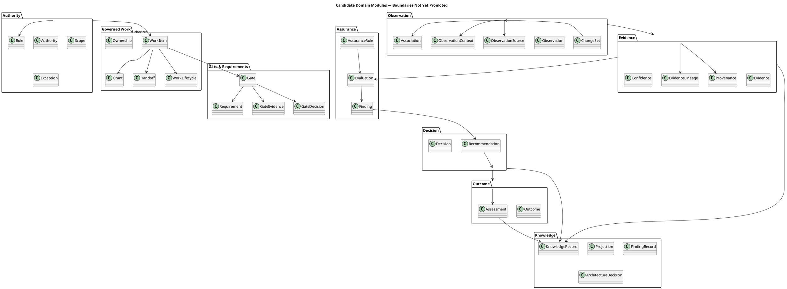

Yes. I would make the C4 model **evidence-derived**, not pretend that the proposed KnowledgeOS kernel is already established.

I would use **four C4 levels**, with one additional deployment view only if needed:

1. **C1 — System Context**
2. **C2 — Container**
3. **C3 — Component**
4. **C4 — Code / Domain Structure**
5. Optional: **Deployment / Runtime View**

The important architectural distinction is that **C1–C3 describe the architecture we are proposing from the evidence**, while uncertain future elements are explicitly marked as candidates.

## C1 — System Context

```plantuml
@startuml
!include https://raw.githubusercontent.com/plantuml-stdlib/C4-PlantUML/master/C4_Context.puml

LAYOUT_TOP_DOWN()

title EKS / KnowledgeOS — C1 System Context

Person(engineer, "Engineer", "Performs engineering work")
Person(architect, "Architect", "Defines architecture and architecture decisions")
Person(governance, "Governance Authority", "Defines authority, rules, approvals and exceptions")
Person(reviewer, "Reviewer / Decision Maker", "Reviews evidence and makes governed decisions")
Person(ai, "AI Engineering Agent", "Assists engineering, observation, analysis and recommendation")

System(eks, "Engineering Knowledge System (EKS)",
    "Evidence-governed engineering system that controls work, observes engineering activity, evaluates evidence, records decisions and preserves engineering knowledge.")

System_Ext(publicdigit, "PublicDigit / Engineering Target",
    "Software systems and engineering artifacts being changed.")

System_Ext(git, "Git / Repository",
    "Source code, documents, commits and repository history.")

System_Ext(devtools, "Engineering Tools",
    "Editors, CI/CD, test runners and other engineering tools.")

Rel(governance, eks, "Defines authority, rules and governance decisions")
Rel(architect, eks, "Defines architecture decisions and constraints")
Rel(engineer, eks, "Receives governed work and produces engineering changes")
Rel(reviewer, eks, "Reviews evidence and records decisions")
Rel(ai, eks, "Observes, analyzes and recommends")

Rel(eks, publicdigit, "Governs / observes engineering activity")
Rel(eks, git, "Reads and persists evidence / knowledge")
Rel(eks, devtools, "Receives engineering signals / observations")

Rel(engineer, publicdigit, "Changes")
Rel(ai, publicdigit, "Assists with changes")

@enduml
```

### Interpretation

The key point is that **EKS surrounds engineering activity**.

It does not replace PublicDigit or become the business application.

---

# C2 — Container Architecture

This is the most important diagram.

```plantuml
@startuml
!include https://raw.githubusercontent.com/plantuml-stdlib/C4-PlantUML/master/C4_Container.puml

LAYOUT_TOP_DOWN()

title EKS — C2 Container Architecture
title Evidence-Governed Engineering Architecture

Person(engineer, "Engineer")
Person(architect, "Architect")
Person(governance, "Governance Authority")
Person(reviewer, "Reviewer / Decision Maker")
Person(ai, "AI Engineering Agent")

System_Ext(target, "Engineering Target",    "PublicDigit and other engineering systems")

System_Ext(git, "Git / Repository",    "Source, documents, commits")

System_Ext(tools, "Engineering Tools",    "IDE, CI/CD, test runners, file-save and commit signals")

System_Boundary(eks, "Engineering Knowledge System (EKS)") {

    Container(governanceC, "Governance & Authority",        "Rules, authority, scope, exceptions","Defines who may authorize what")

    Container(work, "Work Control",        "Work Item, Grant, Handoff, Ownership, Lifecycle", "Controls governed engineering work")

    Container(gates, "Gate & Requirement Evaluation",        "Gate definitions, preconditions, required evidence", "Determines whether controlled transitions may proceed")

    Container(observation, "Observation",        "ChangeSet, ObservationTrigger, ObservationRuntime, Collectors",    "Observes engineering activity")

    Container(evidence, "Evidence & Provenance",    "Observations, provenance, timestamps, associations",     "Preserves what was actually observed")

    Container(assurance, "Assurance",        "Rules, verification, metrics, deterministic assessment",        "Evaluates evidence against requirements")

    Container(recommendation, "Recommendation",        "Deterministic and AI-assisted recommendations",        "Proposes actions; does not grant authority")

    Container(decision, "Decision",        "Accept, Reject, Defer, Remediate, Exception",        "Records authorized decision")

    Container(outcome, "Outcome & Assessment",        "Outcome, Assessment, effectiveness",        "Records what happened after a decision")

    Container(knowledge, "Knowledge & Projections",        "Findings, ADRs, lessons, dashboards, reports",        "Projects durable engineering knowledge")

    ContainerDb(store, "Evidence / Knowledge Store",        "Append-oriented repository-backed records",        "Persists evidence and knowledge")

    Container(aiassist, "AI Assistance",        "Classification, correlation, summarization, candidate discovery",        "Assists analysis; never becomes authority")
}

Rel(governance, governanceC, "Defines / authorizes")
Rel(architect, governanceC, "Defines architecture constraints")
Rel(governanceC, work, "Authorizes governed work")
Rel(work, gates, "Presents work and preconditions")
Rel(gates, work, "Controls lifecycle transition")

Rel(work, target, "Provides governed work context")
Rel(target, observation, "Produces engineering changes")
Rel(tools, observation, "Triggers observation")
Rel(git, observation, "Provides change signals")

Rel(observation, evidence, "Produces observations")
Rel(evidence, assurance, "Provides evidence")
Rel(assurance, gates, "Provides gate evidence")
Rel(assurance, recommendation, "Provides findings")
Rel(aiassist, recommendation, "Provides candidate analysis")

Rel(recommendation, decision, "Proposes")
Rel(reviewer, decision, "Makes governed decision")
Rel(decision, outcome, "Creates expected outcome")
Rel(target, outcome, "Produces actual outcome")

Rel(outcome, knowledge, "Feeds learning")
Rel(evidence, knowledge, "Feeds durable knowledge")
Rel(decision, knowledge, "Records decisions")
Rel(knowledge, governanceC, "Feeds future rules / governance")

Rel(evidence, store, "Persists")
Rel(knowledge, store, "Persists / projects")

Rel(ai, aiassist, "Uses")
Rel(ai, target, "Assists engineering")
Rel(ai, observation, "May initiate / participate in observation")

@enduml
```

---

# The crucial C2 relationship

The architecture has **two flows**:

```text
CONTROL FLOW

Governance
    ↓
Work
    ↓
Gate
    ↓
Engineering
    ↓
Gate
    ↓
Decision
```

and:

```text
EVIDENCE FLOW

Engineering
    ↓
Observation
    ↓
Evidence
    ↓
Assurance
    ↓
Recommendation
    ↓
Decision
    ↓
Outcome
    ↓
Knowledge
```

The architecture closes them:

```text
                 ┌──────── GOVERNANCE ────────┐
                 │                            │
                 ▼                            │
               WORK                           │
                 │                            │
                 ▼                            │
               GATE                           │
                 │                            │
                 ▼                            │
            ENGINEERING                       │
                 │                            │
                 ▼                            │
            OBSERVATION                       │
                 │                            │
                 ▼                            │
             EVIDENCE                         │
                 │                            │
                 ▼                            │
             ASSURANCE                        │
                 │                            │
                 ▼                            │
           RECOMMENDATION                     │
                 │                            │
                 ▼                            │
             DECISION ────────────────────────┘
                 │
                 ▼
              OUTCOME
                 │
                 ▼
             KNOWLEDGE
                 │
                 └──────────► GOVERNANCE
```

This is the C4 architecture's central story.

---

# C3 — Component Architecture

I would decompose the **EKS core** like this.

```plantuml
@startuml
!include https://raw.githubusercontent.com/plantuml-stdlib/C4-PlantUML/master/C4_Component.puml

LAYOUT_LEFT_RIGHT()

title EKS — C3 Component Architecture
title Governed Work + Observation + Assurance

Container_Boundary(core, "EKS Core") {

    Component(workModel, "Work Model",        "Domain",        "Work Item, Grant, Handoff, Ownership and lifecycle")

    Component(authority, "Authority Model",        "Domain",        "Authority, scope, authorization and exceptions")

    Component(gateEngine, "Gate Engine",        "Domain / Application",        "Evaluates gate preconditions and required evidence")

    Component(changeSet, "ChangeSet Builder",        "Application",        "Normalizes engineering activity into ChangeSets")

    Component(trigger, "Observation Trigger",        "Port",        "Receives engineering-change signals")

    Component(runtime, "Observation Runtime",        "Application",        "Runs deterministic observation pipeline")

    Component(collector, "Observation Collectors",        "Adapters",        "Collects code, document, test and repository evidence")

    Component(association, "Work Association",        "Domain / Application",        "Associates observed changes with governed work")

    Component(provenance, "Provenance",        "Domain",        "Records source, timestamp, lineage and confidence")

    Component(assuranceRules, "Assurance Rules",        "Domain",        "Evaluates evidence against requirements")

    Component(recommendationEngine, "Recommendation Engine",        "Application",        "Produces deterministic recommendations")

    Component(aiAnalysis, "AI Analysis Adapter",        "Adapter",        "Candidate classification / correlation / discovery")

    Component(decisionModel, "Decision Model",        "Domain",        "Accept, Reject, Defer, Remediate, Exception")

    Component(outcomeModel, "Outcome & Assessment",        "Domain",        "Records actual result and effectiveness")

    Component(knowledgeProjection, "Knowledge Projection",        "Application",        "Projects evidence, decisions and outcomes into knowledge views")

    Component(persistence, "Persistence Adapter",        "Infrastructure",        "Repository-backed durable evidence and state")
}

System_Ext(workflow, "Engineering Workflow")
System_Ext(git, "Git")
System_Ext(testing, "Test / Verification Tools")
System_Ext(ai, "AI Agent")

Rel(workflow, trigger, "Triggers")
Rel(git, collector, "Provides changes")
Rel(testing, collector, "Provides results")

Rel(trigger, changeSet, "Creates")
Rel(changeSet, runtime, "Executes")

Rel(runtime, collector, "Invokes")
Rel(collector, association, "Produces observed changes")
Rel(workModel, association, "Provides governed work context")

Rel(association, provenance, "Records association evidence")
Rel(provenance, assuranceRules, "Provides evidence")

Rel(assuranceRules, gateEngine, "Satisfies / fails requirements")
Rel(assuranceRules, recommendationEngine, "Provides findings")

Rel(ai, aiAnalysis, "Analyzes")
Rel(aiAnalysis, recommendationEngine, "Provides candidate recommendations")

Rel(recommendationEngine, decisionModel, "Proposes")
Rel(decisionModel, outcomeModel, "Produces decision outcome")
Rel(outcomeModel, knowledgeProjection, "Feeds")
Rel(provenance, knowledgeProjection, "Feeds")
Rel(decisionModel, knowledgeProjection, "Feeds")

Rel(workModel, persistence, "Persists")
Rel(authority, persistence, "Persists")
Rel(provenance, persistence, "Persists")
Rel(decisionModel, persistence, "Persists")
Rel(outcomeModel, persistence, "Persists")

@enduml
```

---

# C4 — Domain-level structure

For the fourth level, I would **not yet pretend that all of these are bounded contexts**.

Instead, C4 should show the **candidate domain modules and their dependencies**.



---

# 5. One important correction to the diagram

I would **not implement all the boxes shown in C4 immediately**.

The diagram represents the **architectural responsibility model**, not today's complete implementation.

For example:

### Established / strongly evidenced

- Work control
- Authority records
- ObservationTrigger
- ChangeSet
- ObservationRuntime
- Collectors
- Recommendation
- Decision
- Outcome
- Assessment
- document assurance
- knowledge linting / integrity mechanisms

### Partially established

- authority enforcement
- temporal reconstruction
- work-to-change association
- provenance across processes
- delegation
- identifier integrity

### Candidate / earned through future experiments

- generalized Gate model
- generalized Work Association
- universal Rule model
- cross-domain Knowledge kernel
- AI orchestration layer
- generalized KnowledgeOS kernel

That distinction is essential because the source architecture baseline explicitly classifies current EKS by implementation/evidence maturity rather than treating conceptual architecture as implementation. :chatgpt-content-reference{index="0"}

---

# 6. The architecture boundary I would draw today

I would draw the system boundary like this:

```text
                    ┌──────────────────────────────┐
                    │            EKS               │
                    │                              │
                    │ Governance                   │
                    │ Work Control                 │
                    │ Observation                  │
                    │ Evidence                     │
                    │ Assurance                    │
                    │ Decision                     │
                    │ Outcome                      │
                    │ Knowledge                    │
                    │                              │
                    └──────────────┬───────────────┘
                                   │
                ┌──────────────────┼──────────────────┐
                │                  │                  │
                ▼                  ▼                  ▼
          PublicDigit          Git/Repo         Engineering
          / Products                            Tools / CI
```

**KnowledgeOS should not yet be drawn as a separate deployed system beside EKS.**

That would falsely imply that the kernel/platform boundary has already been proven.

The historical architecture material explicitly says:

> do not perform **EKS capability → rename → KnowledgeOS kernel**.

A kernel candidate must demonstrate domain independence, invariant-bearing behavior, reuse across more than one knowledge domain, independent ownership and stable boundary. :chatgpt-content-reference{index="1"}

---

## My recommendation for the C4 baseline

I would therefore create **two C4 sets**, not one:

### C4-A — Current EKS

```text
C1 Current EKS Context
C2 Current EKS Containers
C3 Current EKS Components
```

Strictly archaeological.

### C4-B — Evidence-Governed EKS Architecture

```text
C1 Target/Principle Context
C2 Principle Containers
C3 Capability Components
C4 Domain candidates
```

Clearly labelled **PROPOSED / EVIDENCE-DERIVED / NOT YET ADOPTED**.

This prevents the biggest architectural mistake we could make now: **mixing today's implementation with the architecture we are deliberately trying to earn through experiments.**

And the next capability—**Governed Engineering Act Observation**—would sit exactly at the C2/C3 seam between **Work Control → Engineering Activity → Observation → Evidence**, making it an excellent first vertical slice for validating whether this architecture is actually correct.
