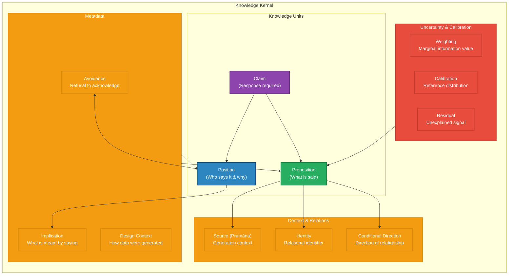

# Knowledge Kernel Architecture – Integrative Summary

**Senior Principal Architect Review**  
*Based on analysis of seven philosophical & scientific works*

---

## Executive Summary

After reviewing the extracted insights from **seven foundational works** across epistemology, philosophy of language, logic, and statistics, I have identified a **coherent set of architectural principles** for a minimal Knowledge Kernel. These principles converge on a single insight:

> **Knowledge is not a possession — it is a relationship. A Kernel must model that relationship, not just the proposition.**

The works converge on several architectural imperatives:

| Source | Core Insight | Architectural Implication |
|--------|--------------|---------------------------|
| **Chinese Philosophy** | Identity is relational, not intrinsic | Kernel must model relational identity, not fixed identity |
| **Nyāya (Tarka)** | Knowledge is causally generated, not possessed | Kernel must track generation process (pramāṇa) |
| **Wittgenstein (Tractatus)** | Saying ≠ Showing; meaning is use | Kernel must distinguish proposition from position |
| **Cavell** | Knowing ≠ Acknowledging | Kernel must model claims, not just propositions |
| **Stigler** | Information requires aggregation & calibration | Kernel must support data reduction & uncertainty quantification |

---

## Part 1: The 12 Architectural Principles

### 1. Identity is Relational, Not Intrinsic

**From Chinese Philosophy & Nyāya:**

A unit of knowledge cannot be identified independently of its relations — its identity is constituted by its role, context, and history.

| Implication | Architecture |
|-------------|--------------|
| Identity is not a fixed property but a relationship | Kernel must track the **relational context** of each knowledge unit |
| Boundaries are provisional, not absolute | Kernel must support **provisional boundaries** that can shift |
| The same "thing" can be known differently in different contexts | Kernel must support **context-dependent identity** |

**Architectural Pattern:** Contextual Identity – Each knowledge unit has identity relative to its context, not absolutely.

---

### 2. Knowledge is Generated, Not Possessed

**From Nyāya (Pramāṇa Theory):**

Knowledge is produced by the right kind of process (pramāṇa). Error is a misplacement, not a separate category.

| Implication | Architecture |
|-------------|--------------|
| Knowledge claims must be traceable to their generation process | Kernel must track the **pramāṇa** (source) for each unit |
| Error is a modified version of truth, not a distinct state | Kernel must model error as a **misplacement**, not a separate category |
| Default trust is the epistemic default | Kernel must **trust by default** and **doubt only on reason** |

**Architectural Pattern:** Traceable Generation – Every knowledge unit must record its source and generation conditions.

---

### 3. Meaning is Use, Not Definition

**From Wittgenstein (Tractatus) & Cavell:**

Words have meaning only in use. The "must" of meaning — the implication of an utterance — is not optional.

| Implication | Architecture |
|-------------|--------------|
| Propositions cannot be stored without their context of use | Kernel must store **utterance context**, not just proposition |
| What is "said" is not the same as what is "meant" | Kernel must distinguish **proposition** from **position** |
| Implications are part of meaning, not external pragmatics | Kernel must model **implied meaning** as part of the knowledge unit |

**Architectural Pattern:** Meaning-as-Use – Knowledge is stored with its context of utterance and implied meaning.

---

### 4. Knowing and Acknowledging are Distinct

**From Cavell:**

Knowing that \(p\) is not the same as acknowledging a claim. Acknowledgment is a response to a claim, not a judgment of truth.

| Implication | Architecture |
|-------------|--------------|
| A Kernel must model **claims** (which require response) not just propositions | Kernel must have a separate category for **claims** |
| The observer is implicated in what they observe | Kernel must track the **knower's implication** |
| Acknowledgment cannot be reduced to knowing | Kernel must support **acknowledgment as a distinct relation** |

**Architectural Pattern:** Claim-as-Relation – Claims are stored as relationships between persons, not as propositions.

---

### 5. Information Requires Aggregation

**From Stigler (Pillar 1):**

You gain information by discarding information. Aggregation reveals what individual observations obscure.

| Implication | Architecture |
|-------------|--------------|
| Data reduction is a first-class operation, not a loss | Kernel must support **aggregation operations** |
| Raw data and summaries are different knowledge forms | Kernel must distinguish **raw observations** from **summaries** |
| Identity must sometimes be submerged to reveal signal | Kernel must allow **identity submergence** for aggregation |

**Architectural Pattern:** Aggregation-as-Transformation – Aggregation is a transformation, not a loss.

---

### 6. Information Accumulates with Diminishing Returns

**From Stigler (Pillar 2):**

Information does not accumulate linearly. The second 20 observations are worth less than the first 20.

| Implication | Architecture |
|-------------|--------------|
| Data cannot be treated as equally informative | Kernel must **weight information** by marginal contribution |
| Additional data has diminishing value | Kernel must account for **diminishing returns** in inference |
| More data does not equal more knowledge | Kernel must avoid the assumption that **more is always better** |

**Architectural Pattern:** Weighted Information – Each datum contributes with a weight determined by its marginal information value.

---

### 7. Likelihood is Calibration, Not Truth

**From Stigler (Pillar 3):**

Probability is a calibration, not a truth value. The P-value is a measure of surprise, not of certainty.

| Implication | Architecture |
|-------------|--------------|
| Probabilities must be stored with their reference distribution | Kernel must track the **reference distribution** for probability claims |
| Calibrated uncertainty is not subjective belief | Kernel must distinguish **calibrated probability** from **subjective belief** |
| Surprise is not truth | Kernel must not treat low probability as falsehood |

**Architectural Pattern:** Calibrated Uncertainty – Each probability claim is stored with its calibration context.

---

### 8. Design Shapes What Can Be Learned

**From Stigler (Pillar 6):**

Data do not speak for themselves. The generation process determines what inferences are valid.

| Implication | Architecture |
|-------------|--------------|
| Data must be stored with their generation metadata | Kernel must track **how data were generated** |
| Randomization creates inference | Kernel must model **randomization** as a property of data |
| Planned observation is different from passive collection | Kernel must distinguish **planned** from **unplanned** observation |

**Architectural Pattern:** Design-as-Context – Each datum is stored with its generation context.

---

### 9. Residuals are Signal, Not Noise

**From Stigler (Pillar 7):**

What remains after subtracting known effects is often the most important signal. Residual analysis is the engine of discovery.

| Implication | Architecture |
|-------------|--------------|
| Residuals are not "error" to be ignored | Kernel must support **residual analysis** |
| Fitting and subtracting is a knowledge operation | Kernel must model **model fitting** as a first-class operation |
| The unexplained is often the most valuable | Kernel must track **what remains unexplained** |

**Architectural Pattern:** Residual-as-Signal – Residuals are treated as potential signal, not just noise.

---

### 10. The Self is Concealed in Assertion

**From Cavell:**

What we assert is not always a transparent expression of what we mean. The self hides in assertion.

| Implication | Architecture |
|-------------|--------------|
| Assertions must be stored with their speaker's position | Kernel must track the **speaker's position** |
| Concealment is part of meaning | Kernel must model **concealment** as a property of utterances |
| Knowledge of the self is acknowledgment, not introspection | Kernel must support **self-acknowledgment** as a relation |

**Architectural Pattern:** Position-as-Meaning – Every assertion is stored with the speaker's position, not just the proposition.

---

### 11. The Ordinary is Not the Obvious

**From Cavell & Wittgenstein:**

What is ordinary is in plain view, yet we fail to see it. The difficulty is not epistemic — it is existential.

| Implication | Architecture |
|-------------|--------------|
| The problem is often not lack of information | Kernel must model **avoidance** as a property |
| More information is not always the solution | Kernel must support **acknowledgment** operations |
| The obvious is what we refuse to see | Kernel must model **refusal** as a knowledge operation |

**Architectural Pattern:** Avoidance-as-State – Avoidance is tracked as a state of the knower, not as an information gap.

---

### 12. The Direction of Conditioning Matters

**From Stigler (Pillar 5):**

Asking the same question backwards gives a different answer. Relationships are not symmetric.

| Implication | Architecture |
|-------------|--------------|
| Conditional relationships are directional | Kernel must store **direction** of relationships |
| Regression is a property of the direction of inquiry | Kernel must model **regression** as a directional phenomenon |
| The Rule of Three is a trap | Kernel must not assume proportional relationships |

**Architectural Pattern:** Directional-Relation – Every relationship is stored with its directionality.

---

## Part 2: The Integrated Architecture

### The Knowledge Kernel – High-Level Structure

---

### Key Design Patterns

| Pattern | Description | Implementation |
|---------|-------------|----------------|
| **Contextual Identity** | Identity is relative to context | Store identity as a relation, not a fixed property |
| **Traceable Generation** | Knowledge is produced by processes | Track pramāṇa (source) and conditions for each unit |
| **Meaning-as-Use** | Meaning is in use, not definition | Store utterance context and implied meaning |
| **Claim-as-Relation** | Claims require response | Separate storage for claims vs. propositions |
| **Aggregation-as-Transformation** | Aggregation reveals signal | Support aggregation as a first-class operation |
| **Weighted Information** | Information has diminishing returns | Weight data by marginal information value |
| **Calibrated Uncertainty** | Probability is calibration | Track reference distribution for each probability |
| **Design-as-Context** | Data generation shapes inference | Store generation metadata for each datum |
| **Residual-as-Signal** | Residuals are potential signal | Track unexplained variance as knowledge |
| **Position-as-Meaning** | Assertions reveal position | Store speaker position with each assertion |
| **Avoidance-as-State** | Avoidance is a knowledge state | Track refusal to acknowledge |
| **Directional-Relation** | Relationships have direction | Store directionality of each relationship |

---

## Part 3: The 5 Architectural Shifts

### Shift 1: From Proposition to Proposition-in-Context

| Before | After |
|--------|-------|
| Store "p is true" | Store "p is asserted by S in context C with implication I" |
| Identity is a fixed ID | Identity is a relational ID dependent on context |
| Meaning is definitional | Meaning is use in context |

**Implementation:** Each knowledge unit must store:
- The proposition (content)
- The speaker position (who said it, why)
- The context (when, where, circumstances)
- The implication (what must be meant in saying it)
- The source (how it was generated)

---

### Shift 2: From Knowledge to Knowledge-With-Uncertainty

| Before | After |
|--------|-------|
| "True" or "False" | Probability with calibration context |
| All data are equally informative | Data are weighted by marginal information |
| Residuals are error | Residuals are potential signal |

**Implementation:** Each knowledge unit must store:
- The proposition with its uncertainty quantification
- The reference distribution (what is it calibrated against?)
- The weight (marginal information contribution)
- Residual analysis (what remains unexplained)

---

### Shift 3: From Statement to Position

| Before | After |
|--------|-------|
| "S says p" | "S says p from position P, with avoidance A" |
| Assertions are transparent | Assertions conceal the self |
| Knowledge is independent of knower | Knowledge implicates the knower |

**Implementation:** Each assertion must store:
- The speaker's position (role, relationship, context)
- Avoidance state (what is being refused?)
- Acknowledgment status (was the claim responded to?)

---

### Shift 4: From Data to Data-with-Design

| Before | After |
|--------|-------|
| Data are given | Data are generated |
| More data is better | More data has diminishing value |
| Randomization is optional | Randomization creates inference |

**Implementation:** Each datum must store:
- Generation process (how was it produced?)
- Randomization status (was it randomized?)
- Design metadata (was it planned?)
- Marginal information value (weighting)

---

### Shift 5: From Identity to Relational Identity

| Before | After |
|--------|-------|
| Identity is a fixed property | Identity is a relationship to context |
| Boundaries are absolute | Boundaries are provisional |
| The same thing is the same everywhere | Identity depends on context |

**Implementation:** Each entity must store:
- Identity as a relationship to its context
- Provisional boundaries that can shift
- Multiple identity modes depending on perspective

---

## Part 4: The 10 Core Capabilities

| # | Capability | Description | Implementation |
|---|------------|-------------|----------------|
| 1 | **Traceable Generation** | Every knowledge unit tracks its source and conditions | Pramāṇa metadata attached to each unit |
| 2 | **Contextual Identity** | Identity is a relation, not a fixed property | Identity is stored with context dependency |
| 3 | **Meaning-as-Use** | Meaning is derived from context of utterance | Utterance context stored with each proposition |
| 4 | **Claim-Acknowledgment** | Claims require response, not just judgment | Separate claim storage with acknowledgment status |
| 5 | **Aggregation** | Aggregation reveals signal, not just reduces data | First-class aggregation operations |
| 6 | **Weighted Information** | Information has diminishing returns | Weight each datum by marginal information value |
| 7 | **Calibrated Uncertainty** | Probability is calibration, not truth | Reference distribution tracked for each probability |
| 8 | **Residual Analysis** | Residuals are potential signal, not error | Track unexplained variance as knowledge |
| 9 | **Design Context** | Data generation shapes inference | Generation metadata stored with each datum |
| 10 | **Directional-Relation** | Relationships have direction | Directionality stored with each relationship |

---

## Part 5: Anti-Reasoner Capabilities

| Capability | Description | Implementation |
|------------|-------------|----------------|
| **Avoidance Detection** | Model the refusal to acknowledge | Avoidance state tracked for each knower |
| **Definition Adequacy** | Test definitions for avyāpti/ativyāpti/asambhava | Definition checking for all concepts |
| **Reason Integrity** | Test arguments for fallacy | Argument structure analysis with Tarka attacks |
| **Representation-Truth Distinction** | Distinguish representation from truth | Separate representation and truth layers |
| **Category Confusion Detection** | Distinguish absence, doubt, contradiction, error | Category classification for uncertain states |
| **Conclusion Excess Detection** | Ensure conclusions do not exceed premises | Argument boundary checking |

---

## Part 6: The 10 Falsification Questions for Any Kernel

1. **Identity Question:** Does the Kernel assume identity is a property or a relation?

2. **Generation Question:** Does the Kernel track how knowledge was generated, or only what was generated?

3. **Meaning Question:** Does the Kernel store propositions alone, or propositions with their context of use?

4. **Claim Question:** Does the Kernel distinguish between propositions and claims that require acknowledgment?

5. **Aggregation Question:** Does the Kernel support data reduction as a transformation, or as a loss?

6. **Weighting Question:** Does the Kernel treat all data as equally informative, or weight by marginal value?

7. **Calibration Question:** Does the Kernel treat probability as truth, or as calibration with a reference distribution?

8. **Design Question:** Does the Kernel know how data were generated, or treat data as "given"?

9. **Residual Question:** Does the Kernel treat residuals as error, or as potential signal?

10. **Direction Question:** Does the Kernel assume relationships are symmetric, or track directionality?

---

## Part 7: Next Steps

| Step | Action |
|------|--------|
| 1 | **Validate** the architectural shifts with the Constitution |
| 2 | **Prioritize** which capabilities are essential for a minimal Kernel |
| 3 | **Prototype** the core capabilities (Traceable Generation, Contextual Identity, Meaning-as-Use) |
| 4 | **Test** the Kernel against the falsification questions |
| 5 | **Iterate** based on results |

---

**This summary document represents the convergence of seven philosophical works into a coherent architectural vision. The next step is to prioritize and prototype.**