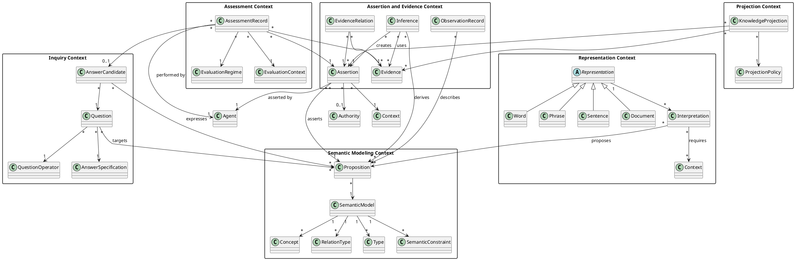

Yes. I think this makes sense, but I would make one important architectural distinction:

> **Truth, falsity, coherence, relevance, and answer-completeness should not be properties of a word or sentence alone. They are evaluations of a statement/question within a context and against some evidence or knowledge state.**

So I would model the **Knowledge Space** as the central semantic space, with linguistic representations connected to it.

Here is a first PlantUML model.

```plantuml
@startuml
title KnowledgeOS — Knowledge Space, Language, Questions and Epistemic Evaluation

skinparam shadowing false
skinparam packageStyle rectangle
skinparam classAttributeIconSize 0

' =========================================================
' KNOWLEDGE SPACE
' =========================================================

package "Knowledge Space" as KS {

    class KnowledgeState {
        +stateId
        +validAt
        +confidence
        +completeness
    }

    package "Semantic Layer" {

        class Topic {
            +topicId
            +boundary
            +scope
        }

        class Concept {
            +conceptId
            +meaning
        }

        class Relation {
            +relationType
        }

        class Proposition {
            +propositionId
            +semanticContent
        }

        class Fact {
            +factId
        }
    }

    package "Representation Layer" {

        class Word {
            +token
            +language
        }

        class Phrase {
            +text
        }

        class Sentence {
            +text
            +language
        }

        class Document {
            +documentId
        }
    }

    package "Epistemic Layer" {

        class Assertion {
            +assertionId
            +status
        }

        class Evidence {
            +evidenceId
            +strength
        }

        class Observation {
            +observationId
            +observedAt
        }

        class Inference {
            +inferenceId
            +method
        }
    }

    package "Question Layer" {

        abstract class Question {
            +questionId
            +text
        }

        class WhatQuestion
        class WhoQuestion
        class WhichQuestion
        class WhenQuestion
        class WhereQuestion
        class WhyQuestion
        class HowQuestion
        class HowManyQuestion
        class HowMuchQuestion
        class YesNoQuestion
    }

    package "Evaluation Layer" {

        class TruthAssessment {
            +value
            +confidence
        }

        class CoherenceAssessment {
            +coherent
            +confidence
        }

        class RelevanceAssessment {
            +relevance
        }

        class AnswerabilityAssessment {
            +answerable
            +confidence
        }

        class CompletenessAssessment {
            +coverage
            +missingParts
        }

        class ContradictionAssessment {
            +contradictionDetected
        }

        enum TruthValue {
            TRUE
            FALSE
            UNKNOWN
            BOTH
            NEITHER
        }
    }
}

' =========================================================
' SEMANTIC STRUCTURE
' =========================================================

KnowledgeState "1" o-- "*" Topic

Topic "1" o-- "*" Concept
Topic "1" o-- "*" Proposition

Concept "*" -- "*" Relation
Concept "*" -- "*" Concept

Relation "*" --> "*" Concept

Proposition "*" --> "*" Concept
Proposition "*" --> "*" Relation

Proposition "0..*" --> "0..*" Fact

' =========================================================
' LANGUAGE -> SEMANTICS
' =========================================================

Word "*" --> "*" Concept : expresses
Phrase "*" --> "*" Concept : expresses
Sentence "*" --> "*" Proposition : expresses
Document "*" --> "*" Proposition : contains

Word "*" --> "*" Topic : occurs in
Sentence "*" --> "*" Topic : interpreted in
Document "*" --> "*" Topic : concerns

' A sentence is not the proposition itself.
Sentence --> Proposition : semantic interpretation

' =========================================================
' EPISTEMIC STRUCTURE
' =========================================================

Observation "*" --> "*" Proposition : may support
Observation "*" --> "*" Fact : observes

Evidence "*" --> "*" Observation : derived from
Evidence "*" --> "*" Proposition : supports

Assertion "*" --> "1" Proposition : asserts

Inference "*" --> "*" Proposition : derives
Inference "*" --> "*" Evidence : uses
Inference "*" --> "*" Proposition : produces

Fact "*" --> "*" Evidence : supported by

' =========================================================
' QUESTIONS
' =========================================================

Question "*" --> "*" Topic : asks about
Question "*" --> "*" Concept : concerns
Question "*" --> "*" Proposition : seeks information about

WhatQuestion --|> Question
WhoQuestion --|> Question
WhichQuestion --|> Question
WhenQuestion --|> Question
WhereQuestion --|> Question
WhyQuestion --|> Question
HowQuestion --|> Question
HowManyQuestion --|> Question
HowMuchQuestion --|> Question
YesNoQuestion --|> Question

' =========================================================
' QUESTION -> ANSWER
' =========================================================

class Answer {
    +answerId
    +text
}

Question "1" --> "0..*" Answer : answered by

Answer "*" --> "*" Proposition : expresses

' =========================================================
' EVALUATION
' =========================================================

Assertion "*" --> "1" TruthAssessment
Assertion "*" --> "1" CoherenceAssessment
Assertion "*" --> "1" RelevanceAssessment

TruthAssessment --> TruthValue

Question "1" --> "1" AnswerabilityAssessment
Answer "1" --> "1" CompletenessAssessment

Question "1" --> "0..*" RelevanceAssessment

Proposition "*" --> "0..*" ContradictionAssessment
Assertion "*" --> "0..*" ContradictionAssessment

' =========================================================
' EVALUATION AGAINST KNOWLEDGE STATE
' =========================================================

TruthAssessment "*" --> "1" KnowledgeState : evaluated against
CoherenceAssessment "*" --> "1" KnowledgeState : checked against
RelevanceAssessment "*" --> "1" KnowledgeState : contextualized by
AnswerabilityAssessment "*" --> "1" KnowledgeState : based on
CompletenessAssessment "*" --> "1" KnowledgeState : measured against

Evidence "*" --> "1" KnowledgeState : belongs to
Assertion "*" --> "1" KnowledgeState : evaluated within

' =========================================================
' IMPORTANT DISTINCTIONS
' =========================================================

note right of Word
A word is a representation.
It is NOT itself the meaning.
end note

note right of Sentence
A sentence is linguistic form.
Its semantic interpretation may
correspond to a proposition.
end note

note right of Proposition
A proposition is semantic content.
It may be asserted, questioned,
supported or contradicted.
end note

note right of TruthAssessment
Truth is not an intrinsic property
of a sentence.

It is an assessment of a proposition
against evidence / knowledge state
under a defined epistemic regime.
end note

note right of AnswerabilityAssessment
A question can be:

ANSWERABLE
PARTIALLY ANSWERABLE
UNDERDETERMINED
UNANSWERABLE

independently of whether a candidate
answer is true or false.
end note

note right of CompletenessAssessment
An answer can be true but incomplete.

Example:

Question:
"Why did X happen?"

Answer:
"Because A."

A may be true while B and C
are missing.
end note

@enduml
```



### The important conceptual structure

I would visualize the architecture as:

```text
                    KNOWLEDGE SPACE
                          │
             ┌────────────┴────────────┐
             │                         │
        SEMANTIC SPACE             CONTEXT
             │
      ┌──────┼────────┐
      │      │        │
   Concept Relation Proposition
      │                │
      │                │
      └───────┬────────┘
              │
       REPRESENTATIONS
              │
       ┌──────┼──────┐
       │      │      │
      Word  Sentence Document
              │
              ▼
        Interpretation
              │
              ▼
         Proposition
              │
       ┌──────┼───────────────┐
       │      │               │
     Claim  Evidence       Question
       │                      │
       │                      ▼
       │                Answer candidate
       │                      │
       └──────────┬───────────┘
                  ▼
             EVALUATION
                  │
       ┌──────────┼───────────┐
       ▼          ▼           ▼
     Truth     Coherence   Relevance
       │
       ├── TRUE
       ├── FALSE
       ├── UNKNOWN
       ├── BOTH
       └── NEITHER

Question evaluation:
       │
       ├── Answerable?
       ├── Relevant?
       ├── Complete?
       └── Sufficiently specific?
```

## And your `what / which / when / why / how` idea is important

I would **not model these merely as words**.

They are **question operators**.

For example:

| Question operator | What it seeks                       |
| ----------------- | ----------------------------------- |
| **What**          | identity, definition, state, object |
| **Who**           | agent / actor / authority           |
| **Which**         | selection from alternatives         |
| **When**          | temporal position/interval          |
| **Where**         | spatial/contextual location         |
| **Why**           | cause, reason, justification        |
| **How**           | mechanism, process, method          |
| **How many**      | cardinality                         |
| **How much**      | quantity/magnitude                  |
| **Whether / Is**  | truth/status                        |
| **Whose**         | ownership/authority                 |
| **What if**       | counterfactual                      |
| **How likely**    | probability/uncertainty             |

This gives us something much more interesting than ordinary NLP.

A question becomes a **structured request against the Knowledge Space**.

For example:

> **"Why did the election result change?"**

could be represented as:

```text
Question
 ├── operator: WHY
 ├── target: ElectionResult
 ├── desired relation: CAUSAL
 ├── temporal scope: relevant interval
 ├── context: Election X
 └── required answer:
       causal explanation
```

Whereas:

> **"When did the election result change?"**

becomes:

```text
Question
 ├── operator: WHEN
 ├── target: ElectionResult
 └── desired relation: TEMPORAL
```

Same topic.

**Different epistemic query.**

---

# The really important addition: "Does it make sense?"

I would explicitly model this separately from truth.

Because these are different:

### 1. True

> "Berlin is in Germany."

Potentially **true**.

### 2. False

> "Berlin is in France."

Potentially **false**.

### 3. Meaningless / ill-formed

> "The color of Tuesday is 17 kilograms."

The problem may not be truth at all.

### 4. Incoherent

A set of statements may individually make sense but contradict one another.

### 5. Underdetermined

There is not enough evidence to answer.

### 6. Irrelevant

The answer may be true but doesn't answer the question.

### 7. Incomplete

The answer addresses only part of the question.

### 8. Ambiguous

The question has multiple possible interpretations.

Therefore I would make the evaluation vector something like:

[
E =
(
S,,
T,,
C,,
R,,
A,,
K,,
U
)
]

where:

* (S) = semantic well-formedness
* (T) = truth status
* (C) = coherence
* (R) = relevance
* (A) = answerability
* (K) = completeness
* (U) = uncertainty

This is much better than:

```text
answer = true/false
```

---

## This may become a central KnowledgeOS concept

I would call it an **Epistemic Answer Vector** or **Knowledge Assessment Vector**.

For example:

```text
Question:
"Why did X happen?"

Candidate Answer:
"Because A."

Assessment:

semantic       = valid
truth          = supported
coherence      = high
relevance      = high
answerability = answerable
completeness   = 0.62
uncertainty    = 0.21
```

Now we are getting very close to your original idea of **quantifying the state of knowledge without pretending that knowledge itself is one number**.

And this is exactly where the statistical, topological, Pramāṇa, Kāraka, Shani, and language lenses can converge.
## 
perplexity : 
##
The idea is directionally sound, but from a DDD perspective the PlantUML model currently crosses too many bounded contexts and treats several **roles, evaluations, records, and semantic objects as peers**. I would retain the central insight—evaluations are contextual and evidence-dependent—but restructure the model around domain capabilities and aggregate boundaries before allowing it to influence the KnowledgeOS kernel.

## Executive assessment

The strongest principle is:

> Truth, falsity, coherence, relevance, answerability, and completeness are not intrinsic properties of linguistic forms. They are outcomes of evaluations performed on propositions, assertions, questions, and answers within a declared context, against a specified knowledge state and evidential basis.

That principle is compatible with established provenance and graph-validation approaches. PROV separates entities, activities, agents, derivations, and responsibility rather than treating provenance as a single attribute; SHACL similarly validates graph structure against declared shapes rather than deciding the truth of graph content. [w3](https://www.w3.org/groups/wg/prov/publications/)

The model’s main architectural problem is that it currently combines at least six different domains:

1. semantic modeling;
2. linguistic representation;
3. observation and evidence;
4. inquiry and answering;
5. epistemic evaluation;
6. governance and contextual scope.

In DDD terms, this is not one coherent domain model. It is a **conceptual map across several bounded contexts**.

## The central DDD correction

I would not call the entire structure “Knowledge Space” as though it were one aggregate or one unified domain model.

Instead:

> KnowledgeOS should be modeled as a federation of bounded contexts connected through explicit published language, translation rules, provenance links, and anti-corruption layers.

A candidate context map would look like this:

```text
Semantic Modeling
       │
       │ published semantic language
       ▼
Representation and Interpretation
       │
       │ interpreted proposition
       ▼
Assertion and Evidence
       │
       │ evidence graph / epistemic record
       ▼
Inquiry and Answering
       │
       │ evaluation request
       ▼
Assessment and Governance
```

The arrows should not imply direct object sharing. Each context should own its own model and translate incoming concepts into its own language.

For example, `Sentence` in the Representation Context should not become the same object as `Proposition` in the Semantic Context. It should produce an **interpretation result** that refers to, or proposes, a proposition.

## What should change in the model

### 1. `KnowledgeState` should not own everything

The current model contains:

```plantuml
KnowledgeState "1" o-- "*" Topic
```

This is too strong. It suggests that a knowledge state is an aggregate containing topics, concepts, propositions, and all associated content.

From a DDD perspective, `KnowledgeState` is more likely to be one of three things:

- a read model;
- a snapshot of selected assertions and evaluations;
- a projection for a specific purpose, context, or agent.

It should not automatically own the lifecycle of concepts, documents, observations, evidence, and assessments.

A better formulation is:

```text
KnowledgeState
  ├── selects assertions
  ├── selects evidence
  ├── applies temporal scope
  ├── applies boundary and context
  ├── applies epistemic policy
  └── projects a usable view
```

Thus:

\[
KS = \operatorname{Project}(A, E, C, \tau, P)
\]

where:

- \(A\) = assertions;
- \(E\) = evidence and provenance;
- \(C\) = context;
- \(\tau\) = temporal scope;
- \(P\) = projection policy or purpose.

This makes `KnowledgeState` a derived domain concept rather than a universal container.

### 2. `Fact` should not be a primitive entity yet

The model currently contains both `Proposition` and `Fact`:

```plantuml
Proposition "*" --> "0..*" Fact
```

This risks reintroducing the exact conflation the architecture is trying to avoid.

A fact may mean at least four different things:

- a state of affairs in reality;
- a proposition accepted as true;
- an observed event;
- a database record labeled “fact.”

These are not interchangeable.

I would replace `Fact` temporarily with more explicit concepts:

```text
StateOfAffairs
ObservationRecord
AcceptedAssertion
FactClaim
```

Then investigate whether `Fact` is needed at all.

A safer relationship is:

```text
ObservationRecord --observes--> StateOfAffairs
Assertion --asserts--> Proposition
Evidence --supports--> Assertion
Assessment --evaluates--> Assertion
```

This preserves the distinction between what happened, what was observed, what was asserted, and what was accepted.

### 3. `Evidence` is not primarily an object type

The current model has:

```plantuml
Evidence "*" --> "*" Proposition : supports
```

This is useful, but incomplete. Evidence is not merely something that “supports a proposition.” It may:

- support an assertion;
- challenge an assertion;
- qualify an assertion;
- establish provenance;
- justify an inference;
- establish authority;
- indicate absence;
- demonstrate reproducibility.

The primary relationship should be directed toward an **assertion**, not only a proposition:

```text
Evidence --supports/challenges/qualifies--> Assertion
```

This matters because the same proposition may be supported by one source and challenged by another. Evidence is therefore contextual and relational.

A more precise model is:

```text
EvidenceRelation
  ├── source
  ├── target assertion
  ├── role: supports | challenges | qualifies | derives
  ├── method
  ├── strength
  ├── evaluatedAt
  └── provenance
```

`strength` should not be an intrinsic scalar on `Evidence`. Strength depends on the assertion, method, domain, and evaluation regime.

### 4. `Observation` should be an event or record, not a fact

The model currently allows:

```plantuml
Observation "*" --> "*" Fact : observes
```

This is reasonable as a hypothesis, but the identity of an observation must include the observational act:

- observer;
- instrument or method;
- observed subject;
- time;
- location or context;
- procedure;
- recorded result;
- uncertainty;
- provenance.

PROV is useful here because it explicitly models activities over time, entities used or generated by them, and agents bearing responsibility. [w3](https://www.w3.org/TR/prov-o/)

A DDD-style distinction could be:

```text
ObservationEvent
  ├── observes target
  ├── performed by observer
  ├── uses method/instrument
  ├── occurs at time
  └── produces ObservationRecord
```

The record is not identical to the state of affairs observed.

## Bounded-context proposal

### Semantic Modeling Context

This context owns meaning structures:

- Concept;
- Relation;
- Type;
- Proposition;
- semantic constraints;
- domain vocabulary;
- semantic identity.

Its responsibility is to answer:

> Is this semantic structure well-formed and meaningful within this domain?

It should not decide whether a proposition is true.

A possible aggregate is:

```text
SemanticModel
  ├── domain identity
  ├── concepts
  ├── relation definitions
  ├── types
  ├── constraints
  └── version
```

However, do not assume that `SemanticModel` contains every concept. In a large KnowledgeOS installation, concepts may be independently governed and referenced through stable identities.

### Representation Context

This context owns artifacts and linguistic forms:

- Word;
- Phrase;
- Sentence;
- Document;
- source code;
- diagram;
- data file;
- embedding;
- generated text.

Its responsibility is to answer:

> What representation exists, how was it produced, and what semantic interpretation does it propose?

The relation should be:

```text
Representation --interpretedAs--> Interpretation
Interpretation --proposes--> Proposition
```

not:

```text
Sentence --> Proposition
```

The direct association in the PlantUML model is too deterministic. A sentence can be ambiguous, incomplete, metaphorical, malformed, or context-sensitive.

### Assertion and Evidence Context

This context owns epistemic records:

- Assertion;
- Observation;
- Evidence;
- Inference;
- provenance;
- epistemic status;
- contradiction sets.

Its responsibility is to answer:

> Who claims what, on what basis, under which context and time, and how does the claim relate to other claims?

A core aggregate candidate could be:

```text
Assertion
  ├── proposition reference
  ├── asserting agent
  ├── assertion context
  ├── assertion time
  ├── validity interval
  ├── epistemic status
  ├── authority basis
  └── evidence references
```

I would keep this as a candidate rather than immediately declaring it the fundamental aggregate.

### Inquiry Context

This context owns:

- Question;
- question operator;
- answer specification;
- answer candidate;
- answer provenance;
- evaluation request.

Its responsibility is:

> What information is being requested, under what interpretation, and what would count as an adequate response?

This is distinct from the semantic proposition being asked about.

### Assessment Context

This context owns evaluation acts:

- TruthAssessment;
- CoherenceAssessment;
- RelevanceAssessment;
- AnswerabilityAssessment;
- CompletenessAssessment;
- ContradictionAssessment;
- uncertainty assessment.

Its responsibility is:

> Given an evaluation regime, context, evidence, and knowledge state, what assessment result is produced?

The assessments should be immutable records of evaluations, not mutable properties of the evaluated object.

## Question operators are domain behavior

The question-operator idea is strong and should be retained. In DDD terms, these are not merely subclasses of `Question`; they are **query intentions** or **information-seeking behaviors**.

Instead of creating many subclasses immediately:

```text
WhatQuestion
WhoQuestion
WhenQuestion
WhyQuestion
...
```

I would initially model:

```text
Question
  ├── operator
  ├── target
  ├── constraints
  ├── requested relation
  ├── temporal scope
  ├── contextual scope
  ├── expected answer form
  └── acceptance criteria
```

with a value object:

```text
QuestionOperator
  ├── type
  ├── required bindings
  ├── expected relation
  ├── expected cardinality
  └── answer-shape policy
```

This avoids inheritance proliferation and makes operators extensible.

For example:

```text
QuestionOperator: WHY
Target: ElectionResult
Required relation: CAUSAL
Temporal scope: election-period
Expected answer: one or more causal chains
Completeness policy: identify principal causes and evidence
```

The operator should constrain the answer space, not determine the answer.

### Important extension: question presuppositions

A question may contain presuppositions:

> “Why did the election result change?”

This presupposes that:

1. there was an election result;
2. the result changed;
3. the compared states are identifiable;
4. “change” is meaningful under the selected context.

Therefore, `Question` should contain:

```text
presuppositions
ambiguities
scope constraints
target bindings
```

A question may be:

- syntactically valid;
- semantically interpretable;
- presuppositionally defective;
- answerable only after clarification.

This is a major omission in the current model.

## The evaluation vector needs redesign

The proposed vector is useful:

\[
E=(S,T,C,R,A,K,U)
\]

But its components are not all the same kind of value.

- \(S\): semantic admissibility;
- \(T\): truth or support status;
- \(C\): coherence;
- \(R\): relevance;
- \(A\): answerability;
- \(K\): completeness;
- \(U\): uncertainty.

Some are categorical, some graded, and some relational.

I would model it as a structured **AssessmentResult**, not a numeric vector:

```text
AssessmentResult
  ├── subject
  ├── assessmentType
  ├── value
  ├── scale
  ├── evaluationRegime
  ├── evidenceBasis
  ├── evaluator
  ├── evaluatedAt
  ├── applicabilityContext
  └── explanation
```

Then define separate assessment types.

### Semantic admissibility

This should answer:

> Is the proposition or answer well-formed under the selected semantic model?

Possible values:

```text
WELL_FORMED
ILL_FORMED
AMBIGUOUS
UNDER_SPECIFIED
INEXPRESSIBLE_IN_MODEL
```

This is not truth.

### Truth or epistemic status

The current `TruthValue` enum is potentially dangerous:

```text
TRUE
FALSE
UNKNOWN
BOTH
NEITHER
```

`TRUE`, `FALSE`, `UNKNOWN`, `BOTH`, and `NEITHER` do not necessarily belong to one universal scale.

- `TRUE` and `FALSE` concern semantic or model-theoretic evaluation.
- `UNKNOWN` concerns knowledge availability.
- `BOTH` and `NEITHER` may reflect a paraconsistent or incomplete logic.
- `unsupported` and `disputed` concern evidence and assertion state.

I would separate:

```text
TruthStatus:
  TRUE
  FALSE
  UNDETERMINED
  NOT_APPLICABLE

KnowledgeStatus:
  KNOWN
  UNKNOWN
  UNCERTAIN
  DISPUTED
  UNEXPLORED

ConflictStatus:
  CONSISTENT
  CONFLICTING
  INCONSISTENT
```

If the selected reasoning regime supports four-valued logic, then `BOTH` and `NEITHER` should be values in that explicit regime, not universal kernel values.

### Relevance

Relevance is not a property of an answer alone. It is a relation:

```text
Answer --relevantTo--> Question
```

and is evaluated relative to:

- purpose;
- audience;
- task;
- context;
- time;
- answer policy.

A technically true answer may be irrelevant to the requested purpose.

### Completeness

Completeness should not be a free-floating percentage. It requires an answer specification.

For a `WHY` question, completeness might require:

- target event identified;
- relevant time interval established;
- causal factors listed;
- causal mechanism explained;
- evidence attached;
- uncertainty disclosed.

Thus:

\[
\text{Completeness} =
\frac{\text{required answer obligations satisfied}}
{\text{required answer obligations}}
\]

This only becomes meaningful after the question operator produces answer obligations.

### Answerability

Answerability should be evaluated before truth assessment of a candidate answer:

```text
Question
  ├── semantic status
  ├── presupposition status
  ├── available bindings
  ├── evidence sufficiency
  ├── ambiguity status
  └── answerability result
```

A question can be answerable even when the answer is “the proposition is false,” and it can be unanswerable even when a model produces a plausible sentence.

## Suggested aggregate boundaries

I would not create one aggregate containing all classes. A provisional DDD design could use these aggregate candidates:

### `SemanticModel`

Owns semantic definitions and constraints.

Invariant examples:

- relation endpoints must be valid semantic identities;
- a proposition must use permitted relation forms;
- a type must not create unresolved cyclic constraints unless allowed;
- concept identity must be stable across representation changes.

### `RepresentationRecord`

Owns an artifact and its immutable metadata.

Invariant examples:

- content hash and identity must be consistent;
- language and media type must be valid;
- transformations must reference their source records;
- interpretation must not overwrite the original representation.

### `AssertionRecord`

Owns a situated assertion.

Invariant examples:

- exactly one proposition reference;
- asserting agent is identified;
- assertion context is explicit;
- temporal semantics are explicit;
- epistemic status changes are recorded as events;
- evidence relationships are traceable.

### `QuestionSpecification`

Owns an information request.

Invariant examples:

- operator is present;
- target or unresolved target is explicit;
- expected answer form is defined;
- presuppositions are represented;
- ambiguity cannot be silently discarded.

### `AssessmentRecord`

Owns one assessment event.

Invariant examples:

- evaluator and regime are explicit;
- assessment is immutable;
- evidence basis is traceable;
- assessment result cannot mutate the underlying assertion;
- different assessment types cannot overwrite one another.

### `KnowledgeProjection`

This should probably be a read model, not an aggregate.

It materializes:

- selected assertions;
- applicable temporal scope;
- relevant boundaries;
- evidence summaries;
- conflicts;
- unanswered questions;
- derived confidence or coverage measures.

## Correcting the PlantUML relationships

Several relationships should be changed.

### Avoid composition for cross-context ownership

Current:

```plantuml
KnowledgeState "1" o-- "*" Topic
Topic "1" o-- "*" Concept
Topic "1" o-- "*" Proposition
```

Use references or projections instead:

```plantuml
KnowledgeProjection "*" --> "*" Topic : includes
Topic "*" --> "*" Concept : scopes
Topic "*" --> "*" Proposition : admits
```

A topic should not necessarily own a concept. A concept may be shared across contexts, translated across bounded contexts, or locally redefined.

### Replace direct sentence-to-proposition identity

Current:

```plantuml
Sentence "*" --> "*" Proposition : expresses
```

Retain the relationship but introduce an interpretation:

```plantuml
Sentence "*" --> "*" Interpretation : receives
Interpretation "*" --> "*" Proposition : proposes
Interpretation "*" --> "*" Context : requires
```

This accommodates ambiguity and competing interpretations.

### Connect evidence to assertions

Prefer:

```plantuml
Evidence "*" --> "*" Assertion : supports
Evidence "*" --> "*" Assertion : challenges
Evidence "*" --> "*" Assertion : qualifies
```

with role-specific relationships or a single `EvidenceRelation`.

### Make assessments contextual and immutable

Current:

```plantuml
Assertion "*" --> "1" TruthAssessment
```

This implies every assertion has exactly one truth assessment. That is too restrictive.

Use:

```plantuml
Assertion "*" --> "0..*" AssessmentRecord
AssessmentRecord "*" --> "1" EvaluationRegime
AssessmentRecord "*" --> "1" EvaluationContext
AssessmentRecord "*" --> "*" Evidence
```

An assertion may have multiple assessments under different regimes, times, authorities, or purposes.

## A revised conceptual model

The following is closer to a DDD model:



This is not yet an implementation model. It is a **bounded-context candidate model**.

## DDD facts that matter here

### Aggregates are consistency boundaries

An aggregate should be selected because certain invariants must be transactionally consistent—not because the concepts look related in a diagram.

For example, `Assertion`, `Evidence`, `Question`, and `TruthAssessment` may be related, but they probably should not be one aggregate. Their change rates, authorities, lifecycles, and consistency requirements differ.

### Domain events are preferable for cross-context propagation

Instead of having every context directly mutate another context’s objects, use events such as:

```text
PropositionDefined
RepresentationRegistered
InterpretationProposed
AssertionCreated
ObservationRecorded
EvidenceLinked
InferenceProduced
QuestionSubmitted
AssessmentCompleted
AssertionSuperseded
BoundaryVersioned
```

Cross-context consumers can build their own models from these events.

### Value objects should carry constrained dimensions

Likely value objects include:

- `SemanticIdentity`;
- `TemporalInterval`;
- `LanguageCode`;
- `QuestionOperator`;
- `EpistemicStatus`;
- `EvidenceRole`;
- `EvaluationRegime`;
- `BoundaryReference`;
- `ConfidenceInterval`;
- `AnswerObligation`;
- `ProvenancePointer`.

Do not make these entities unless they have independent identity and lifecycle.

### Repositories should not expose the entire Knowledge Space

A repository should serve an aggregate or a narrowly defined domain collection:

```text
AssertionRepository
QuestionSpecificationRepository
SemanticModelRepository
RepresentationRepository
AssessmentRepository
```

A generic `KnowledgeRepository` would likely recreate the same undifferentiated model at the persistence boundary.

## Facts versus hypotheses

The following are well-supported architectural facts or established modeling principles:

- Provenance models commonly distinguish entities, activities, agents, derivations, and responsibility rather than collapsing them into one “source” attribute. [w3](https://www.w3.org/groups/wg/prov/publications/)
- Graph constraint languages such as SHACL validate graph structure against declared constraints; structural conformance is not equivalent to truth evaluation. [w3](https://www.w3.org/TR/shacl/)
- A representation and what it represents are distinct modeling concerns; this is also consistent with the representational distinction associated with Wittgenstein’s early work. [plato.stanford](https://plato.stanford.edu/entries/wittgenstein/)
- An observation record is not automatically identical to the state of affairs observed.
- Evidence is evidential relative to a target assertion and an evaluation purpose.
- Completeness is relative to a question and its answer obligations, not an intrinsic property of text.
- Relevance is relative to a question, context, audience, and purpose.

The following should remain hypotheses:

- `Proposition` as the central semantic primitive.
- `Assertion` as the central epistemic aggregate.
- `KnowledgeState` as a first-class domain object rather than a projection.
- A universal five-valued truth enum.
- A universal numerical “knowledge assessment vector.”
- The listed question operators as a complete taxonomy.
- A one-to-one mapping from linguistic sentence to proposition.

## Recommended assessment model

I would rename `Epistemic Answer Vector` to **Assessment Profile** or **Evaluation Profile**.

“Vector” suggests that the dimensions are commensurable and can be combined mathematically. That may eventually be useful, but it should not be assumed.

```text
AssessmentProfile
  ├── semanticAdmissibility
  ├── truthStatus
  ├── epistemicStatus
  ├── coherenceStatus
  ├── relevanceResult
  ├── answerabilityResult
  ├── completenessResult
  ├── uncertaintyRepresentation
  ├── evaluationRegime
  ├── context
  ├── evidenceBasis
  └── assessedAt
```

Only some fields should be numeric:

- relevance may be ranked;
- completeness may be coverage over obligations;
- uncertainty may be probabilistic, interval-based, qualitative, or unknown;
- semantic admissibility is often categorical;
- truth may be model-relative;
- coherence may be logical, empirical, normative, or contextual.

A better mathematical abstraction is:

\[
\operatorname{Assess}(x, q, K, C, R)
\rightarrow
\langle v, j, b, t \rangle
\]

where:

- \(x\) = proposition or answer candidate;
- \(q\) = question or evaluation target;
- \(K\) = selected knowledge projection;
- \(C\) = context;
- \(R\) = evaluation regime;
- \(v\) = result;
- \(j\) = justification;
- \(b\) = evidence basis;
- \(t\) = evaluation time.

This preserves the fact that an assessment is an **act performed under a regime**, not a permanent intrinsic property.

## Final recommendation

Keep the idea, but change the architectural framing:

> The model is not one Knowledge Space aggregate. It is a context map for semantic modeling, representation, assertion, evidence, inquiry, assessment, governance, and projection.

The next research artifact should therefore be a **DDD Conceptual Separation and Context Map**, containing:

1. candidate bounded contexts;
2. context-specific meanings of each term;
3. aggregate candidates;
4. value objects;
5. domain events;
6. invariants;
7. translation relationships;
8. unresolved semantic ambiguities;
9. counterexamples;
10. explicit non-responsibilities.

The most important change to the PlantUML model is to replace direct ownership and direct identity relationships with:

- context-local models;
- explicit interpretation;
- assertion/evidence relations;
- immutable assessment records;
- projection-based knowledge states;
- temporal and authority-aware references.

That gives KnowledgeOS a DDD foundation without prematurely turning “knowledge,” “truth,” or “assessment” into a universal kernel abstraction.
#
# chatgpt 
# 
The idea is directionally sound, but from a DDD perspective the PlantUML model currently crosses too many bounded contexts and treats several **roles, evaluations, records, and semantic objects as peers**. I would retain the central insight—evaluations are contextual and evidence-dependent—but restructure the model around domain capabilities and aggregate boundaries before allowing it to influence the KnowledgeOS kernel.

## Executive assessment

The strongest principle is:

> Truth, falsity, coherence, relevance, answerability, and completeness are not intrinsic properties of linguistic forms. They are outcomes of evaluations performed on propositions, assertions, questions, and answers within a declared context, against a specified knowledge state and evidential basis.

That principle is compatible with established provenance and graph-validation approaches. PROV separates entities, activities, agents, derivations, and responsibility rather than treating provenance as a single attribute; SHACL similarly validates graph structure against declared shapes rather than deciding the truth of graph content. [w3](https://www.w3.org/groups/wg/prov/publications/)

The model’s main architectural problem is that it currently combines at least six different domains:

1. semantic modeling;
2. linguistic representation;
3. observation and evidence;
4. inquiry and answering;
5. epistemic evaluation;
6. governance and contextual scope.

In DDD terms, this is not one coherent domain model. It is a **conceptual map across several bounded contexts**.

## The central DDD correction

I would not call the entire structure “Knowledge Space” as though it were one aggregate or one unified domain model.

Instead:

> KnowledgeOS should be modeled as a federation of bounded contexts connected through explicit published language, translation rules, provenance links, and anti-corruption layers.

A candidate context map would look like this:

```text
Semantic Modeling
       │
       │ published semantic language
       ▼
Representation and Interpretation
       │
       │ interpreted proposition
       ▼
Assertion and Evidence
       │
       │ evidence graph / epistemic record
       ▼
Inquiry and Answering
       │
       │ evaluation request
       ▼
Assessment and Governance
```

The arrows should not imply direct object sharing. Each context should own its own model and translate incoming concepts into its own language.

For example, `Sentence` in the Representation Context should not become the same object as `Proposition` in the Semantic Context. It should produce an **interpretation result** that refers to, or proposes, a proposition.

## What should change in the model

### 1. `KnowledgeState` should not own everything

The current model contains:

```plantuml
KnowledgeState "1" o-- "*" Topic
```

This is too strong. It suggests that a knowledge state is an aggregate containing topics, concepts, propositions, and all associated content.

From a DDD perspective, `KnowledgeState` is more likely to be one of three things:

- a read model;
- a snapshot of selected assertions and evaluations;
- a projection for a specific purpose, context, or agent.

It should not automatically own the lifecycle of concepts, documents, observations, evidence, and assessments.

A better formulation is:

```text
KnowledgeState
  ├── selects assertions
  ├── selects evidence
  ├── applies temporal scope
  ├── applies boundary and context
  ├── applies epistemic policy
  └── projects a usable view
```

Thus:

\[
KS = \operatorname{Project}(A, E, C, \tau, P)
\]

where:

- \(A\) = assertions;
- \(E\) = evidence and provenance;
- \(C\) = context;
- \(\tau\) = temporal scope;
- \(P\) = projection policy or purpose.

This makes `KnowledgeState` a derived domain concept rather than a universal container.

### 2. `Fact` should not be a primitive entity yet

The model currently contains both `Proposition` and `Fact`:

```plantuml
Proposition "*" --> "0..*" Fact
```

This risks reintroducing the exact conflation the architecture is trying to avoid.

A fact may mean at least four different things:

- a state of affairs in reality;
- a proposition accepted as true;
- an observed event;
- a database record labeled “fact.”

These are not interchangeable.

I would replace `Fact` temporarily with more explicit concepts:

```text
StateOfAffairs
ObservationRecord
AcceptedAssertion
FactClaim
```

Then investigate whether `Fact` is needed at all.

A safer relationship is:

```text
ObservationRecord --observes--> StateOfAffairs
Assertion --asserts--> Proposition
Evidence --supports--> Assertion
Assessment --evaluates--> Assertion
```

This preserves the distinction between what happened, what was observed, what was asserted, and what was accepted.

### 3. `Evidence` is not primarily an object type

The current model has:

```plantuml
Evidence "*" --> "*" Proposition : supports
```

This is useful, but incomplete. Evidence is not merely something that “supports a proposition.” It may:

- support an assertion;
- challenge an assertion;
- qualify an assertion;
- establish provenance;
- justify an inference;
- establish authority;
- indicate absence;
- demonstrate reproducibility.

The primary relationship should be directed toward an **assertion**, not only a proposition:

```text
Evidence --supports/challenges/qualifies--> Assertion
```

This matters because the same proposition may be supported by one source and challenged by another. Evidence is therefore contextual and relational.

A more precise model is:

```text
EvidenceRelation
  ├── source
  ├── target assertion
  ├── role: supports | challenges | qualifies | derives
  ├── method
  ├── strength
  ├── evaluatedAt
  └── provenance
```

`strength` should not be an intrinsic scalar on `Evidence`. Strength depends on the assertion, method, domain, and evaluation regime.

### 4. `Observation` should be an event or record, not a fact

The model currently allows:

```plantuml
Observation "*" --> "*" Fact : observes
```

This is reasonable as a hypothesis, but the identity of an observation must include the observational act:

- observer;
- instrument or method;
- observed subject;
- time;
- location or context;
- procedure;
- recorded result;
- uncertainty;
- provenance.

PROV is useful here because it explicitly models activities over time, entities used or generated by them, and agents bearing responsibility. [w3](https://www.w3.org/TR/prov-o/)

A DDD-style distinction could be:

```text
ObservationEvent
  ├── observes target
  ├── performed by observer
  ├── uses method/instrument
  ├── occurs at time
  └── produces ObservationRecord
```

The record is not identical to the state of affairs observed.

## Bounded-context proposal

### Semantic Modeling Context

This context owns meaning structures:

- Concept;
- Relation;
- Type;
- Proposition;
- semantic constraints;
- domain vocabulary;
- semantic identity.

Its responsibility is to answer:

> Is this semantic structure well-formed and meaningful within this domain?

It should not decide whether a proposition is true.

A possible aggregate is:

```text
SemanticModel
  ├── domain identity
  ├── concepts
  ├── relation definitions
  ├── types
  ├── constraints
  └── version
```

However, do not assume that `SemanticModel` contains every concept. In a large KnowledgeOS installation, concepts may be independently governed and referenced through stable identities.

### Representation Context

This context owns artifacts and linguistic forms:

- Word;
- Phrase;
- Sentence;
- Document;
- source code;
- diagram;
- data file;
- embedding;
- generated text.

Its responsibility is to answer:

> What representation exists, how was it produced, and what semantic interpretation does it propose?

The relation should be:

```text
Representation --interpretedAs--> Interpretation
Interpretation --proposes--> Proposition
```

not:

```text
Sentence --> Proposition
```

The direct association in the PlantUML model is too deterministic. A sentence can be ambiguous, incomplete, metaphorical, malformed, or context-sensitive.

### Assertion and Evidence Context

This context owns epistemic records:

- Assertion;
- Observation;
- Evidence;
- Inference;
- provenance;
- epistemic status;
- contradiction sets.

Its responsibility is to answer:

> Who claims what, on what basis, under which context and time, and how does the claim relate to other claims?

A core aggregate candidate could be:

```text
Assertion
  ├── proposition reference
  ├── asserting agent
  ├── assertion context
  ├── assertion time
  ├── validity interval
  ├── epistemic status
  ├── authority basis
  └── evidence references
```

I would keep this as a candidate rather than immediately declaring it the fundamental aggregate.

### Inquiry Context

This context owns:

- Question;
- question operator;
- answer specification;
- answer candidate;
- answer provenance;
- evaluation request.

Its responsibility is:

> What information is being requested, under what interpretation, and what would count as an adequate response?

This is distinct from the semantic proposition being asked about.

### Assessment Context

This context owns evaluation acts:

- TruthAssessment;
- CoherenceAssessment;
- RelevanceAssessment;
- AnswerabilityAssessment;
- CompletenessAssessment;
- ContradictionAssessment;
- uncertainty assessment.

Its responsibility is:

> Given an evaluation regime, context, evidence, and knowledge state, what assessment result is produced?

The assessments should be immutable records of evaluations, not mutable properties of the evaluated object.

## Question operators are domain behavior

The question-operator idea is strong and should be retained. In DDD terms, these are not merely subclasses of `Question`; they are **query intentions** or **information-seeking behaviors**.

Instead of creating many subclasses immediately:

```text
WhatQuestion
WhoQuestion
WhenQuestion
WhyQuestion
...
```

I would initially model:

```text
Question
  ├── operator
  ├── target
  ├── constraints
  ├── requested relation
  ├── temporal scope
  ├── contextual scope
  ├── expected answer form
  └── acceptance criteria
```

with a value object:

```text
QuestionOperator
  ├── type
  ├── required bindings
  ├── expected relation
  ├── expected cardinality
  └── answer-shape policy
```

This avoids inheritance proliferation and makes operators extensible.

For example:

```text
QuestionOperator: WHY
Target: ElectionResult
Required relation: CAUSAL
Temporal scope: election-period
Expected answer: one or more causal chains
Completeness policy: identify principal causes and evidence
```

The operator should constrain the answer space, not determine the answer.

### Important extension: question presuppositions

A question may contain presuppositions:

> “Why did the election result change?”

This presupposes that:

1. there was an election result;
2. the result changed;
3. the compared states are identifiable;
4. “change” is meaningful under the selected context.

Therefore, `Question` should contain:

```text
presuppositions
ambiguities
scope constraints
target bindings
```

A question may be:

- syntactically valid;
- semantically interpretable;
- presuppositionally defective;
- answerable only after clarification.

This is a major omission in the current model.

## The evaluation vector needs redesign

The proposed vector is useful:

\[
E=(S,T,C,R,A,K,U)
\]

But its components are not all the same kind of value.

- \(S\): semantic admissibility;
- \(T\): truth or support status;
- \(C\): coherence;
- \(R\): relevance;
- \(A\): answerability;
- \(K\): completeness;
- \(U\): uncertainty.

Some are categorical, some graded, and some relational.

I would model it as a structured **AssessmentResult**, not a numeric vector:

```text
AssessmentResult
  ├── subject
  ├── assessmentType
  ├── value
  ├── scale
  ├── evaluationRegime
  ├── evidenceBasis
  ├── evaluator
  ├── evaluatedAt
  ├── applicabilityContext
  └── explanation
```

Then define separate assessment types.

### Semantic admissibility

This should answer:

> Is the proposition or answer well-formed under the selected semantic model?

Possible values:

```text
WELL_FORMED
ILL_FORMED
AMBIGUOUS
UNDER_SPECIFIED
INEXPRESSIBLE_IN_MODEL
```

This is not truth.

### Truth or epistemic status

The current `TruthValue` enum is potentially dangerous:

```text
TRUE
FALSE
UNKNOWN
BOTH
NEITHER
```

`TRUE`, `FALSE`, `UNKNOWN`, `BOTH`, and `NEITHER` do not necessarily belong to one universal scale.

- `TRUE` and `FALSE` concern semantic or model-theoretic evaluation.
- `UNKNOWN` concerns knowledge availability.
- `BOTH` and `NEITHER` may reflect a paraconsistent or incomplete logic.
- `unsupported` and `disputed` concern evidence and assertion state.

I would separate:

```text
TruthStatus:
  TRUE
  FALSE
  UNDETERMINED
  NOT_APPLICABLE

KnowledgeStatus:
  KNOWN
  UNKNOWN
  UNCERTAIN
  DISPUTED
  UNEXPLORED

ConflictStatus:
  CONSISTENT
  CONFLICTING
  INCONSISTENT
```

If the selected reasoning regime supports four-valued logic, then `BOTH` and `NEITHER` should be values in that explicit regime, not universal kernel values.

### Relevance

Relevance is not a property of an answer alone. It is a relation:

```text
Answer --relevantTo--> Question
```

and is evaluated relative to:

- purpose;
- audience;
- task;
- context;
- time;
- answer policy.

A technically true answer may be irrelevant to the requested purpose.

### Completeness

Completeness should not be a free-floating percentage. It requires an answer specification.

For a `WHY` question, completeness might require:

- target event identified;
- relevant time interval established;
- causal factors listed;
- causal mechanism explained;
- evidence attached;
- uncertainty disclosed.

Thus:

\[
\text{Completeness} =
\frac{\text{required answer obligations satisfied}}
{\text{required answer obligations}}
\]

This only becomes meaningful after the question operator produces answer obligations.

### Answerability

Answerability should be evaluated before truth assessment of a candidate answer:

```text
Question
  ├── semantic status
  ├── presupposition status
  ├── available bindings
  ├── evidence sufficiency
  ├── ambiguity status
  └── answerability result
```

A question can be answerable even when the answer is “the proposition is false,” and it can be unanswerable even when a model produces a plausible sentence.

## Suggested aggregate boundaries

I would not create one aggregate containing all classes. A provisional DDD design could use these aggregate candidates:

### `SemanticModel`

Owns semantic definitions and constraints.

Invariant examples:

- relation endpoints must be valid semantic identities;
- a proposition must use permitted relation forms;
- a type must not create unresolved cyclic constraints unless allowed;
- concept identity must be stable across representation changes.

### `RepresentationRecord`

Owns an artifact and its immutable metadata.

Invariant examples:

- content hash and identity must be consistent;
- language and media type must be valid;
- transformations must reference their source records;
- interpretation must not overwrite the original representation.

### `AssertionRecord`

Owns a situated assertion.

Invariant examples:

- exactly one proposition reference;
- asserting agent is identified;
- assertion context is explicit;
- temporal semantics are explicit;
- epistemic status changes are recorded as events;
- evidence relationships are traceable.

### `QuestionSpecification`

Owns an information request.

Invariant examples:

- operator is present;
- target or unresolved target is explicit;
- expected answer form is defined;
- presuppositions are represented;
- ambiguity cannot be silently discarded.

### `AssessmentRecord`

Owns one assessment event.

Invariant examples:

- evaluator and regime are explicit;
- assessment is immutable;
- evidence basis is traceable;
- assessment result cannot mutate the underlying assertion;
- different assessment types cannot overwrite one another.

### `KnowledgeProjection`

This should probably be a read model, not an aggregate.

It materializes:

- selected assertions;
- applicable temporal scope;
- relevant boundaries;
- evidence summaries;
- conflicts;
- unanswered questions;
- derived confidence or coverage measures.

## Correcting the PlantUML relationships

Several relationships should be changed.

### Avoid composition for cross-context ownership

Current:

```plantuml
KnowledgeState "1" o-- "*" Topic
Topic "1" o-- "*" Concept
Topic "1" o-- "*" Proposition
```

Use references or projections instead:

```plantuml
KnowledgeProjection "*" --> "*" Topic : includes
Topic "*" --> "*" Concept : scopes
Topic "*" --> "*" Proposition : admits
```

A topic should not necessarily own a concept. A concept may be shared across contexts, translated across bounded contexts, or locally redefined.

### Replace direct sentence-to-proposition identity

Current:

```plantuml
Sentence "*" --> "*" Proposition : expresses
```

Retain the relationship but introduce an interpretation:

```plantuml
Sentence "*" --> "*" Interpretation : receives
Interpretation "*" --> "*" Proposition : proposes
Interpretation "*" --> "*" Context : requires
```

This accommodates ambiguity and competing interpretations.

### Connect evidence to assertions

Prefer:

```plantuml
Evidence "*" --> "*" Assertion : supports
Evidence "*" --> "*" Assertion : challenges
Evidence "*" --> "*" Assertion : qualifies
```

with role-specific relationships or a single `EvidenceRelation`.

### Make assessments contextual and immutable

Current:

```plantuml
Assertion "*" --> "1" TruthAssessment
```

This implies every assertion has exactly one truth assessment. That is too restrictive.

Use:

```plantuml
Assertion "*" --> "0..*" AssessmentRecord
AssessmentRecord "*" --> "1" EvaluationRegime
AssessmentRecord "*" --> "1" EvaluationContext
AssessmentRecord "*" --> "*" Evidence
```

An assertion may have multiple assessments under different regimes, times, authorities, or purposes.

## A revised conceptual model

The following is closer to a DDD model:

```plantuml
@startuml
skinparam shadowing false
skinparam packageStyle rectangle
skinparam classAttributeIconSize 0

package "Semantic Modeling Context" {
  class SemanticModel
  class Concept
  class RelationType
  class Type
  class Proposition
  class SemanticConstraint

  SemanticModel "1" --> "*" Concept
  SemanticModel "1" --> "*" RelationType
  SemanticModel "1" --> "*" Type
  SemanticModel "1" --> "*" SemanticConstraint
  Proposition "*" --> "1" SemanticModel
}

package "Representation Context" {
  abstract class Representation
  class Word
  class Phrase
  class Sentence
  class Document
  class Interpretation

  Representation <|-- Word
  Representation <|-- Phrase
  Representation <|-- Sentence
  Representation <|-- Document

  Representation "1" --> "*" Interpretation
  Interpretation "*" --> "*" Proposition : proposes
  Interpretation "*" --> "*" Context : requires
}

package "Assertion and Evidence Context" {
  class Assertion
  class ObservationRecord
  class Evidence
  class Inference
  class EvidenceRelation

  Assertion "*" --> "1" Proposition : asserts
  ObservationRecord "*" --> "*" Proposition : describes
  EvidenceRelation "*" --> "1" Evidence
  EvidenceRelation "*" --> "1" Assertion
  Inference "*" --> "*" Evidence : uses
  Inference "*" --> "*" Proposition : derives
  Inference "*" --> "1" Assertion : creates
}

package "Inquiry Context" {
  class Question
  class QuestionOperator
  class AnswerSpecification
  class AnswerCandidate

  Question "*" --> "1" QuestionOperator
  Question "*" --> "1" AnswerSpecification
  Question "*" --> "*" Proposition : targets
  AnswerCandidate "*" --> "1" Question
  AnswerCandidate "*" --> "*" Proposition : expresses
}

package "Assessment Context" {
  class AssessmentRecord
  class EvaluationRegime
  class EvaluationContext

  AssessmentRecord "*" --> "1" EvaluationRegime
  AssessmentRecord "*" --> "1" EvaluationContext
  AssessmentRecord "*" --> "*" Evidence
  AssessmentRecord "*" --> "1" Assertion
  AssessmentRecord "*" --> "0..1" AnswerCandidate
}

package "Projection Context" {
  class KnowledgeProjection
  class ProjectionPolicy

  KnowledgeProjection "*" --> "*" Assertion
  KnowledgeProjection "*" --> "*" Evidence
  KnowledgeProjection "*" --> "1" ProjectionPolicy
}

class Context
class Authority
class Agent

Assertion "*" --> "1" Context
Assertion "*" --> "0..1" Authority
Assertion "*" --> "1" Agent : asserted by
AssessmentRecord "*" --> "1" Agent : performed by

@enduml
```

This is not yet an implementation model. It is a **bounded-context candidate model**.

## DDD facts that matter here

### Aggregates are consistency boundaries

An aggregate should be selected because certain invariants must be transactionally consistent—not because the concepts look related in a diagram.

For example, `Assertion`, `Evidence`, `Question`, and `TruthAssessment` may be related, but they probably should not be one aggregate. Their change rates, authorities, lifecycles, and consistency requirements differ.

### Domain events are preferable for cross-context propagation

Instead of having every context directly mutate another context’s objects, use events such as:

```text
PropositionDefined
RepresentationRegistered
InterpretationProposed
AssertionCreated
ObservationRecorded
EvidenceLinked
InferenceProduced
QuestionSubmitted
AssessmentCompleted
AssertionSuperseded
BoundaryVersioned
```

Cross-context consumers can build their own models from these events.

### Value objects should carry constrained dimensions

Likely value objects include:

- `SemanticIdentity`;
- `TemporalInterval`;
- `LanguageCode`;
- `QuestionOperator`;
- `EpistemicStatus`;
- `EvidenceRole`;
- `EvaluationRegime`;
- `BoundaryReference`;
- `ConfidenceInterval`;
- `AnswerObligation`;
- `ProvenancePointer`.

Do not make these entities unless they have independent identity and lifecycle.

### Repositories should not expose the entire Knowledge Space

A repository should serve an aggregate or a narrowly defined domain collection:

```text
AssertionRepository
QuestionSpecificationRepository
SemanticModelRepository
RepresentationRepository
AssessmentRepository
```

A generic `KnowledgeRepository` would likely recreate the same undifferentiated model at the persistence boundary.

## Facts versus hypotheses

The following are well-supported architectural facts or established modeling principles:

- Provenance models commonly distinguish entities, activities, agents, derivations, and responsibility rather than collapsing them into one “source” attribute. [w3](https://www.w3.org/groups/wg/prov/publications/)
- Graph constraint languages such as SHACL validate graph structure against declared constraints; structural conformance is not equivalent to truth evaluation. [w3](https://www.w3.org/TR/shacl/)
- A representation and what it represents are distinct modeling concerns; this is also consistent with the representational distinction associated with Wittgenstein’s early work. [plato.stanford](https://plato.stanford.edu/entries/wittgenstein/)
- An observation record is not automatically identical to the state of affairs observed.
- Evidence is evidential relative to a target assertion and an evaluation purpose.
- Completeness is relative to a question and its answer obligations, not an intrinsic property of text.
- Relevance is relative to a question, context, audience, and purpose.

The following should remain hypotheses:

- `Proposition` as the central semantic primitive.
- `Assertion` as the central epistemic aggregate.
- `KnowledgeState` as a first-class domain object rather than a projection.
- A universal five-valued truth enum.
- A universal numerical “knowledge assessment vector.”
- The listed question operators as a complete taxonomy.
- A one-to-one mapping from linguistic sentence to proposition.

## Recommended assessment model

I would rename `Epistemic Answer Vector` to **Assessment Profile** or **Evaluation Profile**.

“Vector” suggests that the dimensions are commensurable and can be combined mathematically. That may eventually be useful, but it should not be assumed.

```text
AssessmentProfile
  ├── semanticAdmissibility
  ├── truthStatus
  ├── epistemicStatus
  ├── coherenceStatus
  ├── relevanceResult
  ├── answerabilityResult
  ├── completenessResult
  ├── uncertaintyRepresentation
  ├── evaluationRegime
  ├── context
  ├── evidenceBasis
  └── assessedAt
```

Only some fields should be numeric:

- relevance may be ranked;
- completeness may be coverage over obligations;
- uncertainty may be probabilistic, interval-based, qualitative, or unknown;
- semantic admissibility is often categorical;
- truth may be model-relative;
- coherence may be logical, empirical, normative, or contextual.

A better mathematical abstraction is:

\[
\operatorname{Assess}(x, q, K, C, R)
\rightarrow
\langle v, j, b, t \rangle
\]

where:

- \(x\) = proposition or answer candidate;
- \(q\) = question or evaluation target;
- \(K\) = selected knowledge projection;
- \(C\) = context;
- \(R\) = evaluation regime;
- \(v\) = result;
- \(j\) = justification;
- \(b\) = evidence basis;
- \(t\) = evaluation time.

This preserves the fact that an assessment is an **act performed under a regime**, not a permanent intrinsic property.

## Final recommendation

Keep the idea, but change the architectural framing:

> The model is not one Knowledge Space aggregate. It is a context map for semantic modeling, representation, assertion, evidence, inquiry, assessment, governance, and projection.

The next research artifact should therefore be a **DDD Conceptual Separation and Context Map**, containing:

1. candidate bounded contexts;
2. context-specific meanings of each term;
3. aggregate candidates;
4. value objects;
5. domain events;
6. invariants;
7. translation relationships;
8. unresolved semantic ambiguities;
9. counterexamples;
10. explicit non-responsibilities.

The most important change to the PlantUML model is to replace direct ownership and direct identity relationships with:

- context-local models;
- explicit interpretation;
- assertion/evidence relations;
- immutable assessment records;
- projection-based knowledge states;
- temporal and authority-aware references.

That gives KnowledgeOS a DDD foundation without prematurely turning “knowledge,” “truth,” or “assessment” into a universal kernel abstraction. 

##
# 
# In DDD, a **Published Language** is not merely a JSON schema or shared DTO. It is a deliberately designed, publicly documented language used to translate between bounded contexts without forcing those contexts to share their internal models. It is commonly paired with an Open Host Service, while the downstream context may still use an Anti-Corruption Layer to translate the published language into its own model. [github](https://github.com/ddd-crew/context-mapping)

For KnowledgeOS, this distinction is foundational: the Published Language should express **inter-context meaning and commitments**, not expose the internal ontology of the KnowledgeOS kernel.

## 1. Published Language in DDD

A Published Language has four properties:

1. It is explicit.
2. It is stable enough for independent consumers.
3. It is documented as a semantic contract.
4. It is translated into local models rather than directly reused as domain objects.

The published model is therefore neither:

```text
Shared database schema
```

nor:

```text
Universal domain model
```

It is:

```text
Inter-context communication language
```

This aligns with the DDD principle that each bounded context has its own model and ubiquitous language, while context maps describe how those models interact. [oreilly](https://www.oreilly.com/library/view/domain-driven-design-distilled/9780134434964/)

## 2. KnowledgeOS context map

For the current KnowledgeOS model, I would propose these bounded contexts:

```text
                    ┌────────────────────────┐
                    │ Semantic Modeling       │
                    │ Context                 │
                    └───────────┬────────────┘
                                │
                         Published Language
                                │
                    ┌───────────▼────────────┐
                    │ Representation and      │
                    │ Interpretation Context  │
                    └───────────┬────────────┘
                                │
                         Published Language
                                │
                    ┌───────────▼────────────┐
                    │ Assertion and Evidence  │
                    │ Context                 │
                    └───────────┬────────────┘
                                │
                         Published Language
                                │
                    ┌───────────▼────────────┐
                    │ Inquiry and Answering   │
                    │ Context                 │
                    └───────────┬────────────┘
                                │
                         Published Language
                                │
                    ┌───────────▼────────────┐
                    │ Assessment and          │
                    │ Governance Context      │
                    └───────────┬────────────┘
                                │
                         Published Language
                                │
                    ┌───────────▼────────────┐
                    │ Knowledge Projection    │
                    │ Context                 │
                    └────────────────────────┘
```

This should not be interpreted as a mandatory pipeline. In practice, the contexts may communicate asynchronously through domain events, query services, or both.

The important point is that each context should publish **integration concepts**, not its internal aggregates.

## 3. What the KnowledgeOS Published Language should express

The Published Language should probably contain a small set of stable semantic primitives:

```text
SemanticReference
RepresentationReference
AssertionReference
QuestionReference
EvidenceReference
ContextReference
BoundaryReference
AgentReference
TemporalScope
ProvenanceReference
AssessmentReference
```

These are references and contract objects, not necessarily local domain entities.

A canonical external message might look like:

```json
{
  "messageType": "AssertionPublished",
  "schemaVersion": "1.0",
  "assertion": {
    "assertionId": "assertion-123",
    "propositionRef": "proposition-456",
    "assertedBy": "agent-789",
    "contextRef": "voting-context",
    "validity": {
      "validFrom": "2026-01-01T00:00:00Z",
      "validUntil": null
    },
    "epistemicStatus": "ASSERTED",
    "provenanceRef": "prov-321"
  }
}
```

This message does not say that the proposition is true. It says that an assertion exists with specific provenance, context, authority references, and temporal semantics.

That distinction should be encoded in the language itself.

## 4. Published Language layers

I would divide the KnowledgeOS Published Language into four layers.

### Semantic contract

This expresses semantic identity and structure:

```text
ConceptDefined
RelationTypeDefined
TypeDefined
PropositionProposed
SemanticConstraintPublished
```

Example:

```json
{
  "messageType": "PropositionProposed",
  "propositionRef": "prop-001",
  "subjectRef": "voter-001",
  "predicateRef": "submits",
  "objectRef": "ballot-001",
  "semanticModelRef": "voting-model-v3"
}
```

The word “proposed” matters. The semantic context may establish that the proposition is well-formed without asserting that it is true.

### Representation contract

This expresses artifacts and interpretation results:

```text
RepresentationRegistered
DocumentPublished
SentenceInterpreted
InterpretationAmbiguous
InterpretationRejected
```

Example:

```json
{
  "messageType": "InterpretationProposed",
  "representationRef": "sentence-100",
  "interpretationRef": "interpretation-200",
  "propositionRefs": ["prop-001", "prop-002"],
  "contextRef": "voting-context",
  "ambiguity": true
}
```

This supports multiple interpretations rather than assuming that one sentence deterministically maps to one proposition.

### Assertion and evidence contract

This expresses epistemic records:

```text
AssertionCreated
ObservationRecorded
EvidenceLinked
EvidenceChallenged
InferenceProduced
AssertionSuperseded
AssertionDisputed
```

Example:

```json
{
  "messageType": "EvidenceLinked",
  "evidenceRef": "evidence-001",
  "targetAssertionRef": "assertion-123",
  "role": "SUPPORTS",
  "basis": {
    "method": "RUNTIME_OBSERVATION",
    "observationRef": "observation-456"
  },
  "provenanceRef": "prov-999"
}
```

The published language should make the evidence relation explicit. Avoid a generic field such as:

```json
"evidenceStrength": 0.84
```

without specifying:

- for which assertion;
- according to which regime;
- evaluated by whom;
- at what time;
- using what method.

### Inquiry and assessment contract

This expresses questions, answer candidates, and assessments:

```text
QuestionSubmitted
AnswerCandidateProduced
AnswerEvaluated
AssessmentCompleted
QuestionClarified
QuestionPartiallyAnswered
```

Example:

```json
{
  "messageType": "QuestionSubmitted",
  "questionRef": "question-001",
  "operator": "WHY",
  "targetRef": "election-result-001",
  "requestedRelation": "CAUSAL",
  "temporalScope": {
    "from": "2026-08-01T00:00:00Z",
    "to": "2026-08-25T00:00:00Z"
  },
  "answerObligations": [
    "identify-target-change",
    "identify-principal-causes",
    "provide-supporting-evidence",
    "state-uncertainty"
  ]
}
```

This is considerably stronger than sending:

```json
{
  "question": "Why did the election result change?"
}
```

The Published Language turns the question into a structured domain request.

## 5. Published Language versus Shared Kernel

A **Shared Kernel** means that bounded contexts share a deliberately limited part of the model, including the associated language and often implementation. DDD guidance emphasizes keeping such a kernel small because changes require coordination across the participating teams. [github](https://github.com/ddd-crew/context-mapping)

For KnowledgeOS, I would avoid using a Shared Kernel for:

- `KnowledgeState`;
- `Proposition`;
- `Evidence`;
- `TruthAssessment`;
- `Question`;
- `Document`.

These concepts are too semantically loaded and likely to diverge by context.

A possible small Shared Kernel might contain only:

```text
StableIdentifier
Version
TemporalInterval
ProvenancePointer
ContextReference
CorrelationId
```

Even these should be shared only if their semantics are genuinely identical.

The rest should be exchanged through the Published Language and translated locally.

## 6. Upstream and downstream relationships

Published Language is usually associated with an upstream/downstream relationship. The upstream context publishes a language; downstream contexts consume it. The downstream context may be a customer whose requirements influence the upstream service, or it may conform to the upstream model if it has little influence. [deviq](https://deviq.com/domain-driven-design/context-mapping/)

For KnowledgeOS, the relationships might be:

| Upstream | Downstream | Relationship | Recommendation |
|---|---|---|---|
| Semantic Modeling | Representation | Published Language | Publish semantic references and constraints |
| Representation | Assertion/Evidence | Open Host Service + Published Language | Publish interpretation results, not internal parser objects |
| Assertion/Evidence | Inquiry | Published Language | Publish assertion and evidence views |
| Inquiry | Assessment | Customer/Supplier + Published Language | Inquiry defines answer obligations |
| Governance | All contexts | Open Host Service + Published Language | Publish authority and policy decisions |
| Assertion/Evidence | Projection | Published Language | Projection consumes events and builds local read models |

The relationship type should be explicit in the context map, because the technical integration alone does not show power, ownership, or translation responsibility.

## 7. Anti-Corruption Layers are essential

The Published Language should not be directly imported into every context as domain classes.

For example:

```text
Published Assertion
        │
        ▼
Assertion ACL
        │
        ▼
Local Evidence Context Model
```

The downstream context may translate:

```text
propositionRef
epistemicStatus
validity
provenanceRef
```

into local concepts such as:

```text
ClaimUnderReview
ReviewBasis
ApplicablePeriod
SourceTrace
```

That translation is not accidental duplication. It protects the downstream model from semantic corruption.

### Example

The Assertion Context may publish:

```text
epistemicStatus = ASSERTED
```

The Assessment Context may translate this into:

```text
reviewTarget.status = UNVERIFIED_ASSERTION
```

The two values are not contradictory. They belong to different bounded contexts.

## 8. Published Language must express uncertainty and plurality

A conventional integration model often assumes one canonical value:

```json
{
  "status": "TRUE"
}
```

That is unsuitable for KnowledgeOS.

The Published Language should preserve plurality:

```json
{
  "messageType": "AssertionPublished",
  "assertionRef": "a-1",
  "propositionRef": "p-1",
  "status": "ASSERTED"
}
```

and separately:

```json
{
  "messageType": "AssertionPublished",
  "assertionRef": "a-2",
  "propositionRef": "p-1",
  "status": "DISPUTED",
  "assertedBy": "agent-2"
}
```

The language should not collapse these into a single universal truth field.

A projection may later calculate:

```text
conflictStatus = CONFLICTING
```

but this should be a derived view, not a destructive merge of the source assertions.

## 9. Domain events versus Published Language messages

These are related but not identical.

### Domain event

A domain event describes something meaningful that happened in the source bounded context:

```text
AssertionCreated
EvidenceLinked
QuestionSubmitted
```

It is expressed in the source context’s language.

### Published Language message

A Published Language message is the stable, externalized contract sent to other contexts:

```text
AssertionPublished
EvidenceRelationPublished
QuestionRequestPublished
```

The message may be derived from one or more domain events and may deliberately omit internal details.

The distinction is:

```text
Internal domain event
        ↓ translation / publication policy
Published integration message
```

This is important because internal events may change more frequently than inter-context contracts.

## 10. Versioning strategy

A KnowledgeOS Published Language needs semantic versioning and compatibility rules.

Each published message should carry:

```text
messageType
schemaVersion
semanticModelVersion
producerContext
producedAt
correlationId
causationId
provenanceRef
```

Do not rely on schema compatibility alone. A message can remain structurally compatible while changing meaning.

For example:

```text
"status": "verified"
```

could change from:

```text
verified by automated rule
```

to:

```text
verified by authorized human reviewer
```

without any JSON schema change.

Therefore, version:

1. serialization schema;
2. semantic vocabulary;
3. evaluation regime;
4. authority policy;
5. temporal interpretation.

## 11. Published Language governance

The Published Language itself needs governance. Otherwise, it becomes an uncontrolled shared kernel.

I recommend a dedicated **Integration Language Governance** capability responsible for:

- vocabulary definitions;
- message specifications;
- semantic versioning;
- compatibility policy;
- deprecation;
- migration guides;
- examples and counterexamples;
- conformance tests;
- translation rules;
- authority to approve breaking changes.

A message contract should have at least:

```text
PublishedTerm
  ├── termId
  ├── definition
  ├── semantic scope
  ├── allowed contexts
  ├── relation constraints
  ├── examples
  ├── counterexamples
  ├── version
  ├── owner
  └── status
```

This makes the Published Language itself a governed knowledge artifact.

## 12. A conformance model

Structural validation can use a schema or graph constraint language. SHACL is specifically designed to validate RDF graphs against declared conditions and shapes, which makes it a useful technical option for validating KnowledgeOS integration messages or semantic graph projections. [w3](https://www.w3.org/TR/shacl/)

But conformance should have at least three layers:

### Structural conformance

```text
Are required fields present?
Are references syntactically valid?
Are cardinalities respected?
Are temporal intervals well-formed?
```

### Semantic conformance

```text
Does the relation permit these endpoint types?
Is the proposition admissible in the declared semantic model?
Is the question operator compatible with the target?
```

### Governance conformance

```text
Is the producer authorized?
Is the authority scope valid?
Is the message version approved?
Is the evidence role permitted?
```

None of these automatically establishes truth.

## 13. Recommended KnowledgeOS Published Language

I would define the initial language around these message families:

### Semantic messages

```text
ConceptDefined
RelationTypeDefined
TypeDefined
PropositionProposed
SemanticConstraintPublished
SemanticModelVersioned
```

### Representation messages

```text
RepresentationRegistered
RepresentationTransformed
InterpretationProposed
InterpretationAmbiguous
DocumentReleased
```

### Assertion and evidence messages

```text
AssertionCreated
ObservationRecorded
EvidenceLinked
EvidenceChallenged
InferenceProduced
AssertionDisputed
AssertionSuperseded
```

### Inquiry messages

```text
QuestionSubmitted
QuestionClarificationRequested
AnswerCandidateProduced
AnswerObligationDefined
```

### Assessment messages

```text
SemanticAssessmentCompleted
TruthAssessmentCompleted
CoherenceAssessmentCompleted
RelevanceAssessmentCompleted
AnswerabilityAssessmentCompleted
CompletenessAssessmentCompleted
```

### Governance messages

```text
BoundaryDefined
BoundaryChanged
AuthorityGranted
AuthorityRevoked
PolicyPublished
EvaluationRegimePublished
```

The message names should describe domain events or published facts, not CRUD operations.

Prefer:

```text
AssertionPublished
```

over:

```text
CreateAssertionRecord
```

## 14. The most important rule

The Published Language should publish **facts about domain activity and references to semantic objects**, not universal interpretations.

For example:

```text
AssertionCreated
```

means:

> An assertion was created in the Assertion Context.

It must not mean:

> The proposition is true.

Similarly:

```text
InterpretationProposed
```

means:

> An interpretation has been produced.

It must not mean:

> The sentence has one final meaning.

And:

```text
AssessmentCompleted
```

means:

> An evaluation was performed under a specified regime.

It must not mean:

> The result is universally valid in every context.

## 15. Final DDD recommendation

I would adopt the following formulation:

> KnowledgeOS Published Language is a governed, versioned integration language for exchanging semantic references, representations, assertions, evidence relations, questions, assessments, temporal scopes, authority references, and provenance across bounded contexts. It is not a shared domain model, not a shared database schema, and not a universal truth vocabulary.

The initial architecture should use:

- **Published Language** for stable cross-context communication;
- **Open Host Service** for standard access to published information;
- **Anti-Corruption Layers** at downstream boundaries;
- **Shared Kernel** only for a very small set of genuinely identical primitives;
- **Customer/Supplier relationships** where downstream inquiry and assessment needs shape upstream contracts;
- **separate local models** for semantic, evidential, inquiry, and assessment concerns.

The decisive design principle is:

\[
\text{Shared communication language}
\neq
\text{shared domain model}
\]

For KnowledgeOS, that distinction is what allows federation without recreating the semantic monolith that the bounded-context strategy was intended to prevent.