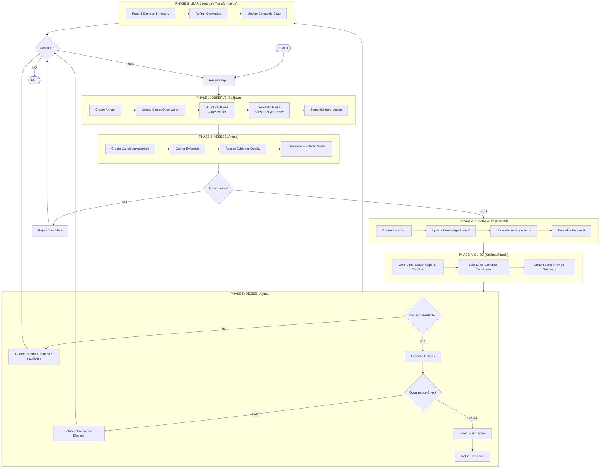
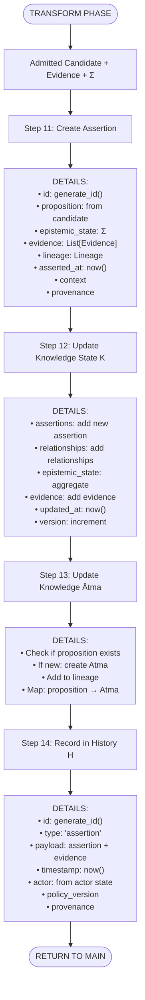
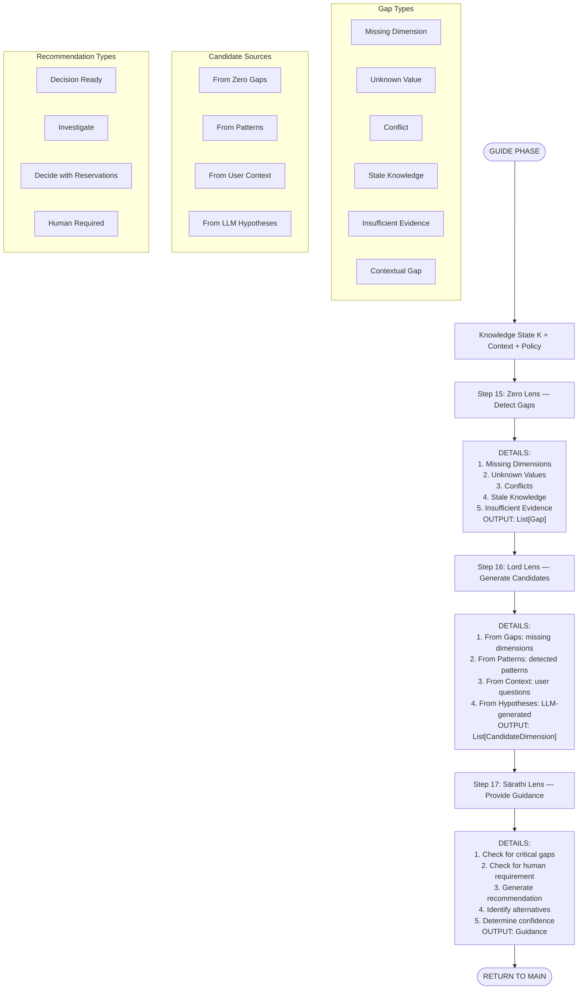
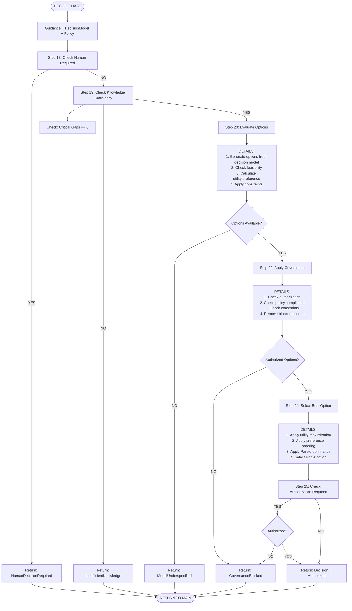
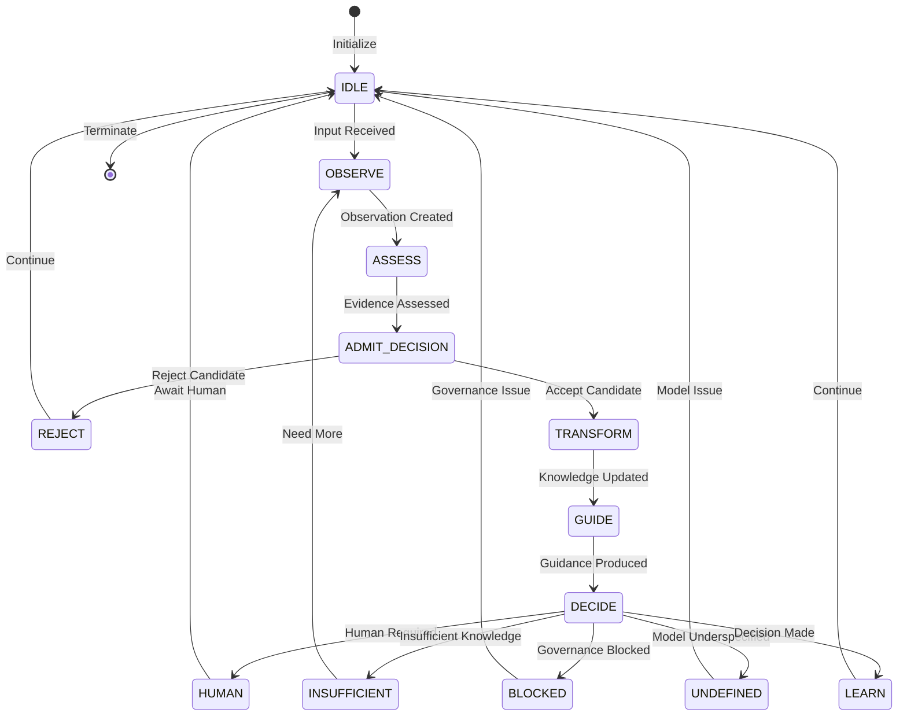
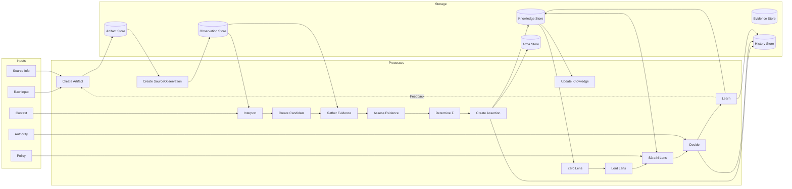
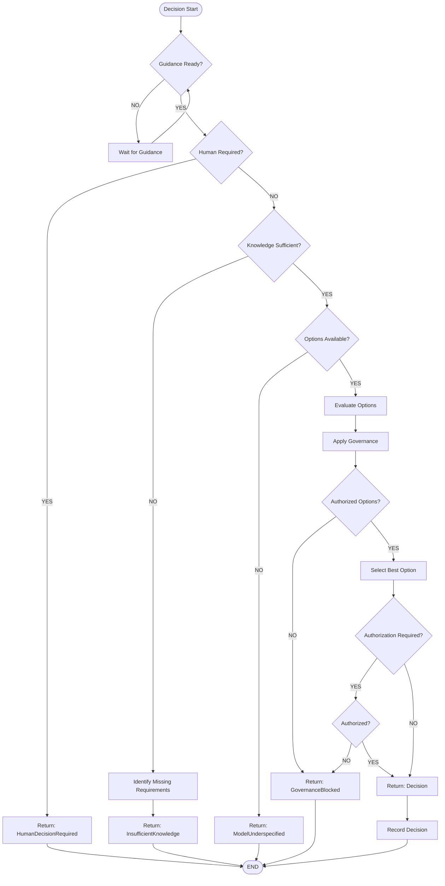
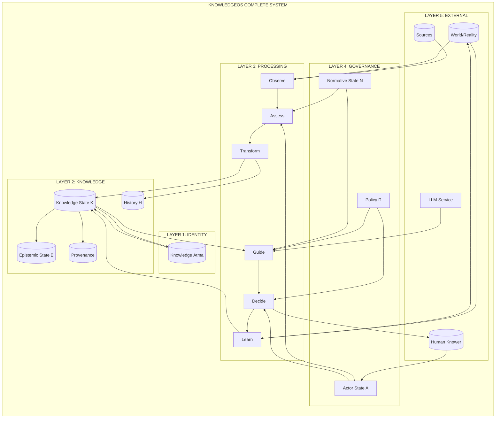

# KNOWLEDGEOS — COMPLETE FLOWCHART

**Date:** 2026-08-31  
**Version:** 1.0  
**Purpose:** Visual representation of the complete KnowledgeOS pseudo-algorithm

---

## Part 1: High-Level Flowchart (Main Pipeline)



---

## Part 2: Detailed Observation Phase (Sañjaya)

```mermaid
flowchart TD
    START_OBSERVE([OBSERVE PHASE]) --> INPUT[Raw Input]
    
    INPUT --> STEP1[Step 1: Create Artifact]
    STEP1 --> DETAIL1["DETAILS:<br/>• id: generate_id()<br/>• source: from source_info<br/>• content: raw input<br/>• content_type: text/json/etc<br/>• acquired_at: now()<br/>• method: file/sql/llm/etc<br/>• context: from source_info<br/>• provenance: actor, source, time"]
    
    DETAIL1 --> STEP2[Step 2: Create SourceObservation]
    STEP2 --> DETAIL2["DETAILS:<br/>• id: generate_id()<br/>• artifact_id: from artifact<br/>• content: artifact.content<br/>• method: artifact.method<br/>• observed_at: now()<br/>• context: artifact.context<br/>• provenance: actor, source, time"]
    
    DETAIL2 --> STEP3[Step 3: Structural Parse (C-like)]
    STEP3 --> DETAIL3["DETAILS:<br/>• Tokenization<br/>• Grammar rules<br/>• Syntax tree<br/>• Dependencies"]
    
    DETAIL3 --> STEP4[Step 4: Semantic Parse (Sanskrit-style)]
    STEP4 --> DETAIL4["DETAILS:<br/>• Entity recognition<br/>• Dimension discovery<br/>• Value extraction<br/>• Relationship detection<br/>• Ontology mapping<br/>• Context interpretation"]
    
    DETAIL4 --> STEP5[Step 5: SemanticInterpretation]
    STEP5 --> DETAIL5["OUTPUT:<br/>• id: generate_id()<br/>• source_observation_id<br/>• entities: List[Entity]<br/>• dimensions: List[Dimension]<br/>• values: Dict[Dimension, Value]<br/>• relationships: List[Relationship]<br/>• confidence: 0.0-1.0<br/>• interpretation_method<br/>• interpreted_at: now()<br/>• context<br/>• alternatives: List[Interpretation]<br/>• provenance"]
    
    DETAIL5 --> END_OBSERVE([RETURN TO MAIN])
```

---

## Part 3: Detailed Assessment Phase (Arjuna)

```mermaid
flowchart TD
    START_ASSESS([ASSESS PHASE]) --> INPUT[SemanticInterpretation]
    
    INPUT --> STEP6[Step 6: Create Proposition]
    STEP6 --> DETAIL6["DETAILS:<br/>• id: generate_id()<br/>• entity: from interpretation<br/>• dimension: from interpretation<br/>• value: from interpretation<br/>• context: from interpretation<br/>• truth_condition: description"]
    
    DETAIL6 --> STEP7[Step 7: Create CandidateAssertion]
    STEP7 --> DETAIL7["DETAILS:<br/>• id: generate_id()<br/>• proposition: from Step 6<br/>• semantic_interpretation_id<br/>• status: 'pending'<br/>• created_at: now()<br/>• context<br/>• provenance"]
    
    DETAIL7 --> STEP8[Step 8: Gather Evidence]
    STEP8 --> DETAIL8["DETAILS:<br/>• id: generate_id()<br/>• proposition_id<br/>• source_observation_id<br/>• relation_type: supports/contradicts/qualifies<br/>• quality: EvidenceQuality<br/>• temporal_validity<br/>• provenance"]
    
    DETAIL8 --> STEP9[Step 9: Assess Evidence Quality]
    STEP9 --> DETAIL9["DETAILS:<br/>• reliability: from source type<br/>• relevance: keyword matching<br/>• currency: age check<br/>• independence: dependency graph<br/>• completeness: based on evidence"]
    
    DETAIL9 --> STEP10[Step 10: Determine Epistemic State Σ]
    STEP10 --> DETAIL10["DETAILS:<br/>• acquisition: observed/reported/inferred/etc<br/>• support: none/weak/moderate/strong/very_strong<br/>• resolution: open/in_progress/resolved<br/>• validity: current/stale/expired/unknown<br/>• conflict: none/potential/active/resolved"]
    
    DETAIL10 --> DECISION{Should Admit?}
    DECISION -->|NO| REJECT[Reject Candidate]
    DECISION -->|YES| END_ASSESS([RETURN TO MAIN])
    
    REJECT --> END_ASSESS
```



---

## Part 4: Detailed Transformation Phase (Krishna)



---

## Part 5: Detailed Guidance Phase (Zero → Lord → Sārathi)



---

## Part 6: Detailed Decision Phase (Arjuna)



---

## Part 7: Detailed Learning Phase (Arjuna's Transformation)

```mermaid
flowchart TD
    START_LEARN([LEARN PHASE]) --> INPUT[DecisionResult + Knowledge State]
    
    INPUT --> STEP27[Step 27: Record Decision in History]
    STEP27 --> DETAIL27["DETAILS:<br/>• id: generate_id()<br/>• type: 'decision'<br/>• payload: decision_result<br/>• timestamp: now()<br/>• actor: from actor state<br/>• policy_version<br/>• provenance"]
    
    DETAIL27 --> STEP28{Decision Executed?}
    STEP28 -->|NO| END_LEARN([RETURN TO MAIN])
    
    STEP28 -->|YES| STEP29[Step 29: Record Outcome in History]
    STEP29 --> DETAIL29["DETAILS:<br/>• id: generate_id()<br/>• type: 'outcome'<br/>• payload: outcome_data<br/>• timestamp: now()<br/>• actor: from actor state<br/>• policy_version<br/>• provenance"]
    
    DETAIL29 --> STEP30[Step 30: Update Epistemic State]
    STEP30 --> DETAIL30["DETAILS:<br/>• resolution: 'resolved'<br/>• support: update based on outcome<br/>• validity: update based on time<br/>• conflict: update based on new evidence"]
    
    DETAIL30 --> STEP31[Step 31: Refine Knowledge]
    STEP31 --> DETAIL31["DETAILS:<br/>• Update assertions<br/>• Update relationships<br/>• Update Evidence links<br/>• Update Atma lineage<br/>• Version: increment"]
    
    DETAIL31 --> STEP32[Step 32: Record Learning in History]
    STEP32 --> DETAIL32["DETAILS:<br/>• id: generate_id()<br/>• type: 'refinement'<br/>• payload: knowledge_state_diff<br/>• timestamp: now()<br/>• actor: from actor state<br/>• policy_version<br/>• provenance"]
    
    DETAIL32 --> END_LEARN([RETURN TO MAIN])
```



---

## Part 8: Complete State Machine



---

## Part 9: Data Flow Diagram



---

## Part 10: Phase Timing Diagram

```mermaid
gantt
    title KnowledgeOS Processing Timeline
    dateFormat  ss.SS
    axisFormat %S.%L
    
    section PHASE 1: Observe
    Create Artifact           :a1, 00.00, 0.5s
    SourceObservation        :a2, after a1, 0.5s
    Structural Parse         :a3, after a2, 0.5s
    Semantic Parse           :a4, after a3, 1.0s
    
    section PHASE 2: Assess
    Create Candidate         :b1, after a4, 0.5s
    Gather Evidence          :b2, after b1, 0.5s
    Assess Quality           :b3, after b2, 0.5s
    Determine Σ              :b4, after b3, 0.5s
    
    section PHASE 3: Transform
    Create Assertion         :c1, after b4, 0.5s
    Update Knowledge         :c2, after c1, 0.5s
    Update Atma              :c3, after c2, 0.5s
    Record History           :c4, after c3, 0.5s
    
    section PHASE 4: Guide
    Zero Lens                :d1, after c4, 1.0s
    Lord Lens                :d2, after d1, 1.0s
    Sārathi Lens             :d3, after d2, 1.0s
    
    section PHASE 5: Decide
    Evaluate Options         :e1, after d3, 0.5s
    Apply Governance         :e2, after e1, 0.5s
    Select Best              :e3, after e2, 0.5s
    
    section PHASE 6: Learn
    Record Decision          :f1, after e3, 0.5s
    Refine Knowledge         :f2, after f1, 0.5s
    Update Σ                 :f3, after f2, 0.5s
```

---

## Part 11: Decision Flowchart (Detailed)



---

## Part 12: The Complete Flowchart Legend

```mermaid
flowchart LR
    subgraph LEGEND["Legend"]
        direction LR
        R1[Process Step] --> R2([Start/End])
        R3{Decision} --> R4[/Input/Output/]
        R5[[Sub-Process]] --> R6[((Database/Storage))]
        R7 -.->|Feedback| R8
    end
```

---

## Part 13: Summary of All Phases

| Phase | Gītā Parallel | Main Component | Output |
|:---|:---|:---|:---|
| **1. Observe** | Sañjaya | Artifact → SourceObservation → Interpretation | SemanticInterpretation |
| **2. Assess** | Arjuna | CandidateAssertion → Evidence → Σ | CandidateAssertion + Evidence + Σ |
| **3. Transform** | Krishna | Assertion → K → Atma → H | Updated Knowledge State |
| **4. Guide** | Krishna/Sārathi | Zero → Lord → Sārathi | Guidance |
| **5. Decide** | Arjuna | DecisionModel → Governance → Selection | DecisionResult |
| **6. Learn** | Arjuna's Transformation | Record → Refine → Update | Refined Knowledge State |

---

## Part 14: The Complete System



---

**END OF FLOWCHART**