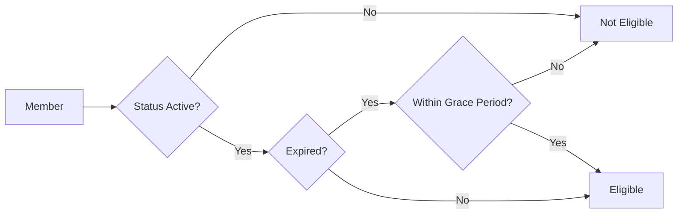

# 📘 **Membership Management System - User Guide**

## **Complete User Guide for Administrators & Members**

---

## 📑 **Table of Contents**

1. [System Overview](#system-overview)
2. [For Organisation Owners/Admins](#for-organisation-ownersadmins)
   - [Managing Membership Types](#1-managing-membership-types)
   - [Reviewing Applications](#2-reviewing-applications)
   - [Managing Member Fees](#3-managing-member-fees)
   - [Processing Renewals](#4-processing-renewals)
   - [Ending Memberships](#5-ending-memberships)
3. [For Members](#for-members)
   - [Applying for Membership](#1-applying-for-membership)
   - [Checking Application Status](#2-checking-application-status)
   - [Self-Renewal](#3-self-renewal)
   - [Viewing Fees](#4-viewing-fees)
4. [For Election Officers](#for-election-officers)
   - [Voter Eligibility](#voter-eligibility)
5. [Email Notifications](#email-notifications)
6. [Troubleshooting](#troubleshooting)
7. [Glossary](#glossary)

---

## 🎯 **System Overview**

The Membership Management System allows organisations to:
- **Define membership tiers** with different fees and durations
- **Accept membership applications** from users
- **Track membership fees** and record payments
- **Manage renewals** (admin or self-service)
- **Control election eligibility** based on membership status

### **User Roles & Permissions**

| Role | Permissions |
|------|-------------|
| **Owner** | Full access: manage types, approve applications, record payments, renew members |
| **Admin** | Approve applications, record payments, renew members (cannot manage types) |
| **Commission** | View applications only (cannot approve/reject) |
| **Member** | Apply, self-renew, view own fees |
| **Voter** | No membership management access |

---

## 👑 **For Organisation Owners/Admins**

### **1. Managing Membership Types**

**Purpose:** Define what membership options are available (e.g., Annual, Lifetime, Student).

#### **Step 1: Navigate to Membership Types**
```
Dashboard → Organisation Admin → Membership Types
```
Or directly: `/organisations/{slug}/membership-types`

#### **Step 2: Create a New Membership Type**

Click **"Create New Type"** and fill in:

| Field | Description | Example |
|-------|-------------|---------|
| **Name** | Display name | "Annual Member" |
| **Slug** | URL-friendly identifier | "annual" |
| **Description** | Optional details | "Standard annual membership" |
| **Fee Amount** | Cost in currency | 50.00 |
| **Fee Currency** | 3-letter currency code | EUR |
| **Duration (months)** | Membership length (leave empty for lifetime) | 12 |
| **Requires Approval** | Whether applications need admin review | ✓ |
| **Active** | Whether this type is available for new applications | ✓ |
| **Sort Order** | Display order in forms | 1 |

**Important:** 
- Slugs must be unique within your organisation
- Duration cannot be changed once members have this type
- Deactivating a type doesn't affect existing members

#### **Step 3: Edit or Delete Types**

- **Edit:** Click the ✏️ icon next to any type
- **Delete:** Click the 🗑️ icon (only possible if no applications/fees exist)

---

### **2. Reviewing Applications**

**Purpose:** Approve or reject membership applications from users.

#### **Step 1: Access Applications List**
```
Dashboard → Organisation Admin → Membership Applications
```
Or directly: `/organisations/{slug}/membership/applications`

#### **Step 2: Review Application Details**

Click on any application to see:
- **Applicant Information:** Name, email, submission date
- **Selected Membership Type:** Name, fee, duration
- **Application Data:** Custom fields from the application form
- **Current Status:** Pending, Approved, or Rejected

#### **Step 3: Approve an Application**

1. Click **"Approve"** button
2. System will automatically:
   - Create organisation user record
   - Create member record with expiry date
   - Generate pending membership fee
   - Send approval email to applicant
   - Mark application as "approved"

**What happens next:**
- User becomes an official member
- User can access organisation features
- User receives a pending fee notification

#### **Step 4: Reject an Application**

1. Click **"Reject"** button
2. Enter **rejection reason** (required)
3. Click **"Confirm Rejection"**

**Result:**
- Application status becomes "rejected"
- Applicant receives email with reason
- No membership is created

---

### **3. Managing Member Fees**

**Purpose:** Record payments and manage fee statuses.

#### **Step 1: Access Member Fees**
```
Dashboard → Members → Select Member → View Fees
```
Or directly: `/organisations/{slug}/members/{member}/fees`

#### **Step 2: Understand Fee Statuses**

| Status | Meaning | Next Action |
|--------|---------|-------------|
| **Pending** | Fee not yet paid | Record payment or waive |
| **Paid** | Payment recorded | No action needed |
| **Overdue** | Past due date | Record payment or waive |
| **Waived** | Fee waived by admin | No action needed |

#### **Step 3: Record a Payment**

1. Find the pending fee
2. Click **"Record Payment"**
3. Fill in:
   - **Payment Method:** Cash, Bank Transfer, Credit Card
   - **Reference:** Optional transaction ID
4. Click **"Confirm Payment"**

**Result:**
- Fee status changes to "Paid"
- Paid timestamp recorded
- Payment recorded by admin name saved

#### **Step 4: Waive a Fee**

1. Find the pending fee
2. Click **"Waive"** button
3. Confirm the action

**When to waive:**
- Complimentary memberships
- Administrative corrections
- Scholarship cases

---

### **4. Processing Renewals**

**Purpose:** Extend membership expiry dates.

#### **Admin-Initiated Renewal**

**When to use:** Member cannot self-renew (past 90-day window) or admin needs to override

**Steps:**
1. Go to Member profile → **"Renew Membership"**
2. Select new membership type (optional)
3. Click **"Renew"**

**Result:**
- New expiry date calculated (extends from current expiry or today)
- New pending fee created
- Renewal record added to audit trail
- Member receives confirmation email

#### **Self-Renewal (Member-Initiated)**

Members can renew themselves within **90 days after expiry** (configurable)

**See [Self-Renewal](#3-self-renewal) section below**

---

### **5. Ending Memberships**

**Purpose:** Terminate a membership before expiry (resignation, non-payment, etc.)

**Steps:**
1. Go to Member profile
2. Click **"End Membership"**
3. Enter reason (e.g., "Resignation", "Non-payment")
4. Confirm

**What happens automatically:**
- Member status changes to "ended"
- All pending fees are waived
- Member removed from all active elections
- End timestamp and reason recorded

**Note:** This action cannot be undone. To reinstate, a new application is required.

---

## 👤 **For Members**

### **1. Applying for Membership**

**Prerequisites:** You must be logged in (registered user)

#### **Step 1: Find the Application Page**
```
Organisation Page → "Apply for Membership" button
```
Or directly: `/organisations/{slug}/membership/apply`

#### **Step 2: Select Membership Type**

Review available options:

| Type | Fee | Duration | Features |
|------|-----|----------|----------|
| Annual | €50 | 12 months | Full voting rights |
| Lifetime | €500 | Lifetime | All benefits permanently |
| Student | €20 | 12 months | Reduced fee with verification |

#### **Step 3: Fill Application Form (if applicable)**

Some membership types may require additional information:
- Full name (if different from account)
- Address
- Date of birth
- Professional credentials

#### **Step 4: Submit Application**

Click **"Submit Application"**

**What happens:**
- Application enters "pending" status
- Organisation admin receives notification
- You receive confirmation email

#### **Step 5: Wait for Approval**

**Typical timeline:** 2-5 business days

**Status updates:**
- **Submitted:** Under review
- **Under Review:** Admin is examining
- **Approved:** Welcome to the organisation!
- **Rejected:** Check email for reason

---

### **2. Checking Application Status**

#### **Method 1: Dashboard**
```
My Dashboard → My Applications
```

#### **Method 2: Email Notifications**

You'll receive emails for:
- Application submitted (confirmation)
- Application approved (welcome + next steps)
- Application rejected (with reason)

#### **Status Meanings**

| Status | What It Means | What You Can Do |
|--------|---------------|-----------------|
| Draft | Not yet submitted | Complete and submit |
| Submitted | Awaiting review | Wait for admin action |
| Under Review | Admin is reviewing | Wait (24-48 hours) |
| Approved | Welcome aboard! | Access member features |
| Rejected | Not approved | Read reason, reapply if eligible |

---

### **3. Self-Renewal**

**Eligibility:**
- Membership status is "active"
- Not a lifetime member
- Expiry date within last 90 days (configurable)

#### **Step 1: Check Renewal Eligibility**

Go to your member profile → Look for **"Renew Membership"** button

**If you see:** You're eligible to renew
**If you don't see:** You're outside the renewal window (contact admin)

#### **Step 2: Initiate Renewal**

1. Click **"Renew Membership"**
2. Select membership type (usually same or upgraded)
3. Click **"Confirm Renewal"**

#### **Step 3: Pay Renewal Fee**

After renewal:
- New pending fee created
- You'll receive payment instructions
- Membership expiry extended

**Example timeline:**
```
Original expiry: 2025-01-01
Renew on: 2024-12-15 (before expiry)
New expiry: 2026-01-01 (+12 months)
```

---

### **4. Viewing Fees**

#### **Access Your Fee History**
```
Member Dashboard → My Fees
```

**Information shown:**
- Fee amount and currency
- Due date
- Payment status (Pending/Paid/Overdue/Waived)
- Payment method (if paid)

#### **What to Do About Unpaid Fees**

| Status | Action |
|--------|--------|
| **Pending** | Wait for admin to send payment instructions or contact them |
| **Overdue** | Contact organisation admin immediately |
| **Paid** | No action needed |
| **Waived** | No payment required |

**Note:** You cannot pay fees directly in the system (manual admin recording). Contact your organisation's treasurer.

---

## 🗳️ **For Election Officers**

### **Voter Eligibility**

The system automatically determines voter eligibility based on:

1. **Member Status:** Must be "active"
2. **Membership Expiry:** Must not be expired (or within grace period)
3. **Election Membership:** Explicitly added to election voter list

#### **How Eligibility Works**



#### **Managing Election Voters**

As election officer, you can:
1. Add members to election voter list
2. Remove ineligible voters
3. View voter eligibility status

**Note:** When a membership ends, the member is automatically removed from all active elections.

---

## 📧 **Email Notifications**

### **Automatic Emails**

| Event | Recipient | Email Content |
|-------|-----------|---------------|
| Application Submitted | Applicant | Confirmation + expected timeline |
| Application Approved | Applicant | Welcome message + next steps |
| Application Rejected | Applicant | Reason + how to reapply |
| Payment Recorded | Member | Receipt confirmation |
| Renewal Confirmed | Member | New expiry date + fee info |
| Expiry Reminder | Member | 30/14/7 days before expiry |

### **Email Settings**

Admins can configure notification channels in `config/membership.php`:

```php
'notifications' => [
    'application_submitted' => ['mail', 'database'],
    'application_approved'  => ['mail'],
    'application_rejected'  => ['mail'],
    'renewal_reminder'      => ['mail'],
    'payment_confirmation'  => ['mail'],
],
```

---

## 🔧 **Troubleshooting**

### **Common Issues & Solutions**

#### **Issue 1: "You are already an active member"**

**Cause:** You're trying to apply while already a member

**Solution:** 
- Check your member status in dashboard
- If expired, request renewal from admin
- If active, you cannot submit another application

#### **Issue 2: "You already have a pending application"**

**Cause:** Previous application still under review

**Solution:**
- Wait for admin decision (check status in dashboard)
- Contact admin if pending for >14 days

#### **Issue 3: "The selected membership type is not available"**

**Cause:** Type was deactivated or deleted

**Solution:**
- Refresh the page
- Contact admin if type should be available
- Select a different type

#### **Issue 4: Cannot renew (self-renewal not allowed)**

**Possible causes:**
- More than 90 days past expiry
- Lifetime membership (never expires)
- Account status not "active"

**Solutions:**
- Contact admin for manual renewal
- Check your membership expiry date
- Verify account status

#### **Issue 5: Payment recorded but status still pending**

**Cause:** Admin hasn't marked payment as received

**Solution:**
- Allow 2-3 business days for processing
- Contact treasurer with proof of payment
- Check if payment method was correct

---

## 📖 **Glossary**

| Term | Definition |
|------|------------|
| **Application** | User's request to become a member |
| **Approval** | Admin's acceptance of application |
| **Duration** | Length of membership (in months, or lifetime) |
| **Expiry Date** | Date when membership benefits end |
| **Fee** | Payment required for membership period |
| **Grace Period** | Days after expiry when members can still vote (configurable) |
| **Lifetime Membership** | Never expires, no renewal needed |
| **Overdue Fee** | Past due date without payment |
| **Pending Fee** | Created but not yet paid |
| **Rejection** | Admin's denial of application (with reason) |
| **Renewal** | Extending membership beyond expiry |
| **Self-Renewal** | Member-initiated renewal (within 90 days after expiry) |
| **Slug** | URL-friendly identifier for membership types |
| **Waived Fee** | Admin-cancelled fee (no payment required) |

---

## 🆘 **Getting Help**

### **For Members**
1. Check your dashboard for status updates
2. Read email notifications carefully
3. Contact organisation admin via email
4. Review FAQ section in your organisation's portal

### **For Admins**
1. Review system logs: `storage/logs/laravel.log`
2. Run diagnostic commands:
   ```bash
   php artisan membership:check-expiry  # Check expired members
   php artisan membership:sync-status   # Sync member statuses
   ```
3. Check scheduled jobs: `php artisan schedule:list`
4. Verify queue workers: `php artisan queue:work`

### **Support Resources**
- **Technical Documentation:** `/docs/membership-system.md`
- **API Documentation:** `/api/docs` (if enabled)
- **Admin Manual:** Internal wiki (organisation-specific)

---

## ✅ **Quick Reference Cards**

### **For Admins: Daily Tasks**

| Task | When | Where |
|------|------|-------|
| Review new applications | Daily | Applications list |
| Record payments | As received | Member fees section |
| Process renewals | As requested | Member profile |
| Check overdue fees | Weekly | Fees report |
| Run expiry job | Daily (automated) | Scheduled job |

### **For Members: Quick Actions**

| Action | Link (example) |
|--------|----------------|
| Apply | `/organisations/{slug}/membership/apply` |
| Check status | Dashboard → My Applications |
| Renew | Member profile → Renew button |
| View fees | Dashboard → My Fees |

---

**🎉 Congratulations! You're now ready to use the Membership Management System.**

*Last Updated: April 2026*  
*Version: 1.0.0*