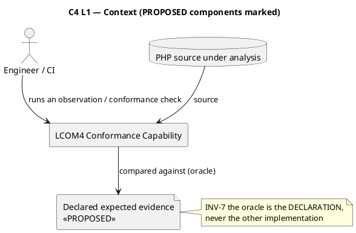

# `KOS-CONTRACT-NEUTRALITY-001` — **Implementation Architecture: D / B3 / C-as-completion**

**Status: 🟡 PROPOSAL ONLY. It adopts nothing, authorizes nothing, and does not self-accept.**
**Assignment:** `S4-architecture-impl-arch-d-b3` (seq 29 REGISTER · 30 HANDOFF · 31 START) · **Grant:** `G-KOS-CONTRACT-IMPL-ARCH`
**Date:** 2026-08-18 · **Role:** Architecture (design) · **Next actor:** PO/ARB — accept or return

> **Producing process, self-declared and NOT attestable** (`INV-ATTR-2`/`G-2`): `claude-code-session:1c8b041b`.
> 🔴 **Disclosed prior position, at the point of use:** this process authored the parsing-architecture evaluation (`d2859e91`) whose recommendation — **D**, with **B** for the language layer and **C-as-completion** — the PO/ARB has now selected. **It is designing the realization of its own recommendation.** `R-34` is not breached (designing is neither verifying nor accepting), but the anchoring risk is real. **Mitigation, and it is checkable: §17.2 states where the selected shape is COSTLY or AWKWARD rather than only where it works, and §16 returns four architectural issues rather than smoothing them.** Not the Python implementer (`fbc084f0`), not the breadth verifier (`5e1dd9ee`), not the completion auditor (`b260fb38`). **`R-34`/`P-2` binds forward: this process must not verify or accept this design.**

**Legend used throughout — ✅ `DECIDED` (in force, not re-opened) · 🟡 `PROPOSED` (this document's design) · ⬜ `OPEN` (returned to the PO/ARB).**

---

# 1 · Executive summary

**This design turns the decided contract into a realizable structure by making one property structural rather than aspirational:**

> ## ⭐ **The cohesion layer is given no PHP syntax to fall back to.**
> **`L4` consumes a CLOSED VOCABULARY of enumerated facts. Raw source text exists only in a separate diagnostic envelope that `L4` is structurally not handed.** A cohesion rule therefore *cannot* inspect a name, a token, or a spelling — not by convention, but because the value is not in its input type. **§14 `INV-4` makes this an invariant and §12 layer C makes it a test.**

**Four design commitments carry the decided rules:**

**① Two orthogonal facts per call site, never one.** `QualifierKind` (*how the target was spelled*) and `TargetUnitRelation` (*whether it denotes the analysed unit*) are separate. **13.3's stratified rule is exactly a table over these two** — and separating them is what lets `aliased` be excluded *by kind* while `fully-qualified` is included *by relation*.

**② `NotTheAnalysedUnit` and `NotDeterminable` are distinct values in a closed enum.** The bucket ruling — *"the qualified case is determinable and must not be classified as 'not determinable'"* — becomes **structurally unsayable to violate**, not a rule someone must remember.

**③ The binding emits every declaration; `L4` decides eligibility.** Interfaces are **seen and excluded**, never unseen. ⚠️ **Otherwise a lexer that drops interfaces is indistinguishable from correct exclusion** — `O-2`'s lesson applied to unit eligibility.

**④ Declared expected evidence is the oracle; differential comparison is a diagnostic.** 13.5's nullsafe ruling forces this: both implementations share the blindness, so agreement proves nothing. **§12 demotes differential comparison everywhere, not only for nullsafe.**

**Measured consequences for both implementations — the grant required these be stated, not assumed. All `Observed` (§11):**

| | Change required |
|---|---|
| **PHP** | scans `Stmt\Class_`, which **misses `Enum_` and `Trait_` entirely** (measured: 1 each, found only via `ClassLike`) · **`$this?->b()` yields `MethodCall` count = 0** — nullsafe is invisible · `(anonymous)` **collides within one file** · `Name::toString()` **erases qualifier kind** |
| **Python** | the `blank_noise`/`CLASS_RE`/`METHOD_RE` layer is **superseded, not repaired** |

> ⇒ **PHP changes more than the record has so far assumed. Decision 1 stands: the reference is not authoritative, and this design does not treat it as a baseline.**

---

# 2 · Architectural principles

| | Principle | Source |
|---|---|---|
| **P-1** | **The neutrality boundary is `L3 → L5`.** Extraction is a *language binding*, below the claim | ✅ 13.1 |
| **P-2** | **Meaning precedes representation.** Every `L3` element exists because a decided rule ranges over it | ✅ selection §2 |
| **P-3** | **The binding REPORTS; the contract INTERPRETS.** The binding never decides an edge | ✅ 13.3 |
| **P-4** | **Distinctions the contract insists on are distinct TYPES**, not conventions | ✅ 13.3 bucket ruling |
| **P-5** | **Evidence is declared, not derived from agreement** | ✅ 13.5 nullsafe · 13.7 |
| **P-6** | **Shared extraction is not shared semantics.** The shared artifact carries no contract content | ✅ 13.1 · `G-KOS-CONTRACT-EXP-AMD1` |
| **P-7** | **Consume before creating** — the existing fixtures, pinned decisions and `_future_layout` are extended, not replaced | `ES-005.4` |

---

# 3 · Context and boundary model

```
            ┌──────────────────────────────────────────────────────────┐
  PHP src → │  L0/L1  BYTES → TOKENS      grammar-exact (B3)           │  binding
            │  L2     DECLARATIONS & BODIES                            │  (below the
            └──────────────────────────────────────────────────────────┘   boundary)
                                    │  emits
            ══════════════════════ L3 FACT MODEL ══════════════════════   ◄── CONFORMANCE BOUNDARY
                                    │  consumed by
            ┌──────────────────────────────────────────────────────────┐
            │  L4  COHESION SEMANTICS   unit eligibility · edge rules   │  the contract
            │  L5  METRIC               connected components → LCOM4    │  (language-neutral)
            └──────────────────────────────────────────────────────────┘
                                    │
                              CONFORMANCE EVIDENCE   node set + edge set + metric
```

**What crosses the boundary upward:** only closed-vocabulary facts. **What never crosses upward:** tokens, offsets, spellings, PHP type names. **What never crosses downward:** cohesion verdicts, exclusions, the notion of an "edge".

---

# 4 · `L3` fact model 🟡 PROPOSED

> ⚠️ **This is a domain model with invariants and a ubiquitous language — deliberately NOT a technical DTO.** Its terms are the vocabulary in which the contract is written; if a term here is not needed by a decided rule, it does not belong.

## 4.1 The vocabulary

| Term | Meaning (ubiquitous language) | Owns |
|---|---|---|
| **`AnalysisScope`** | the extent within which identity must be unique — **one source unit** (a file), per the pinned *analyzed in isolation* limitation | identity uniqueness |
| **`DeclaredUnit`** | a declaration the binding found | `UnitKind` · `UnitIdentity` · `DeclaredName` |
| **`UnitKind`** | closed: `Class` · `AnonymousClass` · `Enum` · `Trait` · `Interface` | what 13.5 rules eligibility over |
| **`UnitIdentity`** | a designation **stable and unique within the `AnalysisScope`** | 13.5's anonymous-class requirement |
| **`MethodDeclaration`** | a method declared in a unit's own body | `MethodIdentity` · `hasBody` |
| **`MethodIdentity`** | the method's name **in the source language's full identifier charset** | discharges `NEW-9` |
| **`StateAccess`** | a touch of the analysed instance's state | `PropertyName` · `AccessMode` |
| **`BehaviourReference`** | one site where a unit's method refers to a behaviour | the six attributes below |

## 4.2 `BehaviourReference` — six attributes, all mandatory

| Attribute | Closed values | Which decided rule needs it |
|---|---|---|
| **`TargetMethodName`** | identifier | every edge rule |
| ⭐ **`QualifierKind`** | `SelfKeyword` · `StaticKeyword` · `ParentKeyword` · `UnqualifiedName` · `QualifiedName` · `FullyQualifiedName` · `RelativeName` · `AliasedName` · `InstanceReceiver` · `ComputedTarget` | **13.3 — the rule is a table over this** |
| ⭐ **`TargetUnitRelation`** | `DenotesAnalysedUnit` · `DenotesOtherUnit` · `Undetermined` | 13.3 — *include* means *include when it denotes this unit* |
| **`ReferenceMode`** | `Invocation` · `CallableReference` | `first_class_callables` · 13.5 `G-4` |
| **`AccessMode`** | `Direct` · `Nullsafe` | **13.5 — nullsafe is an edge** |
| ⭐ **`Determinability`** | `Determinable` · `NotDeterminable` | **13.3's bucket ruling** |

> ### ⭐ Why `QualifierKind` and `TargetUnitRelation` must be SEPARATE
> **`aliased` is excluded by KIND even when it denotes the analysed unit.** **`fully-qualified` is included by RELATION only when it does.** **A single fused "is own class?" boolean cannot express both**, and fusing them is precisely how the reference lost the distinction (`Name::toString()`). *Two facts, because the ruling has two axes.*

## 4.3 Invariants — the part that makes this a model rather than a DTO

| | Invariant | Enforced by |
|---|---|---|
| **`INV-L3-1`** | **Closed vocabulary.** Every decisional attribute is a closed enum or an identity. **No free text is a decision input** | the `Fact`/`Provenance` split (§4.4) |
| **`INV-L3-2`** | **Identity stability.** Identical source ⇒ identical `UnitIdentity`; distinct declarations in one scope ⇒ distinct identities | §4.5 |
| **`INV-L3-3`** | **Kind completeness.** **Every declaration is emitted, including interfaces.** Eligibility is never applied here | §5.4 |
| **`INV-L3-4`** | **Determinability separation.** `NotDeterminable` is used **only** where the target cannot be determined from the scope. A determined target that is another unit is `Determinable` + `DenotesOtherUnit` | distinct enum values |
| **`INV-L3-5`** | **Totality.** A `BehaviourReference` carries all six attributes. There is no "unknown" and no default | constructor totality |
| **`INV-L3-6`** | **No verdicts.** `L3` contains no edge, no exclusion, no metric | §14 `INV-2` |
| **`INV-L3-7`** | **Provenance is non-decisional** | §4.4 |

## 4.4 🟡 The `Fact` / `Provenance` split — how "no fallback to PHP syntax" becomes structural

**Two records, joined by an opaque id:**

```
Fact        { factId, …closed-vocabulary attributes only… }        → handed to L4
Provenance  { factId, sourceOffset, rawText, tokenIndex, … }       → NEVER handed to L4
```

**`L4`'s input type is a collection of `Fact`.** ⇒ **a cohesion rule cannot read a spelling because the value is not reachable from its input.** Provenance still exists — for diagnostics, evidence review and defect reports — but it is **structurally out of the decision path**, not merely discouraged.

> **This is the design's answer to the standing constraint that the cohesion layer must not silently fall back to PHP syntax.** ✅ **Testable: §12 layer C runs `L4` against synthetic facts with no provenance at all. If any rule needs it, that layer fails to compile or to run.**

## 4.5 🟡 `UnitIdentity` for anonymous classes — the hardest requirement

**Requirement (✅ 13.5): stable and unique within the analysed scope.** *Measured problem: PHP emits `(anonymous)` and it collides — probe `N5` produced two rows with the same designation.*

**Proposed: a declaration path** — the chain of enclosing declared units plus a 1-based ordinal among anonymous declarations of the same enclosing unit, in source order:

```
Factory                 a named unit
Factory / anon#1        the first anonymous class declared inside it
Factory / anon#1 / anon#1   nested (probe N5)
```

**Properties:** deterministic · unique within scope (`INV-L3-2`) · independent of formatting and of byte offsets · human-readable in evidence files. **Cost, stated: it is coupled to source ORDER, so reordering two anonymous declarations renames both.** ⬜ **Alternative — a declaration-site coordinate (line/column) — is stable under reordering and unstable under formatting. `OQ-1` returns the choice.**

---

# 5 · `B3` PHP extraction architecture 🟡 PROPOSED

> ⛔ **The extractor produces `L3` facts and contains NO `L4`/`L5` decision.** It never asks whether something is an edge.

## 5.1 The pipeline

```
PHP source
   │  T1  TOKENIZE      the language's own lexer — grammar-exact by construction
   ▼
Token stream  (kind, text, position)      ← the ONLY shared artifact
   │  T2  DECLARE       recognize units and their bodies
   │  T3  MEMBER        recognize methods declared in each unit's own body
   │  T4  OBSERVE       recognize state accesses and behaviour references in each body
   │  T5  CLASSIFY      assign QualifierKind, TargetUnitRelation, Determinability
   ▼
L3 facts + provenance
```

## 5.2 The construct table — every measured defect answered at `T1`

*All rows `Observed`: the token stream was probed against each construct and resolved every one; in all nine probes the count of genuine declaration keywords was exactly 1.*

| Construct | Token-level handling | Closes |
|---|---|---|
| **Attributes** `#[Attr]` | `T_ATTRIBUTE` — **a distinct kind, never a comment** | `K3` · `NEW-2` · `NEW-3` |
| **Heredoc / nowdoc** | delimited by `T_START_HEREDOC` … `T_END_HEREDOC` | `K1` · `K2` · `NEW-4` |
| **Interpolation** | `T_CURLY_OPEN` + `T_VARIABLE` + `T_OBJECT_OPERATOR` (complex) and `T_VARIABLE`+`T_OBJECT_OPERATOR`+`T_STRING` (simple) — **interpolated code is real code and yields real facts** | `NEW-6` |
| **PHP-mode boundaries** | `T_INLINE_HTML`, `T_HALT_COMPILER` — non-code regions are not scanned | `NEW-7` |
| **Identifiers** | `T_STRING` carries the language's full identifier charset | `NEW-9` |
| **`$class` as a variable** | `T_VARIABLE`, never a declaration keyword | `NEW-8` |
| **`new class implements X`** | `T_NEW` precedes the class keyword ⇒ anonymous declaration, **no name captured from a keyword** | `NEW-1` |
| **Name kinds** | `T_STRING` · `T_NAME_QUALIFIED` · `T_NAME_FULLY_QUALIFIED` · `T_NAME_RELATIVE` — **four distinct token kinds** | ⭐ `NEW-5` / `NEW-5b` |

> ### ⭐ **The language's lexer already distinguishes the four name kinds that 13.3 rules over.** `QualifierKind` is therefore *read*, not *inferred* — which is the whole reason `NEW-5` is closable at all.

## 5.3 🟡 `T5` classification — the binding's one hard task

**`QualifierKind`** is read from the token kind (plus `self`/`static`/`parent` keyword recognition and the `use … as` alias map).
**`TargetUnitRelation`** requires **file-local** name resolution only — the `namespace` declaration and the file's `use` map:

| Spelling in `namespace App; class Fq` | `QualifierKind` | `TargetUnitRelation` |
|---|---|---|
| `Fq::b()` | `UnqualifiedName` | `DenotesAnalysedUnit` |
| `\App\Fq::b()` | `FullyQualifiedName` | `DenotesAnalysedUnit` |
| `\Vendor\Fq::b()` | `FullyQualifiedName` | `DenotesOtherUnit` |
| `namespace\Fq::b()` | `RelativeName` | `DenotesAnalysedUnit` |
| `Sub\Fq::b()` | `QualifiedName` | `DenotesOtherUnit` |
| `Ali::b()` after `use App\Fq as Ali` | `AliasedName` | `DenotesAnalysedUnit` |
| `$c::b()` | `ComputedTarget` | `Undetermined` (+ `NotDeterminable`) |

⚠️ **Awkwardness, stated rather than hidden:** for `AliasedName` the binding must resolve the alias far enough to know it *is* an alias, and the contract then discards the resolution (`EXCLUDE` — a stated LIMITATION). **The work is done and thrown away.** That is a real cost of the decided rule and it is recorded, not designed around.

## 5.4 🟡 The shared-token boundary — and its one strict rule

**The token stream is the only artifact both implementations share.** Transport is a token dump emitted by the language's own lexer.

> ⛔ **`INV-5`: the token dump carries `(kind, text, position)` and NOTHING ELSE.** No declarations, no resolved names, no facts, no eligibility, no verdicts. **A dump that contained a resolved name would move `T5` below the shared boundary and make the two implementations agree by construction — which is exactly the circularity `13.1` was drawn to prevent.**

⬜ **`OQ-4` returns the transport and its operational consequence** — a PHP process becomes a runtime dependency of the Python implementation. **Legitimate under `13.1` (below the boundary), and a real CI/packaging cost.**

---

# 6 · `L4` cohesion architecture 🟡 PROPOSED · language-neutral

## 6.1 Unit eligibility (✅ 13.5)

```
UnitKind          eligible as an analysed unit?
────────────────  ───────────────────────────────
Class             YES
AnonymousClass    YES   (requires UnitIdentity — 4.5)
Enum              YES
Trait             YES
Interface         NO    ← seen and excluded, never unseen
```

## 6.2 ⭐ The edge rule table — 13.3, executable

**Evaluated in order; the first matching row decides. `verdict = INCLUDE` only where the target is also a method declared in this unit (§6.3).**

| # | `ReferenceMode` | `QualifierKind` | `TargetUnitRelation` | Verdict | `ExclusionReason` |
|---|---|---|---|---|---|
| 1 | `CallableReference` | *any* | *any* | **EXCLUDE** | `CallableNotInvocation` |
| 2 | *any* | `ComputedTarget` | `Undetermined` | **EXCLUDE** | `NotDeterminable` |
| 3 | *any* | `ParentKeyword` | *any* | **EXCLUDE** | `OutOfFrame` |
| 4 | `Invocation` | `AliasedName` | *any* | **EXCLUDE** | `AliasedSpelling` ⚠️ **LIMITATION** |
| 5 | `Invocation` | `SelfKeyword` · `StaticKeyword` | — | **INCLUDE** | — |
| 6 | `Invocation` | `InstanceReceiver` (`$this->` / `$this?->`) | — | **INCLUDE** | — |
| 7 | `Invocation` | `UnqualifiedName` · `FullyQualifiedName` · `RelativeName` | `DenotesAnalysedUnit` | **INCLUDE** | — |
| 8 | `Invocation` | `UnqualifiedName` · `FullyQualifiedName` · `RelativeName` | `DenotesOtherUnit` | **EXCLUDE** | `NotTheAnalysedUnit` |
| 9 | `Invocation` | `QualifiedName` | *any* | **EXCLUDE** | `NotTheAnalysedUnit` |

> ### ⭐ Rows 2, 8 and 9 are the bucket ruling, made structural
> **Row 9's reason is `NotTheAnalysedUnit` — never `NotDeterminable`.** They are different values of a closed enum, they appear separately in evidence, and **`INV-3` forbids merging them.** *The distinction the contract "insists must never be merged" is now impossible to merge without changing the enum.*

**`AccessMode` is deliberately absent from the table.** ✅ 13.5 rules nullsafe an edge, so `Direct` and `Nullsafe` behave identically **here**. It is carried because **the ruling must be assertable in evidence** (§8.3) — not because it branches.

## 6.3 Node and edge construction

**Nodes** = the eligible unit's `MethodDeclaration`s, excluding `__construct`/`__destruct` (pinned). **Bodyless declarations are nodes** (existing behaviour, both sides agree).
**Edges** — two kinds, kept distinguishable in evidence:
* **state edge**: two nodes share a `StateAccess.PropertyName`;
* **behaviour edge**: an `INCLUDE`d `BehaviourReference` whose `TargetMethodName` is a node of this unit. *(Where it is not, the reference is retained in evidence with `TargetNotDeclaredHere` — visible, not silently dropped.)*

---

# 7 · `L5` metric architecture 🟡 PROPOSED

**Unchanged in substance — ⛔ no new metric is invented.** LCOM4 = connected components over the node set under the union of state and behaviour edges (Hitz & Montazeri, per `_variant`). Union-find; `0` nodes ⇒ value `0`. Interpretation strings unchanged.

**`L5` consumes only `(node set, edge set)`.** It sees no qualifier, no unit kind, no source. ⇒ **it is trivially language-neutral and is the least interesting layer — which is the point: the difficulty was never in the metric.**

---

# 8 · Conformance evidence architecture 🟡 PROPOSED (✅ 13.7)

## 8.1 The pipeline

```
source ─► binding ─► L3 facts ─► L4 ─► node set + edge set ─► L5 ─► metric
                        │                    │                        │
                        ▼                    ▼                        ▼
                  UNIT SET             EDGE SET               FINAL METRIC
                        └──────── compared, element-wise, against ────────┘
                                    DECLARED EXPECTED EVIDENCE
```

## 8.2 Three assertion layers, per fixture

1. **Unit set** — every declaration with `UnitKind`, `UnitIdentity`, and eligibility. **Interfaces appear, marked ineligible.**
2. **Edge set** — per unit: the node set, and each edge with its kind; each excluded reference with its `ExclusionReason`.
3. **Final metric** — per eligible unit.

## 8.3 ⭐ How compensating errors become detectable

**The measured case (`O-2`, probe `C3`): PHP node set `{a, über, c}`, Python `{a, c}` — a lost node AND a lost edge, cancelling to the same metric.** Under element-wise **node-set** comparison the loss fails at layer 2 **before** the metric is consulted. **Cancellation cannot survive a set comparison; it only survives a scalar one.**

**And for nullsafe (✅ 13.5's explicit requirement):** both implementations currently miss `?->`, so **differential comparison can never surface it.** The fixture therefore **declares** the expected edge, and each implementation is compared **to the declaration** — never to the other.

> ## ⛔ `INV-7`: **the declared expected evidence is the oracle. Implementation agreement is a diagnostic and is never a conformance result.**

---

# 9 · Specification / binding / fixture / implementation structure 🟡 PROPOSED

**Consumes the layout `expected.json` recorded for itself on 2026-08-04** — *"specification/ + fixtures/ + implementations/{php,python,…} — the specification becomes the source of truth"*. ⛔ **Described only; nothing is moved by this document.**

```
scripts/observations/lcom4/
  specification/        ← language-NEUTRAL, the contract
      fact-model.md         L3 vocabulary + INV-L3-1..7
      cohesion-rules.md     unit eligibility + the §6.2 table + node/edge construction
      metric.md             LCOM4 definition and interpretations
      conformance.md        the three assertion layers; the oracle rule (INV-7)
  bindings/
      php.md                ← language-SPECIFIC: the §5.2 construct table,
                              the §5.3 classification rules, the token-dump schema,
                              and the C-as-completion PRECONDITIONS a binding must meet
  fixtures/                 ← the ten existing files, plus additions
  expected/
      <fixture>.evidence.json   ← unit set + edge set + metric  (supersedes bare integers)
  implementations/
      php/  python/
```

⚠️ **`expected.json`'s current form — ten fixture→integer rows — becomes one of three assertion layers, not the whole expectation.** ⛔ **Migrating it is a separate governed act (§13, `OQ-3`).**

---

# 10 · Existing collector migration 🟡 PROPOSED · ⛔ neither collector is modified here

## 10.1 `Lcom4Collector.php` (180 lines)

| Current responsibility | Disposition |
|---|---|
| `nikic/php-parser` AST | 🟡 **retained as an alternative binding front-end** — an AST is a legitimate `T1`–`T4`; **it must additionally satisfy `T5`** |
| `findInstanceOf(Stmt\Class_)` | 🔴 **REPLACED by `ClassLike`** — measured: `Class_` finds 2 of 5 declarations; `Enum_`, `Trait_`, `Interface_` are separate node types |
| `PropertyFetch` / `MethodCall` scanning | 🔴 **EXTENDED** — measured: `$this?->b()` yields `MethodCall` = **0**; `NullsafeMethodCall` / `NullsafePropertyFetch` must be handled |
| `namesThisClass()` (`:113–125`) | 🔴 **OBSOLETE.** It fuses the two axes and, via `toString()`, erases the kind. Replaced by `T5` emitting `QualifierKind` + `TargetUnitRelation` |
| `'(anonymous)'` literal (`:96`) | 🔴 **OBSOLETE** — collides within one file; replaced by `UnitIdentity` |
| `isFirstClassCallable()` | ✅ **MOVES to `T5`** as `ReferenceMode` |
| `connectedComponents()` (`:142–178`) | ✅ **MOVES UP to `L5` unchanged** — already pure over `(nodes, edges)` |
| constructor exclusion, interpretation strings | ✅ **MOVE UP to `L4`/`L5`** |

## 10.2 `lcom4_collector.py` (279 lines)

| Current responsibility | Disposition |
|---|---|
| `blank_noise` (`:59–99`) | 🔴 **OBSOLETE** — a hand-written lexer; superseded by `T1` |
| `CLASS_RE` / `METHOD_RE` / `find_methods` depth arithmetic | 🔴 **OBSOLETE** — superseded by `T2`/`T3` over tokens |
| `PROP_OR_CALL_RE` / `STATIC_CALL_RE` (`:155–157`) | 🔴 **OBSOLETE** — superseded by `T4`/`T5` |
| `OUT_OF_FRAME` / `SELF_REFERENTIAL` sets | ✅ **MOVE UP to `L4`** as rows 3 and 5 |
| `connected_components` (`:201–231`) | ✅ **MOVES UP to `L5` unchanged** |
| `interpretation()` | ✅ **MOVES UP to `L5`** |

> ⭐ **Both collectors keep their metric layer and lose their parsing layer.** **The Python file's genuinely independent contribution — the union-find and the exclusion semantics — survives; the scanner does not.** ✅ **That is the experiment's finding realized as structure: the cohesion model transferred, the language substrate did not.**

---

# 11 · Consequences for BOTH implementations (`Observed`)

> **The grant required this be stated, not assumed. Decision 1 stands: the PHP reference is not authoritative and is not the baseline.**

| Decided rule | PHP today | Python today | Who changes |
|---|---|---|---|
| **fully-qualified INCLUDE** | ⚠️ **incoherent** — includes `\Fq`, refuses `\App\Fq`; correctness is an accident of namespace declaration | ⛔ never includes | **BOTH** |
| **relative INCLUDE** | ⚠️ includes, but by prefix-erasure rather than by rule | ⛔ never includes | **BOTH** |
| **qualified unaliased EXCLUDE** (`NotTheAnalysedUnit`) | ✅ excludes — **for the wrong reason**, and the reason is not represented | ✅ excludes, reason not represented | **BOTH** (the *reason* must become a fact) |
| **aliased EXCLUDE (LIMITATION)** | ✅ excludes | ✅ excludes | neither, but must be *stated* |
| **nullsafe `?->` = edge** | 🔴 **misses** — `MethodCall` = 0 for `$this?->b()` | 🔴 misses | **BOTH** |
| **anonymous class = unit, stable identity** | ⚠️ emits `(anonymous)`, **collides** | 🔴 omits or fabricates a keyword name | **BOTH** |
| **enum = unit** | 🔴 **misses** — `Enum_` is a separate node type | 🔴 misses | **BOTH** |
| **trait = unit** | 🔴 **misses** — `Trait_` is a separate node type | 🔴 misses | **BOTH** |
| **interface NOT a unit** | ✅ excluded — but **unseen**, not seen-and-excluded | ✅ unseen | **BOTH** |

> ### 🔴 **Nine decided rules; PHP requires change on eight and Python on nine.** **"Repair Python" was never the shape of this work**, and the design must not be read as a Python migration.

---

# 12 · Test architecture 🟡 PROPOSED — five layers

| | Layer | Proves | ⛔ Does NOT prove |
|---|---|---|---|
| **A** | **Extraction** — source → token handling per §5.2 | the binding sees the construct correctly | nothing about cohesion |
| **B** | **Fact model** — source → `L3`, asserted against declared facts | qualifier kind, identity, determinability and access mode are **preserved** | nothing about edges |
| **C** | **Cohesion semantics** — the §6.2 table over **synthetic facts, with no provenance and no source at all** | the rules are correct **and language-neutral** | nothing about PHP |
| **D** | **Metric** — `(nodes, edges)` → LCOM4 over synthetic graphs | connected-components arithmetic | nothing about extraction |
| **E** | **Conformance** — fixtures → the three assertion layers vs **declared expected evidence** | **an implementation conforms to the contract** | ⛔ **nothing about the other implementation** |

> ### ⭐ **Layer C is the enforcement of the design's central property.** It is executed **without any PHP input**. **If a cohesion rule ever needs a spelling, a token or an offset, layer C cannot be written** — the failure is structural and immediate, not a review finding.

## 12.1 ⛔ The prohibition, stated as a test-architecture rule

> **"Both implementations agree" is NOT a layer. It is a DIAGNOSTIC.**
> **A differential run may be executed to localize a defect, and its result is never a conformance verdict.** `G-2` (nullsafe) is the constructive proof: both agree while both violate a decided rule. **A pass at layer E for each implementation independently is what conformance means.**

---

# 13 · Migration strategy 🟡 PROPOSED · ⛔ not authorized, not begun

| Phase | Content | Gate |
|---|---|---|
| **M-0** | Write `specification/` and `bindings/php.md` (**C-as-completion**). ⛔ No code | acceptance of this design |
| **M-1** | Author declared expected evidence for the ten existing fixtures **at the current decided semantics**. ⚠️ **Enums, traits and anonymous classes will produce NEW rows, and `trait-user.php` gains an observation for the trait itself** — this is where the decided rules first touch pinned expectations | **separate governed act** |
| **M-2** | Build the binding + `L4`/`L5` behind the existing entry point; **dual-run** old and new, recording every divergence as evidence rather than a defect list | separate authorization |
| **M-3** | Layer E green for **both** implementations independently against declared evidence | independent verification |
| **M-4** | Remove the old scanner | see criteria |

**Removal criteria for the old scanner — all four:** layer E green for both implementations · every dual-run divergence explained and attributed to a decided rule (**not merely reconciled**) · the declared evidence covers all nine rules of §11 including nullsafe · independent verification by a process that is neither implementer nor this designer.

⚠️ **Compatibility note:** during M-2 two collectors coexist and **will disagree by design** — the new one implements decided rules the old one predates. **Divergence during dual-run is expected and must not be read as regression**; that expectation must be written into M-2's authorization or the first run will be misread.

---

# 14 · Architectural invariants

| | Invariant | Enforced by |
|---|---|---|
| **`INV-1`** | **`L4`/`L5` never inspect source syntax** | §4.4 `Fact`/`Provenance` split · §12 layer C |
| **`INV-2`** | **The binding never decides cohesion** — no edge, exclusion or eligibility below `L3` | §5 pipeline · §6.1 |
| **`INV-3`** | **`L3` preserves `QualifierKind`; `NotTheAnalysedUnit` ≠ `NotDeterminable`** | closed enums · §6.2 rows 2/8/9 |
| **`INV-4`** | **The `L3` vocabulary is closed.** Adding a decisional attribute is a contract change | §4.3 `INV-L3-1` |
| **`INV-5`** | **Shared token extraction does not become shared contract semantics** — the dump carries `(kind, text, position)` only | §5.4 |
| **`INV-6`** | **The final metric is never the only conformance evidence** | §8.2 · ✅ 13.7 |
| **`INV-7`** | **Declared expected evidence is authoritative; agreement is a diagnostic** | §8.3 · §12.1 |
| **`INV-8`** | **Every declaration is emitted; eligibility is `L4`'s** — *seen-and-excluded* is distinguishable from *unseen* | §4.3 `INV-L3-3` · §8.2 |

---

# 15 · C4 / PlantUML views

> ⛔ **Every component below is `PROPOSED`. Only `Lcom4Collector.php`, `lcom4_collector.py`, the fixtures and `expected.json` exist today.**

### 15.1 Context



### 15.2 Containers

```plantuml
@startuml
title C4 L2 — Containers
skinparam componentStyle rectangle
package "Binding (below the neutrality boundary)" #FFF3E0 {
  [Tokenizer  T1\n<<PROPOSED>>] as T1
  [Declaration & body reader  T2/T3\n<<PROPOSED>>] as T2
  [Fact classifier  T4/T5\n<<PROPOSED>>] as T5
}
package "Contract (language-neutral)" #E8F5E9 {
  [L4 Cohesion engine\n<<PROPOSED>>] as L4
  [L5 Metric\n<<PROPOSED>>] as L5
}
[L3 Fact model\n<<PROPOSED>>] as L3
[Conformance comparator\n<<PROPOSED>>] as CMP
file "expected/*.evidence.json\n<<PROPOSED>>" as EXP
T1 --> T2 --> T5 --> L3
L3 --> L4 : Fact only (no Provenance)
L4 --> L5 : nodes + edges
L4 --> CMP : unit set, edge set
L5 --> CMP : metric
EXP --> CMP
note right of L3 : ══ CONFORMANCE BOUNDARY (13.1) ══
@enduml
```

### 15.3 D / B3 component view

```plantuml
@startuml
title C4 L3 — D / B3 implementation architecture
skinparam componentStyle rectangle
[PHP source] as SRC
[token_get_all (language lexer)] as LEX
[Token dump  (kind,text,position) ONLY\n<<PROPOSED>>  INV-5] as DUMP
package "PHP implementation <<PROPOSED>>" {
  [PHP T2/T3/T5] as PT
  [PHP L4/L5] as PL
}
package "Python implementation <<PROPOSED>>" {
  [Py T2/T3/T5] as YT
  [Py L4/L5] as YL
}
SRC --> LEX --> DUMP
DUMP --> PT --> PL
DUMP --> YT --> YL
note bottom of DUMP
  SHARED: tokens only.
  NOT shared: declarations, resolved
  names, facts, eligibility, verdicts.
end note
@enduml
```

### 15.4 Fact model and conformance flow

```plantuml
@startuml
title L3 fact model + conformance flow
skinparam componentStyle rectangle
class DeclaredUnit {
  UnitKind kind
  UnitIdentity identity
  DeclaredName name
}
class MethodDeclaration { MethodIdentity id \n bool hasBody }
class StateAccess { PropertyName name \n AccessMode mode }
class BehaviourReference {
  TargetMethodName target
  QualifierKind qualifier
  TargetUnitRelation relation
  ReferenceMode mode
  AccessMode access
  Determinability determinability
}
class Provenance { factId \n offset \n rawText }
DeclaredUnit "1" o-- "*" MethodDeclaration
MethodDeclaration "1" o-- "*" StateAccess
MethodDeclaration "1" o-- "*" BehaviourReference
BehaviourReference .. Provenance : factId only\nNEVER handed to L4
note bottom of Provenance : INV-1 / INV-L3-7\nnon-decisional
@enduml
```

---

# 16 · Open questions ⬜ returned to the PO/ARB

| | Question | Why Architecture does not close it |
|---|---|---|
| **`OQ-1`** | **`UnitIdentity` scheme for anonymous classes** — declaration path (unstable under reordering) vs declaration-site coordinate (unstable under formatting)? | Both satisfy 13.5. **The choice trades which edit renames a unit**, and that is a contract-visible consequence, not a coding preference |
| **`OQ-2`** | **Is `AnalysisScope` = one file?** Identity must be unique *within the analysed scope*, and the scope has never been named | The pinned *analyzed in isolation* limitation implies the file, but implication is not a ruling |
| **`OQ-3`** | ⚠️ **`trait = analysed unit` vs the pinned `trait_methods` decision.** They are compatible in principle — *analyse the trait itself; do not resolve its methods into a using class* — but **`trait-user.php` will gain a second observation**, so a pinned expectation changes | 13.5 decided the rule; **nobody has decided that the fixtures change**, and the act said artifact consequences need a separate governed act |
| **`OQ-4`** | **Token-dump transport**, and acceptance of a **PHP process as a runtime dependency of the Python implementation** | Legitimate under 13.1, and an operational/CI commitment the PO/ARB should make knowingly |

⚠️ **`OQ-3` is the one that will surprise.** It is the first place a decided *semantic* forces a change to a *pinned expectation*, and the two have been kept rigorously apart until now.

---

# 17 · Implementation consequences

## 17.1 What becomes possible only after acceptance

Writing `specification/` and `bindings/php.md` · authoring declared expected evidence · building the binding · changing either collector · migrating `expected.json`. ⛔ **None is authorized by this document.**

## 17.2 ⚠️ Where the selected shape is COSTLY or AWKWARD — the anchoring mitigation

**Recorded because this process recommended the architecture it is now designing, and a design that only reports success is not evidence.**

1. **The Python implementation acquires a PHP runtime dependency.** `B2` would not have. Under `13.1` this is legitimate — extraction is below the boundary — but it is a genuine operational cost, and it means the Python side can never run standalone. **The neutrality claim survives; the deployment simplicity does not.**
2. **`AliasedName` requires resolution that is then discarded** (§5.3). The binding must build a `use` map to classify a spelling the contract then excludes. **Work done to reach a rule that ignores it.**
3. **`UnitIdentity` for anonymous classes is the weakest link.** Every scheme couples the identity of a unit to some accident of source layout. **13.5 requires stability; the language provides no stable designator.** `OQ-1` cannot be made cost-free.
4. **Expected-evidence files are an order of magnitude larger than ten integers**, and must be maintained by hand or generated — **and if generated by an implementation, the oracle quietly becomes that implementation.** `INV-7` forbids it; the maintenance burden is nonetheless real and is the most likely place this architecture erodes in practice.
5. **`AccessMode` is carried and never branched on** (§6.2). It is justified — the ruling must be assertable — but it is an attribute whose only consumer is the evidence layer, and a future reader will reasonably ask why it exists.

## 17.3 What does NOT change

The metric · the seven pinned decisions other than those 13.3/13.5 amended · the union-find · the interpretation strings · the ten fixtures' source.

---

# 18 · Recommended implementation sequence

```
S-0  PO/ARB accepts or returns THIS design + rules OQ-1..OQ-4         ← the gate
S-1  specification/ + bindings/php.md          (C-as-completion; no code)
S-2  declared expected evidence for the ten fixtures at decided semantics
       ⚠️ separate governed act — pinned expectations change (OQ-3)
S-3  binding (T1–T5) + L3, per implementation
S-4  L4 + L5 (metric layers migrate up from BOTH collectors)
S-5  test layers A–E; layer C runs with NO PHP input
S-6  dual-run; divergences recorded as evidence, not defects
S-7  independent verification — neither implementer nor this designer
S-8  removal of the old scanner on the four criteria (§13)
```

**Each step is a separate authorization. ⛔ This document authorizes none of them.**

---

**IMPLEMENTATION ARCHITECTURE DELIVERED · STOPPING.**
⛔ **No implementation · no code · no collector, contract, fixture or `expected.json` modified · no architecture re-selected · no decided rule re-opened · no verification · no acceptance · this lane does not complete itself (`G-1`).**
**Next actor: PO/ARB — accept or return this design, and rule `OQ-1`…`OQ-4`.**

**Traceability:** grant `G-KOS-CONTRACT-IMPL-ARCH` · assignment `S4-architecture-impl-arch-d-b3` (seq 29–31) · architecture-selection registration (D / B3 / C-as-completion; the ten fact-model requirements) · Decisions 13.1 · 13.3 (stratified qualifier rules + the bucket ruling) · 13.5 (four silences) · 13.7 · Decision 1 (PHP not authoritative) · Decision 2 · semantic clarification proposal + AMD1 (`N13`/`N13-c`) · parsing evaluation `d2859e91` (`L1`–`L5`, the twelve-divergence root-layer table) · breadth report `17e4f066` (`O-1`, `O-2`, the nine mechanisms) · `expected.json` `_future_layout` (2026-08-04) · measurements taken read-only in scratchpad for this design: nikic node-type coverage (`Class_` 2 of 5; `Enum_`/`Trait_`/`Interface_` separate; `MethodCall` = 0 for `$this?->b()`; `NullsafeMethodCall`/`NullsafePropertyFetch` present) and the token-kind probes of §5.2 — **not added to the repository** · `ES-005.4` · `R-34`/`P-2` · `G-1`.
