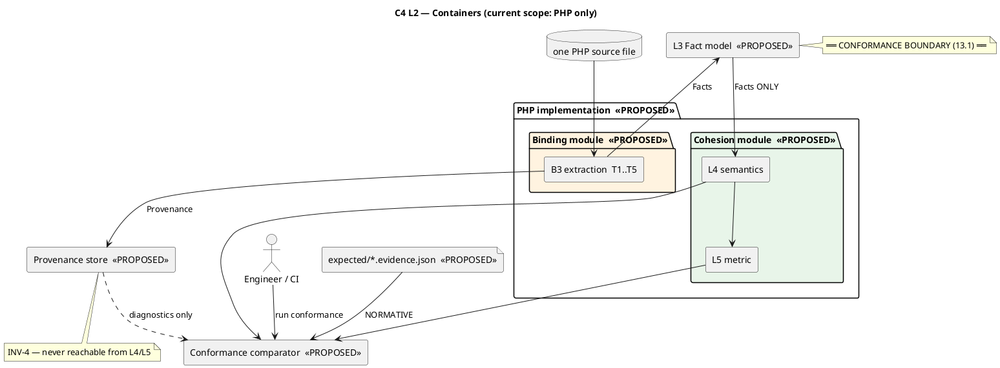

# `KOS-CONTRACT-NEUTRALITY-001` — **FINAL Implementation Architecture** · Architecture D / B3 / C-as-completion · **PHP binding**

**Status: 🟡 PROPOSAL. It adopts nothing, authorizes nothing, verifies nothing and does not self-accept.**
**Assignment:** `S4-architecture-impl-arch-d-b3` (seq 29 REGISTER · 30 HANDOFF · 31 START) · **Grants:** `G-KOS-CONTRACT-IMPL-ARCH` **+ AMD1 (language scope) + AMD2 (OQ-2/OQ-4/conformance) + AMD3 (finalization)**
**Date:** 2026-08-18 · **Next actor:** PO/ARB — accept or return

> **Producing process, self-declared, NOT attestable** (`INV-ATTR-2`/`G-2`): `claude-code-session:1c8b041b`.
> 🔴 **Prior position, disclosed at the point of use:** this process authored the parsing evaluation `d2859e91` whose D/B3/C recommendation was selected, and the first draft of this design. **It is designing its own recommendation.** `R-34` is not breached; the anchoring mitigation is delivered, not promised — **§18 `OPEN-1` records a violation of AMD1's own principle that this design cannot fix by itself**, and §19.2 records five costs. **`R-34`/`P-2`: this process must not verify or accept this design.**
> ⚠️ **This document REPLACES the 2026-08-18 first delivery at the same path.** The earlier version predates AMD1–AMD3; three of its four open questions are now settled by the record and its two-current-implementations premise is superseded.

**Classification used throughout: ✅ `DECIDED` · 🟡 `PROPOSED` · 🔵 `FUTURE` · ⬜ `OPEN`.**

---

# 1 · Executive summary

**The design realizes Architecture D for a single PHP binding, and it turns two properties from intentions into structure.**

> ## ⭐ **① The cohesion layer is given nothing PHP to read.**
> `L3` splits into **`Fact`** (closed-vocabulary semantic attributes — the only thing `L4` receives) and **`Provenance`** (offsets, raw text, token indices — **never handed to `L4`**). A cohesion rule cannot read a spelling, a token or an AST node **because those values are not reachable from its input type.** ✅ **Verified by the pre-delivery gate (§21): PASSES.**

> ## ⭐ **② Conformance is declared, not compared — because it can no longer be compared.**
> The founding method was differential: implement independently in Python, compare. **AMD1 removes that method** — one binding remains. **So `13.7` (node set + edge set + metric) and `13.5`'s declared-expected clause are no longer a supplement to differential testing; they ARE the conformance mechanism.** §9 specifies how expected facts, expected graph and expected metric are authored, stored and asserted.

## 1.1 🔴 Scope of claim — stated because AMD2 requires it and because it is easy to overstate

> ### **Current scope proves: THE PHP BINDING CONFORMS TO THE LANGUAGE-NEUTRAL MODEL.**
> ### ⛔ **It does NOT prove: THE MODEL IS NEUTRAL.**
> **Neutrality becomes demonstrable when a second binding produces the same `L3` facts.** Until then it is claimed **architecturally** — from the stratified boundary and the binding/model separation — **not empirically.** ⛔ **This design does not claim the stronger result, and no artifact it proposes should be quoted as evidence for it.**

## 1.2 The one finding that survives the amendments and must not be lost

**Measured, `Observed`:** `Stmt\Class_` finds **2 of 5** declarations — `Enum_`, `Trait_`, `Interface_` are separate node types, so the PHP reference **misses enums and traits entirely** · **`MethodCall` count is 0** for `$this?->b()`, so nullsafe is invisible · `(anonymous)` **collides within one file** · `Name::toString()` **erases qualifier kind**. ⇒ **Of the nine decided rules, the PHP implementation requires change on eight.** ✅ **Decision 1 stands: the reference is not authoritative and is not this design's baseline.**

---

# 2 · Fixed decisions ✅ DECIDED — inputs, not questions

| | Decision | Source |
|---|---|---|
| **1** | Contract-neutrality boundary is **`L3 → L5`** | 13.1 |
| **2** | **Architecture D** — stratified contract / fact-model boundary | selection act |
| **3** | Language layer **B3** — grammar-exact PHP lexer/token extraction | selection act |
| **4** | **C-as-completion** — binding preconditions, silences, declared expectations | selection act |
| **5** | **PHP is the sole current implementation language** | **AMD1** |
| **6** | **The analysed scope is ONE PHP SOURCE FILE** | **AMD2** (decides `OQ-2`) |
| **7** | **`OQ-4` disposed — not applicable to current scope; deferred** to a future binding's own work item | **AMD2** |
| **8** | **13.3** — qualifier kind preserved by the binding, interpreted by the contract, per the adopted stratified rules incl. the bucket ruling | 13.3 |
| **9** | **13.5** — anonymous class = unit (stable unique identity) · nullsafe `?->` = edge · enum = unit · trait = unit · **interface = NOT a unit** · FQ first-class callable excluded by existing rule | 13.5 |
| **10** | **13.7** — conformance evidence = node set + edge set + final LCOM4; **final-metric equality alone is insufficient** | 13.7 |
| **11** | **Declared specification / expected evidence is normative. Implementation agreement is DIAGNOSTIC ONLY.** | **AMD2** |
| **12** | 🔵 **FUTURE:** one authoritative language-neutral `L4`/`L5` engine; future bindings are separate governed work items | **AMD1/AMD2** |

> ## ⭐ **The principle this design must incorporate, verbatim (AMD1):**
> ### **"PHP is the first language binding, not the definition of the language-neutral cohesion model."**
> **Its test, also verbatim:** *"a design in which PHP's shape has silently become the model's shape violates it, even if nothing named PHP appears at `L4`/`L5`."* ⚠️ **This design applies that test to itself in §18 `OPEN-1` and does not pass it cleanly.**

**Also in force and not re-opened:** the seven pinned `_variant_decisions` except as amended by 13.3/13.5 · Decision 1 (PHP not authoritative) · Decision 2 · `O-1` · `O-2` · `N-2`.

---

# 3 · Architectural principles

| | Principle |
|---|---|
| **P-1** | **`L3` is the conformance boundary.** Extraction is a binding, below the claim |
| **P-2** | **The binding REPORTS; the contract INTERPRETS.** No cohesion decision below `L3` |
| **P-3** | **Meaning precedes representation.** Every `L3` element exists because a decided rule ranges over it |
| **P-4** | **Distinctions the contract insists on are distinct TYPES**, not conventions |
| **P-5** | **Declared expectation is the authority; agreement is a diagnostic** |
| **P-6** | **PHP is the first binding, not the model** *(AMD1, verbatim above)* |
| **P-7** | **Consume before creating** — the fixtures, pinned decisions and `_future_layout` are extended, not replaced (`ES-005.4`) |

---

# 4 · `L3` fact model 🟡 PROPOSED — the conformance boundary

> ⛔ **Not a generic DTO.** It carries ubiquitous language, ownership and invariants; an attribute that no decided rule ranges over does not belong.

## 4.1 Ubiquitous language and ownership

| Term | Meaning | Owned by | Consumed by |
|---|---|---|---|
| **`AnalysisScope`** | ✅ **one PHP source file** (fixed decision 6) — the extent within which identity must be unique | the binding | `L3` identity |
| **`DeclaredUnit`** | a type declaration the binding found | the binding | `L4` eligibility |
| **`UnitKind`** | closed: `Class` · `AnonymousClass` · `Enum` · `Trait` · `Interface` | the **contract** (13.5 rules over it) | `L4` |
| **`UnitIdentity`** | designation **stable and unique within the `AnalysisScope`** | the binding, per a contract-declared rule | `L4`, evidence |
| **`DeclaredName`** | the unit's own written name; **absent for `AnonymousClass`** | the binding | `L4` (target relation) |
| **`MethodDeclaration`** | a method declared in this unit's own body | the binding | `L4` node set |
| **`MethodIdentity`** | the method name in the **language's full identifier charset** | the binding | `L4` |
| **`StateAccess`** | a touch of the analysed instance's state: `PropertyName` + `AccessMode` | the binding | `L4` state edges |
| **`BehaviourReference`** | one site where a method refers to a behaviour — six attributes, §4.2 | the binding | `L4` behaviour edges |

## 4.2 `BehaviourReference` — six mandatory attributes

| Attribute | Closed values | Decided rule that needs it |
|---|---|---|
| `TargetMethodName` | identifier | every edge rule |
| ⭐ `QualifierKind` | `SelfKeyword` · `StaticKeyword` · `ParentKeyword` · `UnqualifiedName` · `QualifiedName` · `FullyQualifiedName` · `RelativeName` · `AliasedName` · `InstanceReceiver` · `ComputedTarget` | **13.3 — the rule is a table over this** ⚠️ see `OPEN-1` |
| ⭐ `TargetUnitRelation` | `DenotesAnalysedUnit` · `DenotesOtherUnit` · `Undetermined` | 13.3 — *include* means *include where it denotes this unit* |
| `ReferenceMode` | `Invocation` · `CallableReference` | `first_class_callables` · 13.5 |
| `AccessMode` | `Direct` · `Nullsafe` | **13.5 — nullsafe is an edge** |
| ⭐ `Determinability` | `Determinable` · `NotDeterminable` | **13.3's bucket ruling** |

> ### ⭐ Why `QualifierKind` and `TargetUnitRelation` are SEPARATE facts
> **`aliased` is excluded BY KIND even when it denotes the analysed unit; `fully-qualified` is included BY RELATION only when it does.** A single fused *"is own class?"* boolean cannot express both — **and fusing them is exactly how the reference lost the distinction** (`Name::toString()` erases the kind before any rule runs). **Two axes in the ruling ⇒ two facts.**

## 4.3 🟡 `UnitIdentity` — now selectable, because the scope has an extent

**AMD2 unblocked this by deciding the scope.** Requirement (13.5): stable and unique **within one PHP file**.

> ### 🟡 **PROPOSED rule — the declaration path:** the chain of enclosing declared units, each anonymous declaration numbered by its **1-based ordinal among the anonymous declarations of the same enclosing unit, in source order**.

```
Factory                      a named unit
Factory/anon#1               the first anonymous class declared inside it
Factory/anon#1/anon#1        nested (measured case: probe N5)
```

**Why this and not a declaration-site coordinate (line/column):** ✅ deterministic · ✅ unique within the file · ✅ **invariant under reformatting**, which a coordinate is not — and reformatting is the far more common edit. ⚠️ **Cost, stated: it is coupled to source ORDER — reordering two sibling anonymous declarations renames both.** ⬜ **Ratification is the PO/ARB's (`OQ-1`), because the choice decides which edit invalidates declared evidence — a contract-visible consequence, not a coding preference.**

## 4.4 Invariants

| | Invariant | Enforced by |
|---|---|---|
| `INV-L3-1` | **Closed vocabulary.** Every decisional attribute is a closed enum or an identity; **no free text is a decision input** | §5 split |
| `INV-L3-2` | **Identity stability.** Same source ⇒ same identity; distinct declarations in a scope ⇒ distinct identities | §4.3 |
| `INV-L3-3` | **Kind completeness.** Every declaration is emitted, **including interfaces**; eligibility is never applied here | §6.4 |
| `INV-L3-4` | **Determinability separation.** `NotDeterminable` **only** where the target cannot be determined within the scope | distinct enum values |
| `INV-L3-5` | **Totality.** All six `BehaviourReference` attributes are always present; no default, no "unknown" | constructor totality |
| `INV-L3-6` | **No verdicts.** `L3` contains no edge, no exclusion, no metric | §17 `INV-2` |
| `INV-L3-7` | **Provenance is non-decisional** | §5 |

---

# 5 · Provenance boundary 🟡 PROPOSED — **structural, not documentary**

**AMD3 makes this load-bearing: `L4`/`L5` must not be able to access raw source, spelling, parser objects, AST nodes or tokens.**

```
Fact        { factId, …closed-vocabulary attributes only… }          ──►  handed to L4
Provenance  { factId, byteOffset, line, rawLexeme, tokenIndex, … }   ──►  NEVER handed to L4
```

**Realization — three enforcing properties, all checkable:**

1. **Type-level.** `L4`'s entry point accepts a collection of `Fact`. `Provenance` is a **separate collection reachable only from the evidence/diagnostic path**. There is no navigation from `Fact` to `Provenance` — the join is one-way, by opaque `factId`, resolved *outside* `L4`.
2. **Dependency-level.** The `L4`/`L5` module declares **no dependency** on the binding module, on any tokenizer, or on any parser package. **A cycle or an added import is a build-visible violation**, not a review finding.
3. **Test-level.** **§12 layer C executes `L4` against synthetic facts constructed in-test, with no PHP source, no tokens and no provenance in the process at all.** If any rule needs them, that layer cannot be written.

> ⛔ **`INV-4`: provenance exists for diagnostics, traceability and evidence review — and is structurally outside the decision path.**

---

# 6 · `B3` PHP language binding 🟡 PROPOSED

> ⛔ **Extraction only. The binding never asks whether something is an edge, whether a unit is eligible, or what the metric is.**

## 6.1 Pipeline

```
one PHP source file  (AnalysisScope — fixed decision 6)
  │ T1 TOKENIZE   the language's own lexer — grammar-exact by construction
  │ T2 DECLARE    recognize DeclaredUnits and their body extents
  │ T3 MEMBER     recognize methods declared in each unit's own body
  │ T4 OBSERVE    recognize StateAccess and BehaviourReference sites in each body
  │ T5 CLASSIFY   assign QualifierKind, TargetUnitRelation, ReferenceMode,
  │               AccessMode, Determinability; assign UnitIdentity
  ▼
L3 Facts  +  Provenance (separate)
```

## 6.2 Construct table — every measured defect answered at `T1`

*All rows `Observed` against the token stream; in every probe the count of genuine declaration keywords was exactly 1.*

| Construct | Token-level handling | Closes |
|---|---|---|
| **Attributes** `#[Attr]` | `T_ATTRIBUTE` — a distinct kind, **never a comment** | `K3` `NEW-2` `NEW-3` |
| **Heredoc / nowdoc** | `T_START_HEREDOC` … `T_END_HEREDOC` delimit; body is not code | `K1` `K2` `NEW-4` |
| **Interpolation** | complex `T_CURLY_OPEN`+`T_VARIABLE`+`T_OBJECT_OPERATOR`; simple `T_VARIABLE`+`T_OBJECT_OPERATOR`+`T_STRING` — **interpolated code yields real facts** | `NEW-6` |
| **PHP-mode boundaries** | `T_INLINE_HTML`, `T_HALT_COMPILER` — non-code regions are never scanned | `NEW-7` |
| **Identifiers** | `T_STRING` carries the full identifier charset | `NEW-9` |
| **`$class` variable** | `T_VARIABLE`, never a declaration keyword | `NEW-8` |
| **Anonymous class** | `T_NEW` precedes the class keyword ⇒ anonymous declaration; **no name is captured from a keyword** | `NEW-1` |
| **`enum` / `trait` / `interface`** | `T_ENUM` · `T_TRAIT` · `T_INTERFACE` — **all emitted with their `UnitKind`** | 13.5 |
| **Nullsafe** | `T_NULLSAFE_OBJECT_OPERATOR` ⇒ `AccessMode::Nullsafe` | 13.5 |
| **Five name kinds** | `T_STRING` · `T_NAME_QUALIFIED` · `T_NAME_FULLY_QUALIFIED` · `T_NAME_RELATIVE` · alias map from `use … as` | ⭐ 13.3 |

> ### ⭐ **The language's own lexer already distinguishes the name kinds that 13.3 rules over.** `QualifierKind` is **read, not inferred** — which is why `NEW-5` is closable at all.

## 6.3 `T5` classification within one file

**`TargetUnitRelation` requires only file-local information** — the `namespace` declaration and the file's `use` map. ✅ **Consistent with fixed decision 6 and with the pinned *analyzed in isolation* limitation: no cross-file lookup, no autoloading, no repository-wide resolution.**

| Spelling inside `namespace App; class Fq` | `QualifierKind` | `TargetUnitRelation` |
|---|---|---|
| `Fq::b()` | `UnqualifiedName` | `DenotesAnalysedUnit` |
| `\App\Fq::b()` | `FullyQualifiedName` | `DenotesAnalysedUnit` |
| `\Vendor\Fq::b()` | `FullyQualifiedName` | `DenotesOtherUnit` |
| `namespace\Fq::b()` | `RelativeName` | `DenotesAnalysedUnit` |
| `Sub\Fq::b()` | `QualifiedName` | `DenotesOtherUnit` |
| `Ali::b()` after `use App\Fq as Ali` | `AliasedName` | `DenotesAnalysedUnit` |
| `$c::b()` | `ComputedTarget` | `Undetermined` (+ `NotDeterminable`) |
| `$this->b()` / `$this?->b()` | `InstanceReceiver` | `DenotesAnalysedUnit` |

⚠️ **Recorded awkwardness:** for `AliasedName` the binding must build the `use` map to know a spelling *is* an alias — and the contract then **discards** the resolution (`EXCLUDE`, a stated LIMITATION). **Work performed to reach a rule that ignores it.** A cost of the decided rule, not of this design.

## 6.4 Emission rule

> **`INV-8`: the binding emits EVERY declaration, including interfaces, with its `UnitKind`. Eligibility is `L4`'s.**
> ⛔ **Otherwise a binding that drops interfaces is indistinguishable from correct exclusion** — `O-2`'s lesson applied to unit eligibility. **Seen-and-excluded must be distinguishable from unseen in the evidence.**

---

# 7 · `L4` cohesion semantics 🟡 PROPOSED — language-neutral

## 7.1 Unit eligibility ✅ 13.5

```
Class · AnonymousClass · Enum · Trait   →  ELIGIBLE
Interface                               →  NOT ELIGIBLE   (seen, recorded, excluded)
```

## 7.2 ⭐ Edge rule table — 13.3, executable. First match decides.

| # | `ReferenceMode` | `QualifierKind` | `TargetUnitRelation` | Verdict | `ExclusionReason` |
|---|---|---|---|---|---|
| 1 | `CallableReference` | *any* | *any* | **EXCLUDE** | `CallableNotInvocation` |
| 2 | *any* | `ComputedTarget` | `Undetermined` | **EXCLUDE** | `NotDeterminable` |
| 3 | *any* | `ParentKeyword` | *any* | **EXCLUDE** | `OutOfFrame` |
| 4 | `Invocation` | `AliasedName` | *any* | **EXCLUDE** | `AliasedSpelling` ⚠️ **LIMITATION** |
| 5 | `Invocation` | `SelfKeyword` · `StaticKeyword` | — | **INCLUDE** | — |
| 6 | `Invocation` | `InstanceReceiver` | — | **INCLUDE** | — |
| 7 | `Invocation` | `UnqualifiedName` · `FullyQualifiedName` · `RelativeName` | `DenotesAnalysedUnit` | **INCLUDE** | — |
| 8 | `Invocation` | `UnqualifiedName` · `FullyQualifiedName` · `RelativeName` | `DenotesOtherUnit` | **EXCLUDE** | `NotTheAnalysedUnit` |
| 9 | `Invocation` | `QualifiedName` | *any* | **EXCLUDE** | `NotTheAnalysedUnit` |

> ### ⭐ Rows 2, 8, 9 ARE the bucket ruling
> **Row 9's reason is `NotTheAnalysedUnit`, never `NotDeterminable`.** Distinct values of a closed enum, reported separately in evidence, `INV-3` forbids merging. **The distinction the contract insists must never be merged is now impossible to merge without changing the enum.**

**`AccessMode` does not appear in the table.** ✅ 13.5 made nullsafe an edge, so `Direct` and `Nullsafe` behave identically **here**. It is carried because **the ruling must be assertable in evidence** (§9.3) — the only reason, and it is stated so a later reader does not delete it as dead.

**`Determinability`** is carried as an independent fact and cross-checked: **row 2 is the only path to `NotDeterminable`**, and any `Determinable` reference reaching that row is an internal contradiction the evidence must surface.

## 7.3 Node and edge construction

**Nodes** = the eligible unit's `MethodDeclaration`s minus `__construct`/`__destruct` (pinned). **Bodyless declarations are nodes** (existing agreed behaviour).
**Edges**, kept distinguishable in evidence:
* **state edge** — two nodes share a `StateAccess.PropertyName` *(both `AccessMode`s count — 13.5)*;
* **behaviour edge** — an `INCLUDE`d reference whose `TargetMethodName` is a node of this unit. Where it is not, the reference is retained with `TargetNotDeclaredHere` — **visible, never silently dropped.**

---

# 8 · `L5` LCOM4 🟡 PROPOSED — ⛔ no new metric

**Cohesion graph** = (node set, edge set) from `L4`. **LCOM4** = number of connected components under the union of state and behaviour edges (Hitz & Montazeri, per `_variant`). Union-find. **0 nodes ⇒ 0.** Interpretation strings unchanged.

**`L5` receives only `(nodes, edges)`** — no unit kind, no qualifier, no source, no provenance. ⇒ **trivially language-neutral, and deliberately the least interesting layer: the difficulty was never in the metric.**

---

# 9 · Conformance evidence 🟡 PROPOSED (✅ 13.7 · AMD2's three levels)

## 9.1 The normative model

```
source ─► binding ─► L3 facts ─► L4 ─► node set + edge set ─► L5 ─► metric
              │                            │                          │
        (1) L3 FACT              (2) L4 SEMANTIC              (3) L5 METRIC
        conformance                conformance                  conformance
              └──────── element-wise vs DECLARED EXPECTED EVIDENCE ────────┘
```

## 9.2 What is declared per fixture

**Level 1 — expected facts:** every `DeclaredUnit` (`UnitKind`, `UnitIdentity`, `DeclaredName`), its methods, and each unit's `StateAccess` and `BehaviourReference` facts with all six attributes. **Interfaces appear here**, with their kind.
**Level 2 — expected graph:** per eligible unit, the node set and the edge set with edge kinds; every excluded reference with its `ExclusionReason`; the eligibility verdict per unit.
**Level 3 — expected metric:** the LCOM4 value per eligible unit.

## 9.3 How declared evidence exposes each failure mode

| Failure mode | Measured instance | Exposed at |
|---|---|---|
| **Fabricated observation** | `NEW-7` ghost classes from inline HTML; `NEW-1`/`NEW-8` units named after keywords | **Level 1** — an extra `DeclaredUnit` |
| **Missing observation** | `NEW-3` class vanishes; enums/traits missed entirely | **Level 1** — a declared unit absent |
| **Wrong identity** | `(anonymous)` collides (probe `N5`) | **Level 1** — identity mismatch |
| **Wrong relationship** | `NEW-6` lost interpolation edges; `K1` fabricated heredoc edge | **Level 2** — edge-set mismatch |
| ⭐ **Compensating errors** | `O-2` probe `C3`: node set `{a,c}` vs `{a,über,c}` — a lost node **and** a lost edge cancelling to the same metric | **Level 2, before the metric is consulted.** **Cancellation survives a scalar comparison; it cannot survive a set comparison** |
| ⭐ **Shared blindness** | `G-2` nullsafe — both implementations miss `?->` | **Level 1 + 2 against the DECLARATION.** ⛔ **No comparison between implementations can ever surface this** |

## 9.4 The authority statement

> ## ⛔ **"Implementation agreement is diagnostic evidence, not the conformance authority."**
> **The normative authority is the declared contract plus expected evidence.** A differential run may be executed to *localize* a defect; **its result is never a conformance verdict.** ✅ **AMD1 makes this structural rather than stylistic: with one binding there is nothing to agree with.**

**Nullsafe specifically (13.5):** the expected evidence **declares** the nullsafe edge; the implementation is asserted against the declaration. ⛔ **Never against another implementation.**

---

# 10 · Specification / binding / fixtures / implementation structure 🟡 PROPOSED

**Consumes `expected.json`'s own `_future_layout` (recorded 2026-08-04).** ⛔ **Described only — nothing is moved, created or modified by this document.**

```
scripts/observations/lcom4/
  A · specification/          LANGUAGE-NEUTRAL — the contract
        fact-model.md             L3 vocabulary, ownership, INV-L3-1..7
        cohesion-rules.md         eligibility, the §7.2 table, node/edge construction
        metric.md                 LCOM4 definition and interpretations
        conformance.md            the three levels; the authority rule (INV-7)
  B · bindings/php.md         PHP-SPECIFIC — the §6.2 construct table, §6.3 classification,
                              the accepted LANGUAGE LEVEL, and the C-as-completion preconditions
  C · fixtures/               the ten existing files, plus additions
      expected/<fixture>.evidence.json    levels 1+2+3
  D · implementations/php/    the PHP binding + the L4/L5 engine, in separate modules (§5)
```

⚠️ **`expected.json`'s ten fixture→integer rows become ONE of three assertion levels, not the whole expectation.** ✅ **Migrating them is already routed: `G-KOS-CONTRACT-ARTIFACT-UPDATE` (AUTHORIZED, UNEXERCISED, no assignment created).** ⛔ **This design does not exercise it.**

---

# 11 · Existing collector migration 🟡 PROPOSED · ⛔ neither collector modified

## 11.1 `Lcom4Collector.php` — becomes the PHP binding + engine

| Current responsibility | Disposition |
|---|---|
| `nikic/php-parser` AST | 🟡 **retained as a legitimate `T1`–`T4` front end** — an AST satisfies grammar-exactness; **it must additionally satisfy `T5`** |
| `findInstanceOf(Stmt\Class_)` | 🔴 **REPLACED by `ClassLike`** — measured: finds **2 of 5**; `Enum_`/`Trait_`/`Interface_` are separate types |
| `PropertyFetch` / `MethodCall` scanning | 🔴 **EXTENDED** — measured: `MethodCall` = **0** for `$this?->b()`; `NullsafeMethodCall`/`NullsafePropertyFetch` required |
| `namesThisClass()` `:113–125` | 🔴 **OBSOLETE** — fuses the two axes and erases the kind via `toString()`. Replaced by `T5` emitting `QualifierKind` + `TargetUnitRelation` |
| `'(anonymous)'` literal `:96` | 🔴 **OBSOLETE** — collides; replaced by `UnitIdentity` (§4.3) |
| `isFirstClassCallable()` | ✅ **MOVES to `T5`** as `ReferenceMode` |
| `connectedComponents()` `:142–178` | ✅ **MOVES UP to `L5` unchanged** — already pure over `(nodes, edges)` |
| constructor exclusion · interpretation strings | ✅ **MOVE UP** to `L4` / `L5` |

## 11.2 `lcom4_collector.py` — ⛔ out of current implementation scope (AMD1)

**AMD1: out of current scope is NOT deletion; any disposition is a separate act.** Its analysis is recorded for the eventual disposition, not acted on.

| Current responsibility | Disposition |
|---|---|
| `blank_noise` `:59–99` · `CLASS_RE`/`METHOD_RE` · `find_methods` depth arithmetic · `PROP_OR_CALL_RE`/`STATIC_CALL_RE` | 🔴 **superseded in principle by `T1`–`T5`** — a hand-written lexer is what B3 replaces |
| `OUT_OF_FRAME` / `SELF_REFERENTIAL` sets | ✅ their **semantics** survive as rows 3 and 5 of §7.2 |
| `connected_components` · `interpretation()` | ✅ their **semantics** survive at `L5` |

> ⭐ **Both collectors keep their metric layer and lose their parsing layer.** **The experiment's finding realized as structure: the cohesion model transferred; the language substrate did not.**

## 11.3 🟡 Retirement criteria — **specifying is design; retiring is a separate Governance act**

**All five, for the old calculation path:**
1. §12 layers A–E green for the PHP implementation **against declared expected evidence**;
2. declared evidence covers **all nine decided rules**, nullsafe included;
3. every dual-run divergence **explained and attributed to a decided rule** — not merely reconciled;
4. the artifact-update step (`G-KOS-CONTRACT-ARTIFACT-UPDATE`) **exercised and accepted**;
5. **independent verification** by a process that is neither the implementer nor this designer.

⛔ **Meeting the criteria does not retire anything.** ⛔ **The Python collector's disposition is not decided here at all.**

---

# 12 · Test architecture 🟡 PROPOSED — five layers

| | Layer | Proves | ⛔ Does NOT prove |
|---|---|---|---|
| **A** | **Extraction** — source → token handling per §6.2 | the binding sees each construct correctly | nothing about cohesion |
| **B** | **Fact model** — source → `L3`, asserted against declared facts | qualifier kind, identity, access mode, determinability are **preserved** | nothing about edges |
| **C** | ⭐ **Cohesion semantics** — the §7.2 table over **synthetic facts built in-test; no PHP source, no tokens, no provenance in the process** | the rules are correct **and language-neutral** | nothing about PHP |
| **D** | **Metric** — `(nodes, edges)` → LCOM4 over synthetic graphs | connected-components arithmetic | nothing about extraction |
| **E** | **Declared conformance** — fixtures → the three levels vs declared evidence | ✅ **the binding conforms to the contract** | ⛔ **that the model is neutral** (§1.1) |

> ### ⭐ **Layer C is the enforcement of §5.** It runs with **no PHP input at all**. **If any cohesion rule ever needs a spelling, a token, an AST node or an offset, layer C cannot be written** — a structural, immediate failure.

> ## ⛔ **"PHP and the implementation agree" is NOT a layer and is NOT conformance authority (AMD3).**
> **`G-2` is the constructive proof: both implementations agree while both violate a decided rule.** A pass at layer E against the **declaration** is what conformance means.

---

# 13 · Migration / rollout 🟡 PROPOSED · ⛔ not authorized, not begun

| Phase | Content | Gate |
|---|---|---|
| **M-0** | Write `specification/` + `bindings/php.md` (**C-as-completion**). ⛔ no code | acceptance of this design + `OQ-1` |
| **M-1** | Author declared expected evidence for the ten fixtures at the decided semantics | **`G-KOS-CONTRACT-ARTIFACT-UPDATE`**, its own assignment |
| **M-2** | Build binding (`T1`–`T5`) + `L3`; then `L4`/`L5` as a **separate module with no dependency on the binding** (§5) | separate implementation authorization |
| **M-3** | **Dual-run** old and new paths; record every divergence as evidence | — |
| **M-4** | Layers A–E green against declared evidence | independent verification |
| **M-5** | Retire the old path | §11.3, and a Governance act |

**Compatibility period.** During M-3 both paths coexist and **will disagree by design** — the new path implements decided rules the old one predates. ⚠️ **Divergence during dual-run is EXPECTED and must not be read as regression.** **That expectation must be written into M-3's authorization, or the first run will be misread as a defect surge.**

**Regression strategy.** The old path's ten integers remain checkable throughout M-2/M-3 as a **coarse smoke signal only** — ⛔ never as conformance (`INV-7`). Layer E against declared evidence is the regression authority from M-1 onward.

---

# 14 · Operational architecture 🟡 PROPOSED

## 14.1 Runtime contract

✅ **Fixed decision 7 removed the cross-process premise: `OQ-4` is disposed and deferred.** ⇒ **In current scope B3 runs IN-PROCESS inside the PHP implementation.** No subprocess, no token dump, no serialized transport. The runtime dependency is simply *the PHP that runs the collector*.

## 14.2 Supported PHP versions and grammar compatibility

**Measured on this estate:** PHP **8.5.8**; `T_ATTRIBUTE`, `T_NAME_QUALIFIED`, `T_NAME_FULLY_QUALIFIED`, `T_NAME_RELATIVE`, `T_ENUM`, `T_READONLY`, `T_NULLSAFE_OBJECT_OPERATOR`, `T_HALT_COMPILER`, `T_INLINE_HTML` — **all defined.**

> ### ⭐ **The governing rule: the ANALYSING runtime must be at least the language level of the ANALYSED source.**
> A lexer cannot tokenize syntax it predates. **Minimum for the decided rules: PHP 8.1** (enums as a unit kind, plus 8.0's attributes, name kinds and nullsafe). **Analysing 8.4 property hooks or 8.5 syntax requires a runtime at that level.**

🟡 **The binding DECLARES an accepted `LanguageLevel` in `bindings/php.md`, and it is recorded in every evidence file (§14.6).** ⛔ **A runtime below the declared level is a refusal, not a degraded run.**

## 14.3 Failure behaviour — the rule that matters most

> ## ⛔ **A source that cannot be tokenized produces a NAMED REFUSAL, never an empty unit set.**
> **`NEW-3` is the measured reason: a vanished class and a class that legitimately has no methods both present as "nothing here".** **Empty must never be the failure representation.**

**Also refusals, not silent skips:** an unknown/newer token kind · a `LanguageLevel` mismatch · an evidence-version mismatch (§14.6) · an identity collision (which would breach `INV-L3-2` and indicates a binding defect).

## 14.4 Deterministic execution and reproducibility

**Same source + same `LanguageLevel` + same binding version ⇒ byte-identical `L3` facts.** No clock, no randomness, no filesystem ordering, no locale dependence.

⚠️ **One concrete locale hazard, worth naming because it interacts with a decided rule:** PHP folds **ASCII** case in type names and does **not** fold non-ASCII. 🟡 **The binding's name comparison must therefore be ASCII-case-insensitive and byte-exact elsewhere** — never a locale-sensitive lowercase. **`NEW-9` (non-ASCII identifiers) is exactly where a locale-sensitive fold would silently produce a wrong `TargetUnitRelation`.**

## 14.5 CI and developer-local

**Both pin the same PHP version**, and the pin is recorded in the evidence. 🟡 **A PHP version bump that changes any declared fact is a governed event**, surfaced by layer B failing — ⛔ **not silently absorbed by re-recording the evidence.**

## 14.6 🟡 Evidence versioning

Every expected-evidence file records: **specification version · binding version · `LanguageLevel` · runtime version used to author it.** **A mismatch on the first three is a refusal; the fourth is informational.** ⇒ **evidence can never be quietly re-interpreted under changed semantics** — the failure the whole work item exists to prevent.

---

# 15 · Future language extension point 🔵 FUTURE — ⛔ not designed, not in scope

**AMD1/AMD2: a future Java/Python/C# binding is a SEPARATE governed work item.** It must produce the **same `L3` fact model** and conform to the **same `L4`/`L5` semantics`**; it does **not** require redesigning `L4`/`L5` **unless new evidence demonstrates a genuine model gap.**

```
🔵 FUTURE  <language> binding  ──►  the SAME L3 Fact Model  ──►  the SAME L4/L5 engine
```

**The seam preserved by this design, and nothing more:** `L4`/`L5` is a module with **no dependency on any binding** (§5, property 2) · `L3` is a declared vocabulary, not a PHP artifact · conformance is asserted against declared evidence, not against a peer.
⛔ **No transport, no serialization format, no second implementation is designed here.** ✅ **When a second binding produces the same `L3` facts, the neutrality claim of §1.1 becomes empirically demonstrable — that is the only thing FUTURE work is promised to add.**

---

# 16 · C4 / PlantUML

> ⛔ **Everything marked `PROPOSED` or `FUTURE` is NOT implemented.** Only `Lcom4Collector.php`, `lcom4_collector.py`, the ten fixtures and `expected.json` exist today.

### 16.1 Container view



### 16.2 Component view

```plantuml
@startuml
title C4 L3 — Components
skinparam componentStyle rectangle
package "Binding  <<PROPOSED>>" {
  [T1 Tokenize] --> [T2 Declare] --> [T3 Members] --> [T4 Observe] --> [T5 Classify]
}
package "Cohesion  <<PROPOSED>>" {
  [Unit eligibility (13.5)] as EL
  [Edge rule table (13.3)] as ER
  [Graph builder] as GB
  [LCOM4 union-find] as UF
  EL --> GB
  ER --> GB --> UF
}
[T5 Classify] --> [L3 Facts] --> EL
[L3 Facts] --> ER
note right of ER
  9 rows, first match wins.
  NotTheAnalysedUnit != NotDeterminable
end note
@enduml
```

### 16.3 D / B3 implementation architecture

```plantuml
@startuml
title D / B3 — current scope in-process; future seam marked
skinparam componentStyle rectangle
[one PHP source file] as SRC
[PHP lexer  token_get_all] as LEX
package "PHP binding  <<PROPOSED>>" { [T2..T5] as PT }
package "Cohesion engine  <<PROPOSED>>\nno dependency on any binding" { [L4 + L5] as ENG }
SRC --> LEX --> PT --> ENG : L3 Facts
package "FUTURE" #EEEEEE {
  [<language> binding  <<FUTURE>>] as FB
}
FB ..> ENG : the SAME L3 Facts  <<FUTURE>>
note bottom of FB
  Separate governed work item (AMD1/AMD2).
  Not designed here. No transport chosen.
end note
@enduml
```

### 16.4 `L3` → `L4` → `L5` conformance flow

```plantuml
@startuml
title Fact model and three-level conformance
skinparam componentStyle rectangle
class DeclaredUnit { UnitKind kind \n UnitIdentity identity \n DeclaredName? name }
class MethodDeclaration { MethodIdentity id \n bool hasBody }
class StateAccess { PropertyName name \n AccessMode mode }
class BehaviourReference {
  TargetMethodName target
  QualifierKind qualifier
  TargetUnitRelation relation
  ReferenceMode mode
  AccessMode access
  Determinability determinability
}
class Provenance { factId \n byteOffset \n rawLexeme }
DeclaredUnit "1" o-- "*" MethodDeclaration
MethodDeclaration "1" o-- "*" StateAccess
MethodDeclaration "1" o-- "*" BehaviourReference
BehaviourReference .. Provenance : factId only — one-way
note bottom of Provenance : INV-4 / INV-L3-7 — non-decisional
note top of DeclaredUnit
  L1 fact conformance
  L2 semantic conformance (graph)
  L3 metric conformance
  all vs DECLARED expected evidence
end note
@enduml
```

---

# 17 · Architectural invariants

| | Invariant | Enforced by |
|---|---|---|
| `INV-1` | **`L3` is the conformance boundary** | §4 · §9 |
| `INV-2` | **`B3` decides no cohesion** — no edge, exclusion, eligibility or metric below `L3` | §6 · §6.4 |
| `INV-3` | **Qualifier kind is preserved; `NotTheAnalysedUnit` ≠ `NotDeterminable`** | closed enums · §7.2 rows 2/8/9 |
| `INV-4` | **`L4`/`L5` cannot access provenance, source, spelling, tokens, AST nodes or parser objects** | §5 — type · dependency · test |
| `INV-5` | **`L4` inspects no PHP syntax** | §12 layer C runs with no PHP present |
| `INV-6` | **Seen-and-excluded ≠ unseen** — every declaration is emitted, incl. interfaces | §6.4 · §9.2 level 1 |
| `INV-7` | **Declared expected evidence is normative; implementation agreement is diagnostic** | §9.4 |
| `INV-8` | **The final metric alone is never sufficient conformance evidence** | §9.1 three levels |
| `INV-9` | **The `L3` vocabulary is closed.** Adding a decisional attribute is a contract change | §4.4 `INV-L3-1` |
| `INV-10` | **PHP is a binding, not the definition of the cohesion model** | §5 property 2 · §15 seam ⚠️ **see `OPEN-1`** |
| `INV-11` | **Determinism** — same source + `LanguageLevel` + binding version ⇒ identical facts | §14.4 |

---

# 18 · Open questions ⬜ / open architectural issues

## ⬜ `OQ-1` — ratify the `UnitIdentity` rule (§4.3)
**Now selectable** (AMD2 gave the scope an extent) and **a rule is proposed**. **The PO/ARB ratifies because the choice decides which edit invalidates declared evidence** — reformatting (coordinates) vs reordering (declaration path). ✅ **This design recommends the declaration path.**

## 🔴 `OPEN-1` — **AMD1's own principle is not cleanly satisfied, and this design cannot fix it alone**

**AMD1's test, verbatim:** *"a design in which PHP's shape has silently become the model's shape violates it, even if nothing named PHP appears at `L4`/`L5`."* **Applied honestly to this design:**

| `L3` vocabulary | PHP-shaped? |
|---|---|
| `QualifierKind`: `SelfKeyword` · `StaticKeyword` · `ParentKeyword` · `RelativeName` | 🔴 **Yes.** `self`/`static`/`parent` are PHP keywords; `static::` and `namespace\X` have no general counterpart. Java has `this`/`super` and neither of the others |
| `UnitKind`: `Trait` | 🔴 **Yes.** PHP/Scala/Rust have traits; Java does not |
| `AccessMode`: `Nullsafe` | 🟡 reasonably general (`?.` in Kotlin, C#, JS) |

> ### **The `L3` vocabulary is currently PHP's taxonomy wearing neutral names. Nothing named PHP appears at `L4`/`L5` — and PHP's shape is nevertheless the model's shape.**
>
> **Why this design does not fix it silently:** **13.3 decided the rules PER QUALIFIER KIND using exactly this taxonomy, and 13.5 decided `trait = analysed unit`.** ✅ **Both are FIXED and AMD3 forbids reopening them.** **Renaming the vocabulary to a language-neutral one — even one-for-one, changing no rule — alters the CONTRACT's terms, which is a PO/ARB act, not an architecture act.**

**🟡 Proposed mitigation, semantics-preserving, for the PO/ARB to accept or decline:** record in `specification/fact-model.md` that the current `QualifierKind` and `UnitKind` value sets are **the PHP binding's taxonomy adopted as the first version of the neutral vocabulary**, and that **a second binding may require the vocabulary to generalize — which would be a contract amendment, not a model gap.** ⇒ **the tension becomes recorded and bounded rather than discovered by the first non-PHP binding.** ⛔ **This changes no rule and no value; it changes what the specification says about itself.**

⚠️ **Stated plainly: this is a real limit on the §1.1 claim.** *"The PHP binding conforms to the language-neutral model"* is weaker still while the model's vocabulary is PHP's. **The pre-delivery gate passes (§21); AMD1's stronger test does not.**

## ⬜ `OQ-3` — routed, not open here
✅ **Covered by `G-KOS-CONTRACT-ARTIFACT-UPDATE`** (AUTHORIZED, UNEXERCISED, no assignment). ⛔ **Not exercised by this design.**

## ✅ Closed by the record
`OQ-2` — **one PHP source file** (AMD2) · `OQ-4` — **disposed, deferred** (AMD2).

---

# 19 · Implementation consequences

## 19.1 What becomes possible only after acceptance
Writing `specification/` and `bindings/php.md` · authoring declared expected evidence (under its own grant) · building the binding and the cohesion module · changing `Lcom4Collector.php` · migrating `expected.json`. ⛔ **None is authorized here.**

## 19.2 ⚠️ Where the selected shape is costly or awkward — the anchoring mitigation, delivered

1. 🔴 **`OPEN-1`** — the neutral vocabulary is PHP's taxonomy. **The most serious limitation in this document.**
2. **Aliased resolution is performed and then discarded** (§6.3) — work done to reach a rule that ignores it.
3. **`UnitIdentity` has no cost-free scheme.** Every option couples a unit's identity to some accident of source layout; 13.5 requires stability and the language provides no stable designator.
4. **Expected-evidence files are an order of magnitude larger than ten integers** — and ⚠️ **if generated by the implementation, the oracle quietly becomes the implementation.** `INV-7` forbids it; **this is the most likely place the architecture erodes in practice**, and §14.6's versioning is the guard.
5. **`AccessMode` is carried and never branched on** (§7.2). Justified — the ruling must be assertable — and a future reader will reasonably propose deleting it.
6. **Neutrality is now architectural, not empirical** (§1.1). **The work item's founding method is gone**, and the design cannot restore it.

## 19.3 What does not change
The metric · the union-find · the interpretation strings · the pinned decisions other than those 13.3/13.5 amended · the ten fixtures' source.

---

# 20 · Recommended implementation sequence

```
S-0  PO/ARB accepts or returns THIS design · ratifies OQ-1 · disposes OPEN-1     ← the gate
S-1  specification/ + bindings/php.md            (C-as-completion; no code)
S-2  declared expected evidence for the ten fixtures
       ⚠️ its own assignment under G-KOS-CONTRACT-ARTIFACT-UPDATE
S-3  binding T1–T5 + L3   (PHP)
S-4  L4 + L5 as a SEPARATE module with no dependency on the binding
S-5  test layers A–E; layer C runs with NO PHP present
S-6  dual-run; divergence recorded as evidence, not regression
S-7  independent verification — neither implementer nor this designer
S-8  retirement of the old path on §11.3's five criteria — a Governance act
```

**Each step is a separate authorization. ⛔ This document authorizes none.**

---

# 21 · Pre-delivery architectural gate — **PERFORMED** (AMD3)

> **The test: can the proposed `L4`/`L5` be implemented without reading PHP source text, PHP spelling, PHP AST nodes, PHP tokens or parser-specific objects?**

| Input | Reachable from `L4`/`L5`? | Why |
|---|---|---|
| PHP source text | ⛔ **No** | not in `Fact`; `Provenance` is a separate collection, one-way join (§5) |
| PHP spelling / raw lexeme | ⛔ **No** | `Fact` carries closed enums and identities only (`INV-L3-1`) |
| PHP AST nodes | ⛔ **No** | the cohesion module declares no dependency on the binding or any parser (§5 property 2) |
| PHP tokens | ⛔ **No** | tokens terminate at `T5` |
| Parser-specific objects | ⛔ **No** | same as above |

> ## ✅ **GATE RESULT: PASSES.** §12 layer C is the executable proof — `L4` runs against synthetic facts with no PHP present.

**Also verified before delivery:**

```
[✓] No decided semantic rule reopened      — 13.3, 13.5, D, B3, C-as-completion restated as inputs (§2)
[✓] No future scope became current scope   — §15 is FUTURE only; no Java/Python binding designed
[✓] No implementation work performed       — no code written
[✓] No existing artifact modified          — collectors, expected.json, fixtures, contract untouched;
                                              sha256 4136519b… / 5acb0e13… / 173ab4ec… unchanged
[✓] No new assignment and no new grant created
[✓] Contradiction found → recorded, not fixed silently — OPEN-1 (§18), returned to PO/ARB
```

⚠️ **The gate passes on its stated terms. AMD1's stronger principle does not — `OPEN-1` records why, and it is returned rather than smoothed.**

---

**FINAL IMPLEMENTATION ARCHITECTURE DELIVERED · STOPPING.**
⛔ **No implementation · no verification · no acceptance · no self-close (`G-1`) · no artifact modified · no decided rule reopened · no future scope pulled into current scope.**
**Next actor: PO/ARB — accept or return; ratify `OQ-1`; dispose `OPEN-1`.**

**Traceability:** `G-KOS-CONTRACT-IMPL-ARCH` + **AMD1** (language scope; the verbatim principle) + **AMD2** (`OQ-2` decided, `OQ-4` disposed, declared-specification conformance at three levels, scope-of-claim) + **AMD3** (finalization; the provenance boundary; the pre-delivery gate; the twelve required coverages) · `G-KOS-CONTRACT-ARTIFACT-UPDATE` (`OQ-3`) · assignment `S4-architecture-impl-arch-d-b3` seq 29–31 · architecture-selection registration · Decisions 13.1 · 13.3 · 13.5 · 13.7 · Decision 1 · Decision 2 · semantic proposal + AMD1 (`N13`/`N13-c`) · parsing evaluation `d2859e91` · breadth report `17e4f066` (`O-1`, `O-2`, `N-2`, the nine mechanisms) · `expected.json` `_future_layout` · measurements taken read-only in scratchpad (nikic node-type coverage; `MethodCall` = 0 for `$this?->b()`; token-kind availability on PHP 8.5.8) — **not added to the repository** · `ES-005.4` · `R-34`/`P-2` · `G-1` · `INV-ATTR-2`.
