# AI Engineering Platform — Architecture Views

**Class:** documentation only — **frozen artifacts win on conflict** (same rule as all `c4/` views). Authority: ADR-AIP-01 Baseline corpus, `Implementation_Process_v1.1_Draft.md`, `registry.yaml`.
**Status:** views document (ARB-proposed diagrams, 2026-07-08, two corrections applied — see notes). Promotion to *"PublicDigit AI Engineering Architecture v1.0"* is an ARB/ADR act, earliest post-PB-004.

## 0. Strategic DDD — where the platform sits in the ecosystem *(the first thing a new architect should see: the platform is not the product)*

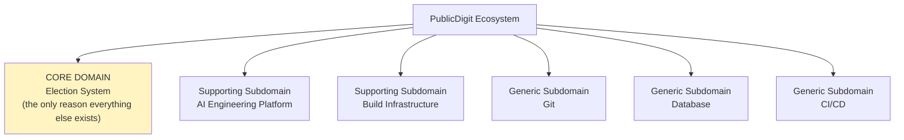

## 0b. How an engineering request flows *(the whole process in one picture)*

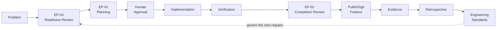

## 1. The central engineering loop *(the provider is not visible — by design)*

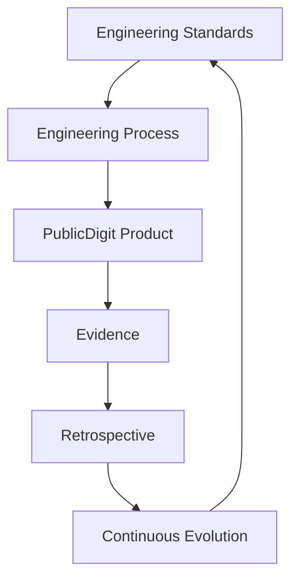

## 2. Provider-independent stack

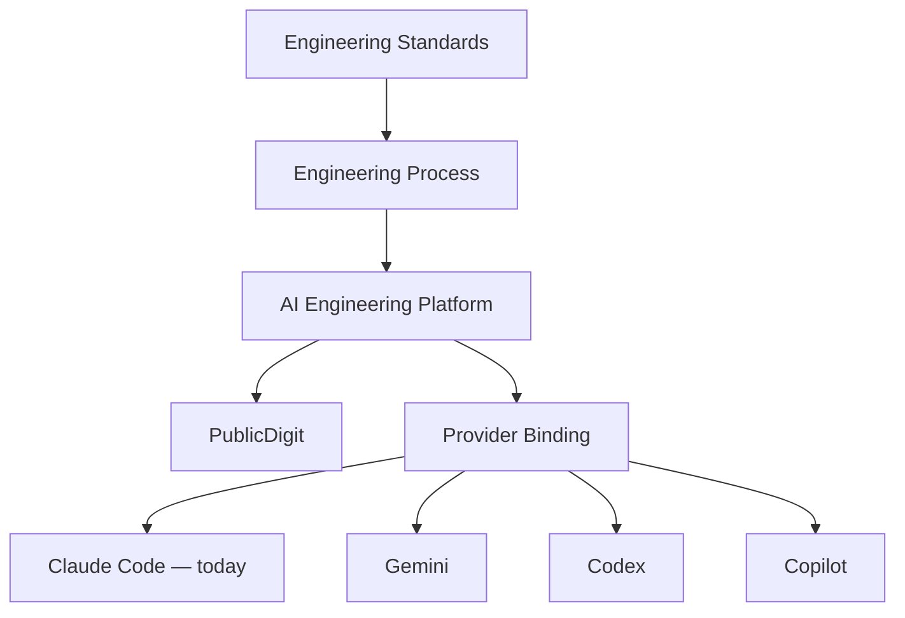

The provider is replaceable; the platform is not.

## 3. Bounded contexts — the real context map *(CORRECTED: not a linear chain; relationships per the frozen Phase-02 map. "Configuration" is a component — the composition root — not a bounded context.)*

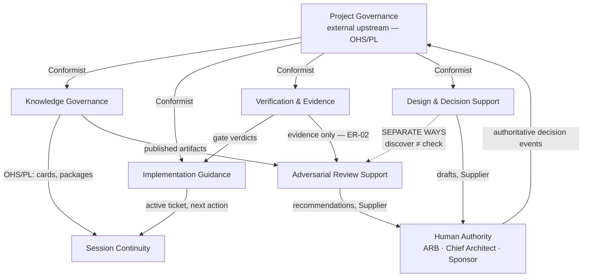

## 3b. Domain model — what lives inside the contexts *(per the frozen Phase-02 §4 aggregates — CORRECTED vs. the ARB sketch: KnowledgePackage is a documentation manifest, not an aggregate (R-2); ADRs/Tickets/IDDs are OBSERVED project artifacts held as VO references (ADR-T16 discipline), never platform aggregates; KnowledgeHarvest is a Think-layer candidate, not yet in the frozen model)*

```mermaid
graph TD
  KG[Knowledge Governance] --> KI[KnowledgeItem ⬢]
  KG -.-> KP[KnowledgePackage — manifest, not aggregate]
  KG -.-> KH[KnowledgeHarvest — candidate, Think layer]
  SC[Session Continuity] --> SES[Session ⬢] & CS[ContextSnapshot ⬢<br/>exactly one SingleNextAction]
  SC -.-> BP[BootstrapPayload — VO]
  IG[Implementation Guidance] --> IP[ImplementationPlan ⬢<br/>WbsItem · MicroSlice entities<br/>progress = derived, no setter]
  IG -.-> TR[TicketRef · IddRef — VO refs, observed]
  VE[Verification & Evidence] --> FF[FitnessFunction ⬢<br/>RED falsifiability required] & GV[GateVerdict ⬢<br/>immutable, evidence-required] & TC[TraceabilityChain ⬢]
  VE -.-> VM[VerificationMatrix — read model]
  RS[Adversarial Review Support] --> AR[AdversarialReview ⬢<br/>Finding entities, evidence mandatory<br/>producer ≠ reviewer]
  DS[Design & Decision Support] --> DD[DecisionDraft ⬢<br/>one decision · APPROVED unreachable] & CM[CapabilityModel ⬢<br/>exactly-one-owner validation]
  DS -.-> ADR[ADRs — observed references, owned by the project]
```

⬢ = aggregate root. Dotted = not an aggregate (VO, manifest, read model, observed reference, or candidate).

## 3c. Why DDD? *(everything starts with business — never with AI)*

## 4. Runtime loading order *(knowledge before rules)*

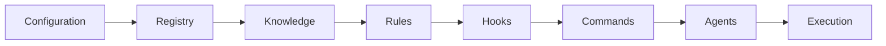

## 5. Registry architecture *(configuration-driven: abstraction → realization → evidence)*

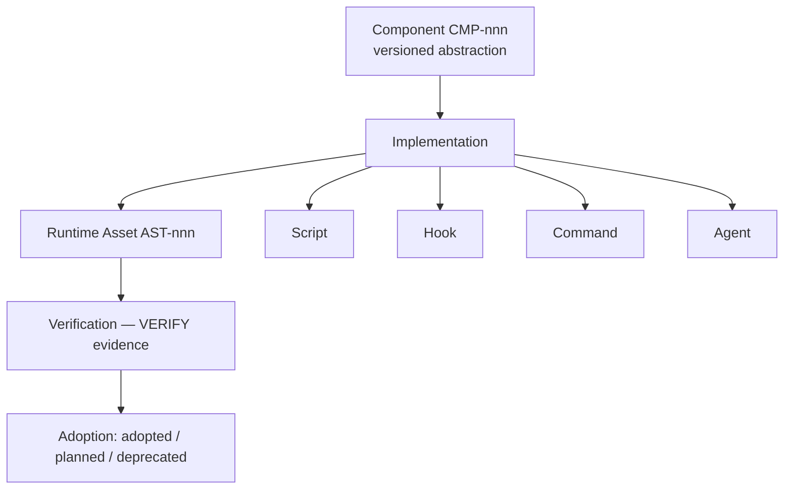

## 6. Engineering Process lifecycle

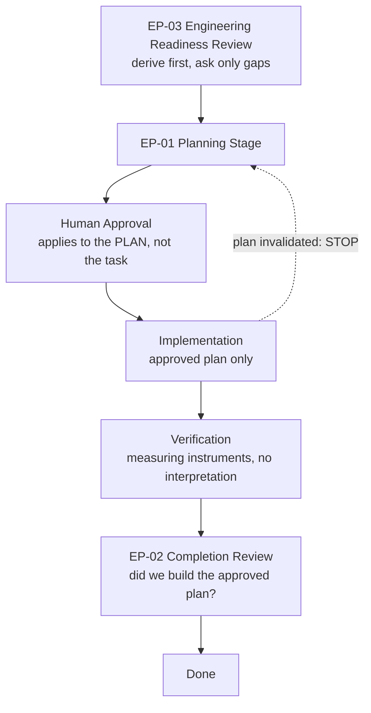

## 7. Engineering Readiness — nine domains (frozen at nine)

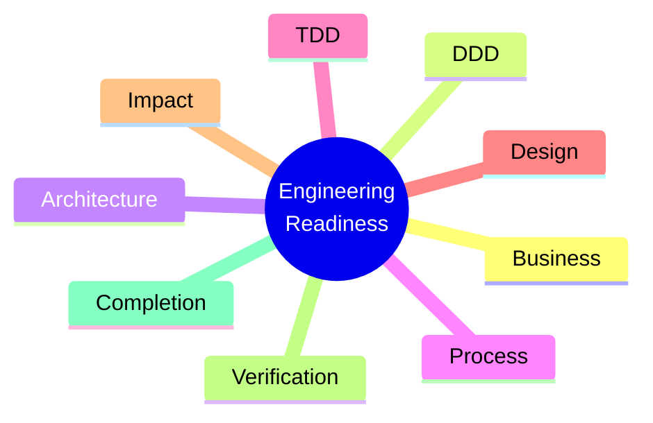

## 8. DDD's position in engineering

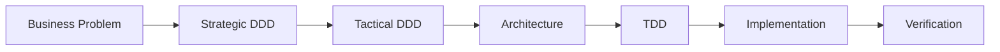

## 9. Knowledge Harvest lifecycle *(CORRECTED: Pattern Evidence Register, not "Evidence Log")*

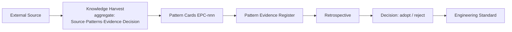

## 10. PublicDigit ecosystem *(the platform is never the Core Domain)*

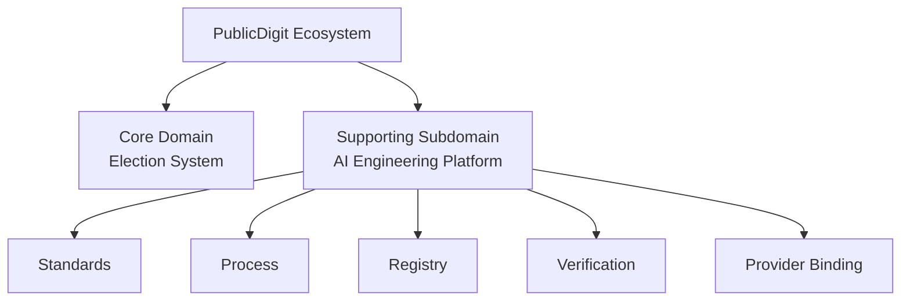

## 10b. Evidence View *(added 2026-07-10 — evidence is a first-class concern with its own loop; implemented-truth vocabulary only)*

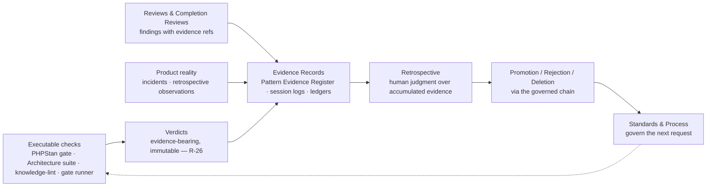

Evidence has many sources and one destination: a human decision. No metric ledger appears at this level — **evidence is architecture; metrics are implementation** (one way of producing evidence, replaceable like any adapter).

## 11. What the provider actually is

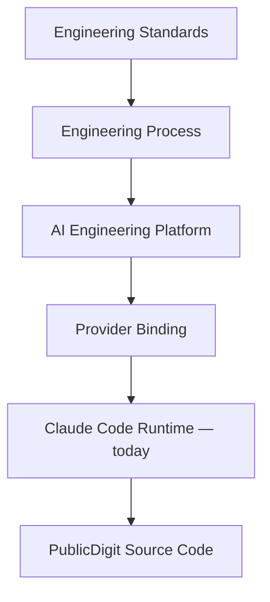

The provider is the runtime at the bottom of a governed engineering stack — never the center of the system.

## 12. Addendum — the constitutional layer (added 2026-07-12; this file predates it entirely)

*(Evidence-reconstruction finding: this document contains zero references to ES-001..006, the Engineering Decision Model, the EEP, or the rulings register beyond R-35 — it was written 2026-07-08, before the 2026-07-11 constitutional consolidation. Added as an addendum, not a rewrite, per this file's own rule: "frozen artifacts win on conflict.")*

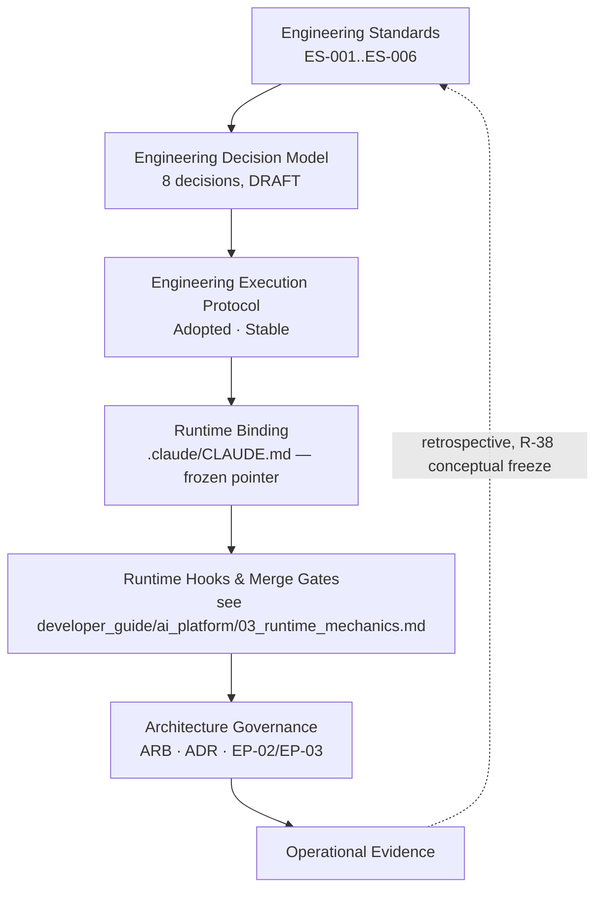

This sits between §2 (Provider-independent stack) and §11 (What the provider actually is) in the reading order: the Decision Model and ES-standards are what "Engineering Standards" in §1/§2 concretely *is*, as of 2026-07-11. The Registry architecture (§5, CMP/AST) and this constitutional layer coexist — the registry governs `.claude` runtime assets; ES-001..006 govern the engineering process and its decisions. Neither absorbed the other.

---

*Corrections applied vs. the ARB draft (2026-07-08): §3 redrawn from a linear chain to the frozen Phase-02 relationships (OHS/PL, Conformist, Separate Ways, Human Authority as event source); §9 renamed to Pattern Evidence Register. §12 added 2026-07-12 (constitutional layer, post-dates original). On any conflict, the frozen Baseline corpus and the Implementation Process win over these views.*
