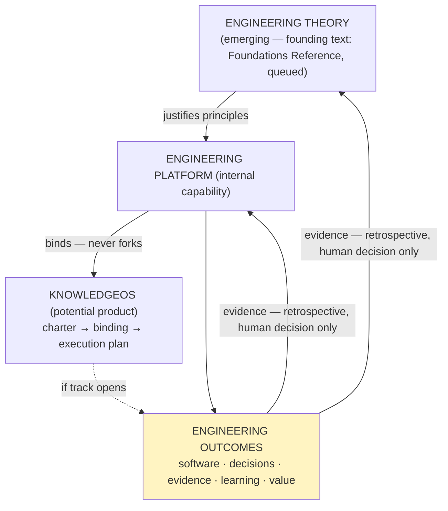

# Engineering Knowledge System — Reference Model

**Class:** Architecture View (explanatory) — **documentation only; frozen and governed artifacts win on every conflict** (the standing `c4/` rule). This document **explains, relates, maps, and navigates. It does not govern, prescribe, or legislate.** It is **not a constitution** — the system it describes already has those, and they are mapped below, not duplicated.
**Status:** descriptive · living · candidates marked as candidates throughout. **Placement provisional pending Placement Rule decision D-1.**
**Commission:** Decision Authority, 2026-07-27 (synthesis review; approve-with-changes on its own proposal: Reference Model, never "constitution of the system"). **Revision 2 same day** — DA's revised instructions folded with pre-refinement verification: guiding-principles foundation added (separate from layers, per the commission) · six-layer inventory added with **corrected relationship representation** (the commissioned linear chain conflated dependent layers with cross-cutting models — the GEP-F1 error class; corrected to chain + cross-cutting) · boundaries and role sections expanded (DOES/DOES-NOT form) · **not imported, with evidence:** "the Engineering Platform is complete" (contradicts its own recorded verdict), "AI Gateway" (no such component exists; gateway explicitly deferred, Phase-02.5), the closing completion claim (thrice-applied precedent).
**Naming note:** "Reference **Model**", deliberately — the name "Reference Architecture" is already held by the *normative* `../reference/Engineering_Platform_Reference_Architecture.md`; one vocabulary, two polarities, two names.
**Revision 3 (2026-07-27, final clarifications — DA-reviewed form):** lifecycle-dimensions note added to §5 (orthogonal attributes; commissioned example corrected — no single artifact is Sealed+PROPOSED; the row aggregated two groups; canonical rule pointed to, not restated) · Engineering Theory consistently **EMERGING** (established only when its founding artifact exists) · Creation Note added to §10 **as revision provenance, not intrinsic property** (per DA rewording) · "fully clarified" claim not imported (completion-claim precedent).
**Maintenance:** re-verified when any mapped artifact changes status; re-verification may conclude no change is required.

**Change-Impact Verification 2026-07-31** (bounded maintenance under the rule above — **not** a refinement; the closed review stands). Findings: **2 stale references** — the rulings range `R-1..R-40` → **R-1..R-42** (R-41 ES-004.3 adoption · R-42 platform-registry scope), in both §4 and §5 · **1 unmapped artifact** — the implementation execution protocol, now inventoried under Runtime. **Verified as NOT requiring change:** ES-001..006 state (still PROPOSED; ES-004.3 is a clause within an already-mapped element, and this map inventories elements, not clauses) · Placement rule (still DRAFT, D-1..D-5 still with the DA) · Evidence corpus (*growing* remains accurate; 4 reports added). **Out of scope, deliberately not added:** the Cross-Context Integration Contract and the Artifact Ownership Decision Paper are **product**-side artifacts; this map covers the Engineering Knowledge System — the ownership paper's platform-facing outcome is already carried by R-42. **Conclusion: minor navigational updates only; no architectural change.**

---

## 1. What this model is for

The repository contains many individually-governed components whose relationships were previously distributed across headers, session logs, and review records. This model is the single explanatory map: what exists · what governs what · what state everything is in · where information lives · which pattern to follow when adding to it.

## 2. Guiding Principles — the foundation, not a layer

*(The reasoning that shapes every layer below. Each principle is traced to its source and carries its honest status — a foundation may contain candidates, so long as they are labeled.)*

1. **Verification before prescription.** Observe → Verify → Classify → Recommend → the Decision Authority decides. *(Source: R-26 instrument discipline · ES-003.1 · the 2026-07-27 operating record. Status: current operating model, consistently observed; standardization is a future governance decision.)*
2. **Canonical ownership before creation.** Identify the information → determine its owner → update the owner; a new artifact only when no owner exists and governance says one should. *(Source: binding rule 2.12 (normative at document tier) + the cross-tier generalization. Status: **CANDIDATE** repository policy, observed twice, pending validation.)*
3. **Decision Authority external to the assistant.** The assistant analyzes, recommends, verifies, prepares; the Decision Authority approves, adopts, ratifies, authorizes. Never merged. *(Source: PD-01..12 · Authority Boundary · EEP §2. Status: constitutional, in force.)*
4. **Evidence-based promotion.** Observation → repeated evidence → candidate → (ES-006.1:) research → pilot → qualification → standard. Nothing promotes without evidence; "no change" is a legitimate success outcome. *(Source: ES-006.1 normative core; lower rungs are this session's observed extension — candidate.)*
5. **Governance artifacts govern the things they govern; they never become them.** The charter governs discovery and is not the discovery; the constitution governs development and is not the product; the execution plan governs activation and is not the activation. *(Source: newly articulated at this commission, generalizing finding GEP-F1. Status: descriptive articulation of practiced separation.)*

## 3. The system at one glance



## 4. Layer inventory

**Layers 1–4 form a genuine dependency chain. Layers 5–6 are cross-cutting models of Layer 1 that every layer uses** — they predate the product track and are not downstream of it (representing them as chain links was the commissioned draft's one modeling error; corrected here).

```text
DEPENDENCY CHAIN
L1  Engineering Platform (reusable foundation)
      methodology modules (DDD adopted; more registerable) · governance (ES-001..006
      PROPOSED · EEP STABLE · rulings R-1..R-42) · knowledge (metamodel CANDIDATE ·
      patterns candidate-tier · RQ-002 research, frozen, project-side) · runtime
      (registry CMP/AST · 7 hooks · merge gate; NO gateway — deferred by ruling)
      · qualification (OQ-ENG-001/002 executed · C3+OQ-ENG-003 · OQ-ENG-004 pending)
L2  KnowledgeOS Product (built on, never into, L1)
      vision (FROZEN for discovery) · problem hypothesis (charter-governed) · Stage-1 scope
L3  Product Governance Stack
      charter (PROPOSED — should we begin?) · constitution (INERT — how is discovery
      governed?) · execution plan (PREPARED — how does the constitution activate?)
L4  Execution Model
      G-1 charter approval (three asks) · G-2 adoption act (R-nn) · S-1..S-5 stages
      (STOP legal at every gate)

CROSS-CUTTING MODELS (of L1, used by all layers)
L5  Information Architecture — canonical ownership: CONTEXT (state+next action) ·
      session log (reasoning+history) · governed headers (status, watch items) ·
      placement rule (DRAFT, D-1..D-5 pending)
L6  Knowledge Evolution — the maturity ladder (§2 principle 4); promotion gates
      human-held at every rung
```

## 5. Component map (what · where · state)

**Note on lifecycle dimensions (read before the table):** the state column combines **orthogonal attributes** — *editing status* (Sealed: moves allowed, edits never · drafting-closed · living) is independent of *adoption status* (PROPOSED · Accepted/ADOPTED · STABLE), which is independent of *activation status* (INERT · ACTIVE). Accurate examples: the sealed baseline is **Sealed + Accepted** (ADR-AIP-01); the ES set is **editable + PROPOSED**; the EEP is **governed-change + Adopted · STABLE**; the KnowledgeOS binding is **drafting-closed + PROPOSED + INERT** — three dimensions at once, no contradiction anywhere. Where a row shows two states (e.g. "Sealed / PROPOSED"), it aggregates two artifact groups within one system element, not one artifact in conflict. Canonical statement of the orthogonal-axes rule: the Knowledge Metamodel §6 (this note points; it does not restate).

| System element | Canonical artifact(s) | State (2026-07-27) |
|---|---|---|
| Constitution (platform) | PD-01..20 · AIP-01..14 (sealed) · ES-001..006 + index | Sealed / **PROPOSED (ratification pending)** |
| Execution protocol | EEP | **Adopted · STABLE** |
| Decision architecture | Engineering Decision Model | DRAFT (adoption through use) |
| Normative architecture | Engineering Platform Reference Architecture | DRAFT |
| Knowledge ontology | Engineering Platform Knowledge Metamodel | **CANDIDATE** (gate: OQ-ENG-004) |
| Placement rule | Placement Rule Decision Paper (→ ES-005.5) | DRAFT — **D-1..D-5** with the DA |
| Rulings | ADR-AIP-LOG (R-1..**R-42**) | living, append-only |
| Theory layer | Engineering Foundations Reference | **EMERGING** — founding text queued; treated as established only when its foundational artifact exists |
| Methodology modules | DDD Tactical Governance Principles | ADOPTED (R-39) — bind, never fork |
| Learning | pattern cards EPC-001..018 + Evidence Register | candidate-tier; retrospective-gated |
| Platform qualification | OQ-ENG-001/002 · C3+OQ-ENG-003 · OQ-ENG-004 | 2 executed · 2 awaiting fresh sessions |
| Product governance stack | charter → binding (rev 3) → execution plan (rev 2) | PROPOSED → INERT → PREPARED; **one gate: the three asks** |
| Runtime | registry + 7 hooks + CONTEXT/session machinery | operating |
| Implementation execution protocol | `.claude/IMPLEMENTATION_PROTOCOL.md` (17 phases) | **OPERATIONAL · FROZEN for routine work** (R-41-adjacent; amendments require operational evidence from a completed WP) |
| Evidence corpus | verification/ + session logs | append-only, growing |

## 6. The recurring pattern: two lifecycles, never conflated (GEP-F1, generalized)

```text
GOVERNANCE-ARTIFACT LIFECYCLE            GOVERNED-WORK LIFECYCLE
PROPOSED → (review) → drafting-closed    stage/slice 1 → 2 → … → done,
→ (explicit adoption event) → ACTIVE     with STOP legitimate at every gate
→ (supersession) → historical
```

The artifact's lifecycle is driven by Human Decision Events; the work's lifecycle is *governed by* the active artifact. Requiring the work to finish before the artifact activates inverts the relationship — the modeling error this map exists to prevent (and §4's correction is its second application).

## 7. Current operating models (descriptive — observed, not mandated)

**7.1 Observed verification lifecycle:** `Observe → Verify → Classify (derived vs recommended; authority tier) → Recommend (with trade-offs) → Decision Authority decides` — never `Request → Implement`. Observed consistently through the 2026-07-27 preparation phase; whether it becomes a governed standard is determined by operational evidence and Decision Authority adoption.

**7.2 Observed knowledge promotion model:** `Observation → repeated evidence → candidate → [ES-006.1 normative from here] research → pilot → qualification → standard`. Promotion requires repeated evidence across contexts, explicit DA adoption, and traceability to canonical sources. **This model is itself a candidate for promotion based on continued evidence.**

**7.3 Candidate ownership model** *(canonical-ownership-before-creation)*: the four-step procedure of §2 principle 2. **Status: CANDIDATE — observed in the split decline and the handover decline.** Promotion requires repeated successful application across situations, explicit DA adoption, and an established canonical owner (if promoted: extends ES-005.3/DeterminePlacement — founds nothing new). Documented as a candidate for validation, **not** a published repository policy.

## 8. Platform ≠ product

| | Engineering Platform | KnowledgeOS |
|---|---|---|
| Nature | internal capability | potential product |
| Customer | the engineering team | organizations |
| Domain classification | Supporting Subdomain (of PublicDigit) | engineering governance/knowledge would be its **Core Domain** — the inversion means platform rules (e.g. AIP-14) do not transfer unchanged |
| Evolution driver | operational evidence · retrospective | customer evidence · stage gates (STOP legal) |
| Relationship | **the product binds the platform; never forks it — and the platform never absorbs product concerns** | |

## 9. Architectural boundaries

**This model DOES:** describe the existing layers and relationships · document observed patterns and practices, at their honest status · provide a coherent mental model for new contributors · serve as a navigational reference for architectural decisions.

**This model DOES NOT:** govern the Engineering Platform · create new governance or methodology · replace or restate any governed artifact (it points; canonical homes host) · prescribe how the system should evolve · promote any candidate by describing it.

## 10. The role of this document

Not a governance artifact. Not a standard. Not a methodology module. A conceptual description of how the existing artifacts relate — existing so that new contributors inherit a mental model, architectural decisions have a map to consult, and future work stays consistent with the governance philosophy already in force. It may be revised as the system evolves, only through the same governance processes it describes, and a re-verification that changes nothing is a success outcome.

**Creation Note (provenance of this revision — a documented characteristic of the revision process, not claimed as an intrinsic property of the model):** this revision was produced using the same governance discipline the model describes — prompt instructions were verified against the existing architecture before application, unsupported claims were rejected with evidence, and authority boundaries were preserved. These clarifications address the current review observations; future refinements remain possible as the engineering system evolves.

## 11. Operational role — how to use this model (review closed 2026-07-27; it exists to be consulted, not to be refined)

**Use it:** new contributors read it first to inherit the mental model · architectural decisions consult it for relationships, dependencies, and each artifact's honest state · governance work uses it to locate canonical sources.

**Do not use it:** as a governance artifact · as a source of truth for state (the canonical artifacts it maps are the truth; this map may lag) · as something to modify on every architectural change — **update the underlying artifacts first; reflect their changes here only once the system has stabilized.** Maintenance rules live in the header (re-verify on mapped-status change; a no-change re-verification is a success outcome).

---
*Traceability: DA synthesis commission + approve-with-changes review + revised instructions (all 2026-07-27, folded with pre-refinement verification — exclusions and corrections in the header) · content sources: Phase 1 baseline · IA review · Knowledge Domain Model · GEP (GEP-F1) · session log 2026-07-27 · placement provisional pending D-1. On any conflict, the governed artifacts win. **Submitted to the Decision Authority as a views-class document; no adoption required for its explanatory purpose, and none claimed.***
