# AI Engineering Platform — Architecture Baseline

**Version: Current State (as implemented on 2026-07-27)**

| | |
|---|---|
| **Class** | Engineering Platform architecture — **descriptive baseline reconstruction** (evidence discovery, not design) |
| **Authority** | Generated (AI-produced; never authoritative without human review — AIP-10/PD-05) |
| **Status** | **DRAFT — submitted to the Decision Authority.** This document adopts nothing, promotes nothing, and creates no governance (ES-001.2). |
| **Commission** | Decision Authority, 2026-07-27: *"Phase 1 — Current State Architecture Discovery. Understand it. Do not redesign it. If evidence is insufficient, record the gap."* |
| **Method** | Read-only reconstruction from repository evidence: all 45 text artifacts under `engineering/`, the live registry, `.claude/settings.json`, all 7 hook scripts (read in full), `.claude/CONTEXT.md`, `developer_guide/ai_platform/00_…`, plus filesystem/git/grep checks. Every statement below traces to §19. |
| **Freeze note** | `engineering/` is under structural freeze (R-37: bugfix/link/typo only) and conceptual freeze (R-38). This artifact proceeds under the same exception those freezes name and that the 2026-07-12 verification reports used: **explicitly commissioned by the Decision Authority, this turn.** It introduces **no new concept, rule, capability, or structure** — it records what already exists. |
| **Placement note** | Placement in `engineering/developer_guide/` was **directed by the Decision Authority** (2026-07-27, revising an initial direction to `engineering/architecture/`). Two facts are recorded rather than silently rationalised: (a) applying ES-005.3 independently, this artifact's *class* is evidence/reconstruction, which the repository otherwise homes in `verification/reports/` (precedent: `2026-07-12-ai-architecture-reconstruction-report.md`); (b) the README's reserved-namespace table names the future developer home as **`developer/guides/`**, not `developer_guide/` — the directed name diverges from the reserved one, and the reserved-namespace row is now partially fulfilled under a different name. The folder rule (ES-005.2) is satisfied: the directory was created *with* its first artifact, not ahead of it. The Decision Authority may relocate or rename. |

---

## 1. Executive Summary

The PublicDigit AI Engineering Platform is **an engineering governance architecture, not a software system**. Its own Reference Architecture states this in the first line of §1, and the repository confirms it: after twenty days of recorded work there is **no orchestrator, no workflow engine, no state machine, and no execution aggregate in code**. What exists instead is a written constitution, a decision catalogue, an execution protocol, a machine-readable registry of seven small shell scripts, and an append-only body of evidence about itself.

Five findings characterise the current state:

1. **The architecture is inverted relative to the industry norm.** It does not start from the AI tool. It starts from Strategic DDD, derives an engineering domain (six bounded contexts), derives capabilities (CAP-01..13), derives components (CMP-001..008), derives runtime assets (AST-001..014), and only then binds a provider. The provider occupies the outermost, most replaceable layer. This is documented as "the inversion" and is mechanically verifiable: the Engineering Execution Protocol contains **zero** provider names and **zero** product names (OQ-ENG-001 phases 8–9).

2. **Governance precedes automation — deliberately, and by ruling.** The platform has explicitly ruled (R-37, burden of proof) that software mechanisms may exist only *after* operational evidence shows the governance model insufficient. The Decision Authority & Verification Matrix concludes that the smallest automation set justified by evidence is **zero new hooks**. One hook was subsequently added by explicit override (AST-014), using the override path the matrix itself names.

3. **The specification layer is complete; the executable layer is minimal and partly unbuilt.** Six Engineering Standards, eight Engineering Decisions, a Reference Architecture, an Execution Protocol, a 20-decision constitution and a 14-principle set are all written. Against that: 7 shell scripts, 7 hook wirings, 0 commands, 0 agents, 0 skills, 0 implemented fitness functions. Two of eight registry components are `deferred` (version 0.0) and one — the Verification Engine — is `under-construction` at version 0.1.

4. **The platform's single mandatory executable gate has never run.** Slice C3 (implement `AST-010 run-gates.sh`) and its companion qualification OQ-ENG-003 were declared ready on 2026-07-11. As of 2026-07-27 the script does not exist on disk and no dated OQ-ENG-003 record exists. The platform's own readiness qualification (OQ-ENG-002 E-4) named this as "the single minimal gap" and made STABLE conditional on it. **The platform therefore remains, in its own vocabulary, `FUNCTIONALLY STABLE — CONSTITUTIONALLY INCOMPLETE`.**

5. **The whole constitutional layer is still formally PROPOSED.** All six ES documents and the Standards Index carry `Status: PROPOSED — awaiting ARB review`; the Decision Model and Reference Architecture carry `DRAFT`. The ratification signature that the platform's own sequence places before C3 has not been recorded. Risk R-a of the 2026-07-11 readiness report — "everything is PROPOSED until ratification" — is still live sixteen days later.

The dominant architectural quality of this platform is **epistemic discipline**: it distinguishes rigorously between what is decided, what is proposed, what is a candidate, what is a research hypothesis, and what is merely observed — and it enforces those distinctions on itself. The dominant architectural fragility is the mirror of that strength: **the platform's evolution path requires operational evidence, and the instrument that produces operational evidence is the one component that was never built.**

---

## 2. Architecture Overview

### 2.1 The three concerns

The repository is partitioned into three concerns, each answering one question (ES-005.1, established by migration EM-001, ARB-approved 2026-07-10):

| Concern | Location | Question it answers |
|---|---|---|
| **Product** | `docs/` · `architecture/` · `app/` · `tests/` | *How does PublicDigit work?* |
| **Engineering** | `engineering/` | *How is PublicDigit engineered?* |
| **Runtime** | `.claude/` | *How does the current adapter execute that engineering?* |

The runtime mount is treated like `.git/` — dictated by tooling, never moving, and explicitly **never "the architecture."**

### 2.2 The stack

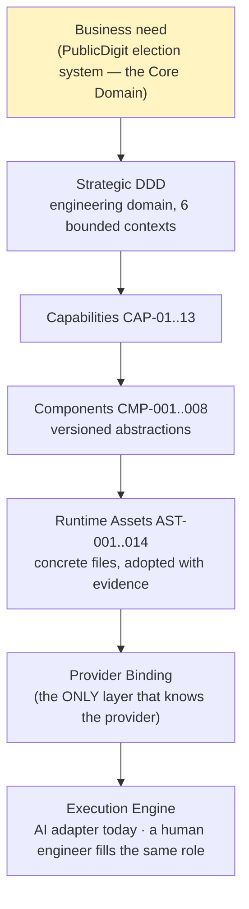

Everything above `Provider Binding` survives replacing the provider. This is not aspiration: it is verified by mechanical scan (EEP: 0 provider hits, 0 product hits) and stated as the platform's litmus test PD/R-10 — *"Would this still make sense if the current AI provider disappeared tomorrow?"*

### 2.3 What the platform is and is not

| It IS | It is NOT |
|---|---|
| A governance architecture enforced by protocol, human authority, and evidence | An orchestrator, workflow engine, or state machine (explicitly rejected, R-37) |
| A Supporting Subdomain of the PublicDigit ecosystem (AIP-14) | The Core Domain — the Election System is (stated in three separate diagrams) |
| Provider-independent by construction, with one binding today | A Claude configuration (Phase-02.7 §1) |
| Reusable-in-principle; adoption evidence interwoven in practice | Proven reusable — no second adopter exists (OQ-ENG-002 E-3, WARN by design) |

---

## 3. Architectural Vision (inferred from evidence)

No document states a single "vision statement." The following is **inferred** from convergent evidence across the corpus; each line names its strongest source.

> **The platform exists to make AI-assisted engineering deterministic, auditable, reproducible, traceable, and maintainable — without ever transferring engineering authority to the AI.**
> *(developer guide 00 §Goal — "The AI behaves like another senior engineer, not like an autonomous coding system.")*

Four inferred vision commitments, each traceable:

| Inferred commitment | Evidence |
|---|---|
| **Evidence, never authority** — the platform owns the production, preservation, and verification of engineering *evidence*, never engineering *authority* | Phase-02 §1 (mission statement, verbatim) |
| **The product outranks the platform, permanently** | AIP-14 / ADR-AIP-02; OPERATING_INSTRUCTIONS §Product Primacy; the candidate "Law of Architectural Evolution" in the pattern dossier |
| **The platform should shrink, not grow** | OPERATING_INSTRUCTIONS §Minimalism ("the platform should continuously become smaller") + §Success Criterion ("fewer documents, fewer decisions, fewer arguments") |
| **Architecture is reactive to reality, never proactive to ideas** | R-29 final instruction; the standing ARB personal rule recorded in the pattern dossier |

**Evidence not found:** no artifact defines a target end-state, roadmap, or completion condition for the platform itself beyond "Operational Readiness v1.0" (R-33). Roadmaps are, in fact, explicitly forbidden (R-27 §3: *"No platform roadmaps, no speculative capabilities"*).

---

## 4. Architecture Layers

Seven layers are inferable from implementation evidence. They are **not** declared as a numbered layer stack in any single document — the layering below is reconstructed from the Decision Model's diagram, the Reference Architecture's flow, the registry's loading order, and the folder structure. Where a layer's ordering is contested in the sources, that is stated.

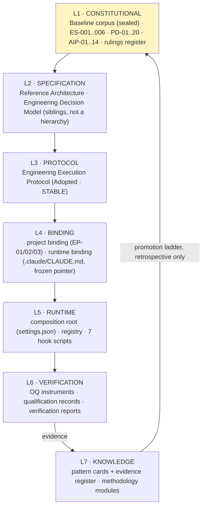

| Layer | Why it exists (evidence) | Change rule in force |
|---|---|---|
| **L1 Constitutional** | Binding rules needed exactly one canonical home; OQ-ENG-002 found runtime MEMORY was carrying permanent governance (F-OQ2-1/2) — the ES consolidation is that finding's remedy | Sealed corpus: moves allowed, edits never (R-30). Rulings: append-only (AIP-11) |
| **L2 Specification** | Two distinct questions needed distinct homes: *what the platform IS* vs *how decisions are RESOLVED*. The ARB explicitly ruled them **complementary siblings, not a hierarchy** | DRAFT → ADOPTED only after one complete engineering cycle + qualification |
| **L3 Protocol** | Execution had to be expressible independently of project and provider ("projects bind it; they do not fork it") | STABLE — changes only on usage evidence from real sessions; imagined improvements rejected by default |
| **L4 Binding** | The protocol must not know about tools; the tools must not reinterpret the protocol. A binding may be stricter, never looser | Bindings are project property |
| **L5 Runtime** | Something must actually fire at session start, before writes, and at stop | Registry-first: register → review → implement → verify |
| **L6 Verification** | "Verification ≠ certification" (D-11) is a linguistic boundary the project already drew; the platform inherited it | Report-never-fix (ES-003.1); verdict history is part of the verdict |
| **L7 Knowledge** | External knowledge must enter through one governed pipeline, not by copying | Promotion ladder (ES-006.1); research freeze (ES-006.2) |

**Contested ordering, recorded not resolved:** the pattern dossier carries an ARB hypothesis (note (o)) that *Capability* may belong **above** Process in the hierarchy. It is explicitly hypothesis-tier and deliberately not modelled. This baseline does not resolve it.

---

## 5. Component Catalogue

Components appear in **three families**. Only family B carries formal CMP identity; families A and C are components in the architectural sense (they own a responsibility and have a lifecycle) without registry ids.

### Family A — Constitutional & Specification components

| Component | Kind | Status (as written) | Owns |
|---|---|---|---|
| Sealed Baseline corpus (Phase-01 … Phase-03A) | 6 documents | FROZEN · SEALED (R-30) | AIP-01..14 · PD-01..20 · CAP-01..13 · FF-1..17 · the ubiquitous language · rulings R-1..29 |
| ADR-AIP corpus (01, 02) | 2 ADRs | Accepted (Chief ARB, 2026-07-08) | The baseline decision; Product Primacy |
| ADR-AIP-LOG Rulings Register | living register | Append-only, R-30..R-39 | Ongoing governance rulings |
| STANDARDS_INDEX + ES-001..ES-006 | 7 documents | **PROPOSED** | Every binding engineering rule's home or authoritative pointer |
| Engineering Execution Protocol (EEP) | 1 protocol | **Adopted · STABLE** | The 7-stage lifecycle, 4 roles, 10 principles |
| Engineering Decision Model | 1 reference | **DRAFT** | 8 named Engineering Decisions + the decision schema |
| Engineering Platform Reference Architecture | 1 reference | **DRAFT** | The 5 engineering capabilities; the deferral register |
| Platform C4 Views | 1 document, 17 diagrams | documentation-only ("frozen artifacts win on conflict") | Architecture views |
| DDD Tactical Governance Principles | methodology module | **ADOPTED** (R-39 exception, 2026-07-26) | 7 tactical-DDD principles |

### Family B — Registry components (CMP-nnn) — the declared architectural abstractions

| id | Component | Owning bounded context | Realizes | Version | Adoption state | Implementation on disk |
|---|---|---|---|---|---|---|
| CMP-001 | composition_root | none (wires contexts) | — | 1.0 | adopted | `settings.json` (AST-001); AST-008 deprecated + unwired |
| CMP-002 | session_manager | Session Continuity | CAP-01, CAP-02 | 1.0 | adopted | AST-002/003/004 (3 scripts) |
| CMP-003 | knowledge_manager | Knowledge Governance | CAP-03 | 0.0 | **deferred** | **none — not constructed** |
| CMP-004 | workflow_engine | Implementation Guidance | CAP-05, CAP-06 | 1.0 | adopted *(minimal form: tripwires + plan/progress convention)* | AST-005/006/012/013/014 |
| CMP-005 | verification_engine | Verification & Evidence | CAP-07, CAP-08, CAP-09 | 0.1 | **under-construction** | AST-007 only (guard surface). AST-010 **planned, absent** |
| CMP-006 | review_engine | Adversarial Review Support | CAP-11 | 0.0 | **deferred** | **none — reviews are human** |
| CMP-007 | drafting_studio | Design & Decision Support (Core) | CAP-10, CAP-12 | 1.0 | adopted-by-reference | AST-011 (consumed, never copied) |
| CMP-008 | platform_registry | Design & Decision Support | CAP-13 | 1.0 | active | AST-009 (self-registering) |

**Derived observation:** of eight declared components, **three are not functionally implemented** (CMP-003, CMP-005 partially, CMP-006). The Core-Domain component (CMP-007, Design & Decision Support) is `adopted-by-reference` — it owns no code at all, consuming a frozen project template instead. The platform's Core Domain is therefore realised entirely as *human-and-AI reasoning over governed documents*, which is consistent with its own statement that "the architecture never executes — the Engineer consults it."

### Family C — Runtime assets (AST-nnn) — the concrete files

| id | Path | Component | Adoption | Tier | Runtime moment(s) | On disk? |
|---|---|---|---|---|---|---|
| AST-001 | `.claude/settings.json` | CMP-001 | adopted | — | START/PRE/POST/END | ✅ |
| AST-002 | `scripts/inject-context.sh` | CMP-002 | adopted | — | SESSION_START | ✅ |
| AST-003 | `scripts/session-changes-logger.sh` | CMP-002 | adopted | — | POST_ARTIFACT | ✅ |
| AST-004 | `scripts/session-log-reminder.sh` | CMP-002 | adopted | 2 | SESSION_END | ✅ |
| AST-005 | `scripts/discipline-gate-reminder.sh` | CMP-004 | adopted | 2 | PRE_ACTION | ✅ |
| AST-006 | `scripts/dev-guide-reminder.sh` | CMP-004 | adopted | 2 | SESSION_END | ✅ |
| AST-007 | `scripts/db-safety-check.sh` | CMP-005 | adopted | **1 (blocking)** | PRE_ACTION | ✅ |
| AST-008 | `~/.claude/hooks/timestamp-plan.sh` | CMP-001 | **deprecated** | — | — | ❌ absent (machine-local); **unwired 2026-07-11** |
| AST-009 | `.claude/platform/registry.yaml` | CMP-008 | adopted | — | START / ON_DEMAND | ✅ |
| AST-010 | `scripts/run-gates.sh` | CMP-005 | **planned** | — | ON_DEMAND | ❌ **does not exist** |
| AST-011 | `docs/…/IDD_Prompt_Template…md` | CMP-007 | adopted (by reference) | — | ON_DEMAND | ✅ (product tier) |
| AST-012 | `.claude/CLAUDE.md` | CMP-004 | adopted | 3 | SESSION_START | ✅ |
| AST-013 | `.claude/platform/OPERATING_INSTRUCTIONS.md` | CMP-004 | adopted | 3 | SESSION_START | ✅ |
| AST-014 | `scripts/ddd-principles-reminder.sh` | CMP-004 | adopted | 2 | PRE_ACTION | ✅ |

**Governance tiers observed in the wild:** exactly **one Tier-1 blocking gate exists** (AST-007, database safety). Everything else is Tier-2 (non-blocking reminder) or Tier-3 (advisory doctrine text). The domain model specifies seven Tier-1 blocking gates (Phase-02 §6). **Six of seven specified Tier-1 gates have no executable implementation.**

---

## 6. Component Responsibilities (detail)

Per the commission's schema. Sources are named; where a field has no evidence it says so.

### CMP-001 · Composition Root
- **Purpose:** the single, versioned entry point wiring runtime moments to components. No component self-registers outside it (Phase-03A §3).
- **Responsibilities:** hook registration; scope precedence (project scope authoritative for governance; local may tighten, never weaken a Tier-1 gate).
- **Owned knowledge:** none — it is pure wiring.
- **Inputs:** provider lifecycle events. **Outputs:** script invocations with tool-input payloads.
- **Dependencies:** the provider's settings mechanism. **Consumers:** all runtime assets.
- **Lifecycle:** adopted 2026-07-08 (full read + wiring trace).
- **Architectural importance:** **critical** — it is the only place the provider and the platform meet. Phase-01 identified "own the payloads" as the key lesson from the rejected claude-flow scaffold; the current composition root does own them (all seven scripts are in-repo and read their own input).

### CMP-002 · Session Manager
- **Purpose:** assemble the bootstrap from governed sources at session start; record and archive sessions append-only; detect staleness.
- **Responsibilities (verified in code):** `inject-context.sh` self-heals `.claude/` structure, injects MEMORY + CONTEXT + the CONTEXT-declared active plan + today's log; `session-changes-logger.sh` writes a repo-relative fact log and derived `state.json`, and refreshes plan `Last Updated:` headers; `session-log-reminder.sh` emits a sync checklist only when state is genuinely stale.
- **Owned knowledge:** session logs, per-day file logs, derived state json.
- **Inputs:** repository files, tool-input JSON. **Outputs:** injected context; `.claude/runtime/*` (gitignored); non-blocking system messages.
- **Dependencies:** CONTEXT.md as **plan authority** (deterministic resolution: `Plan:` line → prose path → mtime fallback).
- **Consumers:** the AI actor at session start; auditors.
- **Lifecycle:** adopted 2026-07-08; unchanged since.
- **Architectural importance:** **high** — this is the platform's only continuously-exercised runtime capability. It is also the component with the highest recorded improvement pressure (EPC-001 Progressive Disclosure: the bootstrap injects everything unconditionally; 4/4 independent sources converge on layered loading; **0 implementation evidence, deliberately unbuilt**).

### CMP-003 · Knowledge Manager — **deferred, version 0.0**
- **Purpose (specified):** register platform outputs as `generated` with correct cards; curate lint-validated packages; surface promotion proposals.
- **Current reality:** *"Iteration 1: plan files declare their reading lists; no gap evidenced by PB-004"* (registry note).
- **Architectural importance:** the responsibility is real and currently discharged **by convention** (plan-declared reading lists) rather than by software. **Evidence not found** that this has caused a defect.

### CMP-004 · Workflow Engine — adopted in "minimal form"
- **Purpose:** track the per-ticket plan; derive progress; fire discipline tripwires; enforce step order.
- **What is actually implemented:** three non-blocking reminders (`discipline-gate-reminder.sh`, `dev-guide-reminder.sh`, `ddd-principles-reminder.sh`) plus two doctrine-text assets (`CLAUDE.md`, `OPERATING_INSTRUCTIONS.md`).
- **What is specified but not implemented:** WBS-derived progress with no setter; step-order enforcement; DoD blocking. **None of these exist as software.** They are honoured as document convention.
- **Notable engineering detail:** both PreToolUse reminders are **state-aware** — a `.claude/runtime/YYYY-MM-DD-*.flag` marker limits each to once per session-day, explicitly reasoned as "repeating it every file is noise, not signal."
- **Architectural importance:** **high in name, moderate in force.** The name "Workflow Engine" describes an abstraction whose realisation is currently three reminders; the registry is honest about this ("minimal form").

### CMP-005 · Verification Engine — **under-construction, version 0.1**
- **Purpose:** execute registered checks; record immutable evidence-bearing verdicts; maintain traceability; observe constitutional guards → halt + escalate.
- **Implemented:** AST-007 only — the one Tier-1 blocking gate. Its history is instructive: it used `exit 1` until 2026-07-12, meaning **the "BLOCKED" message was cosmetic and the destructive command executed anyway**; the fix to `exit 2` is documented in the script's own comment block.
- **Not implemented:** AST-010 `run-gates.sh` — registered `planned` since 2026-07-08 under the registry-first rule (register before implement), never built.
- **Constraint that shapes it:** R-26 — *run → capture → PASS/FAIL → stop; no interpretation inside the instrument.*
- **Architectural importance:** **the critical path.** Every promotion, every architecture change, and the STABLE declaration itself depend on operational evidence that this component is supposed to produce.

### CMP-006 · Review Engine — **deferred, version 0.0**
- **Purpose (specified):** attempt-to-reject protocols, evidence-cited findings, producer ≠ reviewer enforcement.
- **Current reality:** reviews are human/AI-authored documents. The producer ≠ reviewer rule is enforced **procedurally** (fresh-session constraints in C3 and OQ-ENG-003), not structurally.
- **Architectural importance:** the responsibility is discharged and visibly effective — the Neutrality Review is a case of the verification function auditing *itself* by its own rule.

### CMP-007 · Drafting Studio — adopted **by reference**
- **Purpose:** guide ADR/IDD/capability-model drafting against frozen upstream templates.
- **Implementation:** consumes `AST-011` (the product's frozen IDD template) unchanged. **Creates no parallel copies** — a direct application of ES-005.4 (never a copy).
- **Architectural importance:** **highest by classification** — this component's bounded context (Design & Decision Support) is the declared **Core Domain** (R-3). It owns the least code in the entire platform. That inversion is deliberate: the Core Domain is judgment, and judgment is not automated.

### CMP-008 · Platform Registry — the composition root of knowledge
- **Purpose:** the authoritative component/asset map as *data*, with the five-question trace per asset.
- **Verified properties:** 8 components, 14 assets, unique ids, every asset carrying `capability → context → principle → decision → adr`.
- **Rule it enforces:** *ids never change; paths do.* ADRs and reviews cite ids.
- **Architectural importance:** **structural.** "Everything else is discovered from the registry."

---

## 7. Component Interaction

### 7.1 Collaboration (runtime)

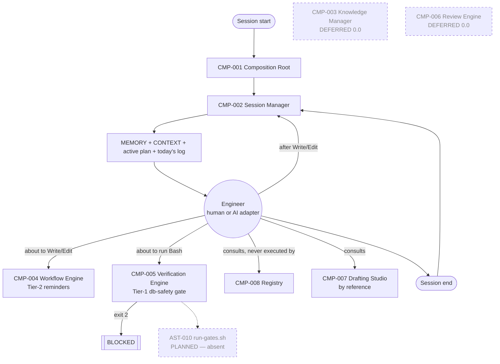

### 7.2 Dependency direction

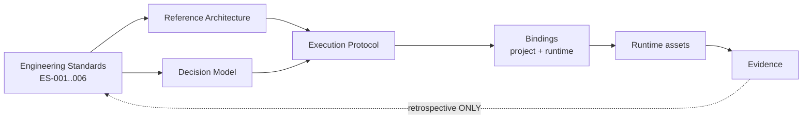

The only cycle in the architecture is the retrospective feedback edge — and it is deliberately **not** a runtime path. Everything else flows one way: specification → binding → runtime → evidence.

### 7.3 Bounded-context map (the domain model beneath the components)

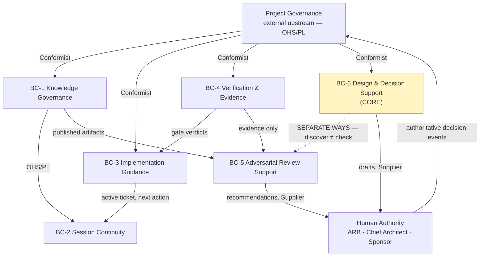

Two relationships carry the platform's safety properties:
- **Conformist to Project Governance, deliberately without an anticorruption layer** — "an ACL here would be a design smell: a licence to privately reinterpret frozen rules."
- **Separate Ways between BC-6 and BC-5** — the checker must not share the producer's internal model. This is separation of duties expressed as a context-map relationship.

---

## 8. Governance Architecture

### 8.1 How architecture is governed

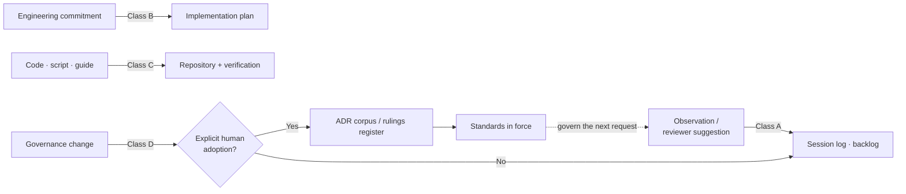

The A/B/C/D classification (AST-013, refining R-34) is the platform's single most load-bearing governance mechanism: **default classification is "observation."** Praise, suggestion, and inference cannot create governance. Only explicit adoption can.

### 8.2 Governance mechanisms actually in force

| Mechanism | Instrument | Evidence it operates |
|---|---|---|
| Rulings register | `ADR-AIP-LOG` (append-only, R-30..R-39) | 10 living rulings recorded; R-38 corrected *by the Decision Authority against itself* the same day |
| ADR process | ADR-AIP-01/02 | Both Accepted with recorded human decision events + addenda appended, never rewritten |
| Freezes (four, cumulative) | R-27 governance · R-29 no-change-without-insufficiency · R-37 structural + burden of proof · R-38 conceptual | All four cited in live documents; R-38 explicitly declared to add *no new governance* |
| Approval gate | EEP §5 — *"a request authorizes planning; only an approved plan authorizes implementing"* | Encoded verbatim in `.claude/CLAUDE.md` EP-01 pointer |
| Rule parsimony | ES-001.1 | Applied against a proposed new rule at OQ-ENG-002 E-4 ("~80% covered by registry-first + folder rule + R-37 → fold as a clarification, not a new id") |
| Stopping rules | Three, independently stated (ES set · Decision Model · R-38) | Each names the same first question: *"which existing rule/decision owns this?"* |
| Decision Authority & Verification Matrix | 16 rule rows × 3 separated dimensions | Concludes **zero new hooks justified**; one automation candidate with cited incident evidence |

### 8.3 The three-dimension separation

The matrix's central discipline is that these are never conflated:

| Dimension | Question | Values observed |
|---|---|---|
| Primary Decision Authority | *who determines compliance* | Machine · AI evaluates · Human decides |
| Verification | *how compliance is checked* | OQ instrument · EP-02 review · human review · reminder |
| Automation | *what software exists or is justified* | Existing · Candidate · None |

---

## 9. Knowledge Architecture

### 9.1 Storage

| Knowledge kind | Home | Form |
|---|---|---|
| Engineering standards | `governance/ES-00n` | rules, stated once; everything else points |
| Decisions | `architecture/adr/` | ADRs + append-only rulings register |
| Genesis record | `architecture/baseline/` | sealed, byte-verified (sha1 before/after the migration) |
| Harvested patterns | `knowledge/patterns/` (EPC-001..018) + `sources/` | pattern cards + Pattern Evidence Register |
| Methodology modules | `knowledge/methodology/` | DDD Tactical Governance Principles (1 module) |
| Evidence | `verification/reports/` + `verification/qualification/` | narrative reports + OQ records |
| Runtime state | `.claude/CONTEXT.md`, `sessions/`, `runtime/` | current state · append-only history · gitignored derived state |

### 9.2 Evolution — the promotion ladder

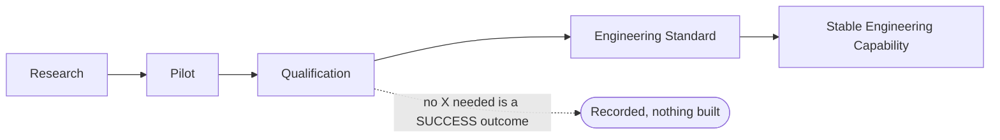

Three properties of this ladder are unusual and evidence-supported:
1. **Qualification sits between research and engineering** — nothing is promoted because it is a good idea.
2. **"No" is the healthy answer.** ES-006.4 states that a mature platform's harvest is mostly *No*, and that "if every ticket yields a pattern or standard, the platform is over-generalizing."
3. **The question is forbidden in its rule-seeking form.** *"Did this work REVEAL reusable engineering knowledge?"* is mandated; *"can we create a new rule?"* is forbidden, because "asking for rules makes people find rules."

### 9.3 Validation and reuse
- Pattern promotion requires **register entries, never a single anecdote**; four frozen convergence dimensions (independent sources · contradictions · implementation evidence · promotion status) with an explicit **metric freeze** — no weighted scores, no composite indices.
- The register shows honest downgrades: an ARB sketch claimed 4/4 source convergence for Context Economy; the derivation "honestly gives 3; names follow evidence."
- **Bindings, never forks:** the DDD module is bound by the project at `docs/architecture/governance/DDD_PRINCIPLES.md` and pointed at by the runtime hook — the rule text exists exactly once.

### 9.4 How architecture survives context resets
This is a first-class architectural concern, not an afterthought:
- `inject-context.sh` mechanically loads the governed state at every session start;
- **"evidence beats memory"** is BC-2's defining invariant — on conflict, the repo wins;
- **exactly one Single Next Action** at all times (invariant, not convenience);
- runtime MEMORY is demoted to *hints only* — the OQ-ENG-002 elevated finding was precisely that "runtime memory must never be the long-term source of governance."

---

## 10. Workflow Architecture

The platform runs **one lifecycle, expressed at three altitudes**, and they are consistent with each other.

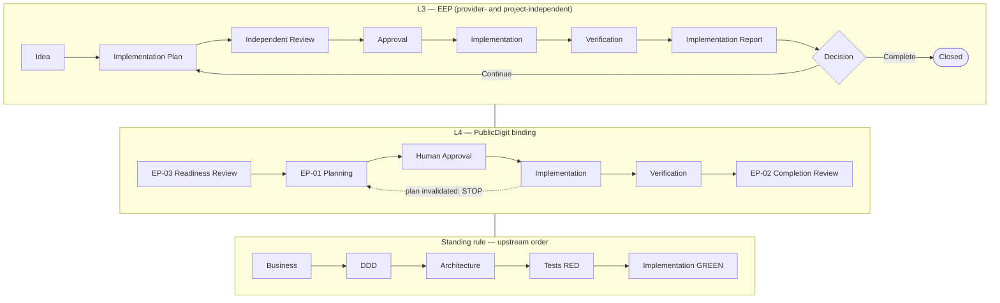

Load-bearing workflow rules, each verbatim in a governed source:
- **No stage may be skipped.** Depth scales with risk; the sequence does not.
- **Continuation is recursive and never implicit** — "a report that recommends further work does not authorize it."
- **Item 2 of the report is mandatory:** *changes deliberately NOT made* — "what was intentionally left untouched is as auditable as what changed."
- **One person or system may not occupy both Engineer and Independent Reviewer** for the same item.
- **Silent scope change is a protocol violation regardless of the quality of the result.**

**Automation status of this workflow: none.** The 2026-07-12 execution verification states it explicitly — the Architecture Governance flow is "the one flow with no automation."

---

## 11. Execution Architecture

### 11.1 Runtime moments (the provider-neutral abstraction)

`SESSION_START · PRE_ACTION · POST_ARTIFACT · SESSION_END · ON_DEMAND` — a closed enum in the registry, mapped by the binding to concrete provider hook events.

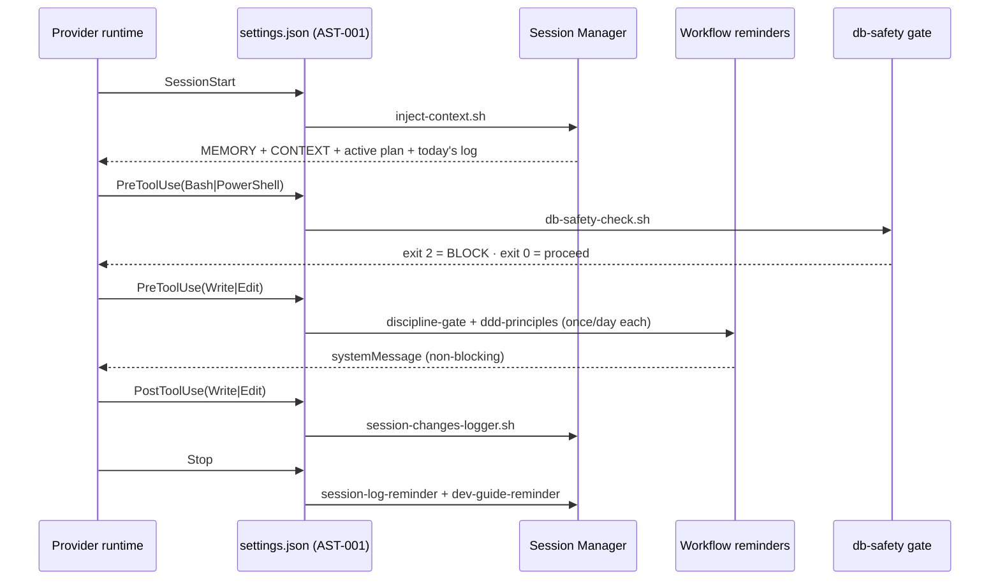

### 11.2 Execution constraints in force
- **No background daemons, no scheduled autonomous mutation, no auto-commit** (PD-12; Phase-03A §2 "Never" row). Verified: `settings.json` declares no scheduled entry point.
- **Escalation is an obligation, not an option** (PD-19).
- **No retry path exists** for a constitutional guard trip (PD-06) — halt + escalate, structurally.
- **Repository is the only persistence.** "No databases. No hidden state. No external services." Verified: the sole non-versioned state is `.claude/runtime/*`, explicitly non-authoritative and reconstructible.

### 11.3 Slice discipline
Every implementation slice is "an engineering experiment with **one objective, one approved plan, one completion review, one stopping point.** Never extend a slice because there is 'still time.'" Construction shall not be executed in a single session (R-21).

---

## 12. Verification Architecture

### 12.1 The verification chain

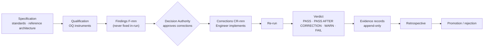

### 12.2 Rules that define this architecture
| Rule | Statement | Origin |
|---|---|---|
| Report-never-fix | A qualification never silently fixes what it finds | ES-003.1, derived from OQ-ENG-001's own friction |
| Verdict history is part of the verdict | A corrected failure is never re-labelled a clean pass | ES-003.1 — applied retroactively to OQ-ENG-001 itself |
| Distinct id series | `F-` findings · `CR-` corrections · `OQ-` qualifications | Each defect gets its own lifecycle |
| Score-persistence stop | Numeric review scores are conversational, never architectural | ES-003.2 |
| Instrument neutrality | Run → capture → PASS/FAIL → stop. No interpretation | R-26 |
| Measurement configuration is measurement semantics | Thread count, driver, invocation path belong to the recorded result | ES-003.3, from the F-7D-2 mutation-testing lesson |
| Falsifiability before active | No fitness function is active without a recorded RED run | Phase-02 §8 |

### 12.3 What is actually verified today

| Layer | Instrument | Status |
|---|---|---|
| Platform structure | OQ-ENG-001 (2026-07-10), OQ-ENG-002 (2026-07-11) | ✅ executed; both ACCEPTED with addenda |
| Platform decision-resolution | OQ-ENG-003 | ❌ **protocol only — never executed** |
| Platform gates | C3 / AST-010 | ❌ **never built, never run** |
| Platform fitness functions FF-1..17 | — | ❌ **zero implementations found anywhere in the repository** |
| Product architecture | Deptrac + `tests/Architecture` + PHPStan, CI-wired blocking merge gate | ✅ operating (evidence: "Deptrac report mode: 0 violations", Architecture 146✔) |

**This is the sharpest structural observation in the baseline:** the platform's *product-tier* verification is strong and machine-enforced, while the platform's *own* verification is entirely documentary. The Verification Engine that would close that gap is the component that was never built.

### 12.4 A notable verified property
The Constitutional Role Matrix records that **every one of the four roles produced at least one boundary crossing in a single engineering cycle, and every crossing was caught by the platform's own mechanisms** — Specification by the parsimony question, Execution by git and the discipline record, Verification by the neutrality review, and the Decision Authority by its own Option-B self-correction. This is measured, not designed.

---

## 13. AI Operating Model

### 13.1 The authority split
> **The AI decides wherever the outcome is a derived fact of an executable check; it recommends wherever the outcome is a judgment; humans hold every gate where authority, value, or entrenchment changes.** (Phase-02 §7)

| The AI may **never** (PD-01..12) | The AI **may** (PD-13..20) |
|---|---|
| Own architecture · approve ADRs · certify capabilities · modify governance | Write drafts (always entering as `generated`) |
| Create authoritative documents | Perform architecture review — **recommendation only** |
| Touch constitutional invariants, their guards, or anonymity-relevant code paths | Implement code **within an approved IDD micro-slice**, RED-first |
| Report a score/verdict/completion claim not derived from an executable check | Run executable checks and record verdicts |
| Assert an event that has not occurred | Derive and report progress — from WBS only |
| Rewrite history | Assemble session context from governed sources only |
| Review an artifact it produced | **Escalate — must**, on ambiguity, conflict, or authority uncertainty |
| Merge, or declare a ticket Done | Capture knowledge and propose promotions |
| Act autonomously in the background | |

Several of these are described as **structurally unconstructible rather than merely forbidden** — e.g. "APPROVED is unreachable inside the platform"; "certified is not a reachable state"; a verdict without an evidence ref "cannot be constructed."

### 13.2 Promoted reasoning behaviours (R-36 — the only amendment to the operating model since baseline)
Promoted from three independent implementation slices: ownership-determines-reuse · reuse-before-create · deferred ≠ skipped · **label epistemic status** (Observed · Measured · Derived · Interpreted · Recommended) · **at architectural uncertainty: stop** · implementation evidence outweighs unverified theory.

### 13.3 Standing operating discipline
- **Everything is temporary by default.** Nothing becomes permanent unless explicitly promoted.
- **Four economies:** Documentation · Governance · Registry · Session — each a filter question before any permanent record.
- **The success criterion is subtractive:** "fewer documents, fewer decisions, fewer arguments, fewer repeated explanations — and faster, safer implementation of PublicDigit."

### 13.4 Observed adherence
Documented, self-recorded deviations — evidence the model is real enough to be violated and caught:
| Deviation | Caught by | Disposition |
|---|---|---|
| TDD breach — production written before the failing test (PB-004 step 2) | human/ARB review; **no automation caught it** | corrected via stash→RED→pop→GREEN; recorded as a lesson |
| Session-log overwrite (append-only violation, 2026-07-11) | git | recovered within minutes; became ES-004.2's cited precedent and the *only* automation candidate with real incident evidence |
| OQ-ENG-001 fixed a finding in-run | the Decision Authority's acceptance review | tolerated once as "the discovery that produced the rule, not a precedent" |
| Verification instrument recommended a governance act ("Authorize C3") | the platform's own Neutrality Review | principle refined: *a verification instrument must protect its boundary even when the commission asks it to cross it* |
| A commission's placement premise was wrong (`docs/architecture/ai-architecture/`) | the placement litmus, applied honestly | commission stopped; **no documents created**; redirected to evidence |

---

## 14. Human Governance Model

### 14.1 Four roles, exclusive and non-overlapping

| Role | Exclusive decisions | Forbidden |
|---|---|---|
| **Specification** | what concepts, rules, and decisions exist and mean | executing · measuring its own compliance · deciding its own adoption |
| **Execution** | how to implement within an approved plan | silently changing direction · creating rules · self-certifying · fixing findings in-run |
| **Verification** | what the evidence shows | fixing findings · recommending governance actions · interpreting beyond measurement |
| **Decision Authority** | adoption · ratification · promotion · plan approval · qualification acceptance · freezes | implementing · measuring its own compliance · **being automated** · inferring its own decisions from praise |

Shared artifacts are **sequential interfaces, not overlaps** (EP-02: Execution authors → Decision Authority accepts).

### 14.2 Human decision events
The only authoritative facts in the domain: `ADRApproved` · `IDDApproved` · `CapabilityCertified` · `CertificationRefused` · `ArtifactFrozen` · `MergeApproved` · `ConstitutionalIncidentResolved` · `ArbReviewCompleted`. **No platform state transition may substitute for one** (the Authority Boundary).

### 14.3 Exclusive human rights
| Authority | Holds |
|---|---|
| Sponsor | constitutional value judgments; incident resolution |
| ARB | certification · freeze/unfreeze · governance and process changes · the platform's own constitution · vocabulary freeze |
| Chief Architect | ADR approval · IDD approval · merge approval |
| Knowledge owner | authority promotion of their items |

### 14.4 One recorded exception to the human governance rules
**R-39 (2026-07-26):** the DDD Tactical Governance Principles were promoted to the platform on evidence from **one** bounded context, where the rule requires more than one. The Decision Authority approved it, recorded it explicitly as an exception with its rationale and expected validation, and stated that "the multi-context bar continues to apply to FUTURE methodology promotions — this exception does not weaken the rule." This is the only observed instance of the governance model being overridden rather than followed, and it was overridden *in the open*.

---

## 15. Architectural Principles (inferred — implementation-supported only)

Each principle below is asserted **only** where implementation evidence supports it. Principles named in documents but without operating evidence are marked as such.

| # | Principle | Evidence that it operates |
|---|---|---|
| 1 | **Governance precedes automation; automation never defines governance** | Matrix concludes zero new hooks justified; four freezes; the one added hook came by explicit override recorded as such |
| 2 | **Evidence before authority** | Verdict-without-evidence is unconstructible by design; every report cites captured output |
| 3 | **Rules live once** | ES documents distinguish HOSTED from REGISTERED; DDD module bound, never copied; `.claude/CLAUDE.md` reduced to pointers |
| 4 | **Provider independence** | EEP mechanically verified: 0 provider names, 0 product names |
| 5 | **Product primacy** | AIP-14; iteration-close protocol; "no direct answer → stop and return to product work" |
| 6 | **Append-only history** | Rulings register, session logs, verdict history; the one overwrite was treated as a violation and recovered |
| 7 | **Assertion integrity** | `Phase-02.5-Capability-Certification.md` was *renamed* because certification had not occurred (R-7) |
| 8 | **Rule parsimony** | Applied against three separate proposed rules, including R-38 against itself |
| 9 | **Separation of duties** | Separate Ways in the context map; fresh-session constraints; producer ≠ reviewer |
| 10 | **The folder rule** — a directory exists only when its first artifact arrives | 13 subdirectories, zero empty (verified twice); reserved namespaces documented in a table instead of created |
| 11 | **Burden of proof reversed** | "Improvements without demonstrated insufficiency are rejected by default" (R-37) |
| 12 | **Demand-driven growth** | 0 commands, 0 agents, 0 skills after twenty days — deferrals honoured |
| 13 | **Measure, never score** | Metric freeze on four convergence dimensions; no composite indices anywhere |
| 14 | **Human approval boundaries** | APPROVED/CERTIFIED unreachable in platform models |
| 15 | **No hidden state** | Only `.claude/runtime/*` is unversioned and it is declared non-authoritative |

**Named but not yet operating (evidence not found):** *Deterministic Behaviour* (AIP-04) and *Reproducibility* (AIP-08) depend on the gate runner and immutability digests — neither exists. *Convergence* (ER-05/FF-13) is defined as a measured diff; no measurement instrument was found.

---

## 16. Architecture Diagrams

### 16.1 Governance flow

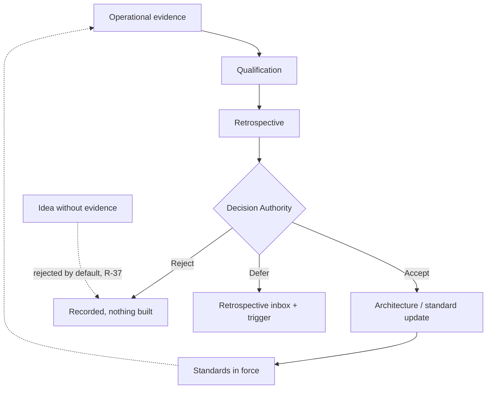

### 16.2 Verification flow (evidence to decision)

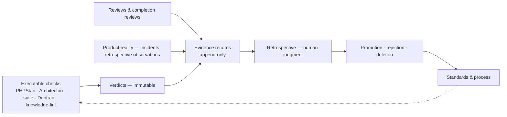
*Evidence has many sources and one destination: a human decision.*

### 16.3 Artifact lifecycle and the promotion crossing

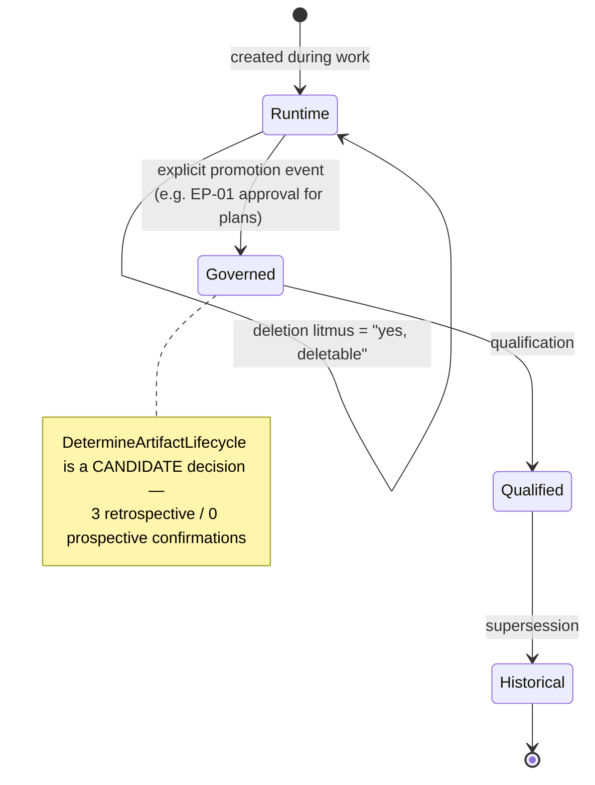

### 16.4 Where the platform sits

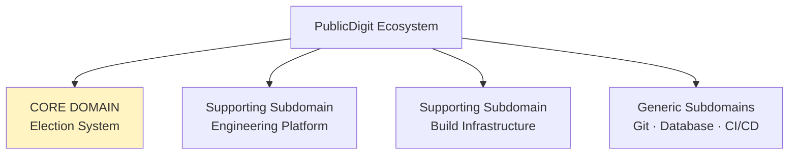

---

## 17. Architecture Strengths

1. **Epistemic labelling is enforced, not encouraged.** Five distinct status vocabularies coexist without collapsing: adoption (adopted/planned/deferred/deprecated), rule status (PROPOSED/DRAFT/Adopted/STABLE/FROZEN/SEALED), candidacy (candidate/research question/watch-item), verdicts (PASS/PASS AFTER CORRECTION/WARN/FAIL/INCONCLUSIVE/EMERGENT), and authority (authoritative/derived/generated/historical/provisional). The C3 readiness review verified that **no candidate has become normative**.

2. **The platform catches its own violations in all four role directions** (§12.4) — including against its own apex authority.

3. **Falsifiability is designed into the governance artifacts themselves.** The Project-State Synchronization protocol includes a "**no observable impact**" symptom category *specifically to make the hypothesis fail if inconsistencies occur without consequence*. The Artifact Promotion plan defines FALSIFIED and INCONCLUSIVE conditions before collecting evidence, and adds EMERGENT as a fourth outcome so surprises cannot silently become architecture.

4. **Refusal is a first-class outcome.** Recorded instances: a commission's premise rejected after the placement litmus failed (no documents created); an EEP amendment blocked by the EEP's own change policy; "no reference architecture needed" declared a *success* outcome of qualification.

5. **The sealed-corpus discipline is mechanically verified**, not merely asserted — six baseline documents confirmed byte-identical by sha1 across a repository migration, and `git diff --stat` showing "6 files changed, 0 insertions, 0 deletions."

6. **Registry-first is genuinely practised.** AST-010 was registered *before* implementation and has honestly carried `planned` for nineteen days rather than being quietly deleted or quietly claimed.

7. **Honest self-downgrades appear throughout** — an ARB convergence sketch corrected from 4/4 to 3/4 ("names follow evidence"); a plain PASS re-labelled PASS AFTER CORRECTION to preserve history; "Operationally Validated" explicitly redefined as *validated to be caught when violated*, not *proven never violated*.

8. **The Core Domain owns the least code.** Design & Decision Support is `adopted-by-reference` with zero implementation — a coherent expression of "the architecture never executes; the Engineer consults it."

---

## 18. Architectural Risks (descriptive only — no remediation proposed)

Per the commission, these are recorded, not solved. Each is evidence-anchored.

| # | Observation | Evidence | Class |
|---|---|---|---|
| **A-1** | **The mandatory executable gate has never run.** C3 / AST-010 declared ready 2026-07-11; `run-gates.sh` absent 2026-07-27; no dated OQ-ENG-003 record exists | filesystem + directory listing | Structural — the platform's own "single minimal gap" (OQ-ENG-002 E-4) |
| **A-2** | **The constitutional layer remains PROPOSED.** All six ES documents + the index still read "PROPOSED — awaiting ARB review"; Decision Model and Reference Architecture remain DRAFT | grep of status headers | Governance — predicted as risk R-a, still live |
| **A-3** | **A self-referential dependency in the evolution path.** Change requires operational evidence (R-37); operational evidence requires the gate runner; the gate runner requires a construction slice that is itself paused behind the freeze sequence | R-37 + C3 status | Structural, descriptive |
| **A-4** | **Six of seven specified Tier-1 blocking gates have no implementation.** Only db-safety exists; and it was cosmetic (exit 1) from creation until the 2026-07-12 exit-2 fix | Phase-02 §6 vs `settings.json` + script bodies | Specification-vs-implementation delta |
| **A-5** | **Zero platform fitness functions implemented.** FF-1..17 are defined; `verification/fitness-functions/` is a reserved namespace with no artifacts | README reserved table; no matches in repository | Specification-vs-implementation delta |
| **A-6** | **README information map is stale.** `knowledge/methodology/` and `verification/qualification/` exist on disk but appear in neither the information map nor as removed rows of the reserved-namespace table — where `verification/qualification/` is still listed as *reserved*. **This document's own directory, `developer_guide/`, adds a third unmapped folder** and partially fulfils the reserved `developer/guides/` row under a different name | README §Information map + §Reserved namespaces vs `find` | Documentation currency; note the OQ E-2 instrument checks exactly this property |
| **A-7** | **README states "16 diagrams" for the C4 views; the file contains 17 mermaid blocks** across 12 sections (§12 was appended 2026-07-12) | `grep -c '```mermaid'` = 17 | Documentation currency |
| **A-8** | **Load-bearing runtime files carry no registry identity.** `.claude/CONTEXT.md` and `.claude/MEMORY.md` are injected at every session start and CONTEXT is the declared plan authority, yet neither has an AST id; `settings.local.json` and the `enabledPlugins` entry in `settings.json` are also unregistered | registry (14 assets) vs `.claude/` contents | Registry-first coverage gap |
| **A-9** | **AST-008 persists as a registry entry pointing at a file that does not exist**, across two qualifications (F-OQ-2 → F-OQ2-3). It is now correctly unwired from `settings.json`; the scheduled removal ("next release", R-36) has not occurred | registry vs filesystem vs settings.json | Known, dispositioned, unclosed |
| **A-10** | **NF-1 remains open by choice:** `DetermineArtifactType`'s resolution procedure points at an "authorized-type index" that does not exist as an artifact. It was deliberately left unrepaired as an organic probe for OQ-ENG-003's sufficiency question — which has not run | C3 delta report §3 + grep | Documentation gap, intentionally preserved; its probe never fired |
| **A-11** | **Platform ≙ Adoption interweaving.** 20 of 24 engineering files referenced PublicDigit at audit; the constitutional core clones cleanly, the adoption evidence does not. Split trigger is a real second adopter | OQ-ENG-002 E-3 | Recorded condition with a named trigger |
| **A-12** | **Four cumulative freezes (R-27, R-29, R-37, R-38)** govern the same corpus. The platform itself questioned whether the fourth added anything and concluded it did not | rulings register | Governance density, self-identified |
| **A-13** | **Runtime "iteration 1" framing has diverged from the product track.** The registry still declares `iteration: 1` and CONTEXT's parallel-track block still names C3-then-PB-004, while the product has progressed through EPIC-001..004 to WP-1 | registry + CONTEXT.md | Currency of runtime configuration |
| **A-14** | **Two "deferred" components have version 0.0 and no reconsideration date** — only triggers. CMP-003 and CMP-006 have been 0.0 since the registry's creation | registry | By design (demand-driven), recorded for visibility |
| **A-15** | **The platform's strongest verified property is product-tier, not platform-tier.** Deptrac/PHPStan/Architecture-suite enforcement is CI-blocking and proven; the platform's own verification is entirely documentary | execution verification report + gate configs | Asymmetry, descriptive |

**Evidence not found (recorded as gaps, not designed around):** no fitness-function implementations · no gate-verdict ledger · no traceability-chain instrument · no capability registry beyond the CMP/AST tables · no immutability digests · no measured context/bootstrap budgets (EPC-002 has 0 implementation evidence) · no second adopting project · no retrospective record for the AIP track itself.

---

## 19. Evidence Appendix

Every architectural statement above traces to one of the following, all read in full during this reconstruction.

### Read in full — `engineering/` (45 text artifacts, 2 PDFs not read)
| Group | Artifacts |
|---|---|
| Entry & migration | `README.md` · `MIGRATION_REPORT.md` |
| ADR | `ADR-AIP-01-…Baseline-v1.0.md` · `ADR-AIP-02-Product-Primacy.md` · `ADR-AIP-LOG-Platform-Rulings.md` (R-30..R-39) |
| Sealed baseline | `Phase-01-Discovery.md` · `Phase-02-Domain-Model.md` · `Phase-02.5-Certification-Plan.md` · `Phase-02.6-Ubiquitous-Language.md` · `Phase-02.7-Platform-Decisions.md` · `Phase-03A-Reference-Architecture.md` |
| C4 | `AI_Engineering_Platform_Views.md` (17 mermaid blocks) |
| Reference | `Engineering_Platform_Reference_Architecture.md` · `Engineering_Decision_Model.md` |
| Governance | `STANDARDS_INDEX.md` · `ES-001` … `ES-006` · `Engineering_Execution_Protocol.md` |
| Knowledge | `DDD_Tactical_Governance_Principles.md` · `engineering_pattern_cards_agent_skills.md` (EPC-001..010 + Evidence Register) · two sibling harvest dossiers (surveyed) |
| Qualification | `2026-07-10-OQ-ENG-001.md` · `2026-07-11-OQ-ENG-002.md` · `OQ-ENG-003-…Protocol.md` · `Artifact-Promotion-Candidate-Qualification-Plan.md` · `Project-State-Synchronization-Observation-Protocol.md` |
| Verification reports | platform-readiness · constitutional-role-matrix · c3-readiness-delta · verification-instrument-neutrality · artifact-promotion-pattern-validation · execution-verification · artifact-lifecycle-verification · ai-architecture-reconstruction · knowledge_architecture_validation · two 2026-07-08 architecture reviews · provider-independence-strategies · Architecture Upgrade Assessment |

### Read in full — runtime (`.claude/`)
`platform/registry.yaml` (333 lines) · `platform/OPERATING_INSTRUCTIONS.md` · `settings.json` · `settings.local.json` · all 7 hook scripts · `CONTEXT.md` (platform blocks) · `developer_guide/ai_platform/00_ai_engineering_architecture.md`

### Executed checks (this session)
| Check | Command / method | Result |
|---|---|---|
| Engineering corpus size | `find engineering -type f` | 47 files · 14 directories (root + 13), **measured before this document existed**; adding it makes 48 files · 15 directories |
| Registry counts | `grep -c '^  - id: CMP-/AST-'` | **8 components · 14 assets** |
| Gate runner existence | `ls .claude/scripts/run-gates.sh` | **No such file or directory** |
| OQ-ENG-003 execution record | `ls engineering/verification/qualification/` | 5 files; **no dated OQ-ENG-003 record** |
| Standards ratification status | `grep '^\*\*Status:\*\*' ES-00*.md STANDARDS_INDEX.md` | **7/7 PROPOSED** |
| C4 diagram count | `grep -c '```mermaid'` | **17** (README says 16) |
| Hook wirings | read of `settings.json` | **7** command wirings across 4 events |
| Commands / agents / skills | `ls .claude/{agents,commands,skills}` | **all three absent — 0/0/0** |
| Directory drift vs README map | `find` vs README §Information map | `knowledge/methodology/`, `verification/qualification/` present, unmapped |
| Recent platform history | `git log --oneline -8 -- engineering/` | last change 2026-07-26 (R-39 / DDD module + AST-014) |

### Platform Cost (derived per AIP-14 — counts, never scores)

| Dimension | Baseline 2026-07-08 (ADR-AIP-02) | Derived 2026-07-27 | Δ |
|---|---|---|---|
| Components | 8 | 8 | 0 |
| Registry assets | 11 | 14 | +3 |
| Scripts | 6 | 7 | +1 |
| Hook wirings | 8 | 7 | −1 |
| Commands | 0 | 0 | 0 |
| Agents | 0 | 0 | 0 |
| Registry lines | 283 | 333 | +50 |

Derived from the registry, settings, and filesystem as AIP-14 prescribes. The runtime surface has grown by one script and one net-negative hook wiring in nineteen days, while the governance corpus grew from 24 to 47 files. **Reported as measured; interpretation belongs to the retrospective, not to this document.**

---

## 20. Architecture Baseline Summary

**The PublicDigit Engineering Platform, as implemented on 2026-07-27, is a fully specified and partially constructed engineering governance architecture.**

| Dimension | State |
|---|---|
| Concerns separated | ✅ Product · Engineering · Runtime, migration-audited (EM-001) |
| Domain model | ✅ 6 bounded contexts + 2 external domains, frozen, with a context map and aggregate model |
| Constitution | ✅ written (PD-01..20 · AIP-01..14 · ES-001..006) — ⚠️ **PROPOSED, unratified** |
| Execution protocol | ✅ **Adopted · STABLE**; provider- and project-independent, mechanically verified pure |
| Decision architecture | ✅ 8 decisions catalogued with authorities and procedures — ⚠️ **DRAFT, adoption earned through use** |
| Components declared | 8 (CMP-001..008) |
| Components functionally implemented | 5 of 8 (CMP-003, CMP-006 deferred at 0.0; CMP-005 at 0.1) |
| Runtime assets | 14 registered · 12 present · 1 planned-absent · 1 deprecated-absent |
| Tier-1 blocking gates | 1 of 7 specified |
| Platform fitness functions | 0 of 17 implemented |
| Qualification runs executed | 2 of 3 (OQ-ENG-003 never run) |
| Executable platform gate (C3) | ❌ **never executed** |
| Freeze regime | 4 cumulative freezes in force |
| Own verdict on itself | **`FUNCTIONALLY STABLE — CONSTITUTIONALLY INCOMPLETE`** (OQ-ENG-002, Decision-Authority-refined) |

### Maturity assessment (evidence-supported; no scores)

| Area | Level | Evidence |
|---|---|---|
| Governance | **Institutionalized** | Rulings register operating with self-correction; role separation verified in all four directions; explicit-adoption-only rule held against inference three times |
| Documentation & records | **Institutionalized** | One canonical home per rule; HOSTED/REGISTERED discipline; append-only honoured, with the single violation recovered and recorded |
| Knowledge governance | **Managed** | Promotion ladder defined and applied; 5 harvests with a shared artifact shape; metric freeze holding — but promotion evidence is still mostly retrospective (3 retrospective / 0 prospective for the live candidate) |
| Specification / architecture | **Managed** | Complete, internally consistent, and reviewed — but formally unratified, and its two reference documents remain DRAFT pending one full cycle of use |
| Execution discipline | **Defined** | The protocol is followed and its violations are caught; enforcement is human/review-based with no automation on the governance flow |
| Verification (platform's own) | **Emerging** | Two OQ runs executed; the lifecycle rule was derived from real friction; but the executable instrument was never built and no fitness function exists |
| Runtime construction | **Emerging** | 7 scripts, 1 blocking gate (fixed 2026-07-12), 0 commands, 0 agents; Iteration 1 slice C3 unexecuted since 2026-07-08 |
| Provider independence | **Managed** | Mechanically verified pure at the protocol layer; unproven in practice — no second binding and no second adopter exists |
| Reusability across projects | **Emerging** | Clone test run once (OQ-ENG-002 E-3): constitutional core clones cleanly, adoption evidence interweaves; the split trigger requires an adopter that does not exist |

### The one-sentence baseline

> **This is an architecture that has thought its way to a very high standard of governance discipline and has been unusually honest about the gap between what it has specified and what it has built — and the single largest item in that gap is the instrument by which it was supposed to prove itself.**

---

*This document describes the architecture that exists. It proposes no change, adopts nothing, and creates no governance. Statements are Observed, Measured, or Derived per R-36 §4; where evidence was absent this document says "Evidence not found" rather than inferring. **STOP — submitted to the Decision Authority.***

*Traceability: Decision Authority commission 2026-07-27 (Phase 1 Current State Architecture Discovery) · evidence inventory §19 · freeze exception per the explicitly-commissioned path (precedent: `verification/reports/2026-07-12-artifact-lifecycle-verification-report.md`) · placement directed by the Decision Authority, ES-005.3 assessment recorded in the header.*
