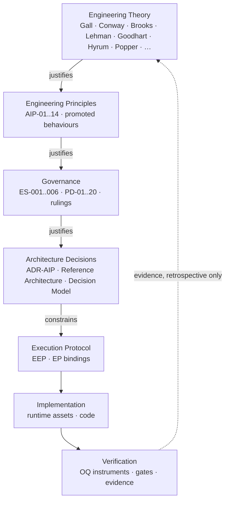

# AI Engineering Platform — Engineering Theory Reference

**Phase 2 — Engineering Theory Reconstruction (Current State)**

| | |
|---|---|
| **Class** | Engineering Platform reference — **theory reconstruction** (evidence discovery, not design) |
| **Authority** | Generated (AI-produced; never authoritative without human review — AIP-10/PD-05) |
| **Status** | **DRAFT — submitted to the Decision Authority.** This document adopts nothing, promotes nothing, and creates no governance (ES-001.2). It is **input to a future decision**, per the commission's own sequencing: *"Only after that reference is reviewed would we consider whether any new governance is justified."* |
| **Commission** | Decision Authority, 2026-07-27 (Phase 2, issued at acceptance of the Phase 1 baseline): *"Identify the engineering theories, laws, and first principles that already underpin the architecture, determine where they are implicit or explicit, and produce an Engineering Theory Reference that links enduring software engineering laws to the platform's principles and governance model. Do not modify the platform."* |
| **Method** | (1) Mechanical scan of the governance corpus for named laws (grep sweep, 26 terms — results in §10); (2) per-law mapping against the Phase 1 evidence base (all governed artifacts read in full during Phase 1, same session lineage); (3) reverse mapping from rule families to laws; (4) honest gap register. Every mapping cites its artifacts. |
| **Companion** | `AI_Engineering_Platform_Architecture_Baseline_Current_State.md` (Phase 1 — the *what*; this document is the *why*) |
| **Freeze note** | Proceeds under the explicitly-commissioned exception to R-37/R-38, same basis as Phase 1 and the 2026-07-12 verification reports. Introduces no new concept into the platform — the "Engineering Theory layer" discussed in §8 is recorded as the commission's proposal plus the platform's own pre-existing reserved question, **not** as adopted structure. |
| **Placement note** | Beside the Phase 1 baseline in `engineering/developer_guide/`, per the Decision Authority's Phase 1 placement direction. If the reference is ever adopted as governed knowledge, ES-006.3 (harvest discipline) and ES-005.3 suggest a `knowledge/`-tier home — that is a Decision Authority call at review, recorded here so the move is a decision, not drift. |

---

## 1. Executive Finding

**The platform's governance corpus names zero canonical software engineering laws — and embodies most of them.**

A mechanical scan of every governed artifact (`engineering/`, `.claude/platform/`, the runtime binding, and the frozen/draft process documents) finds **no occurrence** of Gall, Conway, Brooks, Lehman, Goodhart, Hyrum, Tesler, Occam, Parkinson, Hofstadter, Postel, Popper, Dijkstra, Chesterton, "second-system", "silver bullet", or "leaky abstraction". YAGNI and KISS each appear exactly once — as *descriptions of the rejected claude-flow scaffold's content* (Phase-01 §7 harvest provenance), never as platform rules.

Yet the reconstruction below finds that of ~20 canonical laws examined, the platform **embodies 14 as operating controls**, **explicitly names 2** in law-family vocabulary (AIP-05 Separation of Duties, AIP-06 Least Authority), **deliberately inverts 1** (Postel), and **empirically confirms 1 against itself** (Hofstadter). The platform's grounding is real but *empirical and home-grown*: rules were derived from lived evidence (the claude-flow autopsy, the fabricated-metrics finding, the session-log overwrite, the TDD breach) and expressed in the platform's own vocabulary — "rule parsimony" where the canon says Occam, "falsifiability" where the canon says Popper, "burden of proof" where the canon says Gall/YAGNI.

Three consequences of this finding, stated descriptively:

1. **The current justification chain is one level shallow, exactly as the commission hypothesised.** Rules answer "why?" with "because we evolved it" (AIP-13, R-26's derivation from friction, ES-003.1's derivation from OQ-ENG-001). That is legitimate — the platform's own epistemics rank implementation evidence above theory (R-36 §6). But the *converse* also holds and is currently unexploited: where an independent, decades-old law converges with a rule the platform derived from three weeks of evidence, the law is **independent corroboration at zero cost** — precisely the "independent sources" dimension the Pattern Evidence Register already treats as promotion-relevant (source breadth prioritises; implementation evidence decides).

2. **The platform has begun minting its own laws** — the *PublicDigit Law of Architectural Evolution*, the *rejection-path law*, the *measurement law*, the *first-class-element law* (pattern dossier, notes j–s; all candidate-tier, unpromoted). §7 maps each against the canon: most reduce to compositions of canonical laws; at least one (the rejection-path law) is a genuinely distinctive formulation.

3. **The platform already reserved the conceptual slot a theory layer would occupy.** The maturity ladder labels *"Principle = research question"*, and the ARB explicitly deferred whether *Engineering Principle* is "a distinct domain object above Capability (`Principle → Capability → Pattern → Evidence`) — or merely a heading in the Standards", gated on implementation evidence. The commission's proposed Engineering Theory layer is that deferred question, asked from the theory side. This reference is evidence *toward* it, never a resolution *of* it.

---

## 2. The Usage Rule (from the commission — governing how this reference may ever be used)

> **Engineering laws justify principles. Principles justify governance. Governance justifies architecture. Architecture constrains implementation. Laws never directly govern implementation.**

Two platform-native reasons this indirection is mandatory, both already on record:

- **R-26 / instrument neutrality:** a law wired directly into a gate would smuggle interpretation into a measuring instrument. Laws are interpretive by nature; instruments must not be.
- **Goodhart (see §5):** an empirical law turned into a rigid coding rule becomes a target and stops describing reality — the platform's own score-persistence stop is this insight, applied to metrics; the usage rule applies it to theory.

**Corollary (epistemic):** the laws below are *empirical regularities and design heuristics*, not theorems. Under the platform's own maturity vocabulary they enter at the tier their evidence supports — most are the theory-side analogue of "Pattern = proven across many industries, unproven as a citation in this platform." They corroborate; they do not command.

---

## 3. Classification Vocabulary (used throughout)

| Classification | Meaning |
|---|---|
| **EXPLICIT** | The law (or its family vocabulary) is named in a governed artifact |
| **IMPLICIT** | The law is embodied as an operating rule/control, but never named |
| **PARTIAL** | Embodied in some of its consequences, absent in others |
| **INVERTED BY DESIGN** | The platform deliberately practises the law's opposite, with a defensible rationale |
| **EMPIRICAL CONFIRMATION ONLY** | No control embodies it; the repository record *demonstrates* it |
| **NO MAPPING FOUND** | Honest absence — recorded, not manufactured |

---

## 4. The Law Catalog — canon → platform

### 4.1 Gall's Law — *"A complex system that works is invariably found to have evolved from a simple system that worked."* — **IMPLICIT (load-bearing)**

| Platform embodiment | Evidence |
|---|---|
| Construction resolution: the first objective is "a **minimal, working** AI Engineering Platform capable of supporting a single PublicDigit feature" — never feature completeness | ADR-AIP-01 Addendum |
| Iterations: It-1 minimal → It-2 refine from lessons → It-3+ only if evidence-justified | R-20 |
| AIP-13 Implementation-Driven Evolution; R-29 "no platform change unless a feature demonstrates insufficiency" | Phase-02.5 §3 · rulings register |
| The promotion ladder itself: Research → Pilot → Qualification → Standard — nothing arrives complex | ES-006.1 |
| **The founding counter-example:** claude-flow — a 346-file complex system adopted whole — examined and **rejected as migration target**; "~90% of files inert", governance theatrical | Phase-01 §0/§2 |

*Justifies:* R-29, R-37 burden of proof, the iteration model, ES-006.1. The platform's genesis decision (reject the complex working-looking system; grow a simple working one) is Gall's Law enacted before any rule existed.

### 4.2 Second-System Effect (Brooks) — **IMPLICIT (named in effect, not in name)**

ADR-AIP-02's context paragraph *is* this law, minus the citation: "the platform starts producing platform work — C1 → C2 → C3 → registry → validator → … — **until it exists for itself**. The claude-flow specimen … is the terminal form of that failure." The control is AIP-14: platform-only iterations exceptional; **two consecutive platform-only iterations trigger an over-evolution review**. *Justifies:* AIP-14, the iteration-close protocol, the Platform Cost metric.

### 4.3 No Silver Bullet (Brooks) — essential vs accidental complexity — **IMPLICIT**

The platform's sharpest applied instance: the Execution Verification Report's conclusion that aggregate-boundary *quality* "can reach the protected branch unless review catches it — **by the nature of the principle, not a gap**", and that real-time blocking on judgment calls "is not feasible or even desirable." Essential complexity (modeling judgment) is deliberately kept human; automation is confined to accidental complexity (vocabulary scans, dependency direction, structure). The entire Decision Authority & Verification Matrix — separating what Machines, AI, and Humans each decide — is an essential/accidental partition. *Justifies:* the matrix's "zero new hooks" conclusion; DDD enforcement living in Architecture Governance rather than hooks; CMP-007 (Core Domain) owning no code.

### 4.4 Brooks's Law proper (*adding manpower to a late project makes it later*) — **NO MAPPING FOUND**

The platform governs a single-engineer-plus-roles operating model; schedule/manpower coupling is not a governed concern anywhere in the corpus. Recorded as honest absence — manufacturing a mapping (e.g. via "one objective per slice") would stretch the law past its content.

### 4.5 Conway's Law — *system structure mirrors communication/authority structure* — **IMPLICIT (practised as the inverse-Conway manoeuvre)**

The platform did not drift into Conway alignment; it **designed the authority structure first and made the architecture conform**:

- Bounded contexts were split **by ubiquitous language**, "only where the project itself has already drawn a linguistic boundary" (Phase-02 §2.0) — boundaries of discourse became boundaries of software.
- The four constitutional roles (Specification · Execution · Verification · Decision Authority) generate the four artifact families (standards · plans+code · OQ records · rulings) — verified non-overlapping in the Constitutional Role Matrix.
- **Separate Ways between BC-6 and BC-5** is an organizational rule (discover ≠ check) expressed as a context-map relationship.
- The three-concern repository split (Product / Engineering / Runtime) mirrors the three authority domains (product governance / ARB / provider tooling).

*Justifies:* ES-005.1, the context map, producer ≠ reviewer, the god-context rejection ("it would fuse four languages the constitution keeps apart" — Conway stated linguistically).

### 4.6 Lehman's Laws of Software Evolution — **IMPLICIT (three of the eight)**

| Lehman law | Platform control | Evidence |
|---|---|---|
| I — Continuing Change | Continuous Evolution model: feature → observation → retrospective → one amendment; "baseline" chosen over "closed" — *stable → validated → evolves by amendment* | R-27 §3 · ADR-AIP-01 |
| II — Increasing Complexity (*unless work is done to reduce it*) | ER-05 Convergence: every iteration reduces or maintains complexity; increases require an ADR. Plus the Minimalism duty: "Can anything be **deleted**? … The platform should continuously become smaller" | v1.1 §ER · AST-013 §Minimalism |
| VIII — Feedback System | The evolution path is a closed measured loop: Evidence → Qualification → Retrospective → Decision → Update — and *only* that loop | Reference Architecture §7 |

*Justifies:* ER-05, the retrospective as the sole amendment channel, the subtractive success criterion.

### 4.7 Goodhart's Law — *"When a measure becomes a target, it ceases to be a good measure."* — **IMPLICIT (the platform's most thoroughly embodied law)**

| Platform control | Evidence |
|---|---|
| **The founding lesson:** claude-flow's undefined "truth score" *empowered to auto-rollback* — an opaque metric with authority — classified a governance hazard and rejected | Phase-01 §3 C11 |
| Score-persistence stop: numeric review scores never persisted; records carry governance states + rationale | ES-003.2 |
| Metric freeze: four convergence dimensions are ENOUGH; "no weighted scores, percentages, confidence formulas, or composite indices; the measurement system must stay simpler than the decisions it supports" | pattern dossier §Convergence (3) |
| Harvest-rate deliberately **not** persisted — a "mostly No" harvest is a *qualitative* health signal only, precisely so that Yes-counts never become a target | ES-006.4 |
| "Measure outcomes, not inventory — never counts of prompts/agents/hooks"; R-33 "supersedes any file-count framing" | guide 00 §19 · R-33 |
| The forbidden framing "can we create a new rule?" — "asking for rules makes people find rules" (observer-expectancy, Goodhart's cousin) | ES-006.4 |

*Justifies:* ES-003.2, the metric freeze, R-33's outcome criteria, honesty invariant adjacencies. Also the deepest reason for §2's usage rule.

### 4.8 Hyrum's Law — *"With enough users, all observable behaviors of your system will be depended on."* — **PARTIAL / IMPLICIT**

Embodied for identity and history: "**Paths change; ids never do.** ADRs and reviews reference ids, not paths" (registry header) — a stability contract for the platform's observable surface. AST-008's deprecate → one-release migration window exists "for any remaining local consumer to migrate". Historical records are never path-updated because their contents are depended on *as history* (ES-004.2). Not embodied: no rule governs observable *behavioral* surface of the runtime scripts (their output formats are unversioned). With one adopter, Hyrum pressure is minimal — the law's weight arrives with the second adopter, the same trigger the Platform ≙ Adoption split already names.

### 4.9 The Law of Leaky Abstractions (Spolsky) — **IMPLICIT**

The Provider Binding is designed as a leak-containment vessel: it "contains **zero** engineering judgment (it translates, never decides); provider vocabulary appears nowhere outside it" — with **FF-15 defined as a leak detector** (static scan for provider identifiers outside the seam). The platform also *accepts* one leak honestly rather than abstracting it away: the `.claude/` mount point "is dictated by tooling — like `.git/`", named as geography, not architecture. The R-10 litmus ("would this survive replacing the provider?") is a leak test applied at design time. *Justifies:* AIP-07, FF-15, Phase-03A §7 binding rules. *(Caveat the law itself predicts: FF-15 is defined but unimplemented — the seam is currently guarded by review, not by the scanner.)*

### 4.10 Tesler's Law (conservation of complexity) — **PARTIAL / IMPLICIT**

Complexity is moved to its right owner rather than denied: the EEP stays simple *because* project-specific complexity is pushed into bindings ("projects bind it; they do not fork it"); judgment complexity is kept with humans rather than faked in automation (§4.3); and the capability-cost candidate ("every capability must justify its own operational cost — conceptual beauty is not justification") prices the complexity someone must carry. Not embodied as a stated conservation principle anywhere.

### 4.11 Occam's Razor / parsimony — **EXPLICIT in substance (named "Rule Parsimony", 9 files)**

ES-001.1 is Occam applied to governance: "on any recurring problem, FIRST ask: does an existing rule already cover this?" The three stopping rules (ES set · Decision Model · R-38) all instantiate it, and the razor demonstrably **cut its own wielder**: R-38 was corrected same-day to "introduces NO new governance" when the Decision Authority questioned the necessity of its own consolidating ruling. *Justifies:* ES-001.1, the stopping rules, the "fold as a clarification, not a new rule id" disposition at OQ-ENG-002 E-4.

### 4.12 Parkinson's Law — *work expands to fill the time available* — **IMPLICIT (near-verbatim control)**

AST-013 Construction Discipline: "**Never extend a slice because there is 'still time.'** Never implement 'while we're here' improvements. Never bundle unrelated work. Finish. Verify. Stop." One objective, one plan, one completion review, one stopping point per slice. *Justifies:* the slice discipline; the Session Economy ("what is the smallest permanent record required?").

### 4.13 Hofstadter's Law — *it always takes longer than you expect, even accounting for Hofstadter's Law* — **EMPIRICAL CONFIRMATION ONLY**

No control embodies it. The record demonstrates it: C3 + OQ-ENG-003 were recommended "to run **immediately** upon ratification" (2026-07-11); sixteen days later neither ratification nor execution has occurred (Phase 1 baseline, findings A-1/A-2). Recorded as what it is — a law the platform confirms rather than manages. Whether that gap deserves a control is a Decision Authority question, out of this reference's scope.

### 4.14 Postel's Law — *"Be liberal in what you accept, conservative in what you send."* — **INVERTED BY DESIGN**

The platform is **conservative in what it accepts**, everywhere:

- Deny-by-default configuration: "deny-by-default for anything not declared" (Phase-03A §3);
- The extension model: "**Closed by default**; extension is a governed act, never a drop-in file" (§5);
- Vocabulary: reserved terms usable only in defined senses; forbidden-terms table (Phase-02.6 §3–4);
- The harvested *deny-first authority design* pattern: "the deny list is the important half";
- Class-D governance: nothing enters by inference, suggestion, or praise — explicit adoption only (ES-001.2).

The inversion is coherent, not accidental: Postel's polarity optimises for interoperability among cooperating peers; a governance system for an election platform optimises for integrity against drift, and liberal acceptance is precisely how ungoverned material becomes architecture (the platform's recurring failure class — R-34, R-36's ungoverned-artifact citation, the mermaid-draft finding). The modern security critique of Postel's law converges with the platform's stance. *Recorded as a deliberate inversion; no change implied.*

### 4.15 Popperian falsifiability — **EXPLICIT in substance (the word appears in 11 files; the author nowhere)**

The platform's epistemic backbone: no fitness function is active without a **recorded RED run** (FalsifiabilityProof is a value object; "detect a synthetic violation" is the definition of the proof); the review method is **attempt-to-reject** — "approval only where objective evidence defeats every rejection attempt", conjectures-and-refutations as protocol; observation protocols pre-declare their FALSIFIED conditions, including the "no observable impact" symptom added *specifically to strengthen falsifiability*; the knowledge freeze declares the theory "complete-enough-**to-be-falsified**". The candidate *rejection-path law* (§7) generalises it. *Justifies:* FF falsifiability rules, attempt-to-reject, the four-outcome qualification taxonomy (CONFIRMED / FALSIFIED / INCONCLUSIVE / EMERGENT).

### 4.16 Dijkstra's dictum — *testing shows the presence, not the absence, of bugs* — **IMPLICIT**

Stated in the platform's own words as the glossary boundary of "Operationally Validated": "**validated to be caught when violated, not proven to never be violated** — a deliberately more modest claim than the evidence would otherwise be read as making" (Execution Verification Report, cross-cutting finding). *Justifies:* the honest bounding of every verification claim; the bypass-question split (violable during development? / can it reach the protected branch?).

### 4.17 Chesterton's Fence — *never remove a fence until you know why it was put up* — **IMPLICIT (extended to absence)**

The DDD Tactical Governance module encodes the fence twice, and extends it in a direction the canon does not:

- **DMT** is the fence procedure verbatim-in-substance: dormant implementation "must be classified through evidence, never intuition or default labels" before disposal;
- **ASP** is the fence *inverted onto absence*: "the **absence** of an architectural element is a decision, not a default — rejected candidates and deliberate non-events shall be recorded together with their rationale and reversal conditions", so "why isn't there an X?" always has an answer on record. The reserved-namespace table (documented, never created) and the "deferred ≠ skipped" promoted behaviour are the same fence around holes.

*Justifies:* ASP, DMT, the reserved-namespace convention, R-36 behaviour 3.

### 4.18 YAGNI — *you aren't gonna need it* — **IMPLICIT (named only as provenance of the rejected scaffold)**

Embodied structurally: the folder rule (a directory exists only when its first artifact arrives); 0 commands, 0 agents, 0 skills after the entire construction period; deferred components held at version 0.0 with triggers instead of roadmaps; and the candidate axiom chain "**No Product Need → No Capability → No Pattern → No Standard → No Automation** — automation is always last." The demand-driven-growth pattern card records 3/4 independent source convergence, with claude-flow as the counter-example (346 speculative files). *Justifies:* ES-005.2, AIP-14, R-37's rejected-by-default posture.

### 4.19 DRY — *don't repeat yourself, single point of truth* — **IMPLICIT (re-derived as "rules live once")**

The platform independently re-derived DRY for governance text and enforces it harder than most codebases enforce it for code: the HOSTED/REGISTERED distinction (a rule's full text lives in exactly one canonical home; every other occurrence is a pointer); ES-005.4 "Never a Copy"; the Decision Model as "a decision INDEX, never a second rulebook"; bindings that point and never restate (DDD module, AST-014's comment block: "POINTS, NEVER RESTATES"). The consolidation's stated purpose — curing the duplication that OQ-ENG-002 found — is DRY's rationale verbatim: divergence risk. *Justifies:* the entire ES consolidation architecture.

### 4.20 Saltzer–Schroeder security principles — **EXPLICIT (two of eight named as AIPs)**

The only canon the platform names outright, presumably via the security literature rather than SE folklore: **AIP-06 "Least Authority"** (least privilege: everything emitted is `generated`/`provisional`; read-only toward constitutional guards; zero write-path) and **AIP-05 "Separation of Duties"** (producer ≠ reviewer, structural; discover ≠ decide ≠ check ≠ entrench). Fail-safe defaults appears unnamed as deny-by-default (§4.14). *Justifies:* PD-01..12, the action-space asymmetry, Separate Ways.

### 4.21 Bounded rationality / attention limits (Simon) — **IMPLICIT**

EPC-001's problem statement is the theory in one line: "**bounded attention** — loading everything up front wastes the context that decisions depend on." Progressive disclosure, context economy budgets, and the ≤3-documents onboarding criterion are its controls — and the register honestly records 0 implementation evidence for the budgets (candidate, unbuilt).

### 4.22 CAP theorem — **NO MAPPING FOUND (platform tier)**

The platform has no distributed state: one repository, one source of truth, no concurrent writers by design (PD-12 forbids background mutation). CAP genuinely operates one tier down, in the **product**: the outbox/inbox messaging architecture, "one transaction = one aggregate root + its outbox rows" (ADR-T1), and the correction loop as five causally-linked transactions (ADR-T8) are availability/consistency trades — but those are Product-tier decisions (ES-005.1), outside this reference's scope. Recorded so the absence is a decision (ASP applied to this document).

### 4.23 Linus's Law — *"given enough eyeballs, all bugs are shallow"* — **NO MAPPING FOUND (deliberately)**

The platform's review model is adversarial-depth, not eyeball-breadth: one independent reviewer attempting rejection, not many shallow readers. Its confidence mechanism is Popperian (§4.15), not crowd-based. Honest absence; the fresh-session requirement is independence, not multitude.

---

## 5. Reverse Mapping — rule families → justifying laws

*The table the commission asked for: "Which engineering law justifies R-37?"*

| Platform rule family | Justifying laws (canon) | Mapping strength |
|---|---|---|
| **R-37 / R-29** — structural freeze + burden of proof ("expansion without demonstrated insufficiency rejected by default") | Gall (4.1) · Second-System (4.2) · YAGNI (4.18) · Goodhart (4.7 — speculative structure invites inventory metrics) | Strong, fourfold |
| **AIP-07 / FF-15 / R-10** — provider independence | Leaky Abstractions (4.9) · Hyrum (4.8) · Conway (4.5 — the vendor's org structure would otherwise become yours; Phase-01 §5 "total vendor capture" is this observed) | Strong |
| **ES-001.1** — rule parsimony + stopping rules | Occam (4.11) · Lehman II (4.6 — rule sets are software too; "the rulings register must not grow faster than the software") | Strong |
| **ES-003.2 / metric freeze / R-33** — no scores, outcomes not inventory | Goodhart (4.7) · McNamara fallacy (Goodhart's corollary) | Strong |
| **ES-003.1 / R-26** — report-never-fix; instrument neutrality | Separation of Duties (4.20) · Dijkstra (4.16 — an instrument that fixes what it finds destroys the record of presence) | Strong |
| **FF falsifiability / attempt-to-reject / four-outcome verdicts** | Popper (4.15) · Dijkstra (4.16) | Explicit-in-substance |
| **EEP slice discipline** — one objective, stop at scope end | Parkinson (4.12) · Gall (4.1 — every commit leaves a simple working system) | Strong |
| **ER-05 convergence / Minimalism / subtractive success criterion** | Lehman II (4.6) · Wirth's-law family (bloat) | Strong |
| **AIP-14 Product Primacy / iteration-close protocol** | Second-System (4.2) · the platform's own candidate Law of Architectural Evolution (§7) | Strong |
| **PD-01..12 / Authority Boundary / action-space asymmetry** | Least Authority (4.20, explicit) · fail-safe defaults (4.14) | Explicit |
| **Registry identity rule** ("paths change; ids never do") · AST-008 migration window | Hyrum (4.8) | Moderate |
| **ES-005.1 three concerns / context map by language / Separate Ways** | Conway (4.5) · DDD theory proper (Evans — strategic design; the platform cites the discipline, not the theorist) | Strong |
| **ASP / DMT / reserved namespaces / deferred ≠ skipped** | Chesterton's Fence (4.17) | Strong |
| **Rules-live-once / HOSTED-REGISTERED / Never-a-Copy** | DRY (4.19) | Strong |
| **Human-judgment enforcement for DDD; matrix "zero new hooks"** | No Silver Bullet (4.3) · Tesler (4.10) | Strong |
| **Progressive disclosure / context economy (candidates)** | Bounded rationality (4.21) | Candidate-tier on both sides |
| **Deny-by-default / closed extension / forbidden vocabulary** | Postel **inverted** (4.14) · fail-safe defaults | Deliberate inversion |

**Rules for which no canonical SE law was found** (grounded instead in adjacent disciplines — recorded, not stretched):

| Rule | Actual grounding |
|---|---|
| AIP-11 Append-Only History ("nothing is ever rewritten; everything is superseded") | Accounting/audit ledger practice; the election-audit principle applied to the platform (its own stated origin, ARB observation 4) |
| AIP-10 Assertion Integrity; ES-001.2 documents-record-governance | Scientific-record and organizational-governance practice: decisions are performative acts of the authority, documents are constative records of them. No SE law covers this; the platform derived it from the fabricated-metrics finding |
| ES-003.3 measurement-configuration-is-semantics | Metrology/experimental practice (reproducibility of measurement conditions); derived from the F-7D-2 thread-sensitivity lesson |

---

## 6. Where the platform is *ahead* of the canon (descriptive)

Three platform rules have no adequate canonical antecedent and run in the direction the literature has been moving:

1. **The Authority Boundary as an unconstructible state** — "APPROVED is unreachable inside the platform" goes beyond least-privilege (which restricts actions) to *type-level impossibility of authority claims*. The canon's nearest neighbours (capability security, "make illegal states unrepresentable") are younger and narrower than this application to AI governance.
2. **Epistemic-status labelling as a standing behaviour** (Observed · Measured · Derived · Interpreted · Recommended, R-36 §4) — evidence-grading pyramids exist in medicine (GRADE), not in mainstream SE practice.
3. **"No is the healthy answer" as a system-health indicator** (ES-006.4) — an explicit anti-Goodhart *inversion* of harvest metrics: designing the process so that its null outcome is respectable. The canon warns against bad metrics; it rarely designs the null result as the success signal.

---

## 7. The platform's home-grown laws — mapped against the canon

All candidate-tier, recorded in the pattern dossier (notes j–s), unpromoted. The question this section answers descriptively: *are these new laws, or rediscoveries?*

| Home-grown law (verbatim) | Reduces to | Genuinely novel residue |
|---|---|---|
| **(l) Law of Architectural Evolution** — "The architecture exists to improve the product. The product does not exist to improve the architecture. … on any conflict, the architecture loses" | Gall + YAGNI + Second-System, unified | The *tie-breaking rule* ("the architecture loses") is a decision procedure the canon implies but never states |
| **(m) Rejection-path law** — "Every architectural concept must have an explicit path by which it can be rejected" | Popper | **Substantially novel as stated**: Popper demands falsifiability of *claims*; this demands a rejection path for *architectural concepts as governed objects* — falsifiability lifted from epistemology into lifecycle design. The four-outcome qualification taxonomy is its operational form |
| **(r) Measurement law** — "No measurement exists because it is fashionable; it exists because product evidence demonstrated it was needed" | Goodhart + YAGNI applied to instrumentation | Little residue; a crisp composition |
| **(j) Capability-cost law** — "Every capability must justify its own operational cost" | Tesler + economics of ownership | Little residue |
| **(k) Axiom chain** — "No Product Need → No Capability → No Pattern → No Standard → No Automation" | YAGNI ordered into a dependency chain | The *ordering* (automation always last) is a sharper claim than YAGNI makes |
| **(s) First-class-element law** — "if a concept does not own a unique responsibility and lifecycle, it does not deserve to be a first-class architectural element" | Occam + single-responsibility | Little residue |

**Descriptive implication for the Decision Authority** (not a recommendation): if a theory layer is ever adopted, these six candidates and the twenty canonical laws of §4 are the same population at two provenances — home-derived vs literature-derived — and the Pattern Evidence Register's existing schema (independent sources · contradictions · implementation evidence · status) already fits both. No new machinery would be needed to govern theory; the ladder and the register suffice. That is an observation about *sufficiency of existing mechanisms* (ES-001.1 territory), not a proposal.

---

## 8. The reserved slot — where a theory layer would sit, per the platform's own record

This reference does **not** create an Engineering Theory layer. It records that the platform has already reserved the question, twice:

1. **The maturity ladder** (pattern dossier, note (e), ARB 2026-07-09): "Evidence = proven · Pattern = proven · Capability = strong hypothesis · **Principle = research question**" — the synthesis "models nothing above its evidence tier."
2. **The deferred domain-object question** (same dossier): whether *Engineering Principle* is "a distinct domain object above Capability (`Principle → Capability → Pattern → Evidence` …) — or merely a heading in the Standards; PublicDigit implementation evidence decides."

The commission's proposed hierarchy (Theory → Principles → Governance → Architecture → Execution) is the same question approached from above. If the Decision Authority ever resolves it affirmatively, the promotion path already exists (ES-006.1), the evidence schema already exists (the register), and the placement question (knowledge tier vs architecture tier) is a DeterminePlacement resolution like any other. If resolved negatively — "the laws remain a reading list, not a layer" — that too is a legitimate outcome the platform's own vocabulary honours: *"no X needed" is a SUCCESS outcome of a qualification.*

**Constraint this reference imposes on itself:** per the metric freeze and ES-003.2, the classifications in §4 are categorical, not scored. No "coverage percentage" of the canon is computed, and none should ever be — a canon-coverage number would be a Goodhart target of exactly the kind §4.7 documents.

---

## 9. Summary Table — the canon at a glance

| # | Law | Classification | Strongest single evidence |
|---|---|---|---|
| 1 | Gall's Law | IMPLICIT | claude-flow rejected; "minimal, working platform" resolution |
| 2 | Second-System Effect | IMPLICIT | ADR-AIP-02 context ("until it exists for itself") |
| 3 | No Silver Bullet | IMPLICIT | "by the nature of the principle, not a gap" |
| 4 | Brooks's Law proper | NO MAPPING FOUND | — |
| 5 | Conway's Law | IMPLICIT (inverse-Conway) | contexts split only at linguistic boundaries |
| 6 | Lehman I / II / VIII | IMPLICIT | ER-05 convergence; Continuous Evolution loop |
| 7 | Goodhart's Law | IMPLICIT | score-persistence stop; "truth score" rejection |
| 8 | Hyrum's Law | PARTIAL | "paths change; ids never do" |
| 9 | Leaky Abstractions | IMPLICIT | binding "translates, never decides"; FF-15 |
| 10 | Tesler's Law | PARTIAL | complexity pushed to bindings and humans, not denied |
| 11 | Occam / parsimony | EXPLICIT in substance | ES-001.1; R-38 self-correction |
| 12 | Parkinson's Law | IMPLICIT | "never extend a slice because there is still time" |
| 13 | Hofstadter's Law | EMPIRICAL CONFIRMATION ONLY | C3 "immediately" → 16 days |
| 14 | Postel's Law | **INVERTED BY DESIGN** | closed-by-default extension model; deny-first |
| 15 | Popper falsifiability | EXPLICIT in substance | FalsifiabilityProof; attempt-to-reject |
| 16 | Dijkstra's dictum | IMPLICIT | "caught when violated, not proven never violated" |
| 17 | Chesterton's Fence | IMPLICIT | ASP + DMT (extended to absence) |
| 18 | YAGNI | IMPLICIT | folder rule; 0 commands/agents; axiom chain |
| 19 | DRY | IMPLICIT (as "rules live once") | HOSTED/REGISTERED; Never-a-Copy |
| 20 | Saltzer–Schroeder (least authority, SoD) | **EXPLICIT** | AIP-05, AIP-06 named |
| 21 | Bounded rationality | IMPLICIT | EPC-001 "bounded attention" |
| 22 | CAP theorem | NO MAPPING FOUND (platform tier) | product-tier only (ADR-T1/T8) |
| 23 | Linus's Law | NO MAPPING FOUND (deliberately) | depth-adversarial, not breadth |

---

## 10. Evidence Appendix

**Mechanical scan (this session, 2026-07-27):** `grep -ril` over `engineering/`, `.claude/platform/`, `.claude/CLAUDE.md`, `Implementation_Process_v1.0.md`, `_v1.1_Draft.md` for 26 law terms. Results: Gall 0 · Conway 0 · Brooks 0 · Lehman 0 · Goodhart 0 · Hyrum 0 · Tesler 0 · Occam 0 · Parkinson 0 · Hofstadter 0 · Postel 0 · Popper 0 · Dijkstra 0 · Chesterton 0 · "leaky" 0 · "second-system" 0 · "silver bullet" 0 · "least privilege" 0 · **YAGNI 1** (Phase-01 §7, harvest provenance only) · **KISS 1** (same line) · **DRY 1** (false positive — "dry traversal", OQ-ENG-003 §13) · **"least authority" 1** (AIP-06, Phase-02.5 §3) · **"separation of duties" 5** · **"parsimony" 9** · **"falsifiab-" 11**.

**Mapping evidence base:** the Phase 1 reconstruction's full-read corpus (see the baseline's §19 Evidence Appendix — 45 engineering artifacts + registry + 7 hook scripts + operating instructions + runtime binding), same session lineage. Individual citations appear inline per mapping in §§4–7.

**What this reference did NOT do:** no platform artifact modified · no law promoted to any tier · no coverage score computed · no new folder created (placed beside its Phase 1 companion) · Phase 2 as commissioned ends here — whether any governance follows is the review's outcome, not this document's.

---

*This document describes theoretical grounding that exists (implicitly or explicitly) and records absences honestly. Statements are Observed, Derived, or Interpreted per R-36 §4 — the §4 mappings are **Interpreted** (a law-to-rule correspondence is a judgment, labeled as such), their cited artifacts are Observed, the grep results are Measured. **STOP — submitted to the Decision Authority.***

*Traceability: Decision Authority commission 2026-07-27 (Phase 2 — Engineering Theory Reconstruction, issued at Phase 1 acceptance) · companion: `AI_Engineering_Platform_Architecture_Baseline_Current_State.md` · freeze exception per the explicitly-commissioned path · the §8 reserved-slot record cites the pattern dossier notes (e)/(o) and the deferred Principle-object question verbatim.*
