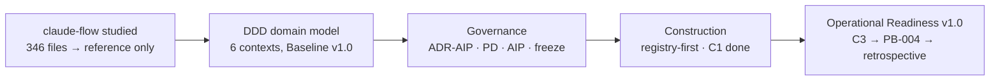

# Architecture Verification Report — 2026-07-08

**Reviewer:** Claude Code (AI Engineering Architect) · **Commissioned by:** ARB · **Status:** **PASS WITH RECOMMENDATIONS**
**Method:** evidence-executed (gates run, greps run, registry validated); scores are reviewer judgment (ARB precedent); confidence is derived from evidence-source counts. Absences caused by governed decisions are marked **PARTIAL-BY-DESIGN** with the ruling cited — never FAIL, never silently PASS.

## Executive Summary

- **Overall: 9/10 — PASS WITH RECOMMENDATIONS.** The architecture is internally consistent, provider-independent by executable evidence, and governed at every transition. The weak row is deliberate: runtime construction is ~15–20% complete (C1 done; C3 approved and waiting).
- **Key strengths:** provider independence proven by grep (zero provider vocabulary in the ADR-AIP corpus, three independent audits) · both product gates green (PHPStan clean; Architecture suite 143/143, 613 assertions) · registry valid with full five-question traceability on all 13 assets · a knowledge system that has processed three harvests through one consistent pipeline.
- **Critical gaps:** none. Major-tracked: fitness-function automation absent (definitions only — its first implementation is the approved slice C3) · bootstrap loading unlayered/unbudgeted (EPC-001 ev=3 / EPC-002 ev=2, top retrospective priorities).
- **Top 3 recommendations:** (1) execute C3 — the only work the freeze authorizes; (2) run PB-004 through the platform and let the retrospective adjudicate the assembled inbox; (3) ratify Implementation Process v1.1 (EP-01/02/03 + ER-05/06/07) — the process now carries substantial unratified draft content.

## Prompt-path → reality map (Phase 1 finding)

| Prompt assumed | Reality |
|---|---|
| `docs/engineering/standards/` | Does not exist — **by design** (R-32: Engineering Standards doc post-PB-004); standards live as AIP-01..14 + a 6-sentence ES candidate queue |
| `docs/engineering/process/` | `docs/implementation/Implementation_Process_v1.0.md` (FROZEN) + `_v1.1_Draft.md` (EP-01/02/03) |
| `engineering_pattern_evidence_register.md` | Register lives inside `architecture/brain_storming/engineering_pattern_cards_agent_skills.md` |
| `.claude/runtime/` as runtime assets | `.claude/runtime/` is gitignored per-day state; runtime assets are registry-listed under `.claude/scripts/` + `.claude/platform/` |
| Architecture views | `docs/architecture/c4/AI_Engineering_Platform_Views.md` (13 views, §0–§11) |

## Verification Results

### 2.1 DDD Alignment — **PASS**
- Election System = Core Domain; platform = Supporting Subdomain: views §0, ADR-AIP-01, handover sentence, Phase-02 (frozen). Two-scope rule recorded (platform-internal core = Architecture Governance; ecosystem-level always Supporting).
- Bounded contexts separated per frozen Phase-02 map (OHS/PL · Conformist · Separate Ways DS↮RS); domain-model view §3b matches aggregates.
- **Domain leakage: none** — grep of `.claude/platform/` + `.claude/scripts/` for election/voter/ballot/candidacy: **zero hits** (captured 2026-07-08). Product suite: constitutional guard `test_at_q7_001_no_voter_vote_linkage` green within the 143.

### 2.2 Clean Architecture — **PASS** (product) / noted (platform)
- Executed: `vendor/bin/phpstan analyse -c phpstan-greenfield.neon` → **"[OK] No errors"**. `vendor/bin/phpunit --testsuite Architecture` → **143 tests, 613 assertions, 1 skipped, 0 failures** (suite enforces domain purity, dependency direction, final/readonly VOs, import boundaries).
- Platform note: the six shell scripts have no tests of their own (validators run ad-hoc with falsifiability demonstrations recorded in session logs). Tracked, minor at current size.

### 2.3 Provider Independence — **PASS**
- Fresh grep: **zero** provider-vocabulary hits in ADR-AIP corpus (captured). Third consecutive independent audit with the same result (see `architecture/brain_storming/knowledge_architecture_validation.md` §3).
- `.claude/CLAUDE.md` is a binding: EP rules referenced, never restated; the single translation ("Planning Stage maps to Plan Mode") lives there. Views §11 places the provider at stack-bottom. Provider swap = rebuild binding only. PI-1 (literal `.claude/` path strings in process docs) remains a low-priority note.

### 2.4 Engineering Governance — **PARTIAL-BY-DESIGN**
- Process defined and **exercised with live evidence**: EP-01 approval gate enforced (C3 approved-as-written, implement-next-session); a real TDD breach on the main track was caught and corrected (stash→RED→pop, CONTEXT process note); evidence re-sequenced C2 (R-25).
- **ERR documents: none yet — EP-03 was adopted 2026-07-08; PB-004 will produce the first** (by design, not defect). Retrospective: scheduled, inbox assembled. **Loop closure (Standards → next request) unproven until one full traversal — that traversal is PB-004.**

### 2.5 Knowledge & Evidence System — **PASS** (with one governed deferral)
- Three harvests, one consistent shape (EPC-010 register ev=2); patterns not features (Harvest #3 explicitly problem-first); dedup held (zero duplicate cards across 18).
- Register live with real counts: EPC-001 ev=3 (own observation + two independent corroborations), EPC-002 ev=2.
- **Counterexamples: NOT recorded — governed deferral** (Chief ARB blocked the template extension pending evidence; seed examples preserved in session log). **Promotions to Standard: none yet — correct**, since the promotion event itself is undefined (audit finding F3, high-priority retrospective item).

### 2.6 Honesty Invariant — **PASS**
- No asserted scores found in governed artifacts; all reported figures derived (platform cost re-derived this review: components 8 · assets 13 · scripts 6 · hook wirings 8 · commands 0 · agents 0 · registry 315 lines · guides 6).
- Falsifiability practiced: registry validator proven against synthetic violations twice (recorded); AST-010's plan includes a falsifiability step.
- EPC-014 (confidence assessment) carries the honesty constraint **on its card** — derived discrete levels only; the Phase-1 "truth score" precedent cited. This report's own scores are labeled reviewer judgment with derived confidence.

### 2.7 Runtime Architecture — **PARTIAL** (construction ~15–20%, by plan)
- Registry: **VALID** (8 components / 13 assets; unique ids, refs resolve, five-question traceability complete, VERIFY evidence on all non-planned assets, runtime moments legal — captured this review).
- Hooks: 8 wirings operative; session continuity working (this resumed session booted from CONTEXT injection). Known items: AST-008 deprecated pending C2 (re-sequenced post-qualification by evidence, R-25); dev-guide reminder coverage defect (found by ARB audit; queued micro-slice).
- Context loading: **not layered, not budgeted** — the top-evidence candidate (EPC-001 ev=3, EPC-002 ev=2); gate runner AST-010 registered `planned` (C3 approved).

## Pattern Review (EPC-001..018)

| EPC | Pattern | Status | Counterexamples? | Evidence |
|---|---|---|---|---|
| 001 | Layered Loading / Progressive Disclosure | Candidate — top priority | No — governed deferral (all cards) | **3** |
| 002 | Engineering Budgets | Candidate (concrete budgets attached) | — | **2** |
| 003 | Capability Packaging | Confirmed (conscious trade-off) | — | — |
| 004 | Load-vs-Reference classes | Candidate | — | 0 |
| 005 | Runtime Declarations | Candidate (registry v1.1 fields) | — | 0 |
| 006 | Pattern Library (recipes) | Candidate | — | 0 |
| 007 | Deterministic Scripts (measuring instrument) | Confirmed — ours stronger (R-26) | — | — |
| 008 | Reasoning over Routing | Confirmed | — | — |
| 009 | Dual-Channel Transparency | Confirmed | — | — |
| 010 | Knowledge Harvest Workflow | Candidate (meta) | — | **2** |
| 011 | Bootstrap Report | Candidate | — | 0 |
| 012 | Health Check (aggregating runner only) | Candidate | — | 0 |
| 013 | New-Project Bootstrap | Candidate — far-deferred (AIP-14) | — | 0 |
| 014 | Engineering Confidence | Candidate — honesty constraint on card | — | 0 |
| 015 | Verification Ladder | Candidate (articulation gap only) | — | 0 |
| 016 | Independent Verification | Candidate (ours structurally stronger; breadth gap) | — | 0 |
| 017 | Engineering Interview Framework | Candidate — **ARB priority 1**, conditional form | — | 0 |
| 018 | Fresh-Context Implementation | Candidate — already practiced (C3 ruling); ES wording queued | — | 0 (C3 = first point) |

Card quality check (Phase 3): problems stated problem-first ✓ · existing solutions accurate (spot-checked EPC-007/016/018 against R-26/PD-10/C3 ruling — accurate, including where ours is stronger) ✓ · gaps honest ✓ · required-evidence appropriate and specific ✓.

## Gap Analysis

| # | Gap | Severity | Evidence | By design? | Recommendation |
|---|---|---|---|---|---|
| VG-1 | Review-prompt path map ≠ repository reality | Minor | path check table above | — | None needed; Guide 00 reading order is the real navigation. Future review prompts should cite real paths |
| VG-2 | Engineering Standards document absent | Minor | R-32 | ✅ (post-PB-004 trigger) | Build at retrospective with the 6-sentence candidate queue + F4 log-rule sweep |
| VG-3 | No ERR documents yet | Expected | EP-03 adopted 2026-07-08 | ✅ | PB-004 produces the first ERRs; they become EPC-017's evidence corpus |
| VG-4 | FF-1..17 defined, not automated | **Major (tracked)** | ad-hoc validators only; AST-010 `planned` | ✅ (AIP-14 deferral) | Execute C3; retrospective decides EPC-012 aggregation |
| VG-5 | Counterexamples absent from cards | Minor | Chief ARB block | ✅ (evidence-first) | Retrospective question + seed examples already queued |
| VG-6 | Bootstrap unlayered/unbudgeted | **Major (candidate)** | EPC-001 ev=3, EPC-002 ev=2, this session's log size | Candidate | Highest-priority retrospective item (ARB priority list) |
| VG-7 | Governance loop closure unproven | Expected | no full traversal yet | ✅ | PB-004 is the traversal |
| VG-8 | Platform scripts untested; dev-guide reminder coverage defect | Minor | ARB audit finding; queued micro-slice | Partially | Fix reminder scope in its approved micro-slice; script tests only if evidence demands |

## Recommendations

**Immediate (before PB-004):** 1. Execute slice C3 exactly as approved (AST-010; measuring instrument; falsifiability; EP-02). 2. Nothing else — R-27/R-29 bind, and this review found no defect justifying the exception clause.
**Near-term (next quarter):** 1. PB-004 through the platform (Operational Readiness v1.0, R-33) — populate ERRs, Evidence Register, verdict trail. 2. Hold the retrospective with its assembled inbox (EPC priorities 002·001·011·012·014·017; findings F1–F4 + VG-6; deletion goal; counterexample question; rename/index bundle; Risk-domain + isomorphism observations). 3. Ratify Implementation Process v1.1. 4. Execute the dev-guide-reminder coverage micro-slice.
**Strategic:** 1. Engineering Standards document (R-32 spec; candidate queue as seed; F3 promotion event defined alongside). 2. Engineering Knowledge domain decision (audit F2 + third-domain observation, after a further harvest). 3. Reference index + rename to "PublicDigit Engineering Platform" (R-35) as one post-qualification bundle.

## Overall Assessment

| Area | Score | Confidence | Notes |
|---|---|---|---|
| DDD | 9.5 | High (frozen corpus + green suite + leakage grep + prior audit) | Two-scope subtlety correctly recorded |
| Clean Architecture | 9 | High (two executed gates, captured output) | Platform scripts untested (minor) |
| Provider Independence | 10 | High (3 independent grep audits + structural binding) | PI-1 cosmetic note open |
| Engineering Governance | 9 | Medium-High (rules exercised: R-25, TDD-breach catch, C3 gate; loop untraversed) | Full confidence only after PB-004 |
| Knowledge System | 9 | High (3 consistent harvests, live register, dedup held) | Promotion event undefined (F3) |
| Honesty Invariant | 9.5 | High (falsifiability proofs recorded; derived metrics re-verified) | EPC-014 constraint pre-empted a violation |
| Runtime Architecture | 6.5 | Medium (registry valid; hooks live; only C1 built) | Deliberate — construction is next |
| Documentation | 9 | High (6 guides, 13 views, ~1h onboarding; responsibility table) | F4 log overload transitional |
| **Overall** | **9** | **High** | **PASS WITH RECOMMENDATIONS** |

## Evidence Index

Executed 2026-07-08: `vendor/bin/phpstan analyse -c phpstan-greenfield.neon` → OK no errors · `vendor/bin/phpunit --testsuite Architecture` → 143/613/1 skipped/0 failures · registry validator (parse, ids, refs, traces, VERIFY, enums) → VALID 8/13 · provider-vocabulary grep (ADR-AIP corpus) → zero · domain-leakage grep (`.claude/platform`, `.claude/scripts`) → zero · platform cost derivation → 8/13/6/8/0/0/315/6 · path reality check (6 paths).
Documents: ADR-AIP-01/02 · ADR-AIP-LOG (R-30..35) · Phase-01…03A (sealed) · Phase-02.5 §6 (R-1..29 historical) · `Implementation_Process_v1.0.md` + `v1.1_Draft.md` (EP-01/02/03, ER-05/06/07) · `registry.yaml` · `OPERATING_INSTRUCTIONS.md` · Guides 00–02 · `AI_Engineering_Platform_Views.md` (§0–§11) · 3 harvest card files + Pattern Evidence Register · `knowledge_architecture_validation.md` · session log 2026-07-08 · CONTEXT.md.

## Sign-off

- **Reviewer:** Claude Code (AI Engineering Architect) — recommendation only; acceptance is an ARB decision (PD-03/D-11 discipline)
- **Date:** 2026-07-08
- **Status:** **PASS WITH RECOMMENDATIONS** — **ACCEPTED by ARB, 2026-07-08** (session log)

---

# Addendum (2026-07-08, appended post-acceptance at senior-reviewer request — original report unchanged)

## A1. Architecture Fitness — the five-year questions

| Question | Answer | Evidence |
|---|---|---|
| Can another implementation agent continue development? *(reworded per ARB — the architecture is provider-independent; the question must outlive any AI product)* | **Yes (structural); live proof pending** | Zero provider vocabulary above the binding (3 grep audits); all state in versioned repo files; binding surface enumerated (Phase-03A §7, five mappings). **The scheduled C3 fresh-session boot is a self-replacement test** — same provider, zero conversational memory, platform-only bootstrap |
| Can another architect understand it? | **Yes, ~1 hour** | Guide 00 reading order (5 documents, timed); 13 views; two-scope DDD classification recorded |
| Can another team maintain it? | **Yes** | No machine-local state (AST-008 deprecated); registry-first workflow documented (Guide 01); every asset carries VERIFY evidence + five-question trace |
| Can another project reuse it? | **Methodology yes, tooling later** | EPC-013 (new-project bootstrap) deliberately far-deferred; the methodology is the reusable asset (views + process + standards queue) |
| Can it evolve? | **Yes — exercised, not asserted** | Amendment machinery used repeatedly under the freeze: ADR-AIP-02 amended a frozen table lawfully; EP-01/02/03 entered via the designated draft; R-25 re-sequenced work on evidence |

## A2. Complexity Budget (all derived 2026-07-08)

| Dimension | Count |
|---|---|
| Bounded contexts / components / capabilities | 6 / 8 / 13 (CAP) |
| Runtime assets / scripts / hook wirings / commands / agents | 13 / 6 / 8 / **0** / **0** |
| Registry size / developer guides | 315 lines / 6 files |
| Rules: EP / ER / AIP / PD / FF(defined) / rulings | 3 / 7 / 14 / 20 / 17 / 35 |
| Pattern cards / harvests / ES candidates | 18 / 3 / 6 |
| Onboarding | ~1 hour (5 documents) |
| **Governance-health: Architectural Decision Density (added per ARB)** | core rules (3 EP + 7 ER + 14 AIP + 20 PD = **44**) ÷ 6 bounded contexts ≈ **7.3 rules/context** · ADR-AIP decisions (2 ADRs + 1 living log) ÷ 13 capabilities ≈ **0.23 decision-docs/capability** · trend to watch per iteration: rules must grow slower than delivered capabilities, else governance is outpacing engineering |
| Reference baseline | source framework studied in Phase 1: **346 files**, of which ~300 were classified DROP |

Interpretation (judgment): the platform's entire runtime is **6 shell scripts + 1 YAML + configuration** governing a rule-set that fits in one hour of reading. Complexity is concentrated in *decisions recorded*, not *machinery running* — the intended shape.

## A3. Engineering Standards Readiness

Candidates: **6 sentences** on record (measurement principle · another-team mindset · philosophy sentence · provider-flow sentence · code-never-starts · fresh-context SHOULD). Supporting inputs at R-32 execution: AIP-01..14 as principle seed, F4 log-rule sweep list, EPC promotion pipeline. **Blocker: F3 — the Standard-promotion event is undefined** (high-priority retrospective item). Readiness verdict: **content-ready, mechanism-pending** — deliberate ordering (define the promotion event, then promote).

## A4. Architecture Evolution (onboarding view)

## A5. AI Replacement Test (executed where executable)

| Test | Result |
|---|---|
| Provider vocabulary above the binding | **0 hits** (grep, 3rd audit) — no other provider would inherit Claude-shaped rules |
| Hidden state outside the repo | **None found** (AST-008 was the last, deprecated; `.claude/runtime/` is declared non-authoritative scratch) |
| Binding surface enumerable | **Yes** — 5 mappings (Phase-03A §7); replacement = rewrite one layer |
| Human continuation | **Yes by construction** — EP rules address "human developer or AI assistant — any provider" verbatim |
| Full live proof | **Pending by design** — a genuine second-provider session is the only complete evidence; until then, C3's cold-boot is the nearest executable approximation |

**Replacement verdict (two-level, per ARB refinement — the qualification must not be skimmable away):**
- **Structural Readiness: PASS**
- **Operational Validation: PENDING** — requires an actual provider-replacement execution; until then, C3's cold-boot is the nearest executable approximation. (ER-02: architectural readiness ≠ demonstrated operational evidence.)

*Addendum notes (final, per ARB review 2026-07-08): the measurement principle is queued for ES promotion post-PB-004. **"Complexity is concentrated in decisions recorded, not machinery running" is promoted to the ES candidate queue** (now 7 sentences). Score-table framing corrected: runtime construction is not the "lowest score" — it is the **current investment focus**, intentionally incomplete rather than architecturally deficient. No governance was added by this addendum — six measurements were. The verification package is complete; focus returns to execution.*
