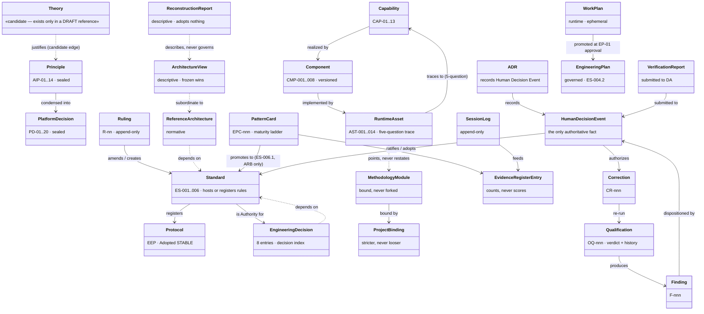

# Engineering Platform — Information Architecture Review

**Knowledge Architecture reconstruction · assessment only**

| | |
|---|---|
| **Class** | Verification report — analysis of the platform's *information architecture* (not its implementation) |
| **Authority** | Generated (never authoritative without human review — AIP-10/PD-05) |
| **Status** | **Submitted to the Decision Authority.** Nothing relocated, nothing renamed, nothing redesigned. Where multiple valid placements exist, trade-offs are stated and **no selection is made** (per the commission). |
| **Commission** | Decision Authority, 2026-07-27 (third commission this session, issued at Phase 1/Phase 2 review): *"Analyse the complete `engineering/` directory. Do not analyse implementation. Determine whether every document is stored in the correct architectural location. … Then reconstruct the Engineering Platform Knowledge Architecture. Produce: Knowledge Map · Knowledge Metamodel · Knowledge Lifecycle · Audience Map · Folder Responsibility Matrix · Canonical Placement Rules · Future Growth Strategy. Do not relocate files. Do not rename files. Do not redesign the platform. Do not invent new knowledge objects — only reconstruct those supported by implementation evidence. If ambiguity exists, record it rather than resolving it."* |
| **Inventory under review** | 49 files · 15 directories under `engineering/` (verified by `find`, 2026-07-27) + 1 satellite: `developer_guide/ai_platform/` (7 files, **outside** the engineering namespace — deferred move D2, MIGRATION_REPORT §4) |
| **Placement of this report** | `verification/reports/`, dated filename — the class-correct home under the **current** placement rules for analysis-of-architecture artifacts (precedent: the three 2026-07-12 reports). Chosen deliberately: this report reconstructs the placement rules, so it must obey them. |
| **Related pending item (recorded, not executed)** | The Decision Authority stated at review an intent to relocate the two Phase reports from `developer_guide/` to `architecture/reference/`, and separately proposed a reference/analysis split. Both are logged as pending decisions in §10 (Ambiguities A and B) with trade-offs; the commission's "do not relocate" governs this run. |

---

## 1. Executive Finding

**The platform's placement rules stop at the concern boundary. Below it, placement is governed by precedent — and precedent has begun to disagree with itself.**

The platform has excellent rules for deciding *which concern* owns an artifact (ES-005.1 three concerns, ES-005.3 litmus, the DetermineConcern/DeterminePlacement decisions). It has **no rule** for deciding *which folder inside `engineering/`* owns an artifact. Sub-placement is currently resolved by three weaker mechanisms: the README information map (an entry-point description, not a rule), the folder rule (which governs *when* a directory may exist, not *what belongs in it*), and precedent. The evidence that this gap is real and operational:

1. **This session's own record.** The Phase 1 baseline was placed three times in one day — directed to `architecture/`, redirected to `developer_guide/`, and at review the Decision Authority stated it belongs in `architecture/reference/`. Three placements, all plausible, because no rule discriminates between them. A decision that must be made repeatedly by authority instead of once by rule is the signature of a missing rule.
2. **The reserved-namespace table has started to diverge from reality.** `verification/qualification/` was created (correctly, by the folder rule) but is still listed as *reserved*; `developer_guide/` exists while the reserved name is `developer/guides/`; `knowledge/methodology/` appears in no map at all.
3. **One folder now contains three audiences** (§8): `developer_guide/` holds architecture references and no developer guidance; `verification/qualification/` holds executed evidence *and* unexecuted protocols; `knowledge/patterns/` holds four knowledge kinds in one file — a density its own header schedules for splitting.

**The counter-finding is equally important: the corpus already contains, latently, every distinction needed to fix this.** The normative/descriptive split the Decision Authority proposed (reference vs analysis) already exists *inside the documents' own self-descriptions* — the Reference Architecture declares "This document is normative"; the Phase 1 baseline declares "describes the architecture that exists … adopts nothing." The knowledge-kind vocabulary already exists (the pattern dossier's own retrospective input: "Harvest / Pattern / Standard / Process / Runtime Asset / Binding are different domain objects with different lifecycles"). What is missing is not concepts — it is **one place where the concepts are defined and one rule that maps kind → location** (§9, §10-H).

Assessment totals: **41 of 49 files are correctly placed under current rules · 2 are misplaced by the corpus's own classifications (the two Phase reports) · 6 sit in recorded ambiguity** (protocol/record mixing, naming-convention deviations, dossier density). No relocation performed.

---

## 2. Method and the Reconstructed Knowledge-Type Vocabulary

Types below are **reconstructed from the corpus's own self-descriptions** — each type name is a phrase the documents use about themselves. No type is invented (commission constraint).

| # | Knowledge type | Self-description evidence (verbatim source) | Nature |
|---|---|---|---|
| T1 | **Entry Point / Index** | README ("entry point"); STANDARDS_INDEX ("every binding rule's canonical home or authoritative pointer") | navigational |
| T2 | **Audit Trail** | MIGRATION_REPORT ("audit trail in MIGRATION_REPORT.md") | historical record |
| T3 | **ADR** (decision record) | ADR-AIP-01 ("this document records that Human Decision Event") | governance record |
| T4 | **Rulings Register** | ADR-AIP-LOG ("Living (append-only)") | governance record, living |
| T5 | **Sealed Baseline** | Phase-02.5 ("historical evidence of what was proposed; no further edits, ever") | frozen design history |
| T6 | **Architecture View** | c4 Views ("documentation only — frozen artifacts win on conflict") | descriptive, subordinate |
| T7 | **Reference Architecture** (normative) | Reference Architecture ("**This document is normative.** Qualification verifies repository conformance") | prescriptive |
| T8 | **Decision Model / decision index** | Decision Model ("a decision INDEX, never a second rulebook") | prescriptive index |
| T9 | **Engineering Standard** | ES-001..006 ("canonical home"; hosts/registers rules) | constitutional |
| T10 | **Execution Protocol** | EEP ("Engineering Platform standard … Adopted · STABLE") | constitutional |
| T11 | **Methodology Module** | DDD principles ("a methodology module the platform enforces, never platform architecture") | bindable knowledge |
| T12 | **Research Dossier / Pattern Cards** | patterns header ("a **research dossier**, not implemented architecture") | research input |
| T13 | **Source Material** | patterns/sources ("provenance travels with the harvest") | provenance |
| T14 | **Qualification Record** | OQ-ENG-001/002 (dated, verdict-bearing, "every verdict carries captured evidence") | evidence, executed |
| T15 | **Qualification Protocol / Plan** | OQ-ENG-003 ("PROTOCOL — not yet executed"); Artifact-Promotion plan ("PREPARED — executed during the pilot") | specification of future measurement |
| T16 | **Observation Protocol** | Project-State-Sync ("ACTIVE — observing") | specification, running |
| T17 | **Verification Report** | reports ("evidence-executed"; "verification only — nothing repaired") | evidence/analysis |
| T18 | **Reconstruction Report** | Phase 1 baseline ("evidence discovery, not design … adopts nothing"); Theory Reference (same class) | **descriptive** analysis |
| T19 | **Developer Guide** | `developer_guide/ai_platform/00_index.md` series ("how do I…" guides) — currently existing **only outside** `engineering/` | contributor how-to |

**The load-bearing distinction the corpus already draws but the folder tree does not:** T7/T8 are *normative* ("conformance is verified against me") while T18 is *descriptive* ("I describe what exists; frozen artifacts win over me"). Both are colloquially "reference documents." They have opposite conflict-resolution polarity — which is precisely why co-locating them is the review's most consequential open question (Ambiguity B).

---

## 3. Per-Document Assessment (all 49 files)

Owner for every artifact below is the Decision Authority/ARB unless noted. "OK?" = is the current location correct **under the current rules and the document's own self-declared type** — not under any proposed future scheme.

### 3.1 Root (2)

| Document | Type | Audience | Lifecycle state | OK? | Notes |
|---|---|---|---|---|---|
| `README.md` | T1 Entry Point | everyone (first contact) | living | ✅ | But it is carrying four responsibilities at once — see §8/§10-I. Information map stale: 3 directories unmapped |
| `MIGRATION_REPORT.md` | T2 Audit Trail | auditors, future maintainers | closed (EM-001 executed) | ✅ | Correct at root: it explains how the namespace came to be |

### 3.2 `architecture/adr/` (3)

| Document | Type | Audience | Lifecycle | OK? | Notes |
|---|---|---|---|---|---|
| `ADR-AIP-01…` | T3 ADR | architects, auditors | Accepted, addendum appended | ✅ | — |
| `ADR-AIP-02…` | T3 ADR | architects, auditors | Accepted | ✅ | — |
| `ADR-AIP-LOG…` | T4 Rulings Register | everyone doing governance work | living, append-only (R-30..R-39) | ✅ | — |

### 3.3 `architecture/baseline/` (6)

All six: T5 Sealed Baseline · audience: architects/auditors/historians · lifecycle FROZEN-SEALED (R-30) · **✅ all correctly placed** — the folder was renamed *for* them ("no longer proposals — they are the frozen Baseline", MIGRATION_REPORT §8b). `Phase-02.6` carries the one open lifecycle item (OI-1 terminology review, freeze conditional) — see §10-H.

### 3.4 `architecture/c4/` (2)

| Document | Type | Audience | Lifecycle | OK? | Notes |
|---|---|---|---|---|---|
| `AI_Engineering_Platform_Views.md` | T6 View | architects, newcomers | living-by-addendum ("frozen artifacts win") | ✅ | 17 diagrams; README says 16 (known, Phase 1 A-7) |
| `2026-07-08-arb-diagram-draft-superseded.md` | T6 (historical) | historians | superseded, correctly self-labeled | ✅ | Model example of honest supersession-in-place |

### 3.5 `architecture/reference/` (2)

| Document | Type | Audience | Lifecycle | OK? | Notes |
|---|---|---|---|---|---|
| `Engineering_Platform_Reference_Architecture.md` | **T7 normative** | architects, qualification | DRAFT → ADOPTED → STABLE | ✅ | The folder's first artifact; its header defines the folder's purpose |
| `Engineering_Decision_Model.md` | **T8 normative index** | every engineer, every session | DRAFT (adoption earned through use) | ✅ | — |

The folder's de-facto responsibility, established by its two residents: **normative current-state architecture**. This matters for Ambiguity B.

### 3.6 `developer_guide/` (2) — **the misplacement finding**

| Document | Type | Audience | Lifecycle | OK? | Assessment |
|---|---|---|---|---|---|
| `AI_Engineering_Platform_Architecture_Baseline_Current_State.md` | **T18 Reconstruction Report** | architects, ARB, newcomers | DRAFT, submitted | ❌ | **Misplaced by the corpus's own classification.** It is not a T19 guide (teaches nothing about *how to contribute*); its own header records the ES-005.3 assessment pointing at `verification/reports/`, and the Decision Authority at review stated `architecture/reference/`. Both candidate homes are defensible — trade-offs in §10-A/B. It is ALSO the only reasonably current single-document architecture description, which is a *reference-like* consumption pattern — the dual nature is real, not sloppiness |
| `AI_Engineering_Platform_Engineering_Theory_Reference.md` | T18 (with T12-like content: literature mapping) | architects, ARB | DRAFT, submitted; methodology revision ordered at review | ❌ | Same misplacement. Additional wrinkle: as a literature-derived mapping it has a *harvest* character — ES-006.3 would argue for `knowledge/`-tier once revised into the Foundations Reference. Three candidate homes; §10-A |
| *(the folder itself)* | — | — | — | ⚠️ | Name collides with the reserved `developer/guides/` namespace (README) and with the *product-side* `developer_guide/` convention, while containing zero developer guidance. Recorded: §10-A/J |

### 3.7 `governance/` (8)

| Document | Type | Audience | Lifecycle | OK? |
|---|---|---|---|---|
| `STANDARDS_INDEX.md` | T1 Index (constitutional) | everyone | PROPOSED | ✅ |
| `ES-001` … `ES-006` (6 files) | T9 Standards | everyone doing engineering work | PROPOSED (ratification pending) | ✅ |
| `Engineering_Execution_Protocol.md` | T10 Protocol | every engineer, any project | Adopted · STABLE | ✅ |

Uniform, coherent, single-audience folder — the cleanest in the tree.

### 3.8 `knowledge/` (6)

| Document | Type | Audience | Lifecycle | OK? | Notes |
|---|---|---|---|---|---|
| `methodology/DDD_Tactical_Governance_Principles.md` | T11 Methodology Module | engineers doing tactical DDD, in any adopting project | ADOPTED (R-39 exception) | ✅ | First artifact of `methodology/` — folder rule honored; folder unmapped in README (§10-F) |
| `patterns/engineering_pattern_cards_agent_skills.md` | T12 Research Dossier — **carrying 4 kinds in 1 file** (cards · evidence register · research candidates · rejections) | ARB at retrospective | Candidate-tier, frozen-for-accumulation | ⚠️ | Its own header orders the four-way restructuring *at the retrospective, never before* — ambiguity already governed, §10-D |
| `patterns/…claude_best_practices.md` · `patterns/…claude_runtime_article.md` | T12 | same | candidate | ✅ | — |
| `patterns/sources/*.pdf` (2) | T13 Provenance | auditors | static | ✅ | README already records "eventual home: research/sources/" — a documented pending move, not drift |

### 3.9 `verification/qualification/` (5) — **the mixed-kind folder**

| Document | Type | Executed? | OK? | Notes |
|---|---|---|---|---|
| `2026-07-10-OQ-ENG-001.md` | T14 Record | ✅ | ✅ | dated-record convention |
| `2026-07-11-OQ-ENG-002.md` | T14 Record | ✅ | ✅ | — |
| `OQ-ENG-003-…Protocol.md` | T15 Protocol | ❌ never | ⚠️ | A *specification* filed among *evidence*. Defensible (the protocol IS the qualification artifact pre-execution; its record will land beside it) — but a reader cannot distinguish executed from unexecuted by location or name. §10-C |
| `Artifact-Promotion-Candidate-Qualification-Plan.md` | T15 Plan | ❌ pilot-gated | ⚠️ | same |
| `Project-State-Synchronization-Observation-Protocol.md` | T16 Observation Protocol | running | ⚠️ | same, plus it is the only *observation* instrument in a *qualification* folder |

### 3.10 `verification/reports/` (13)

All T17/T18 · audience: ARB/Decision Authority + auditors · lifecycle: submitted/accepted, several with terminal status ("ARCHITECTURALLY APPROVED", "content frozen"). **11 of 13 fully conformant.** Two deviations, both already known:

| Document | Deviation |
|---|---|
| `Architecture Upgrade Assessment.txt` | Naming convention (spaces, `.txt`, undated) — recorded as F-OQ2-4, disposition pending since 2026-07-11 |
| `knowledge_architecture_validation.md` | Undated filename among dated reports — same convention family, never formally logged |

### 3.11 The satellite: `developer_guide/ai_platform/` (7 files, outside `engineering/`)

| Document | Type | OK? | Notes |
|---|---|---|---|
| `00_ai_engineering_architecture.md` · `00_index.md` · `01_…` · `02_…` · `03_runtime_mechanics.md` | **T19 Developer Guides — the only real ones the platform has** | ⚠️ known | Deferred move D2 (MIGRATION_REPORT §4): target `engineering/developer/guides/`, blocked on the dev-guide reminder hook's area mapping. **The platform's genuine developer guidance lives outside the platform's namespace, while the platform's `developer_guide/` folder contains none** — the inversion in one sentence |
| `mermaid_diagram_ai_architecture_public_digit.md` | ungoverned draft | ❌ known | Flagged 2026-07-12 (reconstruction report, finding 1: retire / mark historical / leave — ARB disposition still pending) |
| `how_to_develop_ai_archictecture.md` | unassessed in any prior report; filename typo ("archictecture") | ⚠️ | Same ungoverned-draft class as the mermaid file — surfaced here for the same pending disposition |

---

## 4. Deliverable 1 — Knowledge Map (every document → exactly one node)

```text
engineering/                                       [ENTRY: README · AUDIT: MIGRATION_REPORT]
│
├── architecture/          "what the platform IS and DECIDED"
│   ├── adr/               governance records ......... ADR-AIP-01 · ADR-AIP-02 · ADR-AIP-LOG   (3)
│   ├── baseline/          sealed design history ...... Phase-01 … Phase-03A                     (6)
│   ├── c4/                descriptive views .......... Views · superseded draft                 (2)
│   └── reference/         NORMATIVE current state .... Reference Architecture · Decision Model  (2)
│
├── developer_guide/       ⚠ declared audience: contributors — actual content: 2 descriptive
│                            reconstruction reports (Phase 1 · Phase 2)                          (2)
│                            → both flagged; pending DA relocation decision (§10-A)
│
├── governance/            "what the platform ENFORCES"
│                          STANDARDS_INDEX · ES-001..006 · EEP                                   (8)
│
├── knowledge/             "what the platform LEARNS"
│   ├── methodology/       bindable modules ........... DDD Tactical Governance Principles      (1)
│   └── patterns/          research dossiers .......... 3 dossiers (+ sources/ 2 PDFs)           (5)
│
└── verification/          "what the platform PROVES"
    ├── qualification/     ⚠ mixed: 2 executed RECORDS + 3 unexecuted PROTOCOLS/PLANS            (5)
    └── reports/           evidence & analysis ........ 13 reports (2 naming deviations)         (13)

SATELLITE (outside the namespace, deferred D2):
developer_guide/ai_platform/   the actual T19 developer guides (5) + 2 ungoverned drafts        (7)
```

Every one of the 49 files is assigned above; the only assignments that required judgment (rather than reading the document's own header) are the two flagged in `developer_guide/` — which is the finding.

---

## 5. Deliverable 2 — Knowledge Metamodel (reconstructed, evidence-only)

Every class and edge below is evidenced by an existing artifact or an explicit rule; nothing is proposed. *(This diagram is a reconstruction inside an analysis report — it is NOT the `Engineering_Platform_Metamodel.md` the Decision Authority mooted at review; whether that document should exist is Ambiguity H.)*



**Reconstructed allowed-dependency rules** (each stated somewhere as a rule; consolidated here):

| Edge rule | Source |
|---|---|
| Runtime assets point to canonical rule homes, never restate them | AST-014 comment block; rules-live-once |
| Views are subordinate: "frozen artifacts win on conflict" | c4 header |
| Reports cite anything, change nothing | every report's constraint check |
| Baseline is depended on, never edited: supersession only | R-30 |
| Bindings depend on the module; the module never knows its bindings | DDD module header; EEP §10.9 |
| Reference Architecture and Decision Model are siblings — neither depends on the other; both depend on Standards | Decision Model §layered architecture (ARB refinement) |
| Registry is discovered-from, and registers only what exists or is approved | registry header; Registry Economy |
| **Descriptive artifacts (T18) may cite normative ones; nothing normative may cite a T18 as authority** | *derived* from the above polarity — stated as a reconstruction, not a rule; no counterexample exists in the corpus today |

---

## 6. Deliverable 3 — Knowledge Lifecycles (all observed; none invented)

| Lifecycle | States (verbatim from corpus) | Applies to |
|---|---|---|
| Authority | `authoritative · derived · generated · historical · provisional` | every governed artifact (inherited EKP dimension) |
| Status | `idea → research → draft → discovery → reviewed → approved → baseline → frozen` (branch: `superseded → archived`) | baseline corpus, governed docs |
| Standards ratification | `PROPOSED → (ARB signature) → ADOPTED → STABLE` | ES set, index — **currently parked at PROPOSED** |
| Reference adoption | `DRAFT → (one real cycle + qualification) → ADOPTED → STABLE` | Reference Architecture, Decision Model |
| Sealing | `FROZEN → SEALED (moves allowed, edits never)` | baseline corpus |
| Asset adoption | `planned → adopted → deprecated → (removed)` (+ `verify`) | AST-nnn |
| Capability lifecycle | `Proposed → Experimental → Certified → Frozen → Deprecated → Archived` | CAP-nn (defined; no capability has yet moved through it) |
| Pattern maturity | `Candidate → Observed → Validated → Standard` (register entries required; retrospective-only promotion) | EPC-nnn |
| Qualification | `commissioned → executed → verdict (PASS · PASS AFTER CORRECTION · WARN · FAIL · INCONCLUSIVE · EMERGENT) → DA acceptance` — history preserved | OQ-nnn |
| Plan | `Work Plan (runtime) → [EP-01 approval = promotion event] → Engineering Plan (governed) → historical` | plans (Plan Concept Decision Paper, ADOPTED) |
| Knowledge promotion | `Research → Pilot → Qualification → Engineering Standard → Stable Engineering Capability` | ES-006.1, the master ladder |

**Lifecycle gap observed (recorded, not resolved):** T18 Reconstruction Reports have no declared lifecycle of their own. Phase 1/Phase 2 say "DRAFT — submitted", but no rule says what a T18 becomes on acceptance (frozen analysis? superseded by the next reconstruction? re-dated?). The older reports solved this individually ("content frozen from this point; any future change is a new report") — a convention, never a rule. §10-B inherits this.

---

## 7. Deliverable 4 — Audience Map

| Audience | Enters at | Needs | Where it actually lives | Observed friction |
|---|---|---|---|---|
| **New contributor to the platform** | `developer_guide/` (by name) | how-to guides: add a hook, add an asset, run a qualification | `developer_guide/ai_platform/` — **outside** `engineering/` | **Highest-friction audience.** The named folder contains architecture reports; the real guides are in another tree (D2 deferred). The commission's "new engineer asks *how do I implement a verification capability?*" scenario fails today |
| **Platform architect** | README → reference/ | normative current state + decisions | `architecture/reference/` + `adr/` | Low friction. One gap: the *descriptive* current state (Phase 1) is not in the architecture tree |
| **ARB / Decision Authority** | STANDARDS_INDEX, rulings register | rules, matrices, pending dispositions | `governance/` + `adr/` | Low friction; ratification queue is legible |
| **Auditor** | MIGRATION_REPORT, OQ records | evidence chains, verdict history | `verification/` | Low friction; two naming deviations reduce scanability |
| **Cold-boot AI session** | injected CONTEXT → engineering pointers | deterministic bootstrap to standards + decisions | `.claude/` → `engineering/` | Verified complete by the C3 delta report (two redundant, non-contradictory routes — NF-3) |
| **Second adopting project** *(hypothetical)* | README → EEP | the constitutional core, clean of adoption evidence | `governance/` clones cleanly; everything else interweaves | Known WARN-by-design (OQ-ENG-002 E-3); trigger already recorded |

**The audience finding in one line:** five of six audiences are served correctly; the one that is not — the contributor — is the audience the misnamed folder claims to serve.

---

## 8. Deliverable 5 — Folder Responsibility Matrix

| Folder | Declared responsibility (README) | **Observed** responsibility (contents) | Single audience? | Single knowledge kind? | Verdict |
|---|---|---|---|---|---|
| `architecture/adr/` | platform decisions | exactly that | ✅ | ✅ (T3/T4) | **Coherent** |
| `architecture/baseline/` | sealed Baseline corpus | exactly that | ✅ | ✅ (T5) | **Coherent** |
| `architecture/c4/` | platform views | exactly that | ✅ | ✅ (T6) | **Coherent** |
| `architecture/reference/` | Reference Architecture (DRAFT) | normative current-state (2 docs) | ✅ | ✅ (T7/T8) | **Coherent** — polarity would change if T18s move in (§10-B) |
| `developer_guide/` | *(absent from README — folder postdates it)* | 2 descriptive reconstruction reports | ❌ name says contributors, content says architects | ❌ | **Incoherent** — name/content/reserved-namespace triple mismatch |
| `governance/` | what the platform enforces | exactly that | ✅ | ✅ (T9/T10 + index) | **Coherent** — cleanest folder |
| `knowledge/methodology/` | *(absent from README)* | bindable methodology modules | ✅ | ✅ (T11) | Coherent content; **unmapped** |
| `knowledge/patterns/` | pattern cards + evidence register | that, at 4-kinds-per-file density | ✅ | ⚠️ (T12 carrying 4 sub-kinds) | Coherent-by-declared-exception (split scheduled at retrospective) |
| `verification/qualification/` | *(still listed as **reserved** in README)* | 2 executed records + 3 unexecuted protocols | ✅ | ❌ (T14 + T15 + T16) | **Mixed kinds**; also map-stale |
| `verification/reports/` | reviews, audits, assessments | exactly that | ✅ | ✅ (T17/T18) | **Coherent**; 2 naming deviations |

---

## 9. Deliverable 6 — Canonical Placement Rules (as they exist today, reconstructed)

The complete placement decision chain currently in force:

```text
1. DetermineConcern        (ES-005.1)  →  Product | Engineering | Runtime        ← RULE, strong
2. DetermineArtifactLifecycle (candidate) → ephemeral (runtime) | governed        ← CANDIDATE, deletion litmus
3. DetermineArtifactType   (Decision Model) → pattern card | guide | qualification
                            improvement | candidate standard | research | nothing ← RULE with a known gap
                                                                                    (NF-1: the "authorized-type
                                                                                    index" doesn't exist)
4. DeterminePlacement      (ES-005.3 litmus + ES-005.2 folder rule)
      → WHICH CONCERN: rule-governed, works
      → WHICH FOLDER WITHIN engineering/: ❌ NO RULE EXISTS
        current mechanisms: README information map (descriptive, stale in 3 places)
                          · precedent (this session: 3 placements for 1 document in 1 day)
                          · Decision Authority per-case direction
```

**This is the reconstructed root cause of every ambiguity in §10.** The commission's deliverable asks for the rules *as they exist*: steps 1–3 exist and mostly work; step 4's second half **does not exist**. Its absence was invisible while every artifact class had exactly one plausible folder; it became visible the day a document class arrived (T18, descriptive current-state analysis of architecture) that plausibly fits three.

What a placement rule would have to discriminate (stated as the *shape of the gap*, not as a proposed rule): normative vs descriptive (T7 vs T18) · specification vs record of execution (T15 vs T14) · teaching vs describing (T19 vs T18) · kind-pure folders vs audience-pure folders. All four discriminations already exist as document self-descriptions (§2); none exists as a placement rule.

---

## 10. Ambiguity Register (recorded, NOT resolved — trade-offs only, per the commission)

**A — The two Phase reports in `developer_guide/`.** Three candidate homes, each with a real argument:
  - `architecture/reference/` *(Decision Authority's stated intent at review)* — Pro: the Baseline is the platform's only current single-document architecture description; readers seeking "what is the architecture?" look here; sits beside its normative siblings. Con: mixes conflict-resolution polarity in one folder — today everything in `reference/` is normative; the Phase reports explicitly are not ("frozen artifacts win over me"). A reader could mistake description for prescription — the exact epistemic-mixing failure the platform polices elsewhere.
  - `verification/reports/` *(current-rules class match)* — Pro: T18 = analysis-of-architecture; precedent (the 2026-07-12 reconstruction report is the same genus); dated-record conventions apply cleanly; polarity stays pure. Con: buries the best onboarding-adjacent description of the platform among 13 audit records; reports read as point-in-time, while the Baseline is meant to be *the* current-state reference until superseded.
  - `architecture/analysis/` *(the Decision Authority's proposed new node)* — Pro: names the genuine third kind (descriptive analysis of architecture) and resolves the polarity problem structurally. Con: new structure under R-37/R-38 — requires a Decision Authority act and a placement-rule update so the next T18 doesn't reopen the question.
  - *Interaction:* whichever home is chosen also decides the T18 lifecycle question (§6, lifecycle gap) — reference-tier implies supersede-in-place; report-tier implies freeze-and-redate.

**B — `architecture/reference/` polarity.** Whether "reference" means *normative* (current residents) or *any current-state architecture document* (DA's proposal, which would admit the Phase reports and future Component/Knowledge models). Trade-off: single-folder discoverability vs. polarity purity. The corpus's own headers support either reading; only a rule can settle it.

**C — `verification/qualification/` mixes specifications with evidence.** Protocols/plans (T15/T16, unexecuted) sit beside executed records (T14). Options: split (`protocols/` vs records), prefix convention, or status quo (the protocol *becomes* paired with its record on execution — OQ-ENG-003's own header promises "a dated record … beside this protocol"). Status quo is self-consistent but not self-evident to a reader; the folder is also still marked *reserved* in the README either way.

**D — Pattern-dossier density.** Four knowledge kinds in one file — **already governed**: the header itself orders the four-way restructure at the retrospective and explicitly forbids doing it earlier. Recorded here only for completeness; no new decision needed.

**E — The satellite `developer_guide/ai_platform/`.** The platform's only true developer guides live outside its namespace (deferred D2, hook-coupled). The longer D2 defers, the stronger the pull to fill `engineering/developer_guide/` with *something* — which is arguably how Ambiguity A happened. Interaction recorded: resolving A without resolving E leaves the name/content mismatch standing in mirror image.

**F — README information map staleness.** Three directories unmapped (`methodology/`, `qualification/`, `developer_guide/`); `qualification/` still in the reserved table; diagram count off by one. All bugfix-class under R-37's own terms; awaiting disposition. *(The OQ E-2 instrument checks precisely this property — the next qualification run would flag all of these mechanically.)*

**G — Naming deviations in `reports/`.** `Architecture Upgrade Assessment.txt` (known, F-OQ2-4) and `knowledge_architecture_validation.md` (undated; never formally logged — logged now).

**H — The vocabulary/metamodel home.** The platform's ubiquitous language is sealed in Phase-02.6 **with OI-1 (final terminology review) still open since 2026-07-08**, and the constitutional consolidation coined a second vocabulary generation (HOSTED/REGISTERED · Work Plan/Engineering Plan · candidate/watch-item · verdict taxonomy) that has **no dictionary home at all** — Phase-02.6 is sealed and cannot absorb it except by supersession. The Decision Authority's mooted `Engineering_Platform_Metamodel.md` would be that supersession vehicle; equally, OI-1's execution could be. Recorded as the register's deepest item: **the platform has two generations of ubiquitous language and one sealed dictionary.** Which mechanism updates it is a governance decision, not an IA decision.

**I — README responsibility overload.** One file is simultaneously: entry point, information map, reserved-namespace register, placement decision-tree, and binding-rules summary. Every prior staleness incident (F, above) is a symptom of one file carrying four update obligations. Options: keep (single front door, one hop to everything) vs. split map/register out (per-file update duty, two hops). Genuine trade-off; recorded.

**J — Reserved-name drift.** Created names diverge from reserved names (`developer_guide/` vs `developer/guides/`; `qualification/` created while listed reserved). Either the reserved table is updated on each fulfillment (a discipline, not a structure) or it decays into fiction. Bugfix-class; awaiting disposition.

---

## 11. Deliverable 7 — Future Growth Strategy (descriptive; every item is a pending decision with a named owner, none executed)

The commission forbids redesign; growth strategy is therefore stated as **the decision queue that already exists**, ordered by what unblocks what:

1. **The placement-rule gap (§9) is the root; everything in §10 is a leaf.** One rule ("knowledge kind → canonical node", however the Decision Authority shapes it) retires ambiguities A, B, C, and J simultaneously and makes E/F mechanical. Without it, each future T18-class document re-litigates its own placement — the observed cost is already three placements per document.
2. **Sequencing note the record supports:** the platform's own consolidation precedent (OQ-ENG-002 → ES set: *"every binding rule has exactly one canonical home"*) is the exact template for this — the same move, applied to placement instead of rule text. Whether that lands as an ES-005 clarification (parsimony-preferred, per the E-4 precedent: "fold as a clarification, not a new rule id") or new structure is the Decision Authority's call.
3. **Vocabulary before structure (§10-H):** several pending shapes (metamodel doc, analysis/ node, Foundations Reference) each mint terms; the two-generations-one-sealed-dictionary condition argues that *whichever* is decided first should carry the OI-1/supersession duty, so terms are defined once before folders multiply.
4. **Already-scheduled work this strategy must not duplicate** (recorded triggers stand): pattern-dossier 4-way split (retrospective) · D2 guide move (hook slice) · sources → `research/sources/` (PB-004 retrospective table) · Platform ≙ Adoption split (second adopter) · registry spec → `engineering/registry/` (second runtime adapter).
5. **Growth boundary already in force:** R-37/R-38 mean every structural item above enters through explicit Decision Authority action or the retrospective — this report creates none of them.

---

## 12. Constraint Check & Evidence

**Nothing relocated · nothing renamed · nothing redesigned · no knowledge object invented** (every type in §2 carries its self-description quote; the metamodel's one derived edge is labeled as derived) · ambiguities recorded with trade-offs, none resolved · this report is the only file created.

Evidence: full-tree `find` (49 files, 15 dirs, 2026-07-27) · every document's own status/class header (read in full during this session lineage — Phase 1 §19 inventory + the 2 Phase reports + satellite listing) · README information map & reserved-namespace table · MIGRATION_REPORT §§4–8 · OQ-ENG-002 E-2/E-3 · C3 delta report NF-1/NF-3 · the 2026-07-12 reconstruction report (T18 placement precedent) · this session's own three-placement record (session log 2026-07-27).

---

*Statements are Observed (headers, listings), Measured (counts), or Interpreted (coherence verdicts in §8, candidate-home trade-offs in §10 — labeled) per R-36 §4. **STOP — submitted to the Decision Authority.***

*Traceability: Decision Authority IA-review commission 2026-07-27 (issued at Phase 1/Phase 2 review, superseding-in-priority the Foundations-Reference revision, which remains queued) · companions: Phase 1 baseline · Phase 2 theory reference (methodology revision pending per the same review) · placement of this report per §Header.*
