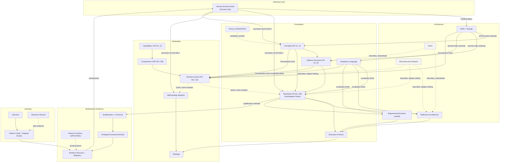
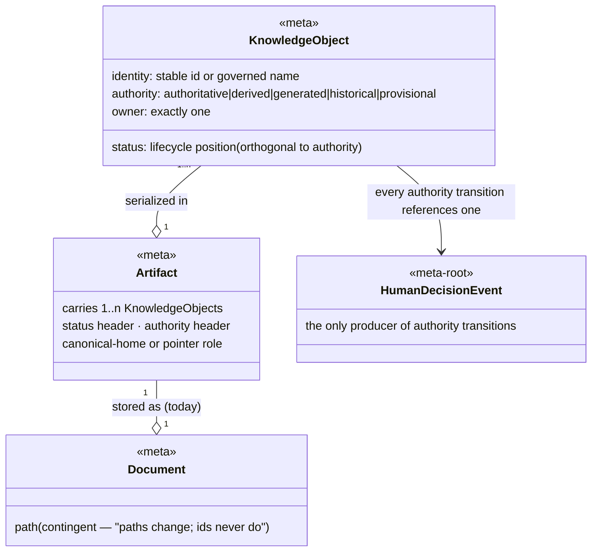

# Engineering Platform — Knowledge Domain Model

**Domain reconstruction: the platform analysed as a domain, not as documents**

| | |
|---|---|
| **Class** | Verification report — **domain-model reconstruction** (descriptive; evidence discovery, not design) |
| **Authority** | Generated (never authoritative without human review — AIP-10/PD-05) |
| **Status** | **Submitted to the Decision Authority.** Adopts nothing, creates no governance. The metamodel in §9 is a *reconstruction of the ontology that operates today*; it becomes the platform's governed metamodel only through an explicit adoption act. |
| **Commission** | Decision Authority, 2026-07-27 (fourth commission this session): *"Do NOT analyse documents. Documents are implementations of knowledge. Reconstruct the domain model represented by those documents: Knowledge Object Inventory · Domain Model · Repository Invariants · Knowledge Dependency Graph · Repository Semantics Evaluation · Knowledge Metamodel. Only include objects and invariants supported by implementation evidence; if evidence is insufficient, state 'Evidence not found.' Do not redesign, do not invent concepts, do not propose relocations."* |
| **Evidence base** | The complete governed corpus, read in full in this session lineage (Phase 1 §19 inventory: 49 engineering artifacts + registry + runtime assets + bindings), plus targeted verification greps this run (§11). |
| **Placement note** | `verification/reports/`, dated — class-correct for descriptive analysis under current rules (per the IA review's own placement reasoning). **Recorded observation, not a proposal:** if the Decision Authority adopts §9 as the platform's metamodel, the adoption would be a *report → governed reference* crossing with a pre-declared promotion event — exactly the **prospective instance** the Artifact-Promotion Candidate Qualification Plan is waiting for (its §1 names "≥1 prospective instance in a NON-plan artifact type" as the missing evidence class). |
| **Companions** | Phase 1 baseline (what is implemented) · Phase 2 theory reference (why, revision pending) · IA review (where knowledge lives) · **this document (what the knowledge IS)** |

---

## 1. Executive Finding

**The Engineering Platform is already a domain model wearing a filesystem. The commission's requested shift — from documents to knowledge objects — is not a new idea being applied to the platform; it is the platform's own founding rule, applied back to itself.**

Four findings organise everything below:

1. **The object/serialization split already exists as a binding rule.** The registry header states it verbatim: *"components carry stable ids CMP-nnn, assets carry stable ids AST-nnn. **Paths change; ids never do.** ADRs and reviews reference ids, not paths."* ES-004.2 repeats it for records: *"cite durable **ids**, not dated filenames."* Identity belongs to the knowledge object; the path belongs to its serialization. The platform has been practising the distinction the commission asks for since C1 — at the *runtime* tier. What has never been done is extending that identity discipline uniformly across the *knowledge* tiers (§8, §10).

2. **Thirty-one knowledge objects are evidenced; the DA's candidate list survives contact with the corpus almost intact, with two honest exceptions.** *Theory* is evidenced only as a candidate (it exists in one DRAFT descriptive artifact and six unpromoted home-grown laws — no governed theory object operates today). *Policy* is evidenced only as an **attribute row inside the sealed domain model** (each bounded context carries a "Policies" row) — it has no identity scheme, no lifecycle, no serialization discipline of its own; treating it as a first-class object today would invent a concept (§3, family G).

3. **The domain has a root: the Human Decision Event.** Every lifecycle in the domain — promotion, ratification, adoption, sealing, acceptance, certification — bottlenecks through exactly one object kind that only humans may produce. Every other object is either *upstream input to* a Human Decision Event (drafts, findings, reports, recommendations) or *downstream record of* one (ADRs, rulings, adopted standards, sealed baselines). This is the domain's deepest structural property, and it is why "No Report may become authoritative" (§6, I-4) is not a convention but a consequence.

4. **The invariants are real; their enforcement is asymmetric.** Of the 18 reconstructed repository invariants (§6), all 18 are stated in governed artifacts, 4 have machine enforcement today, and the rest are enforced by human review and the platform's recorded self-correction record. The sealed domain model specifies many of them as *aggregate construction rules* ("a verdict without an EvidenceRef cannot be constructed") — but no aggregates exist as software, so today every "structurally impossible" is operationally "procedurally caught." The Phase 1 baseline's central asymmetry (specification complete, executable layer minimal) reappears here as the domain model's enforcement asymmetry. Same fact, domain view.

---

## 2. The Three-Level Distinction (Object → Artifact → Document), evidenced

The commission's frame, verified against the corpus:

```text
KNOWLEDGE OBJECT      the identified, governed unit of meaning        Ruling R-36 · Rule ES-003.2 · Pattern EPC-001
        │  is serialized as (1..n objects per artifact)
ARTIFACT              the governed carrier with status/authority       the rulings register · ES-003 · the pattern dossier
        │  is stored as (1 file today; the mapping is contingent)
DOCUMENT              a file at a path                                 ADR-AIP-LOG-….md · ES-003-Qualification.md · …
```

Evidence that the corpus already lives at all three levels:

| Observation | Evidence |
|---|---|
| Ten rulings (R-30..R-39) live in ONE register document — the object count and document count differ by design | ADR-AIP-LOG ("append-only") |
| Eighteen rules (ES-00n.m) live in six standard documents, under an explicit two-mode serialization scheme (HOSTED = full text here · REGISTERED = pointer here, text elsewhere) | STANDARDS_INDEX consolidation convention |
| Ten pattern cards + one evidence register + research candidates + rejections live in ONE dossier file — and the corpus itself flags this as transitional density, ordering a four-way restructure at the retrospective ("this file has served as the accumulation document") | patterns dossier header |
| One knowledge object (the EP-01 rule) has MANY pointer serializations (root CLAUDE.md, .claude/CLAUDE.md, guide 02) and ONE canonical home — the rules-live-once discipline is object identity enforced across serializations | ES-004.2 reconciliation note |
| The registry is explicitly "configuration-as-**data**" — objects (CMP/AST entries) whose YAML file is just the current carrier | Phase-03A §3 |

**Consequence used throughout this report:** the domain model below models *objects*; documents appear only in §8 (where the folder tree is evaluated as a serialization layout). Where one artifact carries several objects, that is recorded as a serialization fact, never as an object-model fact.

---

## 3. Deliverable 1 — Knowledge Object Inventory

31 objects in 7 families. Status vocabulary: **OPERATING** (instances exist and are used) · **SPECIFIED** (defined in a governed artifact; no operating instance) · **CANDIDATE** (explicitly candidate-tier in the corpus) · **ADJACENT** (evidenced, but owned by another domain/tier — recorded for the boundary, not modelled here).

### Family A — Authority objects (the domain's root)

| # | Object | Identity | Evidence | Status |
|---|---|---|---|---|
| A1 | **Human Decision Event** | named event (`ADRApproved`, `CapabilityCertified`, `ArtifactFrozen`, `MergeApproved`, …) + date + authority | Phase-02 §5 (event catalog); UL §1.1 ("No platform state transition may substitute for one"); every ADR/ruling records one | OPERATING |
| A2 | **Decision Record (ADR)** | ADR-AIP-nn | ADR-AIP-01/02, Accepted with addenda | OPERATING |
| A3 | **Ruling** | R-nn | R-1..29 sealed in Phase-02.5 §6; R-30..R-39 in the living register | OPERATING |

### Family B — Constitutional objects

| # | Object | Identity | Evidence | Status |
|---|---|---|---|---|
| B1 | **Principle** | AIP-nn (01..14) | Phase-02.5 §3, sealed; amended only by ADR authority (AIP-14 via ADR-AIP-02) | OPERATING |
| B2 | **Platform Decision** | PD-nn (01..20) | Phase-02.7, sealed; "conflicts resolve in this document's favour" | OPERATING |
| B3 | **Rule** | ES-00n.m | STANDARDS_INDEX; hosted/registered scheme; 18 rules across 6 standards | OPERATING (PROPOSED ratification) |
| B4 | **Standard** | ES-nnn | ES-001..006 — containers that *host* or *register* rules | OPERATING (PROPOSED) |
| B5 | **Execution Protocol** | singleton (EEP) | Adopted · STABLE; provider/project-independent | OPERATING |
| B6 | **Promoted Behaviour** | numbered list, AST-013 § | R-36: six one-line reasoning behaviours, promoted via the AIP-13 amendment path — a distinct object kind: it changes *how work is reasoned about*, hosted in a runtime asset by explicit ARB adoption | OPERATING |
| B7 | **Ubiquitous Language (dictionary)** | term → single definition | Phase-02.6 (sealed, OI-1 open); reserved + forbidden vocabulary | OPERATING — with the two-generations condition (IA review, Ambiguity H) |

### Family C — Architecture objects

| # | Object | Identity | Evidence | Status |
|---|---|---|---|---|
| C1 | **Reference Architecture** (normative current-state model) | singleton per scope | "This document is normative. Qualification verifies repository conformance" | OPERATING (DRAFT lifecycle) |
| C2 | **Engineering Decision** | Determine* name | Decision Model: 8 entries, each Question→Authority→Procedure→Qualification | OPERATING (model DRAFT; 1 entry CANDIDATE: DetermineArtifactLifecycle) |
| C3 | **Architecture View** | section/diagram in the views artifact | c4 Views, "documentation only — frozen artifacts win on conflict" | OPERATING |
| C4 | **Sealed Baseline document** | Phase-NN name | R-30 ("moves allowed, edits never"); byte-verified | OPERATING (terminal) |
| C5 | **Reconstruction Report** (descriptive current-state analysis) | dated filename (no id series — a gap, §10) | Phase 1/2 reports + the 2026-07-12 precedent; "adopts nothing" | OPERATING |

### Family D — Realization objects

| # | Object | Identity | Evidence | Status |
|---|---|---|---|---|
| D1 | **Capability** | CAP-nn (01..13) | Phase-02.5 §2 catalog; registry `realizes:` | OPERATING as trace target; its own 6-state lifecycle is SPECIFIED — no capability has yet transitioned through it |
| D2 | **Component** | CMP-nnn (001..008) | registry; versioned abstractions | OPERATING |
| D3 | **Runtime Asset** | AST-nnn (001..014) | registry; five-question trace mandatory (R-17: "shall not exist" without it) | OPERATING |
| D4 | **Registry** | singleton (AST-009, self-registering) | "configuration-as-data"; composition root of knowledge about the runtime | OPERATING |
| D5 | **Binding** | per-project / per-runtime named binding | EEP §10.9 ("projects bind it; they do not fork it"); EP binding in v1.1; DDD_PRINCIPLES.md ("binding-only, never a second copy"); .claude/CLAUDE.md ("frozen as a pointer") | OPERATING |
| D6 | **Methodology Module** | named module | DDD Tactical Governance Principles — "a methodology module the platform enforces, never platform architecture" | OPERATING (1 instance, ADOPTED via R-39 exception) |

### Family E — Learning objects

| # | Object | Identity | Evidence | Status |
|---|---|---|---|---|
| E1 | **Knowledge Harvest** | source-named dossier | "the aggregate is the Knowledge Harvest — Source → Patterns → Evidence → Decision" (ARB correction, in the dossier header) | OPERATING (5 harvests executed) |
| E2 | **Pattern Card** | EPC-nnn (001..018) | cards with maturity status; "patterns are entities *inside* a harvest, never aggregates themselves" | OPERATING (all Candidate/Observed tier) |
| E3 | **Evidence Register Entry** | row (date · pattern · observation · count) | Pattern Evidence Register — "a register, not a log"; four frozen dimensions, counts never scores | OPERATING |
| E4 | **Research artifact** | RQ-nnn / named charter | RQ-002 corpus, charters — project-side by ES-005.3; frozen by ES-006.2 | OPERATING (frozen; ADJACENT placement) |

### Family F — Verification objects

| # | Object | Identity | Evidence | Status |
|---|---|---|---|---|
| F1 | **Qualification** | OQ-ENG-nnn | OQ-ENG-001/002 executed; 003 commissioned | OPERATING |
| F2 | **Qualification Protocol / Plan** | named protocol | OQ-ENG-003 ("PROTOCOL — not yet executed"); Artifact-Promotion plan (4-outcome) | OPERATING as specifications |
| F3 | **Observation Protocol** | named protocol | Project-State-Sync ("ACTIVE — observing"; falsifiable by design) | OPERATING |
| F4 | **Finding** | F-… (F-OQ-n, F-OQ2-n, F-7D-n, NF-n) | ES-003.1 distinct-id rule: "every defect has its own lifecycle" | OPERATING |
| F5 | **Correction** | CR-nnn | CR-001 (role-name fix, commit-traced) | OPERATING |
| F6 | **Verdict** | per-run verdict + history | vocabulary PASS · PASS AFTER CORRECTION · WARN · FAIL (+ INCONCLUSIVE · EMERGENT in plans); "history is part of the verdict" | OPERATING |
| F7 | **Verification Report** | dated filename | 13 reports; constraint-checked; submitted-to-DA terminal line | OPERATING |
| F8 | **Fitness Function** | FF-nn (01..17) | defined with executable verification statements + falsifiability requirement | **SPECIFIED — zero implemented** (Phase 1, A-5) |
| F9 | **Evidence Record** | referenced artifact (captured output) | UL: "the stored artifact holding evidence; append-only"; OQ records carry them inline | OPERATING (inline form; no standalone ledger — reserved namespace) |

### Family G — Operational objects

| # | Object | Identity | Evidence | Status |
|---|---|---|---|---|
| G1 | **Work Plan** | runtime filename | Plan Concept Decision Paper (ADOPTED): ephemeral runtime artifact | OPERATING |
| G2 | **Engineering Plan** | `YYYYMMDD-HHMM-…-plan.md` (ES-004.2 exception: timestamp IS the identity) | governed EP-01 deliverable; promotion event = EP-01 approval | OPERATING |
| G3 | **Session Log** | date | append-only; violation precedent recorded and recovered | OPERATING |
| G4 | **Context Snapshot** | singleton-per-workstream (CONTEXT.md serialization) | Phase-02 aggregate (exactly one SingleNextAction); operating as the injected CONTEXT | OPERATING |
| G5 | **Developer Guide** | numbered file per area | `developer_guide/ai_platform/` series (outside the namespace — D2) + area convention | OPERATING |

### Explicitly assessed and NOT modelled as first-class objects

| Candidate (from the DA's list) | Verdict | Evidence basis |
|---|---|---|
| **Theory** | **CANDIDATE only.** No governed theory object operates. Exists as: one DRAFT descriptive artifact (Phase 2 reference, revision ordered) + six home-grown candidate laws (dossier notes j–s, unpromoted) + the reserved slot ("Principle = research question"). Modelling it as operating would assert an unoccurred adoption (AIP-10) | grep: zero named laws in governed corpus; dossier maturity ladder |
| **Policy** | **Attribute, not object.** "Policies" exist as rows *inside* each sealed bounded-context table (verified: 7 `Policies` rows in Phase-02) and in the capability-structure hypothesis ("a capability owns Policies" — research-tier). No id scheme, no lifecycle, no serialization discipline. **Evidence of first-class operation not found** | Phase-02 §2 tables |
| **Knowledge Item / Card / Package (EKP)** | **ADJACENT domain.** Project-Knowledge tier, explicitly out of ES-006's scope ("a separate bounded context"); disposition PENDING ARB | ES-006 scope note |
| **Requirement** (as in "every Verification verifies one Requirement") | The corpus's operating word is **Property** ("properties, never class names") for FFs, and **Qualification Method** (per-standard header) for standards. A generic Requirement object: **Evidence not found** | UL §1.2; ES headers |

---

## 4. Deliverable 2 — The Domain Model (per-object schema)

Canonical Owner for every governed object is the **Decision Authority (ARB)** unless a row states otherwise; the recurring producer/consumer pattern is *"AI or engineer produces as `generated` → humans decide → everyone consumes"* — stated once here, per rule-parsimony, and only deviations are tabulated.

### Family A — Authority

| Object | Purpose | Lifecycle | Producers → Consumers | Promotion | Retirement | Relationship constraints |
|---|---|---|---|---|---|---|
| Human Decision Event | the only authoritative fact; every authority transition requires one | occurs → is recorded → permanent | **Humans only** (ARB/Chief Architect/Sponsor) → all objects, all contexts | n/a — it IS the promotion mechanism | never (events are facts) | **Forbidden:** production by any platform/AI process; substitution by any state transition |
| ADR | record one decision with context/consequences | PROPOSED → Accepted → (amended by addendum) → superseded-by-successor | drafted `generated` → accepted by human → cited by everything | acceptance = the recorded event | supersession only (AIP-11) | one decision per ADR; must record its decision event; never edited in place |
| Ruling | append a governance act smaller than an ADR | appended → permanent (may be superseded-in-detail by later ruling) | ARB (via explicit adoption only — R-34/ES-001.2) → all | explicit adoption only; "default classification is observation" | never removed; superseded by later rulings | append-only; **forbidden:** creation by inference from praise/suggestion |

### Family B — Constitution

| Object | Purpose | Lifecycle | Promotion | Retirement | Relationship constraints |
|---|---|---|---|---|---|
| Principle (AIP) | enduring platform rule with a guard host | sealed; amendment only via ADR | via ADR (precedent: AIP-14) | supersession via ADR | each names its guard host (PGP-03); decisions reference principles, never vice versa |
| Platform Decision (PD) | binary authority decision — "no interpretation permitted" | sealed | via superseding version only | never in place | wins every conflict with downstream artifacts; each PD row maps to a guard or named compensating control (Phase-02.7 §4) |
| Rule (ES-00n.m) | one binding engineering rule | hosted (canonical text) or registered (pointer) → ratification pending | ARB ratification (batch pending) | supersession; register keeps history | **exactly one canonical home** (the consolidation's defining invariant); everything else points |
| Standard (ES-nnn) | container/host: owns rules for one concern | PROPOSED → ratified → (stopping rule: set is closed — "never 'Should we create ES-007?'") | ratification signature | supersession | carries Authority + Qualification Method headers (verified 6/6); derives authority from ES-001's registered sources |
| Execution Protocol (EEP) | how work is performed, anywhere | Adopted · STABLE — "changes only on usage evidence; imagined improvements rejected by default" | already adopted | supersession | zero provider/product vocabulary (mechanically verified); bound, never forked; bindings may tighten, never loosen |
| Promoted Behaviour | change how work is *reasoned about* | promoted via AIP-13 amendment path with multi-slice evidence | R-36 precedent: 3 independent slices + ARB refinement | via the same path | lives in AST-013 §; never duplicates subsystem rules ("already-permanent (duplication refused) 4" — R-36 report) |
| Ubiquitous Language | one definition per term; reserved + forbidden vocabulary | sealed, freeze conditional on OI-1 (open) | terms **added by supersession; never silently redefined** | supersession of the dictionary | Phase 3 artifacts use terms "verbatim and no others"; inherits upstream terms unchanged (⬆ Conformist) |

### Family C — Architecture

| Object | Purpose | Lifecycle | Promotion | Retirement | Relationship constraints |
|---|---|---|---|---|---|
| Reference Architecture | normative description of the platform *as implemented* | DRAFT → ADOPTED (one full cycle + qualification) → STABLE | qualification + retrospective confirm accuracy | rewritten only *after* reality changed and evidence accepted — "never ahead of it" | depends on Standards; sibling of the Decision Model (neither depends on the other); loses conflicts to rulings register + sealed corpus + EEP |
| Engineering Decision | one named decision an engineer resolves via a standard | entry in a DRAFT model; catalog closed by stopping rule | model adoption "earned through use"; new entries only via "which existing decision does this extend?" | supersession | points to Authority; **never restates rule text** ("a decision INDEX, never a second rulebook") |
| Architecture View | communicate; never govern | living-by-addendum | n/a — permanently subordinate ("frozen artifacts win on conflict") | superseded-in-place with honest labels (the 2026-07-08 draft) | may cite anything; **nothing may cite a view as authority** |
| Sealed Baseline | genesis record — "historical evidence of what was proposed" | FROZEN → SEALED (terminal) | n/a | never — moves allowed, edits never (R-30) | changes only by supersession via new ADR-AIP; §6 register closed with redirect |
| Reconstruction Report | descriptive current-state analysis | DRAFT → submitted → **lifecycle beyond acceptance: Evidence not found** (each prior report self-declared "content frozen; future change is a new report" — convention, not rule) | adoption into a governed reference would be an explicit promotion event (artifact-promotion pattern) | re-dated successor | adopts nothing; may cite everything; nothing normative may cite it as authority (derived polarity rule — no counterexample in corpus) |

### Family D — Realization

| Object | Purpose | Lifecycle | Promotion | Retirement | Relationship constraints |
|---|---|---|---|---|---|
| Capability | one responsibility, one owning bounded context | `Proposed → Experimental → Certified → Frozen → Deprecated → Archived` (SPECIFIED; no transition yet observed) | `Certified` only via observed ARB `CapabilityCertified` event | `Deprecated` requires successor ref or ADR-accepted gap; `Archived` immutable | exactly one owner (PGP-02, constructor-validated in the model); Certified may not depend on Experimental (FF-16, unimplemented); extension only at declared extension points |
| Component | versioned abstraction realizing capabilities | versioned; adoption states | registry-first: register → review → implement → verify | `deprecated` state | never bound to a technology; owns no other component's internals |
| Runtime Asset | concrete file implementing a component | `planned → adopted → deprecated → removed` (one release cycle: R-36/AST-008 precedent) | adoption requires VERIFY evidence ("nothing is part of Baseline v1.0 automatically") | deprecate → unwire → remove | **five-question trace mandatory or "shall not exist"** (R-17); tier declared (1 blocking / 2 reminder / 3 advisory); points to rule homes, never restates |
| Registry | the runtime's composition root as data | living, governed change only ("registry entry + owner + guard, not an ad-hoc script") | n/a | n/a | registers only what exists or is explicitly approved (Registry Economy); "everything else is discovered from the registry" |
| Binding | project/runtime attachment to a platform object | created at adoption; frozen-as-pointer | n/a | replaced when the bound thing or the binder changes | **may be stricter, never looser**; contains zero engineering judgment; never a second copy |
| Methodology Module | optional discipline the platform enforces for work that declares it | candidate → ADOPTED (normal bar: multi-context evidence; R-39 recorded exception: one context + DA override) | ES-006.1 + explicit DA act | supersession | "never platform architecture"; platform stays methodology-agnostic; binds via Binding objects + a pointing runtime asset |

### Family E — Learning

| Object | Purpose | Lifecycle | Promotion | Retirement | Relationship constraints |
|---|---|---|---|---|---|
| Knowledge Harvest | one governed intake of one external source | executed → dossier permanent | n/a (the harvest is an activity record) | dossier becomes historical | owns Source + Patterns + Evidence + Decision; **input-only: "never architecture until promoted"** |
| Pattern Card | one provider-independent engineering pattern | `Candidate → Observed → Validated → Standard` | **retrospective-only**, register-entries-required, "never from a single anecdote"; ARB decides (ES-006.1) | rejection recorded in dossier (rejections section) | evidence attaches to Patterns, **never directly to Capabilities** (ARB shape); no composite scores |
| Evidence Register Entry | one dated observation attached to one pattern | appended → permanent | n/a | never | four frozen dimensions; counts only (metric freeze) |
| Research artifact | falsifiable input awaiting pilot evidence | frozen (ES-006.2) → pilot evidence → promoted or retired · **expiry rule: Evidence not found** — nothing in the corpus ages research out | ES-006.1 ladder | explicit ARB retirement only | "complete-enough-to-be-falsified"; changes only from pilot/operational evidence; hierarchy has no Level 5 — "do not invent one" |

### Family F — Verification

| Object | Purpose | Lifecycle | Relationship constraints |
|---|---|---|---|
| Qualification | verify implementation against specification | commissioned → executed (fresh-session where self-authorship disqualifies) → findings → DA disposition → corrections → re-run → verdict+history → DA acceptance | **never fixes what it finds** (ES-003.1); instruments produce, authority accepts; re-validated by re-running |
| Qualification/Observation Protocol | specify a future measurement, falsifiably | commissioned → (approved) → executed → paired dated record | pre-declares outcomes incl. FALSIFIED/INCONCLUSIVE; protocols "only collect" — the ARB decides after |
| Finding | one identified defect with evidence | raised → dispositioned by DA → corrected or accepted-residual | invalid without evidence ref (ER-02); own id series — never merged into the verdict |
| Correction | one authorized repair | DA-approved → implemented → verified by re-run | exists only downstream of a disposition — never in-run (the OQ-ENG-001 deviation is the recorded exception that created the rule) |
| Verdict | measurement outcome with history | recorded → immutable; re-runs create new verdicts | corrected failure never relabelled clean pass; constructible only with evidence (Honesty Invariant) |
| Verification Report | evidence/analysis for a DA decision | commissioned → executed → submitted → (accepted; several frozen terminal) | measures, never decides ("a verification instrument must protect its constitutional boundary even when asked to cross it" — Neutrality Review); **never authoritative** |
| Fitness Function | executable check of one Property | defined → falsifiability RED run → active (SPECIFIED; **zero active — no FF has a recorded RED run**) | not `active` without falsifiability proof; property-stated, "never class names" |
| Evidence Record | preserve raw instrument output | created-with-verdict → append-only, immutable | referenced by everything that claims anything; a value with no evidence source is not displayed |

### Family G — Operational

| Object | Purpose | Lifecycle | Relationship constraints |
|---|---|---|---|
| Work Plan | ephemeral working material | created → used → deletable ("deletion litmus": deletable without loss of governed knowledge) | crossing to governed = **explicit promotion event only** (EP-01 approval) — the candidate DetermineArtifactLifecycle decision |
| Engineering Plan | governed EP-01 deliverable | approved → living during work → historical; superseding plan cites superseded | timestamp-identity is the recorded exception to ids-not-filenames (DA override, ES-004.2) |
| Session Log | append-only operational record | daily → historical, immutable | corrections appended, never rewritten; evidence source for registers; paths inside describe the world as it was |
| Context Snapshot | current state + exactly one next action | continuously superseded | facts require repo provenance; **repo wins over memory**; "MEMORY = runtime hints only" — never a rule home (the F-OQ2-2 lesson) |
| Developer Guide | teach contributors how | per-step, updated as slices land | grounded in committed code, "no invented APIs"; teaches rules, **never creates them** (DeterminePromotionPath) |

---

## 5. Evolution Rules (consolidated — the domain's own answers to "when may X become Y?")

| Transition | Rule (evidenced) | Source |
|---|---|---|
| External knowledge → Pattern | only through a Harvest, with provenance; evaluated pattern-by-pattern at two levels | ES-006.3 |
| Pattern → Standard | ES-006.1 ladder; register entries required; retrospective-only; ARB decides; "a standard is only one possible destination" | ES-006.1/.4 |
| Pattern/insight → Methodology Module | multi-context evidence bar; R-39 is the recorded single-context exception that "does not weaken the rule" | R-39 |
| Observation → Governance | never directly — Class A→D crossing requires explicit human adoption | AST-013 classification; R-34 |
| Work Plan → Engineering Plan | EP-01 approval is the promotion event | Plan Concept (ADOPTED) |
| Runtime artifact → Governed artifact | explicit promotion event; deletion litmus discriminates | DetermineArtifactLifecycle (CANDIDATE — pilot decides if it generalizes) |
| Draft → Authoritative | promotion chain, one Human Decision Event per stage, "stages are never skipped" | UL §Promotion Chain |
| Reference → Reference (supersession) | rewritten only after reality changed AND evidence accepted | Reference Architecture footer |
| Anything frozen → changed | supersession via new ADR; never in place | AIP-11 |
| Research → expired | **Evidence not found** — the domain has promotion and freeze rules for research, but no expiry/aging rule; research is retired only by explicit act |  |
| Reconstruction Report → adopted reference | **Evidence not found as a rule** — the artifact-promotion pattern names the shape, but no rule governs this crossing yet (the pattern is itself the candidate under qualification) | |

---

## 6. Deliverable 3 — Repository Invariants (18, each with status and enforcement)

Status: **EXPLICIT** (stated as a rule) · **IMPLICIT** (practised, derivable, unstated) · **ABSENT** (checked for, not found). Enforcement: what actually catches a violation *today*.

| # | Invariant | Status | Stated in | Enforcement today |
|---|---|---|---|---|
| I-1 | **No object becomes authoritative without a referenced Human Decision Event** (the Authority Boundary — the master invariant) | EXPLICIT | UL; Phase-02 §2 (external domain B); PD-05 | human review; the platform's recorded catches (R-34 discipline; three boundary tests caught same-day) |
| I-2 | Every Rule has **exactly one canonical home**; all other occurrences are pointers | EXPLICIT | STANDARDS_INDEX convention; ES-005.4 (candidate) | OQ constitution audits (E-1 class — executed twice) |
| I-3 | Every Runtime Asset answers the **five questions or shall not exist** | EXPLICIT | R-17; registry header | registry review at registration; OQ registry-integrity phase (machine: yaml parse + reference checks) |
| I-4 | **No Report may become authoritative**; retrospectives recommend, never declare | EXPLICIT | ES-004.1; PD-05; every report's `Generated` header | header discipline + DA acceptance step |
| I-5 | **No Verdict without an Evidence reference** (Honesty Invariant) | EXPLICIT | Phase-02 §4 (unconstructible by design); UL | procedural today (no GateVerdict aggregate exists as software); OQ records comply |
| I-6 | **History is append-only** — supersede, never rewrite | EXPLICIT | AIP-11; ES-004.2 | git + review (the one violation was caught and recovered; the append-only *guard* is the platform's single automation candidate, ARB-pending) |
| I-7 | **No asserted events** — no artifact claims a status not granted (incl. in filenames) | EXPLICIT | AIP-10; R-7 precedent (a file renamed for this) | review; FF-14 defined, unimplemented |
| I-8 | **Producer ≠ Reviewer**, structurally | EXPLICIT | AIP-05; PD-10 | procedural (fresh-session constraints in C3/OQ-ENG-003 commissions) |
| I-9 | **Exactly one canonical owner** per responsibility/object | EXPLICIT | PGP-02 (inherited); capability catalog columns | model review; OQ ownership checks |
| I-10 | **Instruments measure; they never interpret or decide** — and must refuse commissions that ask them to | EXPLICIT (refinement recorded) | R-26; Neutrality Review | the Neutrality Review itself is the enforcement precedent (the verifier audited itself) |
| I-11 | A qualification **never fixes what it finds** | EXPLICIT | ES-003.1 | verdict-history audits; the rule's own origin story is its precedent |
| I-12 | **Progress/scores are derived, never asserted; no persisted numeric scores** | EXPLICIT | PD-07/PD-17; ES-003.2; metric freeze | review; grep-class OQ instruments |
| I-13 | Every Pattern promotion requires **register evidence + retrospective + ARB** | EXPLICIT | ES-006.1; dossier promotion rule | promotion-ladder audits (defined); no promotion has yet occurred to test it |
| I-14 | **Certified may not depend on Experimental** | EXPLICIT (SPECIFIED only) | FF-16 | **none** — FF-16 unimplemented, and no Certified capability exists yet to violate it |
| I-15 | **Bindings tighten, never loosen**; bindings contain zero judgment | EXPLICIT | EEP; Phase-03A §3/§7 | review |
| I-16 | Views/descriptive artifacts lose every conflict with frozen/normative artifacts (**normative-over-descriptive polarity**) | EXPLICIT per artifact ("frozen artifacts win") — **IMPLICIT as a general rule** (no single statement covers all descriptive kinds; the IA review derived it) | c4 header; report self-declarations | header discipline |
| I-17 | Every Standard declares its own Qualification Method; every FF proves falsifiability before activation | EXPLICIT | ES headers (6/6 verified); Phase-02 §8 | header check (done); falsifiability: **unenforceable today — zero FFs active** |
| I-18 | **A directory exists only when its first artifact arrives** | EXPLICIT | ES-005.2 | OQ E-2 structural instruments (machine, executed) |
| — | *"Every Verification verifies one Requirement"* (DA's example) | **ABSENT in that form** — the evidenced forms are I-17's two halves (per-standard method; per-FF property). A generic Requirement object does not exist | — | — |
| — | *"Research expires"* | **ABSENT** — no aging rule exists (§5) | — | — |

**The enforcement-asymmetry summary the DA should see:** 18 invariants; machine-checked today: I-3 (partially), I-6 (git as backstop), I-17 (header half), I-18. Everything else is honoured by review, header discipline, and the four-role self-correction record. The sealed domain model *specifies* I-1, I-5, I-8, I-14 as construction-time impossibilities — software that was never built. The invariants are nonetheless real: every recorded violation (7 boundary crossings, Constitutional Role Matrix) was caught by the procedural layer.

---

## 7. Deliverable 4 — Knowledge Dependency Graph (semantic, not folder)

Solid edges: evidenced and operating. Dashed: evidenced as candidate/specified only. The graph is a DAG except the single deliberate feedback edge (evidence → constitution), which is gated by a Human Decision Event.



Three semantic properties the folder tree cannot show, visible here:

1. **Everything authoritative is downstream of HDE, and HDE is downstream only of Evidence** — the loop has exactly one gate, and it is human.
2. **Descriptive objects (Views, Reconstruction Reports) have only dashed/subordinate edges in** — nothing depends on them; they depend on everything. This is the polarity invariant (I-16) as graph structure.
3. **Theory and Fitness Functions are the two dashed nodes at opposite ends** — the domain's unbuilt top (justification layer) and unbuilt bottom (executable enforcement layer). The operating domain runs between them, held together by the procedural middle.

---

## 8. Deliverable 5 — Repository Semantics Evaluation

| Question | Answer | Basis |
|---|---|---|
| Does the folder structure reflect the knowledge object **types**? | **Partial** | Families map to folders acceptably at the top (governance/ = Family B, verification/ = Family F, knowledge/ = Family E, adr/ = Family A records). But many first-class objects are invisible to the tree because they live *inside* multi-object serializations — Rules inside Standards, Rulings inside one register, Patterns + Register inside one dossier, Promoted Behaviours inside a runtime asset. **That is legitimate** (serialization ≠ object) — it only becomes a defect where the corpus itself says the density is transitional (the dossier) or where an object class has no identity scheme at all (Reconstruction Reports — dated filenames, no id series) |
| Does it reflect the **semantic dependencies**? | **No — and it does not need to.** | The dependency direction (§7) is carried by headers, pointers, and trace blocks, not by the tree. One genuine reading hazard: the tree presents `knowledge/` (lowest authority tier — research/candidate) and `governance/` (highest) as siblings with no visual cue of the authority gradient; a reader must know ES-006.1 to know which outranks which |
| Does it reflect **lifecycle stages**? | **Partial** | `baseline/` is a pure lifecycle folder (sealed); `reports/` is date-based (historical accretion); everything else mixes lifecycle stages in place (PROPOSED standards beside the STABLE protocol; unexecuted protocols beside executed records — IA Ambiguity C). Lifecycle lives in status headers, which is consistent with the EKP-inherited rule "lifecycle lives in `status`, never in filenames" — the tree is *not supposed* to carry lifecycle, one folder does anyway |
| Does it reflect **canonical ownership**? | **Yes** | Everything under `engineering/` is DA/ARB-owned; bindings are project-side; runtime objects are in the mount. The three-concern split is an ownership map and it holds (OQ-verified twice) |
| **Semantic mismatches** (recorded only) | 5 | (1) The two Reconstruction Reports sit in a folder whose name promises Family G5 objects (IA Ambiguity A — pending DA). (2) Normative/descriptive polarity is unrepresented — `reference/` currently holds only normative objects but nothing prevents mixing (Ambiguity B). (3) The Ubiquitous Language object is *living* (two vocabulary generations) while its only serialization is *sealed* (Ambiguity H) — the single sharpest object-vs-serialization divergence in the repository. (4) Family F mixes measurement *specifications* with measurement *records* in one folder (Ambiguity C). (5) The Developer Guide objects for the platform exist only outside the platform's namespace (D2) |

**Net evaluation:** the folder structure is a *serviceable serialization layout* for the domain model — its failures are exactly the five known ambiguities, and all five are object-model mismatches, not folder-taste disagreements. The IA review's root cause restated in domain language: **the repository has placement rules for concerns but no serialization rules for knowledge-object kinds.**

---

## 9. Deliverable 6 — Engineering Knowledge Metamodel (the ontology, descriptive)

### 9.1 The meta-structure



### 9.2 The seven meta-kinds (every object in §3 instantiates exactly one)

| Meta-kind | Defining question | Members | Shared meta-rules |
|---|---|---|---|
| **Authority record** | *what was decided, by whom?* | HDE, ADR, Ruling | human-produced or human-ratified; append-only; never rewritten |
| **Norm** | *what must hold?* | Principle, Platform Decision, Rule, Standard, Protocol, Promoted Behaviour, UL term | one canonical home; supersession-only change; wins conflicts with everything below |
| **Model** | *what is / how is it resolved?* (normative description) | Reference Architecture, Engineering Decision, Capability, Component | DRAFT→ADOPTED-through-use; depends on Norms; qualification verifies conformance *to* it |
| **Description** | *what exists?* (non-normative) | View, Reconstruction Report | subordinate polarity: loses every conflict; nothing cites it as authority |
| **Realization** | *what runs / what attaches?* | Runtime Asset, Registry, Binding, Methodology Module binding | registry-first; five-question trace; points-never-restates; replaceable |
| **Evidence** | *what was measured/observed?* | Qualification, Protocol, Finding, Correction, Verdict, Evidence Record, Register Entry, Report | produced-never-asserted; append-only; distinct id per defect; never authoritative |
| **Learning input** | *what might become knowledge?* | Harvest, Pattern Card, Research, Theory (candidate), Work Plan (pre-promotion) | quarantined (`generated`/candidate/frozen); enters governance only via ladder + HDE |

### 9.3 The relationship vocabulary (closed set — every §7 edge uses one)

`records` (authority→event) · `hosts`/`registers` (standard→rule) · `justifies` (norm→norm downward; theory→principle candidate) · `binds` (norm→project/runtime, tighten-only) · `realizes`/`implements` (capability→component→asset) · `traces-to` (asset→five-question chain) · `points-to` (realization→norm, never restates) · `describes` (description→anything, subordinate) · `verifies` (evidence-kind→norm/model conformance) · `evidences` (record→claim) · `promotes` (HDE + ladder: learning→norm) · `supersedes` (any→its predecessor, history preserved).

**Forbidden meta-relationships (each with its evidencing rule):** Description→anything as authority (I-16) · Evidence→Norm without HDE (I-1, ES-004.1) · Realization *restating* a Norm (rules-live-once) · Learning input→anything normative directly (ES-006.3 "never architecture until promoted") · any object→its own promotion (separation of duties; "architecture never promotes itself").

### 9.4 The four orthogonal lifecycle dimensions

Every knowledge object carries positions on up to four independent axes (conflating them is the recorded failure mode the platform polices — "lifecycle ⊥ progress"):

1. **Authority** (whose truth): `generated → … → authoritative → historical`
2. **Status** (how settled): `idea → draft → reviewed → approved → frozen/sealed | superseded → archived`
3. **Maturity** (how proven — learning objects): `Candidate → Observed → Validated → Standard`
4. **Adoption** (whether running — realization objects): `planned → adopted → deprecated → removed`

### 9.5 Meta-invariants (the ontology's own rules, all reconstructed from §6)

1. Identity survives serialization change (registry rule, generalized by evidence, not by fiat — the *gap* is that only Families A/B/D have id schemes; C5, F7, and G-objects identify by filename, which violates the ids-not-filenames preference the corpus states for long-lived citation. **Recorded as the metamodel's one internal inconsistency.**)
2. One canonical home per object; N pointers (I-2).
3. Authority transitions occur only at Human Decision Events (I-1).
4. History is monotone — supersede, never mutate (I-6).
5. Polarity is total: every object is normative-side or descriptive-side, and descriptive always yields (I-16 — implicit as a general rule; the metamodel states it because the corpus practises it without exception).
6. The ontology is closed under the stopping rules: a new object kind requires operational evidence + explicit adoption (R-38) — including any kind this report might have been tempted to invent.

---

## 10. Gaps — "Evidence not found" register (consolidated)

| # | Gap | Detail |
|---|---|---|
| G-1 | **Theory as an operating object** | candidate-tier only; the reserved slot exists; nothing governed instantiates it |
| G-2 | **Policy as a first-class object** | attribute rows in the sealed model only; no identity, no lifecycle |
| G-3 | **A generic Requirement object** | the operating forms are Property (per-FF) and Qualification Method (per-standard) |
| G-4 | **Research expiry rule** | promotion and freeze exist; aging does not |
| G-5 | **Reconstruction-Report lifecycle + id series** | per-report self-declared conventions; no rule; no ids (dated filenames only) |
| G-6 | **Machine enforcement for 14 of 18 invariants** | specified as structural, enforced procedurally; the aggregates that would enforce them were never built (same root as Phase 1 A-1/A-4/A-5) |
| G-7 | **A governed metamodel artifact** | this §9 is a reconstruction inside an evidence-class report; the platform has no adopted ontology document — the DA's mooted `Engineering_Platform_Metamodel.md` remains unbuilt, and the two-generations vocabulary condition (IA Ambiguity H) remains its strongest evidence of need |

---

## 11. Constraint Check & Evidence

**No document analysed for its own sake** — every §3 entry is an object with its serialization noted; **no concept invented** (Theory and Policy explicitly *rejected* as first-class despite appearing in the commission's example list — the evidence did not support them); **no relocation proposed** (§8 records mismatches only); **no governance created** (§9 is descriptive; its adoption path is named, not taken); **"Evidence not found" stated 7 times** (§10).

Evidence: full-corpus read (Phase 1 §19 inventory, this session lineage) · this run's verification greps: registry identity rule (`registry.yaml:8-9`), ids-not-filenames (`ES-004:19`), 7 × `Policies` attribute rows (`Phase-02` §2 tables), knowledge-object-kinds sentence (dossier, 1 hit) · the IA review's 49-file assessment (companion, same day).

---

*Statements are Observed (quoted rules, headers), Measured (counts, grep results), Derived (the polarity rule, the meta-kind partition — each labeled where it is derived), or Interpreted (family groupings, meta-kind assignments) per R-36 §4. **STOP — submitted to the Decision Authority.***

*Traceability: Decision Authority domain-modeling commission 2026-07-27 (fifth deliverable of this session's review chain: Phase 1 baseline → Phase 2 theory → IA review → this domain model) · companions listed in header · the §9 metamodel's adoption, if ever, is an explicit DA act and would constitute the artifact-promotion pattern's first prospective non-plan instance (qualification plan §1).*
