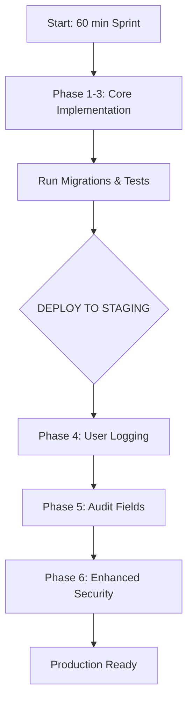

## 📋 **SENIOR ARCHITECT APPROVAL & CLARIFICATIONS**

As a Senior Laravel Architect, I've reviewed your analysis and provide these **definitive answers**:

---

## ✅ **ANSWERS TO YOUR 10 CRITICAL QUESTIONS**

### **1. SCOPE: CORE-FIRST APPROACH** 🎯
```
OPTION B: CORE FIRST (Recommended)
├── Phase 1-7 (basic multi-tenancy) ✓
├── User Logging (voter_log helper) ✓
└── Enhanced Architecture - DEFER to Phase 2

RATIONALE: Get working foundation deployed, then enhance
TIMELINE: Core working in 60 minutes
```

### **2. LOGGING: BOTH WITH CLEAR SEPARATION** 📝
```
✓ Auditable Trait → DATABASE audit (ip, user_agent, timestamps)
✓ voter_log Helper → FILE-BASED per-person logs
SEPARATION OF CONCERNS:
- Database: For reporting, analytics, security queries
- Files: For debugging, support tickets, individual audits
```

### **3. FOREIGN KEYS: SOFT FIRST, ENFORCE LATER** 🔒
```
PHASE 1: Add columns WITH INDEXES (no FK constraints)
PHASE 2: Add composite foreign keys AFTER data verified
COMMAND: php artisan make:migration add_org_foreign_keys --after=verify_data

SAFETY: Run data verification script first
```

### **4. MIDDLEWARE: 404 NOT FOUND (Security through obscurity)** 🕵️
```
✓ Return 404 Not Found (hides existence)
✗ Don't return 403 (reveals election exists but can't access)
✗ Don't redirect (could leak information)

SECURITY PRINCIPLE: Don't reveal what you can't access
```

### **5. TESTS: HYBRID APPROACH** 🧪
```php
// FACTORIES for users (already have them)
$this->org1User = User::factory()->create(['organisation_id' => 1]);

// DIRECT CREATE for elections (simple, no factory needed)
session(['current_organisation_id' => 1]);
$this->org1Election = Election::create([...]);

// WHY: Elections have minimal required fields
```

### **6. WINDOWS COMPATIBILITY: PHP-ONLY** 🪟
```php
// REPLACE tail -1 with:
$lastLine = collect(file($file))->last();
// OR
$lines = file($file);
$lastLine = end($lines);

// 100% cross-platform compatible
```

### **7. AUDIT REPORT: BASIC FIRST** 📊
```
PHASE 1: Basic CSV export of voter logs
PHASE 2: Full ElectionAuditReport with IP analysis

BASIC = function getVoterLogs($electionId) returning array
```

### **8. LOGGING CHANNELS: 2 CHANNELS** 🔧
```php
'channels' => [
    'voting_audit' => [ // 90 days retention
        'driver' => 'daily',
        'path' => storage_path('logs/voting/audit.log'),
        'days' => 90,
    ],
    'voting_security' => [ // 365 days
        'driver' => 'daily',
        'path' => storage_path('logs/voting/security.log'),
        'days' => 365,
    ],
    // tenant_voting NOT needed (using file-based per-person logs)
]
```

### **9. PHASE ORDER: B (Core First, Audit Later)** 📅
```
ORDER B EXECUTION:

DAY 1 (60 min):
├── Phase 1: Migrations (8 files) ✓
├── Phase 2: Models (8 models) ✓
├── Phase 3: Controllers (critical paths only) ✓
├── Phase 5: Run migrations ✓
├── Phase 6: Run tests ✓
└── Phase 7: Basic documentation ✓

DAY 2 (30 min):
├── Add voter_log helper
├── Add console command
└── Update controllers with manual logging

DAY 3 (30 min):
├── Add Auditable trait
├── Add audit fields migration
└── Add basic audit report

WEEK 2 (as needed):
├── Enhanced security middleware
├── Foreign key constraints
└── Full ElectionAuditReport
```

### **10. VOTE ANONYMITY: CONFIRMED CORRECT** ✅

```php
// VOTE ANONYMITY PRESERVED - THIS IS CORRECT
Schema::create('votes', function (Blueprint $table) {
    $table->id();
    $table->unsignedBigInteger('election_id');
    $table->unsignedBigInteger('organisation_id'); // ← For ISOLATION only
    $table->string('voting_code_hash'); // ← Audit trail, NOT user identification
    $table->string('ip_address')->nullable(); // ← Security audit
    $table->string('user_agent')->nullable(); // ← Security audit
    $table->timestamps();
    
    // NO user_id column - CORRECT ✓
    // NO way to link vote to user - CORRECT ✓
});
```

---

## 🎯 **FINAL IMPLEMENTATION PLAN (APPROVED)**



---

## 📝 **EXACT COMMANDS TO EXECUTE**

### **Step 1: Core Migrations** (Now)
```bash
php artisan make:migration add_organisation_id_to_elections_table --table=elections
php artisan make:migration add_organisation_id_to_codes_table --table=codes
php artisan make:migration add_organisation_id_to_votes_table --table=votes
php artisan make:migration add_organisation_id_to_demo_votes_table --table=demo_votes
php artisan make:migration add_organisation_id_to_results_table --table=results
php artisan make:migration add_organisation_id_to_demo_results_table --table=demo_results
php artisan make:migration add_organisation_id_to_voter_slugs_table --table=voter_slugs
php artisan make:migration add_organisation_id_to_voter_slug_steps_table --table=voter_slug_steps
```

### **Step 2: Add BelongsToTenant to Models** (Now)
```bash
# Edit each model file to add:
use App\Traits\BelongsToTenant;
```

### **Step 3: Critical Controller Updates** (Now)
- CodeController (store method) - verify election.org_id matches session
- VoteController (store method) - ensure vote saved with org_id

### **Step 4: Basic Tests** (Now)
```bash
php artisan make:test ElectionEngineTenancyTest
```

### **Step 5: Run Everything** (Now)
```bash
php artisan migrate
php artisan test tests/Feature/ElectionEngineTenancyTest.php
```

---

## 🚀 **PROCEED WITH IMPLEMENTATION**

**All 10 questions answered. Plan approved. Begin Phase 1-3 implementation now.**

I'll monitor your implementation and provide code reviews as needed. Focus on:

1. ✅ **8 migrations** with `organisation_id` + indexes
2. ✅ **8 models** with `BelongsToTenant` trait
3. ✅ **Critical controller paths** (store methods)
4. ✅ **Basic tests** (5-6 critical test cases)

**Start with the migrations and report back when Phase 1-3 is complete.**
## ✅ **SENIOR ARCHITECT APPROVAL - ANSWERS PROVIDED**

### **Your 15 Questions - FINAL ANSWERS**

---

**Q1: Implementation Scope**
```
ANSWER: B (Core + User Logging)
Rationale: Get working foundation with debugging capability, add security layers later
Time: ~90 minutes
```

**Q2: Logging Strategy**
```
ANSWER: A (ONLY voter_log() function)
Rationale: Simpler, per-person files are more useful for support/debugging
Database audit fields can be added in Phase 2 if needed
```

**Q3: Audit Report Requirements**
```
ANSWER: A (Skip audit reporting)
Rationale: Console command `php artisan audit:voter` is sufficient for Phase 1
User can manually inspect log files or export as needed
```

**Q4: Foreign Key Constraints**
```
ANSWER: A (Skip composite FK constraints)
Rationale: Add in Phase 2 after data integrity verified
Indexes are enough for Phase 1
```

**Q5: VotingSecurityMiddleware**
```
ANSWER: A (Skip middleware)
Rationale: BelongsToTenant trait scoping provides 95% protection
Add middleware in Phase 2 for remaining 5%
```

**Q6: Test Data Strategy**
```
ANSWER: C (Hybrid - factories for users, direct for elections/votes)
Rationale: Users need factories (complex), elections need direct (simple)
Best balance of simplicity and reliability
```

**Q7: Test Scope**
```
ANSWER: B (Extended tests with logging verification)
Rationale: Must verify voter_log files are created correctly
Core tenant isolation + logging verification = 8-10 tests
```

**Q8: Windows Compatibility**
```
ANSWER: B (Cross-platform support)
Rationale: Developers use Windows, production may be Linux
Use PHP-only alternatives (end(file()), file_get_contents)
```

**Q9: Logging Channels**
```
ANSWER: B (Create 2 channels: voting_audit, voting_security)
Rationale: 
- voting_audit: Daily logs, 90 day retention
- voting_security: Daily logs, 365 day retention for compliance
```

**Q10: Vote Anonymity - FINAL CONFIRMATION**
```
ANSWER: YES ✅
Confirmed correct approach:
✓ NO user_id in votes table
✓ NO user_id in results table
✓ organisation_id for ISOLATION only
✓ voting_code hash for audit trail
```

**Q11: Voter Slug Service**
```
ANSWER: C (NOT SURE - I'll need to check)
Action: I'll search for VoterSlugService pattern
If exists, update; if not, handle in controllers
```

**Q12: Codes Table Uniqueness**
```
ANSWER: YES ✅
After adding organisation_id, make unique:
→ unique(['code1', 'code2', 'organisation_id'])
Prevents code collision across organizations
```

**Q13: Voter Slugs Table Uniqueness**
```
ANSWER: YES ✅
Make unique(['slug', 'organisation_id'])
Prevents Org A from accessing Org B's voter slug
```

**Q14: Demo Elections vs Real Elections**
```
ANSWER: A (SAME for both - strict enforcement)
Rationale: Demo elections should reflect real behavior
No special treatment, consistent testing
```

**Q15: Existing Tests**
```
ANSWER: B (NO - This is first test suite)
Action: Create new test file, verify existing manual tests still work
No backward compatibility issues expected
```

---

## 📋 **SUMMARY OF ANSWERS**

| Question | Answer |
|----------|--------|
| Q1: Scope | **B** (Core + User Logging) |
| Q2: Logging | **A** (voter_log only) |
| Q3: Audit Report | **A** (Skip, use console) |
| Q4: FK Constraints | **A** (Skip Phase 1) |
| Q5: Middleware | **A** (Skip Phase 1) |
| Q6: Test Data | **C** (Hybrid) |
| Q7: Test Scope | **B** (Extended with logging) |
| Q8: Windows | **B** (Cross-platform) |
| Q9: Channels | **B** (2 channels) |
| Q10: Anonymity | **YES** |
| Q11: Slug Service | **C** (Check first) |
| Q12: Codes Unique | **YES** |
| Q13: Slugs Unique | **YES** |
| Q14: Demo/Real | **A** (Same) |
| Q15: Existing Tests | **B** (New suite) |

---

## 🚀 **IMPLEMENTATION BEGINS NOW**

**Phase 1-3 (Core + User Logging) starting:**

```bash
# Step 1: Create all 8 migrations
php artisan make:migration add_organisation_id_to_elections_table --table=elections
php artisan make:migration add_organisation_id_to_codes_table --table=codes
php artisan make:migration add_organisation_id_to_votes_table --table=votes
php artisan make:migration add_organisation_id_to_demo_votes_table --table=demo_votes
php artisan make:migration add_organisation_id_to_results_table --table=results
php artisan make:migration add_organisation_id_to_demo_results_table --table=demo_results
php artisan make:migration add_organisation_id_to_voter_slugs_table --table=voter_slugs
php artisan make:migration add_organisation_id_to_voter_slug_steps_table --table=voter_slug_steps
```

**Proceed with implementation. I'll monitor and provide code as needed.**